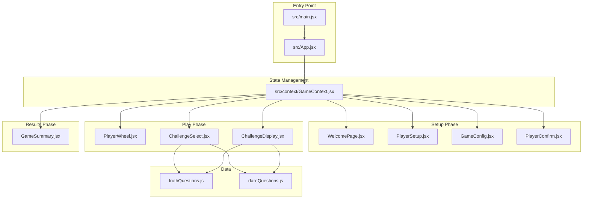
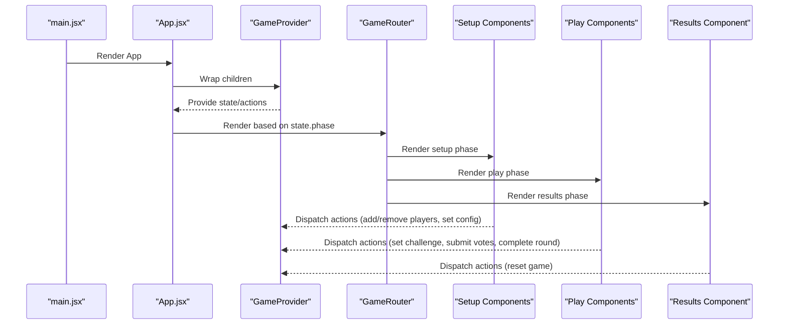
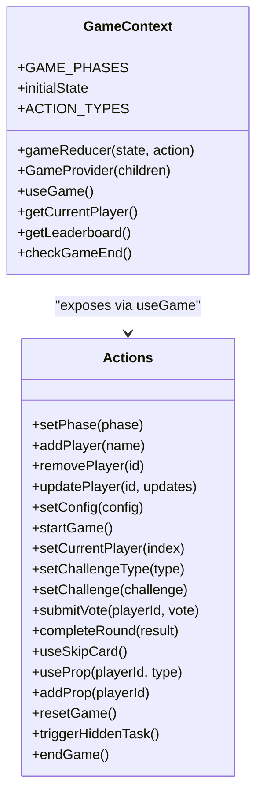
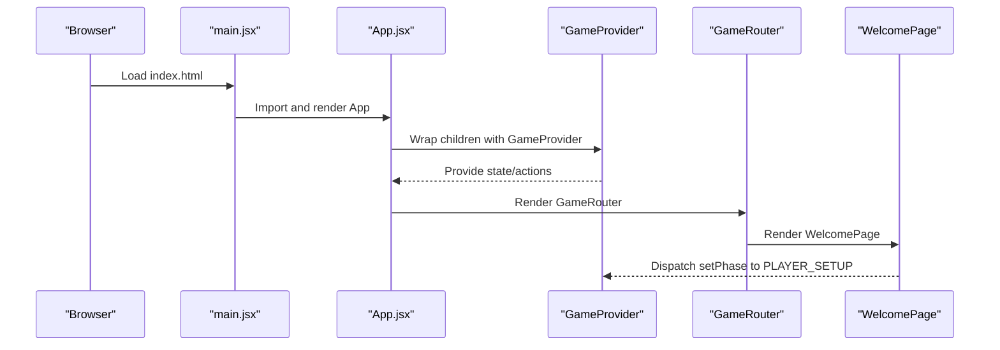
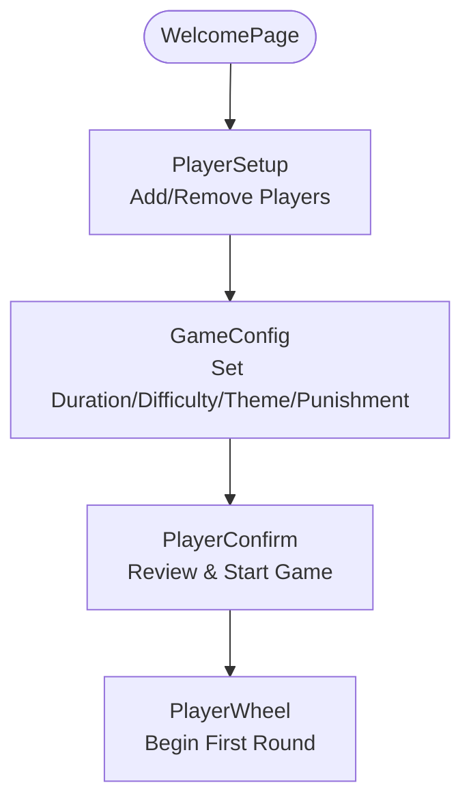
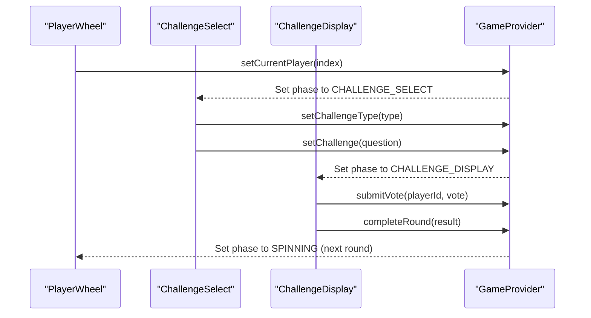
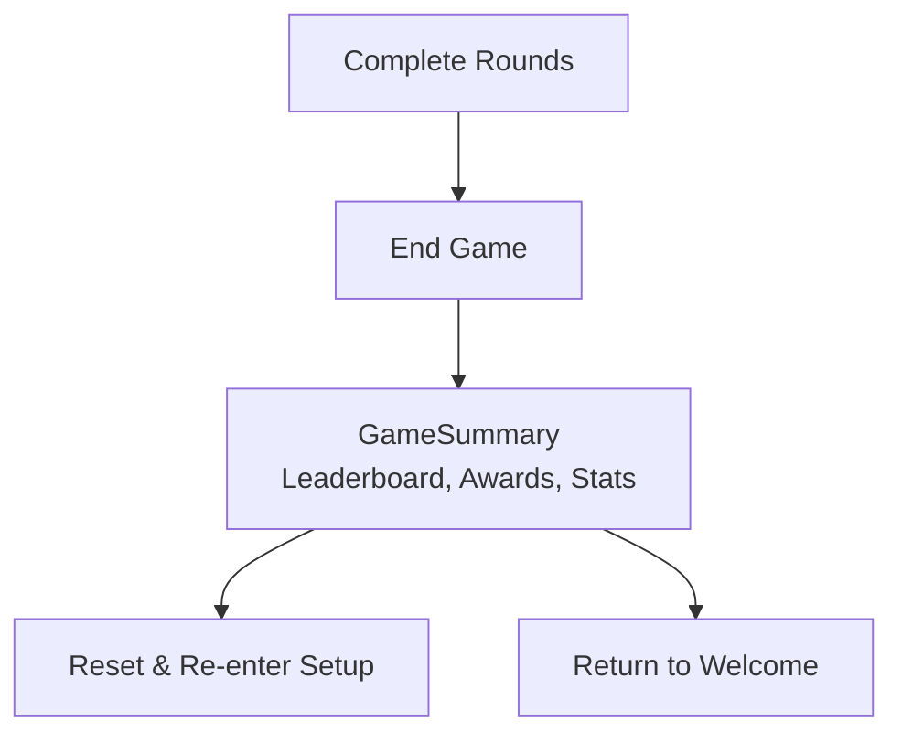
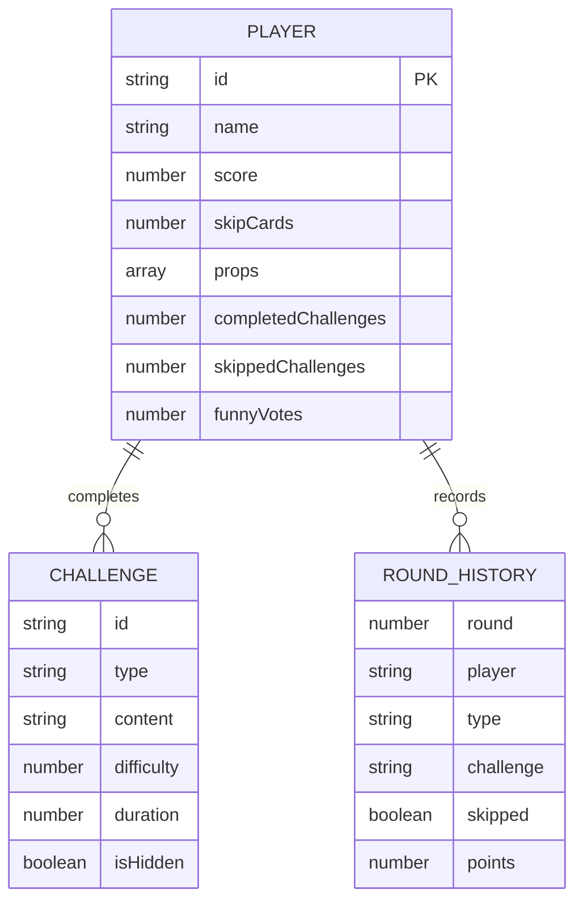
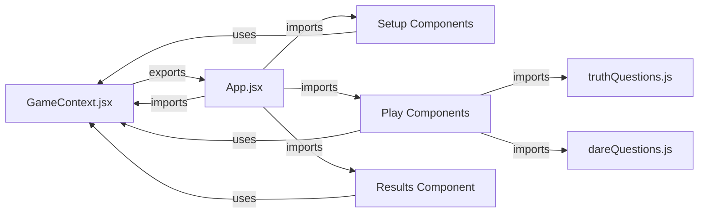

# Architecture Overview

<cite>
**Referenced Files in This Document**
- [main.jsx](file://src/main.jsx)
- [App.jsx](file://src/App.jsx)
- [GameContext.jsx](file://src/context/GameContext.jsx)
- [WelcomePage.jsx](file://src/components/GameSetup/WelcomePage.jsx)
- [PlayerSetup.jsx](file://src/components/GameSetup/PlayerSetup.jsx)
- [GameConfig.jsx](file://src/components/GameSetup/GameConfig.jsx)
- [PlayerConfirm.jsx](file://src/components/GameSetup/PlayerConfirm.jsx)
- [PlayerWheel.jsx](file://src/components/GamePlay/PlayerWheel.jsx)
- [ChallengeSelect.jsx](file://src/components/GamePlay/ChallengeSelect.jsx)
- [ChallengeDisplay.jsx](file://src/components/GamePlay/ChallengeDisplay.jsx)
- [GameSummary.jsx](file://src/components/Results/GameSummary.jsx)
- [truthQuestions.js](file://src/data/truthQuestions.js)
- [dareQuestions.js](file://src/data/dareQuestions.js)
- [package.json](file://package.json)
</cite>

## Table of Contents
1. [Introduction](#introduction)
2. [Project Structure](#project-structure)
3. [Core Components](#core-components)
4. [Architecture Overview](#architecture-overview)
5. [Detailed Component Analysis](#detailed-component-analysis)
6. [Dependency Analysis](#dependency-analysis)
7. [Performance Considerations](#performance-considerations)
8. [Troubleshooting Guide](#troubleshooting-guide)
9. [Conclusion](#conclusion)

## Introduction
This document describes the architectural design of the Truth or Dare application, a React-based party game that manages player interactions, challenge selection, voting mechanics, and scoring. The application follows a component-based architecture with centralized state management using React's Context API and useReducer pattern. It is structured around three primary gameplay phases: Setup, Play, and Results, with clear separation of concerns across component groups.

## Project Structure
The project is organized into feature-based directories under src/, with clear separation between components, context/state management, and data assets:
- Entry point and root app: src/main.jsx, src/App.jsx
- Context provider and state logic: src/context/GameContext.jsx
- Component groups:
  - GameSetup: WelcomePage, PlayerSetup, GameConfig, PlayerConfirm
  - GamePlay: PlayerWheel, ChallengeSelect, ChallengeDisplay
  - Results: GameSummary
- Data assets: src/data/truthQuestions.js, src/data/dareQuestions.js

**Diagram sources**
- [main.jsx](file://src/main.jsx#L1-L11)
- [App.jsx](file://src/App.jsx#L1-L58)
- [GameContext.jsx](file://src/context/GameContext.jsx#L1-L308)
- [WelcomePage.jsx](file://src/components/GameSetup/WelcomePage.jsx#L1-L88)
- [PlayerSetup.jsx](file://src/components/GameSetup/PlayerSetup.jsx#L1-L194)
- [GameConfig.jsx](file://src/components/GameSetup/GameConfig.jsx#L1-L185)
- [PlayerConfirm.jsx](file://src/components/GameSetup/PlayerConfirm.jsx#L1-L158)
- [PlayerWheel.jsx](file://src/components/GamePlay/PlayerWheel.jsx#L1-L293)
- [ChallengeSelect.jsx](file://src/components/GamePlay/ChallengeSelect.jsx#L1-L201)
- [ChallengeDisplay.jsx](file://src/components/GamePlay/ChallengeDisplay.jsx#L1-L341)
- [GameSummary.jsx](file://src/components/Results/GameSummary.jsx#L1-L223)
- [truthQuestions.js](file://src/data/truthQuestions.js#L1-L134)
- [dareQuestions.js](file://src/data/dareQuestions.js#L1-L143)

**Section sources**
- [main.jsx](file://src/main.jsx#L1-L11)
- [App.jsx](file://src/App.jsx#L1-L58)
- [package.json](file://package.json#L1-L33)

## Core Components
- Entry point: Creates the React root and renders the App component.
- Root app: Wraps the application with the GameProvider and renders the GameRouter, which conditionally displays the current phase component.
- GameProvider: Centralized state container using useReducer with actions for managing game lifecycle, player data, challenges, votes, and props.
- Phase router: Switches between setup, play, and results screens based on the current game phase.

Key responsibilities:
- State initialization and reducer logic define the game model and transitions.
- Custom hook useGame exposes state, actions, and helpers to all components.
- Components remain declarative and rely on context for data and mutations.

**Section sources**
- [main.jsx](file://src/main.jsx#L1-L11)
- [App.jsx](file://src/App.jsx#L13-L55)
- [GameContext.jsx](file://src/context/GameContext.jsx#L24-L237)

## Architecture Overview
The application follows a Provider pattern with centralized state management:
- Provider: GameProvider encapsulates state and exposes actions via useGame.
- Consumers: All components depend on useGame to read state and trigger actions.
- Data flow: Unidirectional updates through dispatch -> reducer -> state -> re-render.
- Component composition: App.jsx composes feature-specific components grouped by phase.

**Diagram sources**
- [main.jsx](file://src/main.jsx#L6-L10)
- [App.jsx](file://src/App.jsx#L47-L55)
- [GameContext.jsx](file://src/context/GameContext.jsx#L243-L298)

## Detailed Component Analysis

### Provider Pattern and State Management
The GameContext.jsx implements a robust Provider pattern with:
- GAME_PHASES: Enumerated states for navigation across setup, play, and results.
- Initial state: Comprehensive model covering players, config, rounds, challenges, votes, and history.
- useReducer: Centralized reducer with explicit action types for deterministic state updates.
- Actions: Curried dispatch wrappers for each mutation, ensuring consistent typing and encapsulation.
- Helpers: getCurrentPlayer, getLeaderboard, checkGameEnd for derived computations.

**Diagram sources**
- [GameContext.jsx](file://src/context/GameContext.jsx#L4-L237)
- [GameContext.jsx](file://src/context/GameContext.jsx#L243-L307)

**Section sources**
- [GameContext.jsx](file://src/context/GameContext.jsx#L1-L308)

### Application Flow: Entry to Components
The flow begins at the entry point and progresses through the Provider to the phase router and then to specific components.

**Diagram sources**
- [main.jsx](file://src/main.jsx#L1-L11)
- [App.jsx](file://src/App.jsx#L47-L55)
- [WelcomePage.jsx](file://src/components/GameSetup/WelcomePage.jsx#L55-L61)

**Section sources**
- [main.jsx](file://src/main.jsx#L1-L11)
- [App.jsx](file://src/App.jsx#L13-L45)
- [WelcomePage.jsx](file://src/components/GameSetup/WelcomePage.jsx#L1-L88)

### Setup Phase Components
The setup phase prepares the game environment:
- WelcomePage: Introduces the game and navigates to PlayerSetup.
- PlayerSetup: Manages player addition/removal, enforces min/max limits, and validates uniqueness.
- GameConfig: Configures duration, difficulty, theme, and punishment level.
- PlayerConfirm: Summarizes participants and rules, then starts the game.

**Diagram sources**
- [WelcomePage.jsx](file://src/components/GameSetup/WelcomePage.jsx#L55-L61)
- [PlayerSetup.jsx](file://src/components/GameSetup/PlayerSetup.jsx#L35-L36)
- [GameConfig.jsx](file://src/components/GameSetup/GameConfig.jsx#L174-L179)
- [PlayerConfirm.jsx](file://src/components/GameSetup/PlayerConfirm.jsx#L7-L9)

**Section sources**
- [WelcomePage.jsx](file://src/components/GameSetup/WelcomePage.jsx#L1-L88)
- [PlayerSetup.jsx](file://src/components/GameSetup/PlayerSetup.jsx#L1-L194)
- [GameConfig.jsx](file://src/components/GameSetup/GameConfig.jsx#L1-L185)
- [PlayerConfirm.jsx](file://src/components/GameSetup/PlayerConfirm.jsx#L1-L158)

### Play Phase Components
The play phase governs the core game loop:
- PlayerWheel: Randomly selects the current player with an animated wheel and progress tracking.
- ChallengeSelect: Allows the current player to choose truth or dare, auto-randomizes if time expires, and triggers hidden tasks.
- ChallengeDisplay: Shows the selected challenge with countdown, voting, skip card usage, and prop activation.

**Diagram sources**
- [PlayerWheel.jsx](file://src/components/GamePlay/PlayerWheel.jsx#L54-L56)
- [ChallengeSelect.jsx](file://src/components/GamePlay/ChallengeSelect.jsx#L42-L71)
- [ChallengeDisplay.jsx](file://src/components/GamePlay/ChallengeDisplay.jsx#L62-L99)

**Section sources**
- [PlayerWheel.jsx](file://src/components/GamePlay/PlayerWheel.jsx#L1-L293)
- [ChallengeSelect.jsx](file://src/components/GamePlay/ChallengeSelect.jsx#L1-L201)
- [ChallengeDisplay.jsx](file://src/components/GamePlay/ChallengeDisplay.jsx#L1-L341)

### Results Phase Component
The results phase summarizes the game:
- GameSummary: Computes rankings, awards, statistics, and highlights recent rounds, with controls to replay or return home.

**Diagram sources**
- [GameSummary.jsx](file://src/components/Results/GameSummary.jsx#L29-L37)

**Section sources**
- [GameSummary.jsx](file://src/components/Results/GameSummary.jsx#L1-L223)

### Data Model and Question System
The application maintains separate question libraries for truth and dare challenges, with filtering by difficulty and theme. ChallengeDisplay integrates with these libraries to select appropriate content and manage hidden tasks.

**Diagram sources**
- [GameContext.jsx](file://src/context/GameContext.jsx#L25-L44)
- [truthQuestions.js](file://src/data/truthQuestions.js#L104-L133)
- [dareQuestions.js](file://src/data/dareQuestions.js#L106-L128)

**Section sources**
- [truthQuestions.js](file://src/data/truthQuestions.js#L1-L134)
- [dareQuestions.js](file://src/data/dareQuestions.js#L1-L143)

## Dependency Analysis
The application exhibits low coupling and high cohesion:
- Components depend on useGame rather than importing state directly, reducing tight coupling.
- Data modules are pure functions and data arrays, enabling reuse and testing.
- No circular dependencies observed among components or context.

**Diagram sources**
- [App.jsx](file://src/App.jsx#L1-L11)
- [GameContext.jsx](file://src/context/GameContext.jsx#L1-L308)
- [truthQuestions.js](file://src/data/truthQuestions.js#L1-L134)
- [dareQuestions.js](file://src/data/dareQuestions.js#L1-L143)

**Section sources**
- [App.jsx](file://src/App.jsx#L1-L11)
- [GameContext.jsx](file://src/context/GameContext.jsx#L1-L308)

## Performance Considerations
- State updates are batched through useReducer, minimizing unnecessary re-renders.
- Components use motion animations sparingly; consider lazy-loading animation libraries if needed.
- Question selection filters operate on small arrays; performance remains acceptable given typical player counts.
- Consider memoizing derived data (leaderboard, stats) if the player count grows significantly.

## Troubleshooting Guide
Common issues and resolutions:
- Missing GameProvider: Components using useGame must be rendered within GameProvider; otherwise, a context error is thrown.
- Invalid phase transitions: Ensure actions like setPhase are invoked with valid GAME_PHASES values.
- Player validation errors: PlayerSetup enforces uniqueness and count limits; verify inputs before adding players.
- Timer synchronization: ChallengeDisplay relies on useEffect timers; ensure cleanup occurs to prevent memory leaks.
- Game end detection: PlayerWheel checks game duration; confirm config.duration and gameStartTime are set correctly.

**Section sources**
- [GameContext.jsx](file://src/context/GameContext.jsx#L301-L307)
- [PlayerSetup.jsx](file://src/components/GameSetup/PlayerSetup.jsx#L10-L27)
- [ChallengeDisplay.jsx](file://src/components/GamePlay/ChallengeDisplay.jsx#L17-L33)
- [PlayerWheel.jsx](file://src/components/GamePlay/PlayerWheel.jsx#L22-L26)

## Conclusion
The Truth or Dare application demonstrates a clean, scalable architecture built on React 19.2.0 with centralized state management via React Context and useReducer. The Provider pattern enables predictable state updates, while component composition keeps concerns separated across Setup, Play, and Results phases. The modular data layer and clear action boundaries support maintainability and future enhancements.