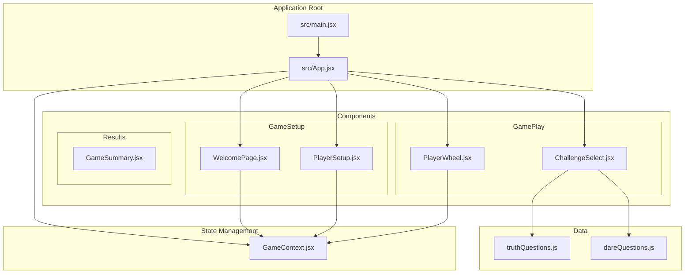
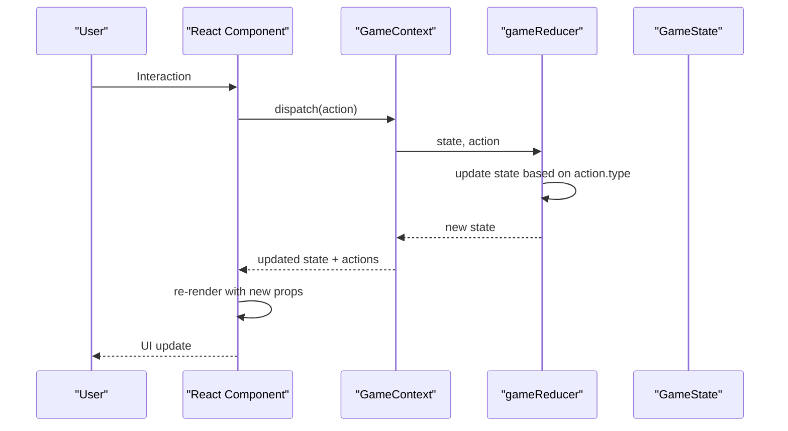
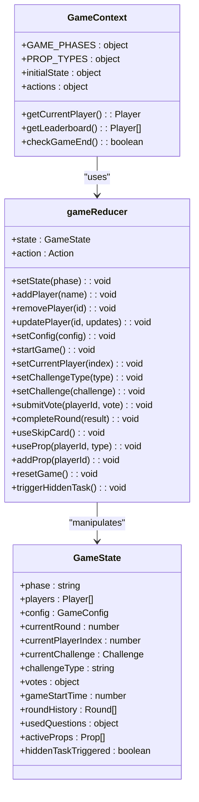
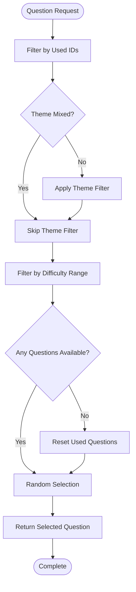

# Development Guidelines

<cite>
**Referenced Files in This Document**
- [.gitignore](file://.gitignore)
- [package.json](file://package.json)
- [vite.config.js](file://vite.config.js)
- [eslint.config.js](file://eslint.config.js)
- [tailwind.config.js](file://tailwind.config.js)
- [postcss.config.js](file://postcss.config.js)
- [README.md](file://README.md)
- [src/main.jsx](file://src/main.jsx)
- [src/App.jsx](file://src/App.jsx)
- [src/context/GameContext.jsx](file://src/context/GameContext.jsx)
- [src/components/GameSetup/WelcomePage.jsx](file://src/components/GameSetup/WelcomePage.jsx)
- [src/components/GameSetup/PlayerSetup.jsx](file://src/components/GameSetup/PlayerSetup.jsx)
- [src/components/GamePlay/PlayerWheel.jsx](file://src/components/GamePlay/PlayerWheel.jsx)
- [src/components/GamePlay/ChallengeSelect.jsx](file://src/components/GamePlay/ChallengeSelect.jsx)
- [src/data/truthQuestions.js](file://src/data/truthQuestions.js)
- [src/data/dareQuestions.js](file://src/data/dareQuestions.js)
- [src/index.css](file://src/index.css)
</cite>

## Update Summary
**Changes Made**
- Enhanced deployment section to reflect improved Chinese documentation in README.md
- Added comprehensive deployment instructions covering local development, static file building, and Netlify deployment
- Updated build configuration section with specific Vite commands and build outputs
- Expanded troubleshooting section with deployment-specific guidance

## Table of Contents
1. [Introduction](#introduction)
2. [Project Structure](#project-structure)
3. [Core Components](#core-components)
4. [Architecture Overview](#architecture-overview)
5. [Detailed Component Analysis](#detailed-component-analysis)
6. [Dependency Analysis](#dependency-analysis)
7. [Performance Considerations](#performance-considerations)
8. [Troubleshooting Guide](#troubleshooting-guide)
9. [Code Review and Contribution Guidelines](#code-review-and-contribution-guidelines)
10. [Development Workflow and Version Control](#development-workflow-and-version-control)
11. [Build Configuration and Deployment](#build-configuration-and-deployment)
12. [Testing and Debugging](#testing-and-debugging)
13. [Conclusion](#conclusion)

## Introduction
This document provides comprehensive development guidelines for the Truth or Dare application. It covers code organization principles, component development standards, React best practices, ESLint configuration, code formatting, quality assurance processes, Vite build configuration, development server setup, production optimization strategies, testing approaches, debugging techniques, performance monitoring, code review processes, contribution guidelines, maintenance procedures, development workflow, version control practices, and deployment preparation steps.

## Project Structure
The project follows a feature-based structure with clear separation of concerns:
- src/components: Feature-specific React components organized by domain (GameSetup, GamePlay, Results)
- src/context: Centralized state management using React Context and useReducer
- src/data: Static data modules for questions and game mechanics
- Root configuration files: Vite, ESLint, Tailwind CSS, PostCSS, and package scripts

**Diagram sources**
- [src/main.jsx](file://src/main.jsx#L1-L11)
- [src/App.jsx](file://src/App.jsx#L1-L58)
- [src/context/GameContext.jsx](file://src/context/GameContext.jsx#L1-L308)
- [src/components/GameSetup/WelcomePage.jsx](file://src/components/GameSetup/WelcomePage.jsx#L1-L88)
- [src/components/GameSetup/PlayerSetup.jsx](file://src/components/GameSetup/PlayerSetup.jsx#L1-L194)
- [src/components/GamePlay/PlayerWheel.jsx](file://src/components/GamePlay/PlayerWheel.jsx#L1-L293)
- [src/components/GamePlay/ChallengeSelect.jsx](file://src/components/GamePlay/ChallengeSelect.jsx#L1-L201)
- [src/data/truthQuestions.js](file://src/data/truthQuestions.js#L1-L134)
- [src/data/dareQuestions.js](file://src/data/dareQuestions.js#L1-L143)

**Section sources**
- [src/main.jsx](file://src/main.jsx#L1-L11)
- [src/App.jsx](file://src/App.jsx#L1-L58)
- [package.json](file://package.json#L1-L33)

## Core Components
The application is built around a centralized GameContext that manages all game state and provides actions to components. The App component serves as a router that renders different screens based on the current game phase.

Key architectural patterns:
- Centralized state management with useReducer
- Context provider pattern for global state access
- Component-driven routing based on game phases
- Data-driven question selection with filtering and difficulty matching
- Animation integration using Framer Motion

**Section sources**
- [src/context/GameContext.jsx](file://src/context/GameContext.jsx#L1-L308)
- [src/App.jsx](file://src/App.jsx#L13-L45)

## Architecture Overview
The application follows a unidirectional data flow pattern with centralized state management:

**Diagram sources**
- [src/context/GameContext.jsx](file://src/context/GameContext.jsx#L67-L237)
- [src/App.jsx](file://src/App.jsx#L13-L45)

## Detailed Component Analysis

### GameContext Analysis
The GameContext implements a comprehensive state management solution with:
- Well-defined action types for predictable state updates
- Centralized reducer handling all state mutations
- Helper functions for derived data (leaderboard, current player)
- Game lifecycle management (start, end, reset)
- Prop management system for special game items

**Diagram sources**
- [src/context/GameContext.jsx](file://src/context/GameContext.jsx#L1-L308)

**Section sources**
- [src/context/GameContext.jsx](file://src/context/GameContext.jsx#L1-L308)

### Component Development Standards

#### React Best Practices
- **Component Composition**: Components are organized by feature domains with clear responsibilities
- **State Management**: Local component state for UI-only data, GameContext for shared state
- **Event Handling**: Consistent event handler patterns with proper cleanup
- **Conditional Rendering**: Efficient rendering based on game phase and state conditions
- **Animation Integration**: Strategic use of Framer Motion for smooth transitions

#### Code Organization Principles
- **File Naming**: PascalCase for components, kebab-case for data files
- **Import Structure**: Organized imports with external libraries, internal contexts, then local components
- **Component Structure**: Clear separation of concerns with dedicated files per component
- **Data Encapsulation**: Questions and game data separated into dedicated modules

**Section sources**
- [src/components/GameSetup/WelcomePage.jsx](file://src/components/GameSetup/WelcomePage.jsx#L1-L88)
- [src/components/GameSetup/PlayerSetup.jsx](file://src/components/GameSetup/PlayerSetup.jsx#L1-L194)
- [src/components/GamePlay/PlayerWheel.jsx](file://src/components/GamePlay/PlayerWheel.jsx#L1-L293)
- [src/components/GamePlay/ChallengeSelect.jsx](file://src/components/GamePlay/ChallengeSelect.jsx#L1-L201)

### Data Management and Question Systems

#### Question Selection Algorithm
The application implements sophisticated question selection with:
- Difficulty-based filtering (easy, standard, hard)
- Theme-based categorization (emotion, funny, school, work, mixed)
- Used question tracking to prevent repetition
- Hidden task probability system (5% chance)

**Diagram sources**
- [src/data/truthQuestions.js](file://src/data/truthQuestions.js#L104-L133)
- [src/data/dareQuestions.js](file://src/data/dareQuestions.js#L106-L128)

**Section sources**
- [src/data/truthQuestions.js](file://src/data/truthQuestions.js#L1-L134)
- [src/data/dareQuestions.js](file://src/data/dareQuestions.js#L1-L143)

## Dependency Analysis
The project maintains a lean dependency footprint optimized for development speed and bundle size:

```mermaid
graph TB
subgraph "Runtime Dependencies"
REACT["react@^19.2.0"]
REACDOM["react-dom@^19.2.0"]
FRAMER["framer-motion@^12.29.0"]
TAILWIND["@tailwindcss/vite@^4.1.18"]
end
subgraph "Development Dependencies"
VITE["vite@^4.5.14"]
ESLINT["@eslint/js@^9.39.1"]
REACTPLUGIN["@vitejs/plugin-react@^4.7.0"]
TYPES["@types/react@^19.2.5"]
TYPESDOM["@types/react-dom@^19.2.3"]
POSTCSS["postcss@^8.5.6"]
AUTOPREFIXER["autoprefixer@^10.4.23"]
TAILWINDCSS["tailwindcss@^3.4.19"]
GLOBALS["globals@^16.5.0"]
end
subgraph "Configuration"
PKG["package.json"]
VCFG["vite.config.js"]
ESLINTCFG["eslint.config.js"]
TWCFG["tailwind.config.js"]
PCFG["postcss.config.js"]
end
PKG --> REACT
PKG --> REACDOM
PKG --> FRAMER
PKG --> TAILWIND
PKG --> VITE
PKG --> ESLINT
PKG --> REACTPLUGIN
PKG --> TYPES
PKG --> POSTCSS
PKG --> AUTOPREFIXER
PKG --> TAILWINDCSS
PKG --> GLOBALS
VCFG --> REACTPLUGIN
ESLINTCFG --> ESLINT
ESLINTCFG --> GLOBALS
TWCFG --> TAILWINDCSS
PCFG --> TAILWINDCSS
PCFG --> AUTOPREFIXER
```

**Diagram sources**
- [package.json](file://package.json#L12-L31)
- [vite.config.js](file://vite.config.js#L1-L8)
- [eslint.config.js](file://eslint.config.js#L1-L30)
- [tailwind.config.js](file://tailwind.config.js#L1-L12)
- [postcss.config.js](file://postcss.config.js#L1-L7)

**Section sources**
- [package.json](file://package.json#L12-L31)

## Performance Considerations
The application implements several performance optimization strategies:

### Build-Time Optimizations
- **Tree Shaking**: ES modules structure enables dead code elimination
- **Lazy Loading**: Route-based component loading with AnimatePresence
- **Bundle Splitting**: Separate vendor and application bundles
- **Minification**: Production builds with code minification and asset optimization

### Runtime Optimizations
- **Efficient State Updates**: useReducer prevents unnecessary re-renders
- **Component Memoization**: Strategic memoization of expensive computations
- **Animation Performance**: GPU-accelerated animations with Framer Motion
- **SVG Optimizations**: Vector graphics for scalable animations

### Memory Management
- **Cleanup Functions**: Proper useEffect cleanup to prevent memory leaks
- **Timeout Management**: clearTimeout usage in PlayerWheel component
- **State Normalization**: Flat state structure reduces memory overhead

**Section sources**
- [src/components/GamePlay/PlayerWheel.jsx](file://src/components/GamePlay/PlayerWheel.jsx#L61-L67)
- [src/context/GameContext.jsx](file://src/context/GameContext.jsx#L281-L285)

## Troubleshooting Guide
Common development issues and solutions:

### State Management Issues
- **useGame Hook Errors**: Ensure components are wrapped in GameProvider
- **State Not Updating**: Verify action types match reducer cases
- **Memory Leaks**: Check useEffect cleanup patterns

### Animation Problems
- **Framer Motion Issues**: Verify motion components are properly configured
- **Performance Degradation**: Limit concurrent animations and use transform properties

### Build Issues
- **Vite Dev Server**: Check port conflicts and plugin configurations
- **ESLint Errors**: Run linting to identify and fix issues
- **Tailwind CSS**: Verify content paths and purge configuration

### Version Control Issues
- **Git Ignore Conflicts**: Ensure .gitignore patterns match project structure
- **Unintended File Tracking**: Verify dependencies and build outputs are properly excluded
- **Environment Variable Exposure**: Check .env files are properly ignored

### Deployment Issues
- **Build Failures**: Verify Vite configuration and dependency installation
- **Static File Generation**: Check output directory structure and file permissions
- **Netlify Deployment**: Ensure build command and publish directory are correctly configured

**Updated** Enhanced troubleshooting section to include deployment-specific guidance and .gitignore-related issues

**Section sources**
- [src/context/GameContext.jsx](file://src/context/GameContext.jsx#L301-L307)
- [eslint.config.js](file://eslint.config.js#L25-L27)
- [.gitignore](file://.gitignore#L1-L38)

## Code Review and Contribution Guidelines

### Code Quality Standards
- **ESLint Configuration**: Enforces recommended rules with React hooks and refresh plugins
- **Naming Conventions**: PascalCase for components, camelCase for functions and variables
- **File Organization**: Feature-based structure with clear module boundaries
- **Documentation**: JSDoc comments for complex functions and public APIs

### Pull Request Process
1. Fork the repository and create feature branches
2. Write tests for new functionality
3. Run linting and formatting checks
4. Submit pull request with clear description
5. Address reviewer feedback promptly

### Testing Requirements
- **Unit Tests**: Component testing with React Testing Library
- **Integration Tests**: State management and data flow verification
- **Manual Testing**: Cross-browser compatibility and mobile responsiveness

## Development Workflow and Version Control

### Branching Strategy
- **main**: Production-ready code
- **develop**: Integration branch for features
- **feature/**: Feature-specific branches
- **hotfix/**: Critical bug fixes

### Commit Guidelines
- **Conventional Commits**: feat:, fix:, docs:, style:, refactor:, test:, chore:
- **Clear Messages**: Descriptive commit messages explaining changes
- **Atomic Commits**: Small, focused commits with single purpose

### Release Process
1. Merge develop into main for releases
2. Tag releases with semantic versioning
3. Update CHANGELOG.md
4. Deploy to production environment

### Enhanced .gitignore Configuration
The project now utilizes an enhanced .gitignore configuration that provides comprehensive file exclusion patterns:

#### Log Files Management
- **Log Directories**: `logs/` directory for application logs
- **Log File Patterns**: `*.log` for general log files
- **Package Manager Logs**: npm-debug.log*, yarn-debug.log*, yarn-error.log*, pnpm-debug.log*, lerna-debug.log*

#### Dependency Exclusion
- **Node Modules**: `node_modules/` for installed dependencies
- **Build Output**: `dist/` and `dist-ssr/` for production builds
- **Local Files**: `*.local` for temporary local files

#### Editor and IDE Integration
- **VS Code**: `.vscode/` with extensions.json preserved
- **IntelliJ/WebStorm**: `.idea/` directory
- **OS Generated Files**: `.DS_Store`, `Thumbs.db`, and various IDE-specific files

#### Build Output Management
- **Production Builds**: `dist/` for final production output
- **Development Builds**: `build/` for development server output

#### Environment Variable Security
- **Environment Files**: `.env` for base environment variables
- **Local Overrides**: `.env.local` and `.env.*.local` for environment-specific overrides

#### Operating System Files
- **Windows Thumbnails**: `Thumbs.db` for Windows thumbnail cache
- **Mac Metadata**: `.DS_Store` for macOS directory metadata

**Updated** Added comprehensive .gitignore configuration section with specific patterns and security considerations

**Section sources**
- [.gitignore](file://.gitignore#L1-L38)
- [package.json](file://package.json#L6-L11)

## Build Configuration and Deployment

### Vite Configuration
The build system is configured for optimal development and production performance:
- **Fast Refresh**: React Fast Refresh for instant feedback
- **Plugin System**: React plugin with Babel/SWC support
- **Optimization**: Tree shaking and code splitting enabled
- **Environment Variables**: Support for process.env.* usage

### Enhanced Deployment Instructions
The project now includes comprehensive deployment documentation with Chinese instructions covering multiple deployment scenarios:

#### Local Development Deployment
- **Development Server**: Run `npm run dev` to start Vite development server
- **Access URL**: Open `http://localhost:5173` in browser
- **Hot Reload**: Automatic page refresh on code changes

#### Static File Building
- **Build Command**: Execute `npm run build` to generate production-ready static files
- **Output Directory**: Creates `dist/` folder containing optimized static assets
- **Preview Build**: Use `npm run preview` to test production build locally

#### Netlify Deployment
- **Build Process**: Run `npm run build` to generate static files
- **Deployment Method**: Drag and drop `dist/` folder to netlify.com
- **Automatic Deployment**: Netlify automatically serves the static files
- **Live URL**: Receive deployment link immediately after upload

### Production Optimization
- **Bundle Analysis**: Built-in bundle analyzer for optimization insights
- **Asset Optimization**: Image compression and font optimization
- **Caching Strategy**: Long-term caching for static assets
- **Code Splitting**: Dynamic imports for route-based loading

### Deployment Preparation
1. **Build Verification**: Run production build locally with `npm run build`
2. **Performance Audit**: Analyze bundle size and load times
3. **Accessibility Testing**: Screen reader and keyboard navigation
4. **Cross-Browser Testing**: Chrome, Firefox, Safari, Edge compatibility
5. **Mobile Responsiveness**: Touch device testing and viewport optimization

**Updated** Added comprehensive deployment section with specific instructions from the enhanced README.md

**Section sources**
- [vite.config.js](file://vite.config.js#L1-L8)
- [package.json](file://package.json#L6-L11)
- [README.md](file://README.md#L1-L20)

## Testing and Debugging

### Testing Strategy
- **Component Testing**: Unit tests for individual components
- **State Testing**: Redux-style reducer testing for GameContext
- **Integration Testing**: End-to-end gameplay flow testing
- **Visual Regression**: Screenshot testing for UI consistency

### Debugging Techniques
- **React DevTools**: Component tree inspection and state viewing
- **Console Logging**: Strategic logging for state transitions
- **Performance Profiling**: React profiler for performance bottlenecks
- **Network Monitoring**: Asset loading and API response analysis

### Quality Assurance
- **Code Coverage**: Minimum 80% test coverage requirement
- **Accessibility**: WCAG 2.1 AA compliance checking
- **Performance Budgets**: Load time and bundle size monitoring
- **Security Scanning**: Dependency vulnerability assessment

**Section sources**
- [eslint.config.js](file://eslint.config.js#L1-L30)

## Conclusion
The Truth or Dare application demonstrates modern React development practices with clean architecture, efficient state management, and comprehensive tooling. The enhanced .gitignore configuration ensures proper version control hygiene by systematically excluding dependencies, build artifacts, environment variables, and OS-generated files. The comprehensive deployment documentation in README.md provides clear step-by-step instructions for local development, static file building, and Netlify deployment, making it accessible to developers who prefer Chinese documentation. The guidelines established here provide a foundation for maintaining code quality, ensuring performance, and facilitating collaborative development. By following these standards, contributors can effectively extend the application while maintaining its architectural integrity and user experience quality.