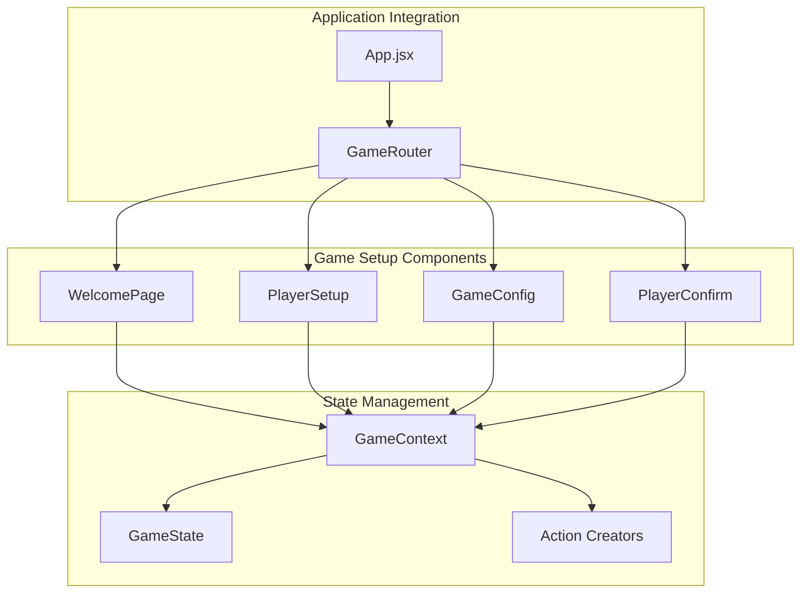
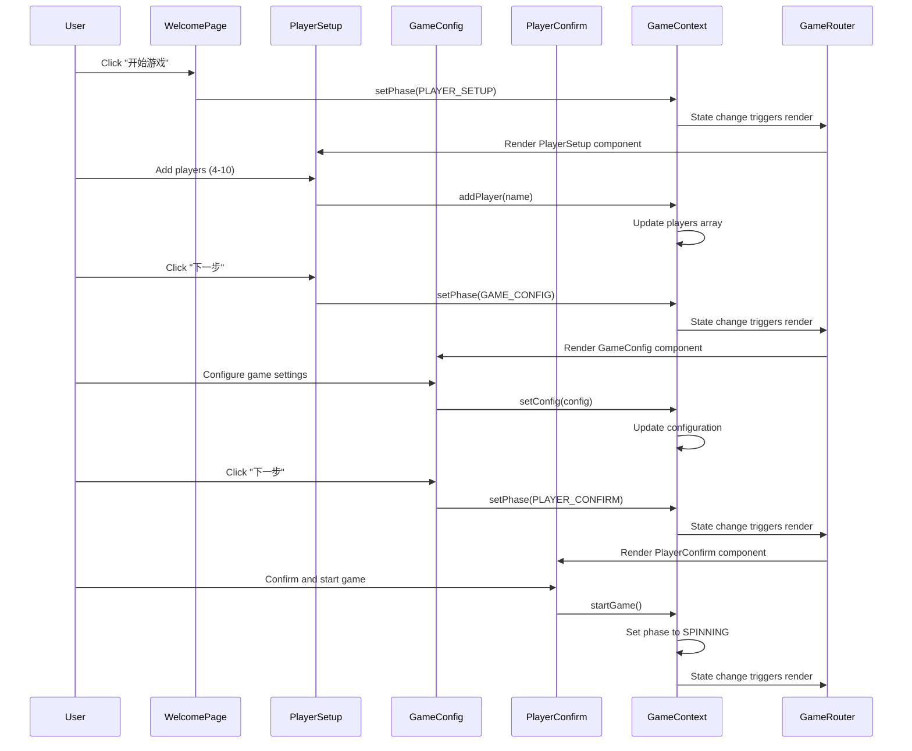
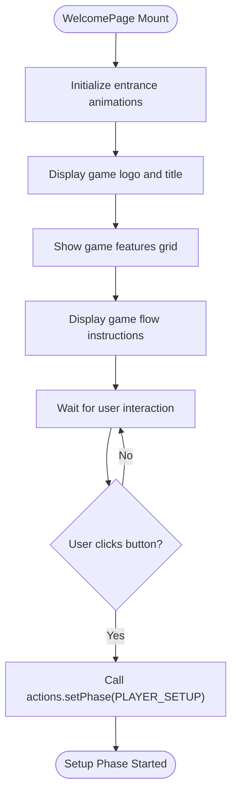
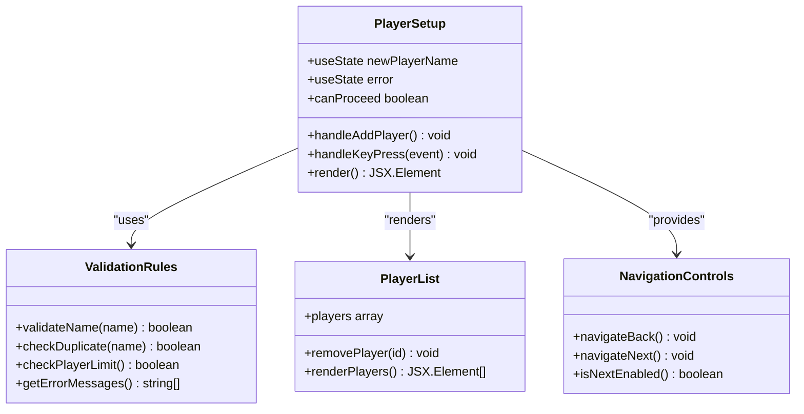
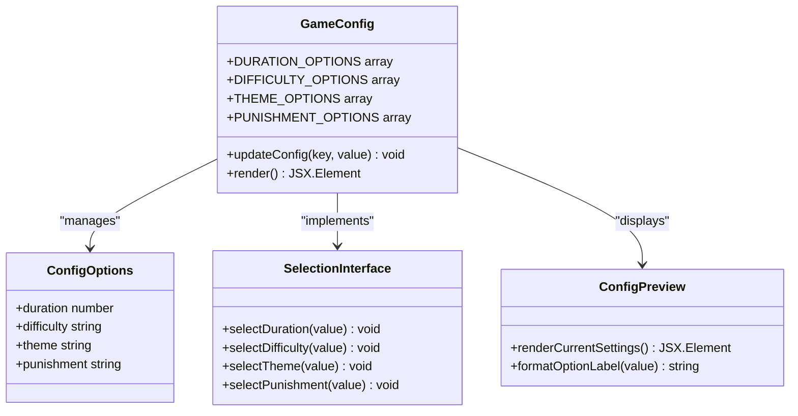
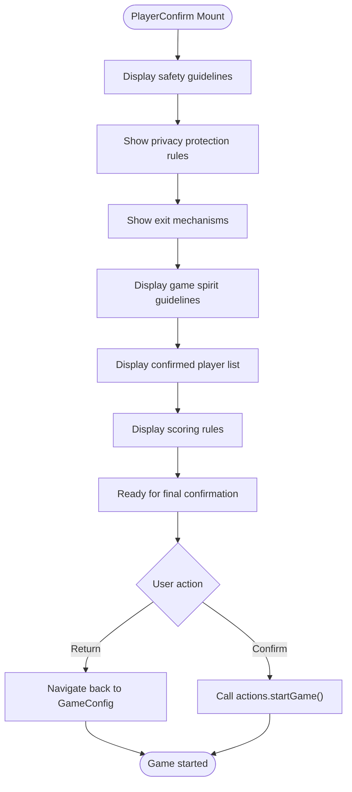
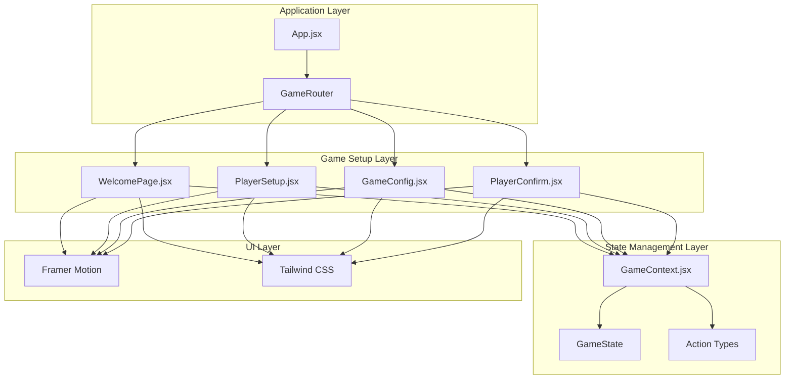

# Game Setup Components

<cite>
**Referenced Files in This Document**
- [WelcomePage.jsx](file://src/components/GameSetup/WelcomePage.jsx)
- [PlayerSetup.jsx](file://src/components/GameSetup/PlayerSetup.jsx)
- [GameConfig.jsx](file://src/components/GameSetup/GameConfig.jsx)
- [PlayerConfirm.jsx](file://src/components/GameSetup/PlayerConfirm.jsx)
- [GameContext.jsx](file://src/context/GameContext.jsx)
- [App.jsx](file://src/App.jsx)
- [index.css](file://src/index.css)
</cite>

## Table of Contents
1. [Introduction](#introduction)
2. [Project Structure](#project-structure)
3. [Core Components](#core-components)
4. [Architecture Overview](#architecture-overview)
5. [Detailed Component Analysis](#detailed-component-analysis)
6. [Dependency Analysis](#dependency-analysis)
7. [Performance Considerations](#performance-considerations)
8. [Troubleshooting Guide](#troubleshooting-guide)
9. [Conclusion](#conclusion)

## Introduction
This document provides comprehensive documentation for the game setup component system in the Truth or Dare party game. The system implements a sequential setup flow that guides users through four distinct phases: WelcomePage, PlayerSetup, GameConfig, and PlayerConfirm. The components work together with centralized state management through GameContext to orchestrate player registration (supporting 4-10 players), game configuration (duration, difficulty, theme, and punishment mechanics), and validation mechanisms.

The setup system emphasizes user-friendly interactions, smooth animations using Framer Motion, and robust state synchronization across components. Each phase enforces specific validation rules and provides clear navigation pathways to ensure a seamless setup experience.

## Project Structure
The game setup components are organized within the GameSetup directory and integrate with the central GameContext state management system. The components follow a clear separation of concerns with dedicated responsibilities for each phase of the setup process.

**Diagram sources**
- [App.jsx](file://src/App.jsx#L13-L45)
- [GameContext.jsx](file://src/context/GameContext.jsx#L243-L297)

**Section sources**
- [App.jsx](file://src/App.jsx#L1-L58)
- [GameContext.jsx](file://src/context/GameContext.jsx#L1-L308)

## Core Components
The game setup system consists of four primary components that collectively manage the entire setup workflow:

### WelcomePage Component
The WelcomePage serves as the entry point for the setup process, presenting game information and initiating the player registration phase. It utilizes sophisticated animations to create an engaging user experience while maintaining intuitive navigation controls.

### PlayerSetup Component
The PlayerSetup component manages player registration with comprehensive validation mechanisms. It supports dynamic player addition, removal, and validation against the 4-10 player constraint. The component provides real-time feedback through animated error messages and maintains a responsive player list interface.

### GameConfig Component
The GameConfig component handles game configuration options including duration, difficulty, theme selection, and punishment mechanisms. It presents interactive selection interfaces with visual feedback and maintains a live configuration preview.

### PlayerConfirm Component
The PlayerConfirm component provides a final review and confirmation interface. It displays safety guidelines, privacy protections, and game rules while presenting the confirmed player list and game configuration details.

**Section sources**
- [WelcomePage.jsx](file://src/components/GameSetup/WelcomePage.jsx#L1-L88)
- [PlayerSetup.jsx](file://src/components/GameSetup/PlayerSetup.jsx#L1-L194)
- [GameConfig.jsx](file://src/components/GameSetup/GameConfig.jsx#L1-L185)
- [PlayerConfirm.jsx](file://src/components/GameSetup/PlayerConfirm.jsx#L1-L158)

## Architecture Overview
The game setup architecture follows a unidirectional data flow pattern with centralized state management. Components communicate exclusively through GameContext actions, ensuring predictable state updates and maintaining component isolation.

**Diagram sources**
- [WelcomePage.jsx](file://src/components/GameSetup/WelcomePage.jsx#L52-L61)
- [PlayerSetup.jsx](file://src/components/GameSetup/PlayerSetup.jsx#L177-L188)
- [GameConfig.jsx](file://src/components/GameSetup/GameConfig.jsx#L171-L179)
- [PlayerConfirm.jsx](file://src/components/GameSetup/PlayerConfirm.jsx#L143-L152)
- [GameContext.jsx](file://src/context/GameContext.jsx#L67-L113)
- [App.jsx](file://src/App.jsx#L13-L45)

## Detailed Component Analysis

### WelcomePage Component Analysis
The WelcomePage component implements a welcoming interface that introduces users to the game while providing immediate access to the setup process. It utilizes sophisticated animation sequences to create visual appeal and engagement.

**Diagram sources**
- [WelcomePage.jsx](file://src/components/GameSetup/WelcomePage.jsx#L8-L61)

Key features include:
- Animated entrance effects using Framer Motion
- Feature showcase grid with visual icons
- Gradient button with hover/tap animations
- Step-by-step game flow explanation
- Responsive design with mobile-first approach

**Section sources**
- [WelcomePage.jsx](file://src/components/GameSetup/WelcomePage.jsx#L1-L88)

### PlayerSetup Component Analysis
The PlayerSetup component manages the critical player registration phase with robust validation and user-friendly interfaces. It supports dynamic player management with comprehensive error handling and validation mechanisms.

**Diagram sources**
- [PlayerSetup.jsx](file://src/components/GameSetup/PlayerSetup.jsx#L5-L35)

The component implements several validation mechanisms:
- Real-time name validation (non-empty, unique, length constraints)
- Player count enforcement (minimum 4, maximum 10)
- Duplicate prevention with user feedback
- Keyboard support (Enter key submission)
- Animated error display with Framer Motion

**Section sources**
- [PlayerSetup.jsx](file://src/components/GameSetup/PlayerSetup.jsx#L1-L194)

### GameConfig Component Analysis
The GameConfig component provides comprehensive game configuration options with intuitive selection interfaces and real-time configuration previews.

**Diagram sources**
- [GameConfig.jsx](file://src/components/GameSetup/GameConfig.jsx#L30-L36)

Configuration options include:
- Duration settings (30, 45, 60 minutes) with descriptive labels
- Difficulty levels (easy, standard, hard) with emoji indicators
- Theme selections (mixed, emotion, funny, school, work) with thematic icons
- Punishment mechanisms (none, light, medium) with impact descriptions

**Section sources**
- [GameConfig.jsx](file://src/components/GameSetup/GameConfig.jsx#L1-L185)

### PlayerConfirm Component Analysis
The PlayerConfirm component serves as the final verification stage, presenting essential game guidelines and confirming the setup details before game commencement.

**Diagram sources**
- [PlayerConfirm.jsx](file://src/components/GameSetup/PlayerConfirm.jsx#L11-L99)

The component presents four essential guideline categories:
- Safety word establishment for discomfort situations
- Privacy protection for game content
- Exit mechanisms and skip card usage
- General game spirit and respectful participation guidelines

**Section sources**
- [PlayerConfirm.jsx](file://src/components/GameSetup/PlayerConfirm.jsx#L1-L158)

## Dependency Analysis
The game setup components demonstrate excellent separation of concerns with minimal inter-component dependencies. All communication occurs through the centralized GameContext, ensuring loose coupling and high maintainability.

**Diagram sources**
- [GameContext.jsx](file://src/context/GameContext.jsx#L1-L308)
- [App.jsx](file://src/App.jsx#L1-L58)

The dependency relationships show:
- All components depend solely on GameContext for state and actions
- No circular dependencies between setup components
- Centralized state management prevents prop drilling
- Animation library (Framer Motion) provides consistent UX across components
- Tailwind CSS ensures consistent styling patterns

**Section sources**
- [GameContext.jsx](file://src/context/GameContext.jsx#L243-L297)
- [App.jsx](file://src/App.jsx#L13-L45)

## Performance Considerations
The game setup system implements several performance optimization strategies:

### State Management Efficiency
- Centralized state reduces unnecessary re-renders through selective updates
- Action creators encapsulate state mutations, preventing direct state manipulation
- Immutable state updates ensure predictable rendering and debugging

### Component Rendering Optimization
- AnimatePresence provides efficient enter/exit animations with proper cleanup
- Conditional rendering minimizes DOM overhead during phase transitions
- Memoized configurations prevent redundant calculations

### Memory Management
- Proper cleanup of animation listeners and event handlers
- Efficient player list rendering with virtualization principles
- Minimal DOM nodes per component for optimal performance

## Troubleshooting Guide

### Common Setup Issues and Solutions

#### Player Registration Problems
- **Issue**: Players cannot be added beyond 10
  - **Cause**: Maximum player limit enforced
  - **Solution**: Remove existing players or adjust game requirements
  
- **Issue**: Duplicate player names rejected
  - **Cause**: Name uniqueness validation
  - **Solution**: Use unique names or remove duplicates
  
- **Issue**: Next button disabled
  - **Cause**: Insufficient players (less than 4)
  - **Solution**: Add more players to meet minimum requirement

#### Configuration Validation Issues
- **Issue**: Configuration changes not persisting
  - **Cause**: Missing action dispatch
  - **Solution**: Ensure setConfig action is called with proper payload
  
- **Issue**: Theme selection not updating
  - **Cause**: State synchronization problems
  - **Solution**: Verify config object structure and action payload

#### Navigation Flow Problems
- **Issue**: Cannot navigate between phases
  - **Cause**: Incorrect phase constants or action dispatch
  - **Solution**: Verify GAME_PHASES enumeration and setPhase action usage

**Section sources**
- [PlayerSetup.jsx](file://src/components/GameSetup/PlayerSetup.jsx#L10-L27)
- [GameConfig.jsx](file://src/components/GameSetup/GameConfig.jsx#L34-L36)
- [GameContext.jsx](file://src/context/GameContext.jsx#L67-L113)

## Conclusion
The game setup component system demonstrates excellent architectural design with clear separation of concerns, robust state management, and user-friendly interfaces. The sequential setup flow from WelcomePage through PlayerSetup, GameConfig, and PlayerConfirm provides a comprehensive foundation for game initialization while maintaining flexibility for future enhancements.

The system's strength lies in its centralized state management approach, which ensures consistency across all setup phases while enabling easy maintenance and extension. The validation mechanisms, animation implementations, and responsive design patterns create a polished user experience that scales effectively across different device sizes and usage scenarios.

Future enhancements could include additional configuration options, advanced player management features, and integration with external data sources for persistent game sessions.