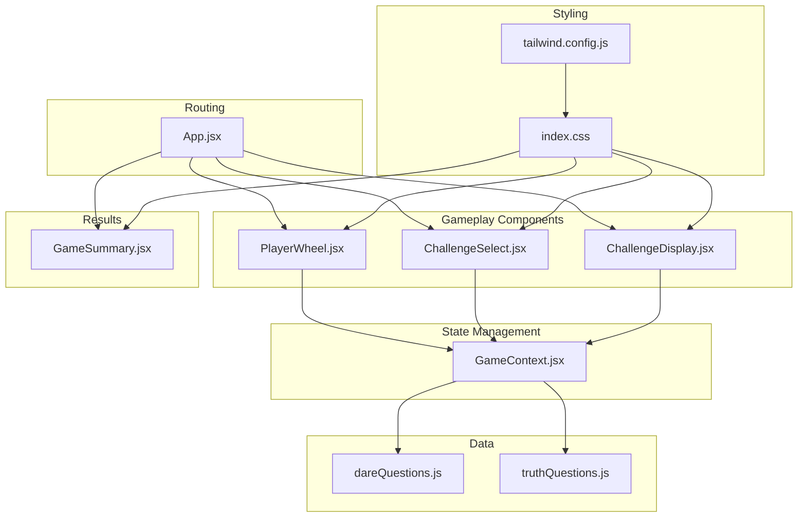
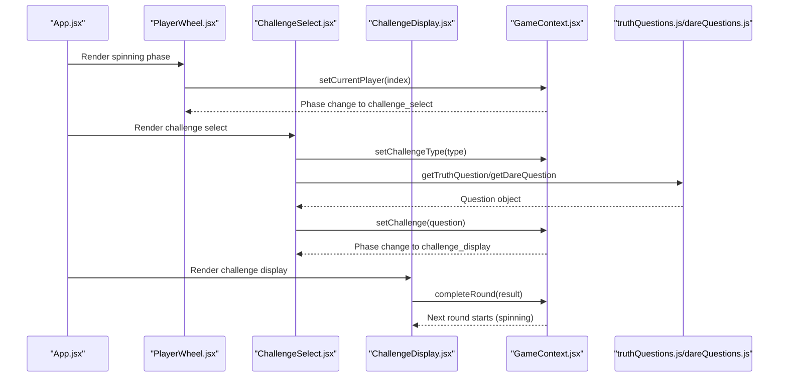
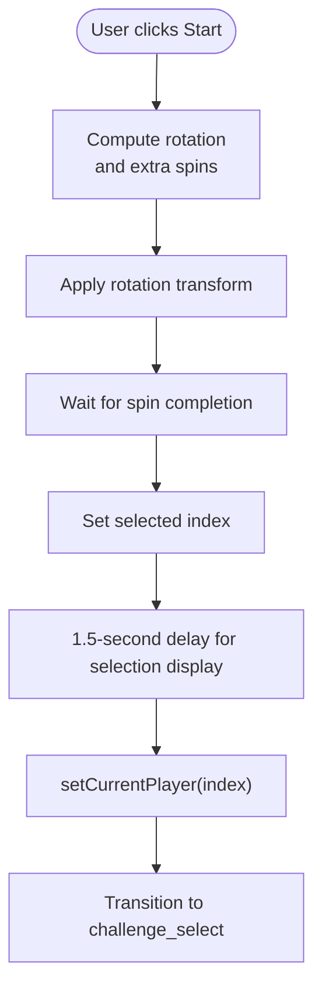
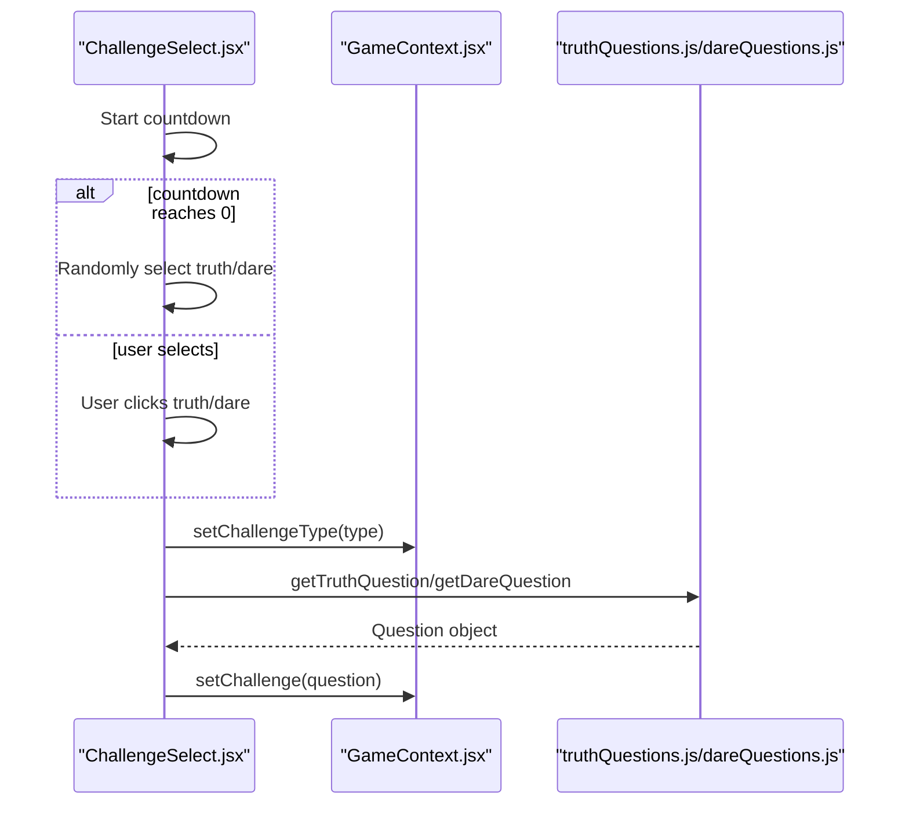
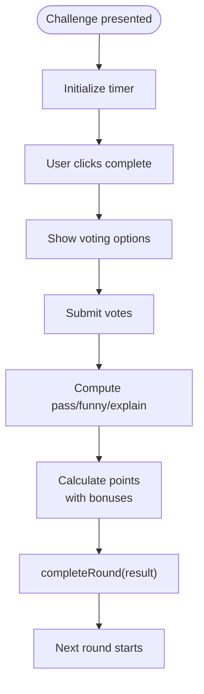
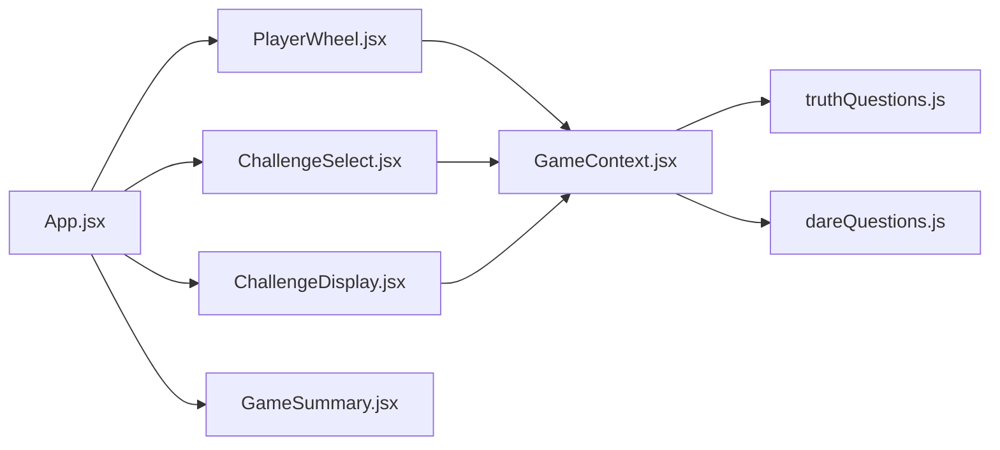

# Gameplay Components

<cite>
**Referenced Files in This Document**
- [PlayerWheel.jsx](file://src/components/GamePlay/PlayerWheel.jsx)
- [ChallengeSelect.jsx](file://src/components/GamePlay/ChallengeSelect.jsx)
- [ChallengeDisplay.jsx](file://src/components/GamePlay/ChallengeDisplay.jsx)
- [GameContext.jsx](file://src/context/GameContext.jsx)
- [dareQuestions.js](file://src/data/dareQuestions.js)
- [truthQuestions.js](file://src/data/truthQuestions.js)
- [App.jsx](file://src/App.jsx)
- [index.css](file://src/index.css)
- [tailwind.config.js](file://tailwind.config.js)
- [GameSummary.jsx](file://src/components/Results/GameSummary.jsx)
</cite>

## Update Summary
**Changes Made**
- Updated PlayerWheel component analysis to reflect new isSelected state and enhanced visual feedback system
- Added documentation for 1.5-second delay mechanism for selected player display
- Updated timeout management section to cover separate spinTimeout and jumpTimeout handling
- Enhanced component lifecycle documentation with improved state control

## Table of Contents
1. [Introduction](#introduction)
2. [Project Structure](#project-structure)
3. [Core Components](#core-components)
4. [Architecture Overview](#architecture-overview)
5. [Detailed Component Analysis](#detailed-component-analysis)
6. [Dependency Analysis](#dependency-analysis)
7. [Performance Considerations](#performance-considerations)
8. [Troubleshooting Guide](#troubleshooting-guide)
9. [Conclusion](#conclusion)

## Introduction
This document provides a comprehensive guide to the core gameplay component system, focusing on the PlayerWheel spinning mechanism, challenge selection interface, and interactive challenge display system. It explains component lifecycles, animation triggers, user interaction patterns, state synchronization with GameContext, challenge generation logic, voting system implementation, and round progression mechanics. It also covers styling with Tailwind CSS, responsive design considerations, accessibility features, performance optimizations, and user experience enhancements.

## Project Structure
The gameplay components reside under src/components/GamePlay and integrate with GameContext for state management. The App router orchestrates phase-based rendering across all screens, including the spinning wheel, challenge selection, challenge display, and game summary.

**Diagram sources**
- [App.jsx](file://src/App.jsx#L13-L45)
- [PlayerWheel.jsx](file://src/components/GamePlay/PlayerWheel.jsx#L1-L300)
- [ChallengeSelect.jsx](file://src/components/GamePlay/ChallengeSelect.jsx#L1-L201)
- [ChallengeDisplay.jsx](file://src/components/GamePlay/ChallengeDisplay.jsx#L1-L341)
- [GameContext.jsx](file://src/context/GameContext.jsx#L1-L308)
- [dareQuestions.js](file://src/data/dareQuestions.js#L1-L143)
- [truthQuestions.js](file://src/data/truthQuestions.js#L1-L134)
- [index.css](file://src/index.css#L1-L73)
- [tailwind.config.js](file://tailwind.config.js#L1-L12)
- [GameSummary.jsx](file://src/components/Results/GameSummary.jsx#L1-L223)

**Section sources**
- [App.jsx](file://src/App.jsx#L1-L58)
- [GameContext.jsx](file://src/context/GameContext.jsx#L1-L308)

## Core Components
- PlayerWheel: Handles player spinning animation, winner selection, and transitions to the next phase with enhanced visual feedback and improved state control.
- ChallengeSelect: Presents truth/dare selection with countdown and automatic selection fallback.
- ChallengeDisplay: Manages challenge presentation, timing, voting, and scoring mechanics.

**Section sources**
- [PlayerWheel.jsx](file://src/components/GamePlay/PlayerWheel.jsx#L1-L300)
- [ChallengeSelect.jsx](file://src/components/GamePlay/ChallengeSelect.jsx#L1-L201)
- [ChallengeDisplay.jsx](file://src/components/GamePlay/ChallengeDisplay.jsx#L1-L341)

## Architecture Overview
The system follows a centralized state management pattern using React's useReducer and context. Components communicate through GameContext actions and subscribe to state changes. Animations leverage Framer Motion for smooth transitions and micro-interactions. Tailwind CSS provides responsive styling and theming.

**Diagram sources**
- [App.jsx](file://src/App.jsx#L13-L45)
- [PlayerWheel.jsx](file://src/components/GamePlay/PlayerWheel.jsx#L28-L67)
- [ChallengeSelect.jsx](file://src/components/GamePlay/ChallengeSelect.jsx#L38-L71)
- [ChallengeDisplay.jsx](file://src/components/GamePlay/ChallengeDisplay.jsx#L62-L99)
- [GameContext.jsx](file://src/context/GameContext.jsx#L115-L138)
- [truthQuestions.js](file://src/data/truthQuestions.js#L104-L133)
- [dareQuestions.js](file://src/data/dareQuestions.js#L106-L128)

## Detailed Component Analysis

### PlayerWheel Component
The PlayerWheel component manages the spinning animation, winner selection, and round progression with enhanced visual feedback and improved state control. It calculates segment angles for each player, generates gradient-filled SVG segments, and animates rotation with easing. After the spin completes, it sets the current player and transitions to the next phase with a 1.5-second delay for better user experience.

**Updated** Enhanced with new isSelected state and improved visual feedback system

Key behaviors:
- Lifecycle hooks:
  - Effect checks for game end on round changes.
  - Cleanup clears both spinTimeout and jumpTimeout on unmount.
- Animation triggers:
  - startSpin computes total rotation (extra spins plus target alignment).
  - Rotation state updates with a 4-second cubic-bezier curve.
- State synchronization:
  - Uses GameContext to set current player and end game when time expires.
- Interactive elements:
  - Disabled button during spin or selection states.
  - Enhanced leaderboard preview and progress bar with celebratory animations.

**Diagram sources**
- [PlayerWheel.jsx](file://src/components/GamePlay/PlayerWheel.jsx#L31-L62)
- [GameContext.jsx](file://src/context/GameContext.jsx#L115-L121)

**Section sources**
- [PlayerWheel.jsx](file://src/components/GamePlay/PlayerWheel.jsx#L1-L300)
- [GameContext.jsx](file://src/context/GameContext.jsx#L280-L285)

### ChallengeSelect Component
ChallengeSelect presents truth/dare selection with a 10-second countdown. If time runs out, it randomly selects a challenge type. It integrates with GameContext to set the challenge type and later fetches a question from data modules.

Key behaviors:
- Lifecycle hooks:
  - Countdown effect decrements every second until zero.
  - Cleanup clears timers on unmount.
- Hidden task probability:
  - 5% chance to trigger a hidden task via GameContext.
- State synchronization:
  - Sets challenge type and triggers question retrieval after a short delay.

**Diagram sources**
- [ChallengeSelect.jsx](file://src/components/GamePlay/ChallengeSelect.jsx#L14-L71)
- [truthQuestions.js](file://src/data/truthQuestions.js#L104-L133)
- [dareQuestions.js](file://src/data/dareQuestions.js#L106-L128)
- [GameContext.jsx](file://src/context/GameContext.jsx#L123-L138)

**Section sources**
- [ChallengeSelect.jsx](file://src/components/GamePlay/ChallengeSelect.jsx#L1-L201)
- [truthQuestions.js](file://src/data/truthQuestions.js#L104-L133)
- [dareQuestions.js](file://src/data/dareQuestions.js#L106-L128)

### ChallengeDisplay Component
ChallengeDisplay handles challenge presentation, timing, voting, and scoring. It initializes timers based on challenge type, supports skip cards and props, and aggregates votes to compute results.

Key behaviors:
- Lifecycle hooks:
  - Initializes timeLeft based on challenge type and duration.
  - Counts down while not in voting mode.
- Voting system:
  - Simulates other players' votes (single-device mode).
  - Computes pass/funny/explain outcomes and bonus points.
- Scoring mechanics:
  - Truth challenges award 2 points; dare challenges award 3 points.
  - Funny votes grant a bonus point.
  - Double prop doubles the final points.
- Props:
  - Protect card allows skipping with zero points.
  - Reverse, double, trouble, and other props are supported via GameContext.

**Diagram sources**
- [ChallengeDisplay.jsx](file://src/components/GamePlay/ChallengeDisplay.jsx#L17-L99)
- [GameContext.jsx](file://src/context/GameContext.jsx#L146-L180)

**Section sources**
- [ChallengeDisplay.jsx](file://src/components/GamePlay/ChallengeDisplay.jsx#L1-L341)
- [GameContext.jsx](file://src/context/GameContext.jsx#L17-L22)

### Challenge Generation Logic
Challenge generation filters questions by difficulty and theme for truth questions and by difficulty categories for dare questions. It avoids duplicates by tracking used question IDs and resets usage when filters exhaust available items.

- Truth questions:
  - Filters by theme and difficulty ranges.
  - Falls back to resetting used IDs when no matches remain.
- Dare questions:
  - Filters by difficulty categories and duration hints.
  - Falls back to resetting difficulty filters when exhausted.
- Hidden tasks:
  - 5% chance to trigger a special hidden task.

**Section sources**
- [truthQuestions.js](file://src/data/truthQuestions.js#L104-L133)
- [dareQuestions.js](file://src/data/dareQuestions.js#L106-L128)
- [ChallengeSelect.jsx](file://src/components/GamePlay/ChallengeSelect.jsx#L29-L46)

### Voting System Implementation
The voting system simulates other players' votes in a single-device environment. It aggregates votes and determines pass/funny/explain outcomes, awarding points accordingly and applying bonuses.

- Pass threshold:
  - If any pass or funny vote exists, the challenge passes.
- Funny bonus:
  - Adds a bonus point when any funny vote is present.
- Scoring:
  - Truth: base 2 points; dare: base 3 points.
  - Double prop multiplies final points.

**Section sources**
- [ChallengeDisplay.jsx](file://src/components/GamePlay/ChallengeDisplay.jsx#L67-L99)
- [GameContext.jsx](file://src/context/GameContext.jsx#L149-L150)

### Round Progression Mechanics
Round progression advances through phases: spinning → challenge selection → challenge display → spinning. The reducer updates scores, histories, and resets votes and challenge state. Game end detection occurs when elapsed time exceeds configured duration.

- Phase transitions:
  - setCurrentPlayer → challenge_select → challenge_display → spinning.
- Scoring and history:
  - Updates player stats and round history entries.
- Game end:
  - checkGameEnd compares elapsed minutes to config duration.

**Section sources**
- [GameContext.jsx](file://src/context/GameContext.jsx#L115-L121)
- [GameContext.jsx](file://src/context/GameContext.jsx#L146-L180)
- [GameContext.jsx](file://src/context/GameContext.jsx#L281-L285)

### Component Styling and Responsive Design
Tailwind CSS provides a consistent design system with:
- Gradient color schemes and card-based layouts.
- Responsive padding and sizing for mobile and desktop.
- Animated transitions and hover effects.
- Custom animations for glow and bounce-in effects.

Responsive considerations:
- Grid layouts adapt to two-column buttons on challenge selection.
- Centered containers with max widths ensure readability.
- Typography scales appropriately across breakpoints.

Accessibility features:
- Semantic headings and labels.
- Focus-friendly button states.
- Sufficient contrast for text and backgrounds.

**Section sources**
- [index.css](file://src/index.css#L1-L73)
- [tailwind.config.js](file://tailwind.config.js#L1-L12)
- [PlayerWheel.jsx](file://src/components/GamePlay/PlayerWheel.jsx#L125-L299)
- [ChallengeSelect.jsx](file://src/components/GamePlay/ChallengeSelect.jsx#L77-L199)
- [ChallengeDisplay.jsx](file://src/components/GamePlay/ChallengeDisplay.jsx#L106-L339)

### Enhanced Timeout Management
The PlayerWheel component now uses separate timeout management for better state control and user experience. Two distinct timeout references manage different phases of the spinning process:

- **spinTimeout**: Manages the 4-second spinning animation completion and triggers the selection display
- **jumpTimeout**: Controls the 1.5-second delay before transitioning to the challenge selection phase

This separation allows for more precise state management and prevents conflicts between the spinning animation and the selection display phases.

**Section sources**
- [PlayerWheel.jsx](file://src/components/GamePlay/PlayerWheel.jsx#L11-L12)
- [PlayerWheel.jsx](file://src/components/GamePlay/PlayerWheel.jsx#L51-L61)
- [PlayerWheel.jsx](file://src/components/GamePlay/PlayerWheel.jsx#L65-L74)

## Dependency Analysis
The components depend on GameContext for state and actions, and on data modules for challenge generation. App.jsx orchestrates routing across phases.

**Diagram sources**
- [App.jsx](file://src/App.jsx#L13-L45)
- [PlayerWheel.jsx](file://src/components/GamePlay/PlayerWheel.jsx#L1-L10)
- [ChallengeSelect.jsx](file://src/components/GamePlay/ChallengeSelect.jsx#L1-L6)
- [ChallengeDisplay.jsx](file://src/components/GamePlay/ChallengeDisplay.jsx#L1-L4)
- [GameContext.jsx](file://src/context/GameContext.jsx#L1-L308)
- [truthQuestions.js](file://src/data/truthQuestions.js#L1-L134)
- [dareQuestions.js](file://src/data/dareQuestions.js#L1-L143)

**Section sources**
- [App.jsx](file://src/App.jsx#L1-L58)
- [GameContext.jsx](file://src/context/GameContext.jsx#L1-L308)

## Performance Considerations
- Animation optimization:
  - Use transform-based animations (rotation, scaling) for GPU acceleration.
  - Limit expensive recalculations inside render loops.
- State updates:
  - Batch updates via GameContext actions to minimize re-renders.
  - Avoid unnecessary deep object cloning in reducers.
- Data filtering:
  - Cache filtered question pools when possible to reduce repeated computations.
- Cleanup:
  - Clear both spinTimeout and jumpTimeout in useEffect cleanup to prevent memory leaks.
- Rendering:
  - Use AnimatePresence for efficient enter/exit animations.
  - Keep component trees shallow to reduce layout thrashing.

## Troubleshooting Guide
Common issues and resolutions:
- Spinning animation does not trigger:
  - Verify isSpinning guard and rotation state updates.
  - Ensure timeout cleanup prevents conflicting animations.
- Challenge not appearing after selection:
  - Confirm setChallengeType and setChallenge actions are dispatched.
  - Check that data module filters are not empty.
- Voting not computed:
  - Ensure votes object is populated and handleConfirmResult reads it.
  - Verify pass/funny thresholds and bonus conditions.
- Game not ending:
  - Confirm elapsed time calculation and checkGameEnd logic.
  - Verify phase transitions to GAME_SUMMARY.
- Selection display not showing:
  - Verify isSelected state is properly managed and cleared after 1.5 seconds.
  - Check that jumpTimeout executes before setCurrentPlayer is called.

**Section sources**
- [PlayerWheel.jsx](file://src/components/GamePlay/PlayerWheel.jsx#L22-L67)
- [ChallengeSelect.jsx](file://src/components/GamePlay/ChallengeSelect.jsx#L14-L27)
- [ChallengeDisplay.jsx](file://src/components/GamePlay/ChallengeDisplay.jsx#L67-L99)
- [GameContext.jsx](file://src/context/GameContext.jsx#L281-L285)

## Conclusion
The gameplay component system integrates tightly with GameContext to deliver a cohesive, animated, and responsive experience. PlayerWheel provides engaging spinning mechanics with enhanced visual feedback, ChallengeSelect offers intuitive choice with countdown, and ChallengeDisplay manages timing, voting, and scoring. Tailwind CSS ensures consistent styling and responsiveness, while Framer Motion enhances user experience through smooth transitions. The modular design and clear state boundaries support maintainability and extensibility. The recent improvements to PlayerWheel with separate timeout management and enhanced selection feedback demonstrate the system's commitment to user experience optimization.