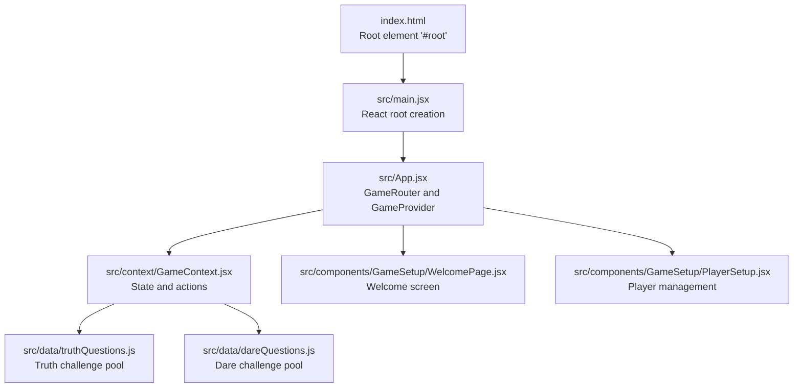

# Getting Started

<cite>
**Referenced Files in This Document**
- [package.json](file://package.json)
- [vite.config.js](file://vite.config.js)
- [eslint.config.js](file://eslint.config.js)
- [tailwind.config.js](file://tailwind.config.js)
- [index.html](file://index.html)
- [src/main.jsx](file://src/main.jsx)
- [src/App.jsx](file://src/App.jsx)
- [src/context/GameContext.jsx](file://src/context/GameContext.jsx)
- [src/components/GameSetup/WelcomePage.jsx](file://src/components/GameSetup/WelcomePage.jsx)
- [src/components/GameSetup/PlayerSetup.jsx](file://src/components/GameSetup/PlayerSetup.jsx)
- [src/data/truthQuestions.js](file://src/data/truthQuestions.js)
- [src/data/dareQuestions.js](file://src/data/dareQuestions.js)
</cite>

## Table of Contents
1. [Introduction](#introduction)
2. [Prerequisites](#prerequisites)
3. [Installation](#installation)
4. [Development Environment Setup](#development-environment-setup)
5. [Project Structure](#project-structure)
6. [Running the Application Locally](#running-the-application-locally)
7. [Development Workflow with Vite](#development-workflow-with-vite)
8. [Build and Preview](#build-and-preview)
9. [Initial Project Configuration](#initial-project-configuration)
10. [Troubleshooting Common Issues](#troubleshooting-common-issues)
11. [Conclusion](#conclusion)

## Introduction
This guide helps you quickly set up and run the Truth or Dare application locally. It covers prerequisites, installation, development workflow using Vite, and initial configuration. The project is a React application with Tailwind CSS for styling and Framer Motion for animations, configured to run efficiently with Vite.

## Prerequisites
Before installing the project, ensure your environment meets the following requirements:
- Node.js version compatible with the project dependencies (see the engines field in package.json)
- A package manager such as npm or yarn installed globally

These requirements are derived from the project’s dependency declarations and configuration.

**Section sources**
- [package.json](file://package.json#L1-L33)

## Installation
Follow these steps to install the project locally:

1. Clone or download the repository to your local machine.
2. Open a terminal in the project root directory.
3. Install dependencies using your preferred package manager:
   - npm: Run npm install
   - yarn: Run yarn install

This installs all runtime and development dependencies declared in package.json, including React, Tailwind CSS, Vite, and ESLint configurations.

**Section sources**
- [package.json](file://package.json#L12-L31)

## Development Environment Setup
After installing dependencies, configure your development environment:

- ESLint: The project includes an ESLint configuration that enforces recommended rules for JavaScript/JSX and integrates with React hooks and React Refresh. Use npm run lint to check for linting errors.
- Tailwind CSS: Tailwind is configured to scan HTML and JSX files under src for utility classes. The content paths are defined in tailwind.config.js.
- Vite: The development server and build pipeline are powered by Vite, configured in vite.config.js with the React plugin.

**Section sources**
- [eslint.config.js](file://eslint.config.js#L1-L30)
- [tailwind.config.js](file://tailwind.config.js#L1-L12)
- [vite.config.js](file://vite.config.js#L1-L8)

## Project Structure
The application follows a component-based structure with clear separation of concerns:

- src/main.jsx: Entry point that renders the root App component.
- src/App.jsx: Top-level component that orchestrates routing between game phases using GameContext.
- src/context/GameContext.jsx: Centralized state management for game phases, players, configuration, challenges, and props.
- src/components/GameSetup/: Components for welcome page, player setup, and game configuration.
- src/data/: Question banks for truth and dare challenges.
- index.html: Minimal HTML shell with a root element for React to mount.

**Diagram sources**
- [index.html](file://index.html#L1-L14)
- [src/main.jsx](file://src/main.jsx#L1-L11)
- [src/App.jsx](file://src/App.jsx#L1-L58)
- [src/context/GameContext.jsx](file://src/context/GameContext.jsx#L1-L308)
- [src/components/GameSetup/WelcomePage.jsx](file://src/components/GameSetup/WelcomePage.jsx#L1-L88)
- [src/components/GameSetup/PlayerSetup.jsx](file://src/components/GameSetup/PlayerSetup.jsx#L1-L194)
- [src/data/truthQuestions.js](file://src/data/truthQuestions.js#L1-L134)
- [src/data/dareQuestions.js](file://src/data/dareQuestions.js#L1-L143)

**Section sources**
- [index.html](file://index.html#L1-L14)
- [src/main.jsx](file://src/main.jsx#L1-L11)
- [src/App.jsx](file://src/App.jsx#L1-L58)
- [src/context/GameContext.jsx](file://src/context/GameContext.jsx#L1-L308)
- [src/components/GameSetup/WelcomePage.jsx](file://src/components/GameSetup/WelcomePage.jsx#L1-L88)
- [src/components/GameSetup/PlayerSetup.jsx](file://src/components/GameSetup/PlayerSetup.jsx#L1-L194)
- [src/data/truthQuestions.js](file://src/data/truthQuestions.js#L1-L134)
- [src/data/dareQuestions.js](file://src/data/dareQuestions.js#L1-L143)

## Running the Application Locally
Start the development server with hot module replacement (HMR):

- npm: Run npm run dev
- yarn: Run yarn dev

The development server starts and serves the app at http://localhost:5173 by default. The Vite configuration enables React Fast Refresh for efficient development.

Access the application in your browser and verify the initial screen shows the welcome page with navigation to player setup.

**Section sources**
- [package.json](file://package.json#L6-L11)
- [vite.config.js](file://vite.config.js#L1-L8)

## Development Workflow with Vite
The project uses Vite for fast development and building. Key aspects of the workflow:

- Hot Module Replacement (HMR): Changes to components and styles propagate instantly without full reloads.
- React Plugin: The @vitejs/plugin-react plugin is configured to support JSX and Fast Refresh.
- ESLint Integration: Use npm run lint to validate code quality and catch potential issues early.

Recommended commands:
- npm run dev: Start the development server
- npm run lint: Run ESLint checks
- npm run build: Build the production bundle
- npm run preview: Serve the built assets locally for testing

**Section sources**
- [vite.config.js](file://vite.config.js#L1-L8)
- [eslint.config.js](file://eslint.config.js#L1-L30)
- [package.json](file://package.json#L6-L11)

## Build and Preview
To prepare the application for deployment:

1. Production Build
   - npm: Run npm run build
   - yarn: Run yarn build
   This compiles and bundles the app for production.

2. Preview Built Assets
   - npm: Run npm run preview
   - yarn: Run yarn preview
   This serves the built assets locally to verify the production build.

The build output is optimized for performance and ready for static hosting.

**Section sources**
- [package.json](file://package.json#L6-L11)

## Initial Project Configuration
Several configuration files define how the app behaves during development and production:

- Vite Config (vite.config.js): Enables the React plugin for JSX and Fast Refresh.
- ESLint Config (eslint.config.js): Extends recommended rules for JS/JSX, React hooks, and React Refresh.
- Tailwind Config (tailwind.config.js): Scans index.html and all JSX files under src for utility classes.
- Package Scripts (package.json): Defines dev, build, lint, and preview scripts.

These configurations ensure a smooth developer experience and consistent code quality.

**Section sources**
- [vite.config.js](file://vite.config.js#L1-L8)
- [eslint.config.js](file://eslint.config.js#L1-L30)
- [tailwind.config.js](file://tailwind.config.js#L1-L12)
- [package.json](file://package.json#L6-L11)

## Troubleshooting Common Issues
Below are common setup and runtime issues along with solutions:

- Node.js Version Mismatch
  - Symptom: Installation fails or scripts do not run.
  - Cause: Node.js version incompatible with project dependencies.
  - Solution: Use a Node.js version that satisfies the engines requirement declared in package.json.

- Port Already in Use
  - Symptom: Development server fails to start on the default port.
  - Cause: Another process is using port 5173.
  - Solution: Change the Vite port in vite.config.js or stop the conflicting service.

- Missing Dependencies After Clone
  - Symptom: Running dev or build throws module resolution errors.
  - Cause: Dependencies were not installed.
  - Solution: Reinstall dependencies using npm install or yarn install.

- Linting Errors Blocking Development
  - Symptom: npm run lint reports errors preventing progress.
  - Cause: Code does not meet ESLint rules.
  - Solution: Fix reported issues or temporarily bypass linting only for local development if necessary.

- Tailwind Utilities Not Applied
  - Symptom: Tailwind classes have no effect.
  - Cause: Tailwind content paths not matching project structure.
  - Solution: Verify content globs in tailwind.config.js match your file locations.

- Unexpected Behavior in Game Phases
  - Symptom: Navigation between screens does not work as expected.
  - Cause: GameContext state not updating or components not consuming context.
  - Solution: Ensure components use useGame and dispatch actions correctly. Verify GAME_PHASES and state transitions in GameContext.

**Section sources**
- [package.json](file://package.json#L1-L33)
- [vite.config.js](file://vite.config.js#L1-L8)
- [eslint.config.js](file://eslint.config.js#L1-L30)
- [tailwind.config.js](file://tailwind.config.js#L1-L12)
- [src/context/GameContext.jsx](file://src/context/GameContext.jsx#L1-L308)

## Conclusion
You now have the essentials to install, run, and develop the Truth or Dare application locally. Use npm run dev for development, npm run build for production, and npm run lint to maintain code quality. The project’s configuration ensures a smooth experience with Vite, Tailwind CSS, and React. If you encounter issues, refer to the troubleshooting section and verify your environment against the prerequisites.