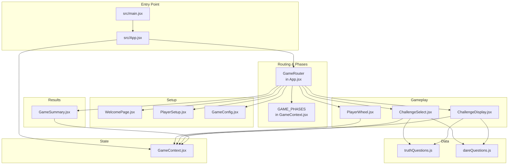
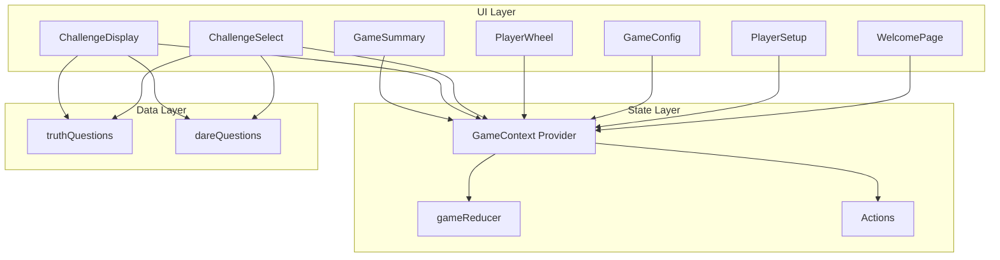
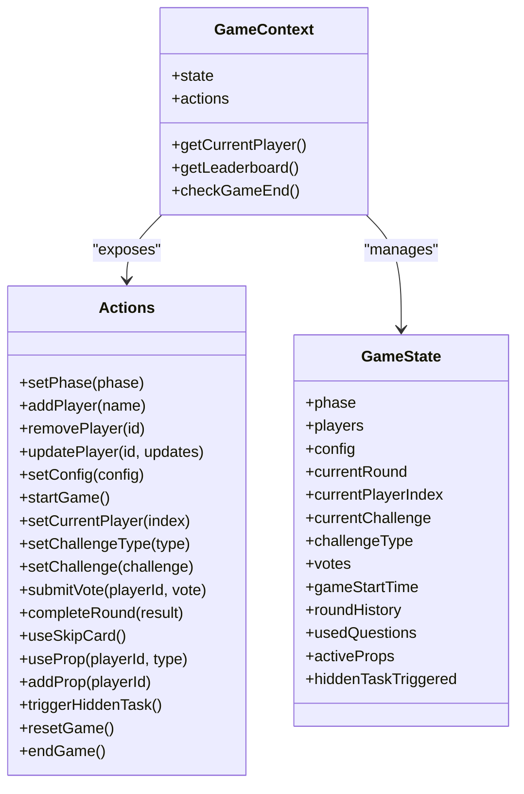
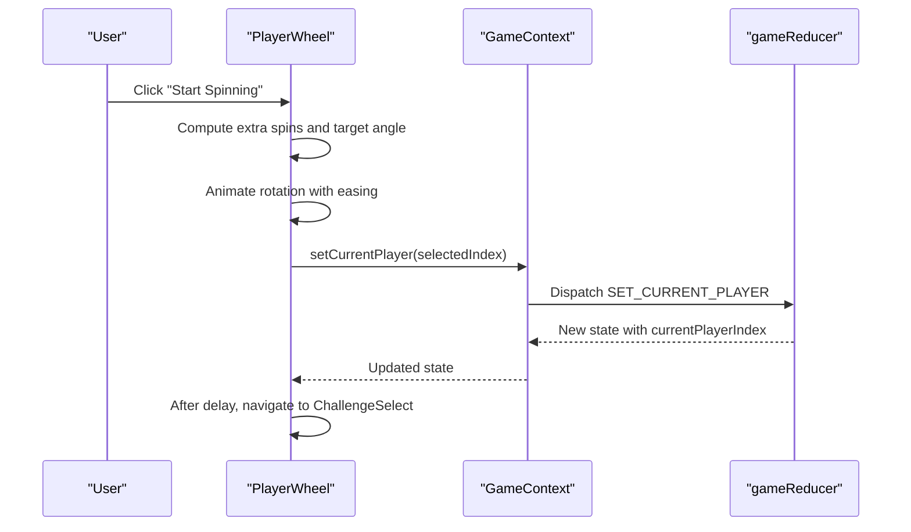
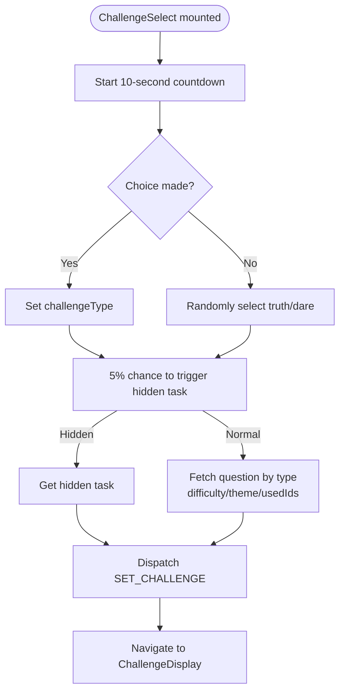
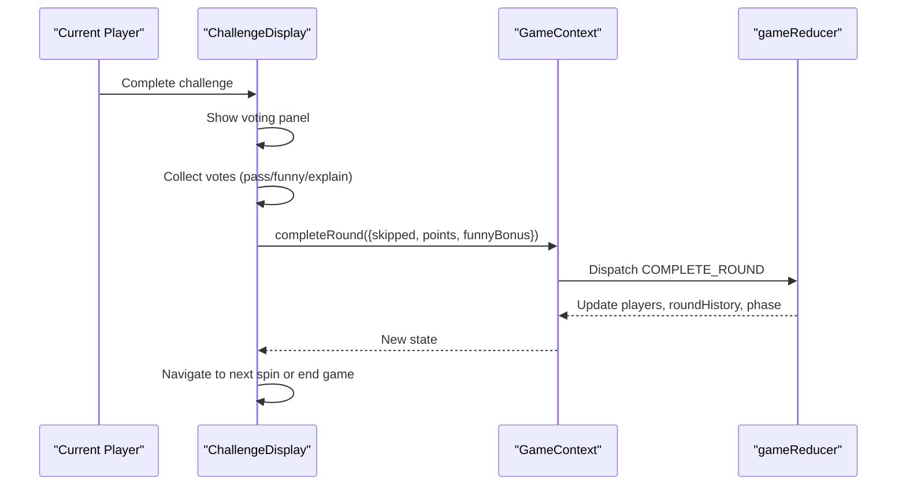
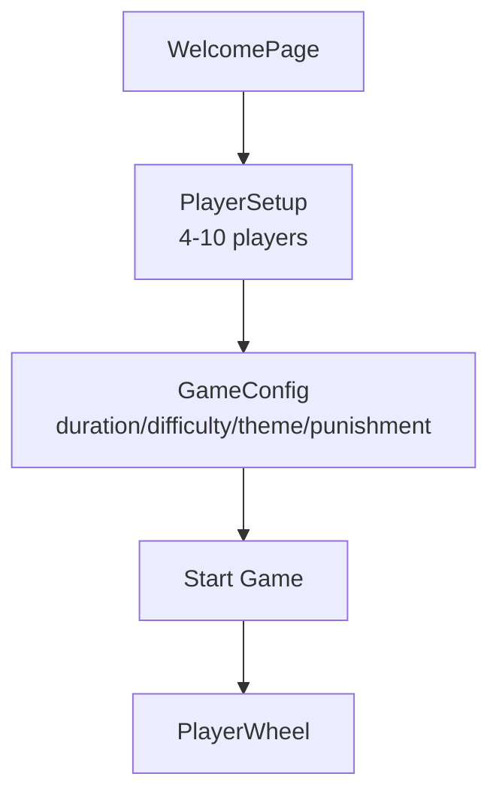
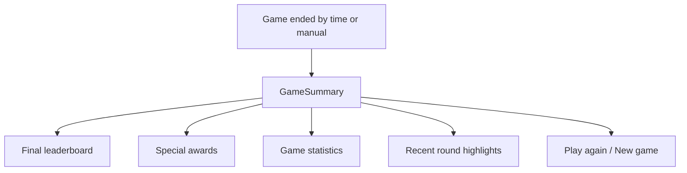
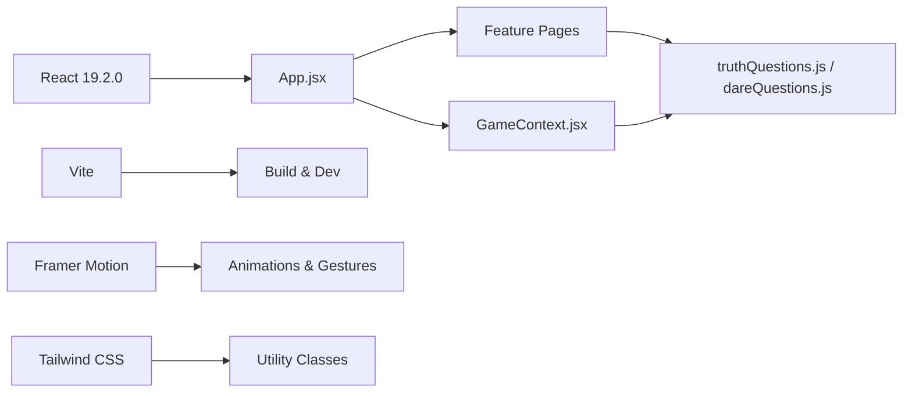

# Project Overview

<cite>
**Referenced Files in This Document**
- [README.md](file://README.md)
- [package.json](file://package.json)
- [src/App.jsx](file://src/App.jsx)
- [src/main.jsx](file://src/main.jsx)
- [src/context/GameContext.jsx](file://src/context/GameContext.jsx)
- [src/components/GamePlay/PlayerWheel.jsx](file://src/components/GamePlay/PlayerWheel.jsx)
- [src/components/GamePlay/ChallengeSelect.jsx](file://src/components/GamePlay/ChallengeSelect.jsx)
- [src/components/GamePlay/ChallengeDisplay.jsx](file://src/components/GamePlay/ChallengeDisplay.jsx)
- [src/components/GameSetup/WelcomePage.jsx](file://src/components/GameSetup/WelcomePage.jsx)
- [src/components/GameSetup/PlayerSetup.jsx](file://src/components/GameSetup/PlayerSetup.jsx)
- [src/components/GameSetup/GameConfig.jsx](file://src/components/GameSetup/GameConfig.jsx)
- [src/components/Results/GameSummary.jsx](file://src/components/Results/GameSummary.jsx)
- [src/data/truthQuestions.js](file://src/data/truthQuestions.js)
- [src/data/dareQuestions.js](file://src/data/dareQuestions.js)
- [src/index.css](file://src/index.css)
</cite>

## Table of Contents
1. [Introduction](#introduction)
2. [Project Structure](#project-structure)
3. [Core Components](#core-components)
4. [Architecture Overview](#architecture-overview)
5. [Detailed Component Analysis](#detailed-component-analysis)
6. [Dependency Analysis](#dependency-analysis)
7. [Performance Considerations](#performance-considerations)
8. [Troubleshooting Guide](#troubleshooting-guide)
9. [Conclusion](#conclusion)
10. [Appendices](#appendices)

## Introduction
This document provides a comprehensive overview of the Truth or Dare Game project, a digital adaptation of the classic party game designed for social gatherings and multiplayer experiences. The application guides players through a structured flow: adding participants, configuring game settings, spinning the player wheel, selecting challenges, displaying and voting on outcomes, and summarizing results. It emphasizes fun, interactive gameplay with animated transitions, configurable themes and difficulty, and a scoring system that rewards completion and humor.

Target audience:
- Social groups and friends playing together
- Party hosts seeking an engaging, tech-enhanced game
- Players who enjoy light competition and shared entertainment

Key differentiators:
- Animated transitions powered by Framer Motion for immersive UX
- Configurable game settings (duration, difficulty, theme, punishment)
- Prop-based gameplay with four distinct cards (Reverse, Protect, Double, Trouble)
- Hidden tasks that introduce dynamic, surprise mechanics
- Real-time scoring, leaderboards, and round summaries

## Project Structure
The project follows a React 19.2.0 application scaffolded with Vite, styled with Tailwind CSS, and enhanced with Framer Motion for animations. The codebase is organized by feature domains:
- Setup pages: welcome, player management, and configuration
- Gameplay: wheel spinning, challenge selection, and display with voting
- Results: game summary and statistics
- Data: truth and dare question libraries
- Context: centralized game state and actions

**Diagram sources**
- [src/main.jsx](file://src/main.jsx#L1-L11)
- [src/App.jsx](file://src/App.jsx#L1-L58)
- [src/context/GameContext.jsx](file://src/context/GameContext.jsx#L1-L308)
- [src/components/GameSetup/WelcomePage.jsx](file://src/components/GameSetup/WelcomePage.jsx#L1-L88)
- [src/components/GameSetup/PlayerSetup.jsx](file://src/components/GameSetup/PlayerSetup.jsx#L1-L194)
- [src/components/GameSetup/GameConfig.jsx](file://src/components/GameSetup/GameConfig.jsx#L1-L185)
- [src/components/GamePlay/PlayerWheel.jsx](file://src/components/GamePlay/PlayerWheel.jsx#L1-L293)
- [src/components/GamePlay/ChallengeSelect.jsx](file://src/components/GamePlay/ChallengeSelect.jsx#L1-L201)
- [src/components/GamePlay/ChallengeDisplay.jsx](file://src/components/GamePlay/ChallengeDisplay.jsx#L1-L341)
- [src/components/Results/GameSummary.jsx](file://src/components/Results/GameSummary.jsx#L1-L223)
- [src/data/truthQuestions.js](file://src/data/truthQuestions.js#L1-L134)
- [src/data/dareQuestions.js](file://src/data/dareQuestions.js#L1-L143)

**Section sources**
- [src/main.jsx](file://src/main.jsx#L1-L11)
- [src/App.jsx](file://src/App.jsx#L1-L58)
- [src/context/GameContext.jsx](file://src/context/GameContext.jsx#L1-L308)

## Core Components
- Game routing and phases: The application routes UI screens based on a finite set of game phases managed in the central context.
- Player wheel: Interactive spinner that selects the next player with smooth animations and progress tracking.
- Challenge selection: Players choose Truth or Dare with a countdown timer and optional hidden task trigger.
- Challenge display: Presents the selected challenge with a timer, voting mechanism, skip card usage, and prop activation.
- Setup and configuration: Welcome screen, player management, and customizable game settings.
- Results and summary: Final rankings, special awards, statistics, and replay options.

High-level feature overview:
- Player management: Add/remove players, enforce minimum/maximum counts, and track per-player stats.
- Scoring: Points awarded for completing challenges, adjusted by active props and bonuses.
- Voting: Players evaluate the challenge outcome; passing or humorous outcomes influence scoring.
- Props: Randomly distributed and used strategically to alter outcomes (skip, double points, reverse, trouble).
- Themes and difficulty: Filters for question pools to tailor the experience.
- Duration-based end: Game ends automatically after configured minutes.

System capabilities:
- Smooth, animated transitions between screens and interactions.
- Real-time progress indicators and leaderboards.
- Persistent round history for retrospective highlights.
- Responsive design via Tailwind CSS.

**Section sources**
- [src/context/GameContext.jsx](file://src/context/GameContext.jsx#L1-L308)
- [src/components/GamePlay/PlayerWheel.jsx](file://src/components/GamePlay/PlayerWheel.jsx#L1-L293)
- [src/components/GamePlay/ChallengeSelect.jsx](file://src/components/GamePlay/ChallengeSelect.jsx#L1-L201)
- [src/components/GamePlay/ChallengeDisplay.jsx](file://src/components/GamePlay/ChallengeDisplay.jsx#L1-L341)
- [src/components/GameSetup/WelcomePage.jsx](file://src/components/GameSetup/WelcomePage.jsx#L1-L88)
- [src/components/GameSetup/PlayerSetup.jsx](file://src/components/GameSetup/PlayerSetup.jsx#L1-L194)
- [src/components/GameSetup/GameConfig.jsx](file://src/components/GameSetup/GameConfig.jsx#L1-L185)
- [src/components/Results/GameSummary.jsx](file://src/components/Results/GameSummary.jsx#L1-L223)

## Architecture Overview
The application uses a centralized context provider pattern to manage global game state and actions. Components are organized by feature and communicate primarily through the context, ensuring predictable data flow and easy testing.

**Diagram sources**
- [src/context/GameContext.jsx](file://src/context/GameContext.jsx#L1-L308)
- [src/components/GameSetup/WelcomePage.jsx](file://src/components/GameSetup/WelcomePage.jsx#L1-L88)
- [src/components/GameSetup/PlayerSetup.jsx](file://src/components/GameSetup/PlayerSetup.jsx#L1-L194)
- [src/components/GameSetup/GameConfig.jsx](file://src/components/GameSetup/GameConfig.jsx#L1-L185)
- [src/components/GamePlay/PlayerWheel.jsx](file://src/components/GamePlay/PlayerWheel.jsx#L1-L293)
- [src/components/GamePlay/ChallengeSelect.jsx](file://src/components/GamePlay/ChallengeSelect.jsx#L1-L201)
- [src/components/GamePlay/ChallengeDisplay.jsx](file://src/components/GamePlay/ChallengeDisplay.jsx#L1-L341)
- [src/components/Results/GameSummary.jsx](file://src/components/Results/GameSummary.jsx#L1-L223)
- [src/data/truthQuestions.js](file://src/data/truthQuestions.js#L1-L134)
- [src/data/dareQuestions.js](file://src/data/dareQuestions.js#L1-L143)

## Detailed Component Analysis

### Game State and Phase Management
The central context defines game phases, configuration, player profiles, and actions. It also computes derived data like the current player, leaderboard, and game-end conditions.

**Diagram sources**
- [src/context/GameContext.jsx](file://src/context/GameContext.jsx#L1-L308)

**Section sources**
- [src/context/GameContext.jsx](file://src/context/GameContext.jsx#L1-L308)

### Player Wheel Mechanics
The wheel component renders a colorful segmented spinner, animates rotation with easing, and selects a player deterministically after a randomized spin. It integrates with the context to advance the game state and displays real-time progress and leaderboard previews.

**Diagram sources**
- [src/components/GamePlay/PlayerWheel.jsx](file://src/components/GamePlay/PlayerWheel.jsx#L1-L293)
- [src/context/GameContext.jsx](file://src/context/GameContext.jsx#L1-L308)

**Section sources**
- [src/components/GamePlay/PlayerWheel.jsx](file://src/components/GamePlay/PlayerWheel.jsx#L1-L293)

### Challenge System: Truth vs. Dare
Players select Truth or Dare with a countdown timer. The selection triggers question retrieval from themed and difficulty-filtered pools. A small chance introduces a hidden task, adding variety and surprise.

**Diagram sources**
- [src/components/GamePlay/ChallengeSelect.jsx](file://src/components/GamePlay/ChallengeSelect.jsx#L1-L201)
- [src/data/truthQuestions.js](file://src/data/truthQuestions.js#L1-L134)
- [src/data/dareQuestions.js](file://src/data/dareQuestions.js#L1-L143)
- [src/context/GameContext.jsx](file://src/context/GameContext.jsx#L1-L308)

**Section sources**
- [src/components/GamePlay/ChallengeSelect.jsx](file://src/components/GamePlay/ChallengeSelect.jsx#L1-L201)
- [src/data/truthQuestions.js](file://src/data/truthQuestions.js#L1-L134)
- [src/data/dareQuestions.js](file://src/data/dareQuestions.js#L1-L143)

### Challenge Display, Voting, and Scoring
The display component shows the challenge with a countdown, allows players to mark completion, skip with cards, or activate props. After completion, a voting interface lets others evaluate the outcome. Scoring is computed based on challenge type, bonuses, and prop effects.

**Diagram sources**
- [src/components/GamePlay/ChallengeDisplay.jsx](file://src/components/GamePlay/ChallengeDisplay.jsx#L1-L341)
- [src/context/GameContext.jsx](file://src/context/GameContext.jsx#L1-L308)

**Section sources**
- [src/components/GamePlay/ChallengeDisplay.jsx](file://src/components/GamePlay/ChallengeDisplay.jsx#L1-L341)
- [src/context/GameContext.jsx](file://src/context/GameContext.jsx#L1-L308)

### Setup and Configuration
The setup flow begins at the welcome page, progresses through player management, and concludes with configurable game settings. Navigation is phase-driven and enforces minimum player counts.

**Diagram sources**
- [src/components/GameSetup/WelcomePage.jsx](file://src/components/GameSetup/WelcomePage.jsx#L1-L88)
- [src/components/GameSetup/PlayerSetup.jsx](file://src/components/GameSetup/PlayerSetup.jsx#L1-L194)
- [src/components/GameSetup/GameConfig.jsx](file://src/components/GameSetup/GameConfig.jsx#L1-L185)
- [src/context/GameContext.jsx](file://src/context/GameContext.jsx#L1-L308)

**Section sources**
- [src/components/GameSetup/WelcomePage.jsx](file://src/components/GameSetup/WelcomePage.jsx#L1-L88)
- [src/components/GameSetup/PlayerSetup.jsx](file://src/components/GameSetup/PlayerSetup.jsx#L1-L194)
- [src/components/GameSetup/GameConfig.jsx](file://src/components/GameSetup/GameConfig.jsx#L1-L185)
- [src/context/GameContext.jsx](file://src/context/GameContext.jsx#L1-L308)

### Results and Summary
The summary screen aggregates final rankings, special awards (courage, humor, champion), statistics, and recent highlights. It offers quick restart options.

**Diagram sources**
- [src/components/Results/GameSummary.jsx](file://src/components/Results/GameSummary.jsx#L1-L223)
- [src/context/GameContext.jsx](file://src/context/GameContext.jsx#L1-L308)

**Section sources**
- [src/components/Results/GameSummary.jsx](file://src/components/Results/GameSummary.jsx#L1-L223)
- [src/context/GameContext.jsx](file://src/context/GameContext.jsx#L1-L308)

## Dependency Analysis
Technology stack:
- React 19.2.0 for component model and hooks
- Vite for fast development and build
- Framer Motion for animations and gestures
- Tailwind CSS for utility-first styling

**Diagram sources**
- [package.json](file://package.json#L1-L33)
- [src/App.jsx](file://src/App.jsx#L1-L58)
- [src/context/GameContext.jsx](file://src/context/GameContext.jsx#L1-L308)
- [src/data/truthQuestions.js](file://src/data/truthQuestions.js#L1-L134)
- [src/data/dareQuestions.js](file://src/data/dareQuestions.js#L1-L143)

**Section sources**
- [package.json](file://package.json#L1-L33)
- [src/index.css](file://src/index.css#L1-L73)

## Performance Considerations
- Animation optimization: Prefer transform and opacity for GPU-accelerated animations; keep spin durations reasonable.
- State updates: Batch related updates in reducers to minimize re-renders.
- Question pools: Filtering and randomization are lightweight; avoid unnecessary recomputation by caching used IDs per type.
- Rendering lists: Virtualize long lists (leaderboard/history) if extended.
- CSS: Tailwind utilities are efficient; avoid excessive nested styles.

## Troubleshooting Guide
Common issues and resolutions:
- No navigation between phases: Verify phase transitions in the router and ensure actions are dispatched correctly.
- Player count errors: Enforce minimum/maximum limits in setup and show user-friendly messages.
- Timer anomalies: Confirm timers are cleared on unmount and re-initialized on mount.
- Vote evaluation: Ensure default pass when no votes are submitted; confirm vote aggregation logic.
- Prop usage: Validate prop activation and removal; ensure double-point logic applies only once per round.

**Section sources**
- [src/components/GamePlay/PlayerWheel.jsx](file://src/components/GamePlay/PlayerWheel.jsx#L1-L293)
- [src/components/GamePlay/ChallengeSelect.jsx](file://src/components/GamePlay/ChallengeSelect.jsx#L1-L201)
- [src/components/GamePlay/ChallengeDisplay.jsx](file://src/components/GamePlay/ChallengeDisplay.jsx#L1-L341)
- [src/context/GameContext.jsx](file://src/context/GameContext.jsx#L1-L308)

## Conclusion
The Truth or Dare Game delivers a polished, animated, and configurable digital take on a beloved party game. Its modular architecture, centralized state management, and thoughtful UI interactions make it ideal for social gatherings. With features like themed questions, props, hidden tasks, and real-time scoring, it enhances spontaneity and engagement while maintaining simplicity and accessibility.

## Appendices
- Use cases:
  - Host parties with diverse groups requiring adaptable themes and difficulty.
  - Encourage participation with skip cards and humorous voting.
  - Track performance and award special recognition with built-in statistics.
- Key differentiators:
  - Smooth animations and transitions for immersive gameplay.
  - Dynamic hidden tasks and prop mechanics for strategic depth.
  - Tailored question pools by theme and difficulty for varied experiences.