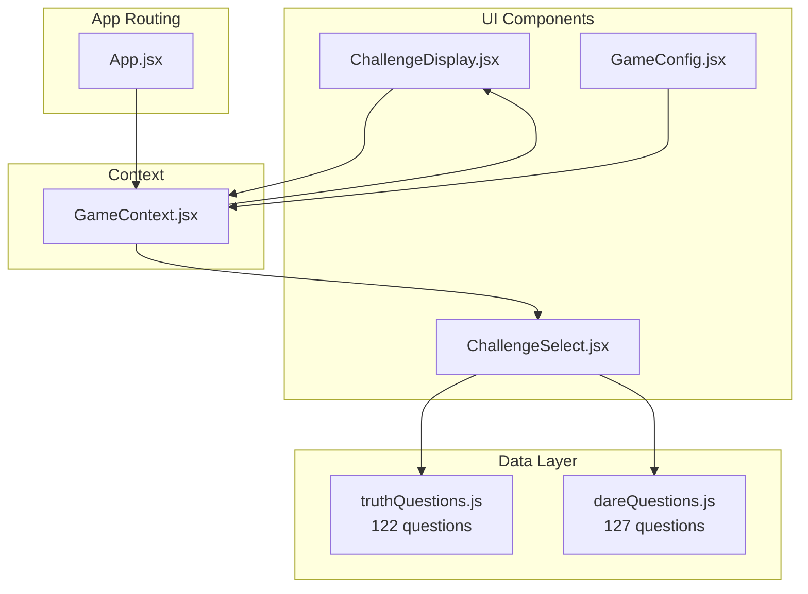
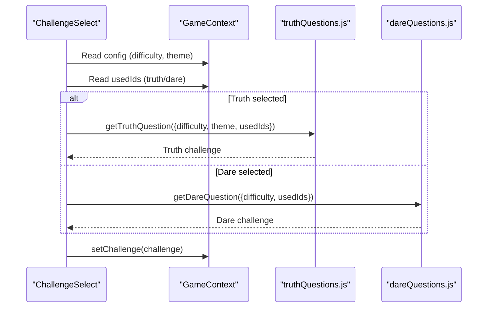
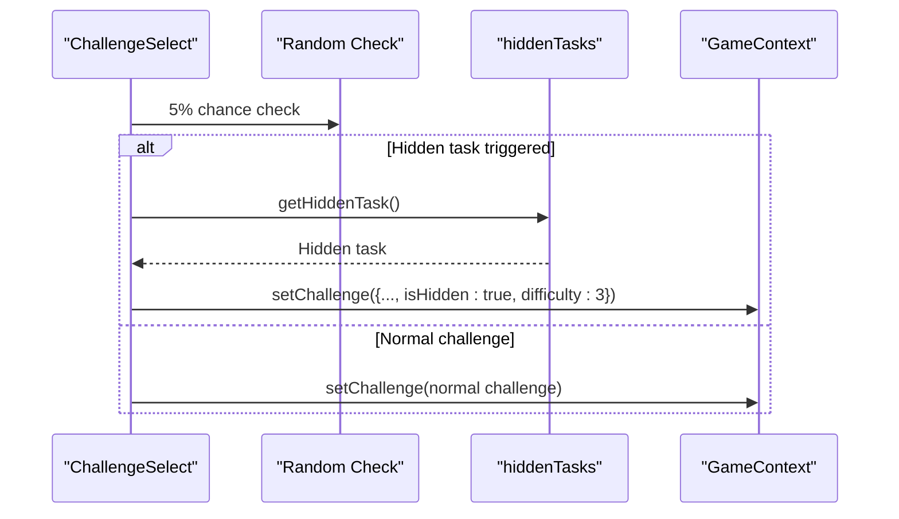
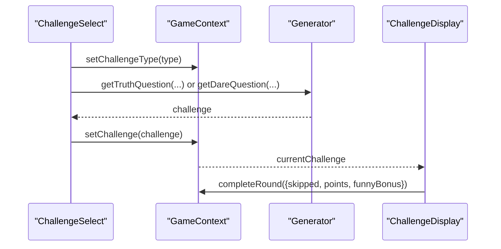
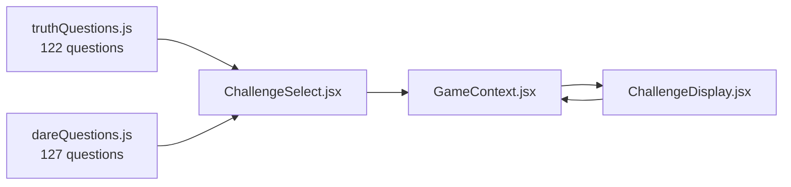

# Question Data System

<cite>
**Referenced Files in This Document**
- [truthQuestions.js](file://src/data/truthQuestions.js)
- [dareQuestions.js](file://src/data/dareQuestions.js)
- [GameContext.jsx](file://src/context/GameContext.jsx)
- [ChallengeSelect.jsx](file://src/components/GamePlay/ChallengeSelect.jsx)
- [ChallengeDisplay.jsx](file://src/components/GamePlay/ChallengeDisplay.jsx)
- [GameConfig.jsx](file://src/components/GameSetup/GameConfig.jsx)
- [App.jsx](file://src/App.jsx)
</cite>

## Update Summary
**Changes Made**
- Updated truth questions library with 81 new entries, expanding from 30 to 122 questions
- Expanded dare questions library with 81 new entries, expanding from 47 to 127 questions
- Enhanced content across all difficulty levels with new categories and themes
- Improved challenge variety with specialized categories including performance, interaction, and talent
- Added new hidden task types and enhanced scoring mechanics

## Table of Contents
1. [Introduction](#introduction)
2. [Project Structure](#project-structure)
3. [Core Components](#core-components)
4. [Architecture Overview](#architecture-overview)
5. [Detailed Component Analysis](#detailed-component-analysis)
6. [Dependency Analysis](#dependency-analysis)
7. [Performance Considerations](#performance-considerations)
8. [Troubleshooting Guide](#troubleshooting-guide)
9. [Conclusion](#conclusion)
10. [Appendices](#appendices)

## Introduction
This document explains the question data system powering the Truth or Dare game. It focuses on the data structures for truth and dare challenges, their categories and difficulty levels, filtering mechanisms, random selection algorithms, and the hidden task implementation. The system has been significantly expanded with 81 new truth questions and 81 new dare questions, providing enhanced content across all difficulty levels and introducing new specialized categories.

## Project Structure
The question data system is organized around two primary data modules and integrates with the game's React components and context.

**Diagram sources**
- [App.jsx](file://src/App.jsx#L13-L45)
- [GameContext.jsx](file://src/context/GameContext.jsx#L243-L298)
- [ChallengeSelect.jsx](file://src/components/GamePlay/ChallengeSelect.jsx#L1-L201)
- [ChallengeDisplay.jsx](file://src/components/GamePlay/ChallengeDisplay.jsx#L1-L341)
- [GameConfig.jsx](file://src/components/GameSetup/GameConfig.jsx#L1-L185)
- [truthQuestions.js](file://src/data/truthQuestions.js#L1-L156)
- [dareQuestions.js](file://src/data/dareQuestions.js#L1-L167)

**Section sources**
- [App.jsx](file://src/App.jsx#L13-L45)
- [GameContext.jsx](file://src/context/GameContext.jsx#L243-L298)

## Core Components
- **Enhanced Truth Questions Data Module**
  - Expanded from 30 to 122 questions with comprehensive coverage across 8 difficulty levels
  - Categories: emotion (30 questions), funny (30 questions), school (15 questions), work (15 questions), mixed (32 questions)
  - Provides a generator function to select a truth question based on difficulty and theme filters, avoiding previously used questions
- **Expanded Dare Questions Data Module**
  - Expanded from 47 to 127 questions with specialized categories and durations
  - Categories: perform (37 questions), interact (20 questions), funny (15 questions), talent (15 questions), punishment (20 questions), special (5 questions)
  - Provides a generator function to select a dare task based on difficulty filters, avoiding previously used tasks
  - Includes a hidden task pool with 5 special gameplay effects and a generator for randomly selecting hidden tasks
- **Game Context**
  - Manages game state, including current challenge, used question IDs, and scoring
  - Coordinates challenge selection and display phases with enhanced difficulty scaling
- **UI Components**
  - ChallengeSelect: Handles automatic or manual selection of challenge type, triggers hidden task checks, and retrieves questions/tasks
  - ChallengeDisplay: Renders the challenge content, manages timing, voting, and scoring with improved visual feedback

**Section sources**
- [truthQuestions.js](file://src/data/truthQuestions.js#L5-L156)
- [dareQuestions.js](file://src/data/dareQuestions.js#L5-L167)
- [GameContext.jsx](file://src/context/GameContext.jsx#L25-L44)
- [ChallengeSelect.jsx](file://src/components/GamePlay/ChallengeSelect.jsx#L38-L71)
- [ChallengeDisplay.jsx](file://src/components/GamePlay/ChallengeDisplay.jsx#L62-L99)

## Architecture Overview
The data system is decoupled from UI rendering. Truth and dare data modules expose pure functions that accept configuration options and return a single challenge item. The UI components orchestrate the flow, passing configuration from the context and invoking the generators.

**Diagram sources**
- [ChallengeSelect.jsx](file://src/components/GamePlay/ChallengeSelect.jsx#L56-L69)
- [truthQuestions.js](file://src/data/truthQuestions.js#L126-L155)
- [dareQuestions.js](file://src/data/dareQuestions.js#L130-L152)
- [GameContext.jsx](file://src/context/GameContext.jsx#L129-L138)

## Detailed Component Analysis

### Enhanced Truth Questions Data Structure
**Updated** Expanded from 30 to 122 questions with comprehensive category coverage

- **Schema**
  - id: Unique identifier string (t001-t122)
  - content: Challenge text
  - category: emotion, funny, school, work, mixed
  - difficulty: Integer 1–5
- **Category Distribution**
  - Emotion: 30 questions (1-5 star distribution)
  - Funny: 30 questions (1-5 star distribution)
  - School: 15 questions (1-4 star distribution)
  - Work: 15 questions (1-4 star distribution)
  - Mixed: 32 questions (1-5 star distribution)
- **Filtering Mechanisms**
  - Theme filtering: Selects challenges matching the chosen theme or mixed
  - Difficulty filtering: Uses a difficulty map to allow easy, standard, or hard ranges
  - Used ID exclusion: Filters out previously used truth question IDs
- **Random Selection**
  - After applying filters, selects a random item from the resulting list
  - If no items remain after filtering, resets the used record to allow reuse
- **Scoring Implications**
  - Truth challenges contribute to scoring during the voting phase

**Diagram sources**
- [truthQuestions.js](file://src/data/truthQuestions.js#L126-L155)

**Section sources**
- [truthQuestions.js](file://src/data/truthQuestions.js#L5-L123)
- [truthQuestions.js](file://src/data/truthQuestions.js#L126-L155)

### Expanded Dare Questions Data Structure
**Updated** Expanded from 47 to 127 questions with specialized categories and durations

- **Schema**
  - id: Unique identifier string (d001-d127)
  - content: Task text
  - category: perform, interact, funny, talent, punishment, special
  - difficulty: Integer 1–5
  - duration: Optional integer representing seconds for timing display
- **Category Distribution**
  - Perform: 37 questions (1-4 star distribution)
  - Interact: 20 questions (1-5 star distribution)
  - Funny: 15 questions (1-4 star distribution)
  - Talent: 15 questions (1-4 star distribution)
  - Punishment: 20 questions (1-4 star distribution)
  - Special: 5 questions (1-5 star distribution)
- **Filtering Mechanisms**
  - Difficulty filtering: Uses a difficulty map to allow easy, standard, or hard ranges
  - Used ID exclusion: Filters out previously used dare task IDs
- **Random Selection**
  - After applying filters, selects a random item from the resulting list
  - If no items remain after filtering, resets the used record to allow reuse
- **Hidden Tasks**
  - Special hidden tasks with types: all_participate, double_points, chain, team, all_truth
  - Hidden task generator returns a random hidden task

**Diagram sources**
- [dareQuestions.js](file://src/data/dareQuestions.js#L130-L152)

**Section sources**
- [dareQuestions.js](file://src/data/dareQuestions.js#L5-L127)
- [dareQuestions.js](file://src/data/dareQuestions.js#L130-L152)
- [dareQuestions.js](file://src/data/dareQuestions.js#L155-L167)

### Enhanced Hidden Task Implementation
**Updated** Expanded hidden task pool with 5 specialized types

- **Hidden Task Pool**
  - all_participate: Everyone must praise themselves
  - double_points: All votes worth double
  - chain: Current player continues after completion
  - team: Pair up for a dual task
  - all_truth: Everyone shares today's events
- **Trigger Mechanism**
  - During challenge selection, a 5% probability triggers a hidden task instead of a normal challenge
  - Hidden tasks are marked with an isHidden flag and difficulty level 3 for UI presentation
- **Effects**
  - Hidden tasks alter gameplay dynamics with enhanced strategic depth

**Diagram sources**
- [ChallengeSelect.jsx](file://src/components/GamePlay/ChallengeSelect.jsx#L29-L56)
- [dareQuestions.js](file://src/data/dareQuestions.js#L155-L167)
- [GameContext.jsx](file://src/context/GameContext.jsx#L129-L138)

**Section sources**
- [dareQuestions.js](file://src/data/dareQuestions.js#L155-L167)
- [ChallengeSelect.jsx](file://src/components/GamePlay/ChallengeSelect.jsx#L29-L56)

### Enhanced Challenge Selection and Display Flow
**Updated** Improved with expanded question pools and enhanced visual feedback

- **Challenge Selection**
  - Players choose truth or dare; if no choice is made within a countdown, a random selection occurs
  - The selected challenge type determines which generator is invoked
  - Enhanced with 81 additional questions providing greater variety
- **Challenge Display**
  - Displays the challenge content with difficulty stars and a timer
  - Supports skipping with skip cards and using道具 (props)
  - Triggers voting after completion, determining pass/funny/explain outcomes and scoring
  - Enhanced visual feedback for hidden tasks with special styling

**Diagram sources**
- [ChallengeSelect.jsx](file://src/components/GamePlay/ChallengeSelect.jsx#L38-L71)
- [ChallengeDisplay.jsx](file://src/components/GamePlay/ChallengeDisplay.jsx#L62-L99)
- [GameContext.jsx](file://src/context/GameContext.jsx#L129-L138)

**Section sources**
- [ChallengeSelect.jsx](file://src/components/GamePlay/ChallengeSelect.jsx#L38-L71)
- [ChallengeDisplay.jsx](file://src/components/GamePlay/ChallengeDisplay.jsx#L62-L99)
- [GameContext.jsx](file://src/context/GameContext.jsx#L146-L180)

## Dependency Analysis
- **Data Modules**
  - truthQuestions.js exports the expanded truth challenge array (122 questions) and the getTruthQuestion generator
  - dareQuestions.js exports the expanded dare challenge array (127 questions), getDareQuestion generator, hidden task pool, and getHiddenTask generator
- **UI Components**
  - ChallengeSelect imports getTruthQuestion and getDareQuestion and reads config and usedIds from GameContext
  - ChallengeDisplay renders the current challenge and interacts with GameContext for scoring and state transitions
- **Context**
  - GameContext holds usedQuestions truth/dare arrays and exposes actions to set challenges and update scores

**Diagram sources**
- [truthQuestions.js](file://src/data/truthQuestions.js#L126-L155)
- [dareQuestions.js](file://src/data/dareQuestions.js#L130-L152)
- [ChallengeSelect.jsx](file://src/components/GamePlay/ChallengeSelect.jsx#L4-L5)
- [ChallengeDisplay.jsx](file://src/components/GamePlay/ChallengeDisplay.jsx#L1-L4)
- [GameContext.jsx](file://src/context/GameContext.jsx#L129-L138)

**Section sources**
- [truthQuestions.js](file://src/data/truthQuestions.js#L126-L155)
- [dareQuestions.js](file://src/data/dareQuestions.js#L130-L152)
- [ChallengeSelect.jsx](file://src/components/GamePlay/ChallengeSelect.jsx#L4-L5)
- [ChallengeDisplay.jsx](file://src/components/GamePlay/ChallengeDisplay.jsx#L1-L4)
- [GameContext.jsx](file://src/context/GameContext.jsx#L129-L138)

## Performance Considerations
- **Enhanced Filtering Complexity**
  - Both generators apply linear-time filters over the expanded question/task arrays (122 and 127 items respectively)
  - For the current question counts, filtering remains highly efficient
- **Used ID Tracking**
  - usedQuestions arrays grow over time. With 122 truth and 127 dare questions, consider periodic cleanup strategies
- **Random Selection**
  - Random selection remains O(1) after filtering with minimal overhead
- **UI Rendering**
  - Framer Motion animations are lightweight for typical device loads
- **Recommendations**
  - For the expanded question pools, consider precomputing category and difficulty indices to reduce repeated filtering costs
  - Implement lazy loading or chunking strategies if question pools grow substantially beyond current size
  - Add a maximum used history length to cap memory usage at approximately 250 items total

## Troubleshooting Guide
- **No Challenges Available**
  - Symptom: getTruthQuestion or getDareQuestion returns undefined or throws
  - Cause: All questions/tasks have been used up (with 122+ truth and 127+ dare questions, this is less likely)
  - Resolution: The generators reset used records when filters yield no results. Ensure usedQuestions are populated and that the reset logic runs.
- **Incorrect Difficulty Range**
  - Symptom: Selected challenges are unexpectedly easy or hard
  - Cause: difficulty option mismatch with difficultyMap
  - Resolution: Verify difficulty values (easy, standard, hard) align with the intended ranges.
- **Theme Not Applied**
  - Symptom: Truth challenges outside the selected theme appear
  - Cause: theme filter not applied or mixed fallback not functioning
  - Resolution: Confirm theme is not 'mixed' and that mixed fallback logic executes when needed.
- **Hidden Task Not Triggering**
  - Symptom: Hidden tasks do not appear
  - Cause: Low probability threshold or incorrect trigger logic
  - Resolution: Check the 5% probability and ensure setChallenge is called with isHidden and difficulty set for hidden tasks.
- **Scoring Mismatch**
  - Symptom: Scores do not match expectations
  - Cause: Double points from props or funny bonus not applied consistently
  - Resolution: Review completeRound logic and activeProps handling.

**Section sources**
- [truthQuestions.js](file://src/data/truthQuestions.js#L145-L150)
- [dareQuestions.js](file://src/data/dareQuestions.js#L144-L147)
- [ChallengeSelect.jsx](file://src/components/GamePlay/ChallengeSelect.jsx#L29-L56)
- [GameContext.jsx](file://src/context/GameContext.jsx#L146-L180)

## Conclusion
The question data system has been significantly enhanced with the addition of 81 new truth questions and 81 new dare questions, expanding the total question pool to 249 challenges. The system maintains clean separation between data generation and UI rendering while providing robust filtering, randomization, and dynamic gameplay through hidden tasks. The expanded content offers greater variety across all difficulty levels and introduces specialized categories that enhance the gaming experience.

## Appendices

### Extensibility Patterns
- **Adding New Truth/Dare Questions**
  - Extend the respective arrays with new objects following the established schema
  - Maintain balanced difficulty distribution across categories
  - Ensure category values align with existing taxonomy (emotion, funny, school, work, mixed for truth; perform, interact, funny, talent, punishment, special for dare)
- **Difficulty Scaling**
  - Adjust difficultyMap ranges to change allowed difficulties per mode
  - Consider adding new difficulty tiers (e.g., extreme) and updating generators accordingly
- **Theme-Specific Content**
  - Introduce new categories and ensure theme filtering includes mixed fallback
  - Maintain consistent difficulty progression within new categories
- **Hidden Task Expansion**
  - Add new hidden task types and effects, ensuring they integrate with setChallenge and display logic
  - Balance new hidden tasks to maintain game fairness

### Data Validation Checklist
- **Truth Questions Validation**
  - Ensure each challenge object has id, content, category, difficulty (1-5)
  - Verify category values are valid enumerations (emotion, funny, school, work, mixed)
  - Confirm difficulty values are integers within 1–5
- **Dare Questions Validation**
  - Ensure each challenge object has id, content, category, difficulty (1-5), duration (optional)
  - Verify category values are valid enumerations (perform, interact, funny, talent, punishment, special)
  - Confirm difficulty values are integers within 1–5
  - Validate duration values are reasonable integers for timing
- **Hidden Task Validation**
  - Ensure hidden task objects include id, content, and type
  - Verify type values are valid enumerations (all_participate, double_points, chain, team, all_truth)
- **Testing Validation**
  - Test filtering logic with edge cases (no matches, all used)
  - Verify difficulty scaling across all modes
  - Test theme filtering with mixed category fallback