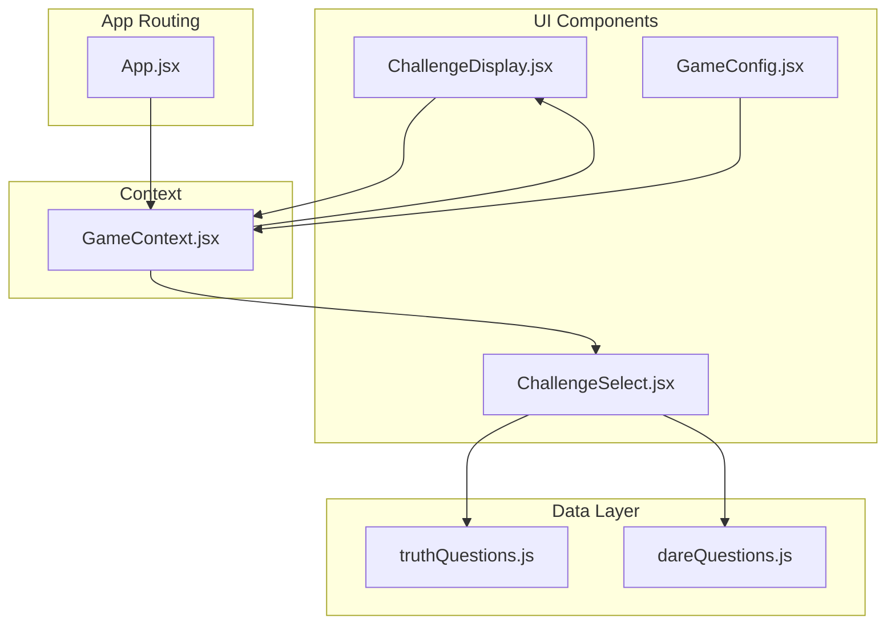
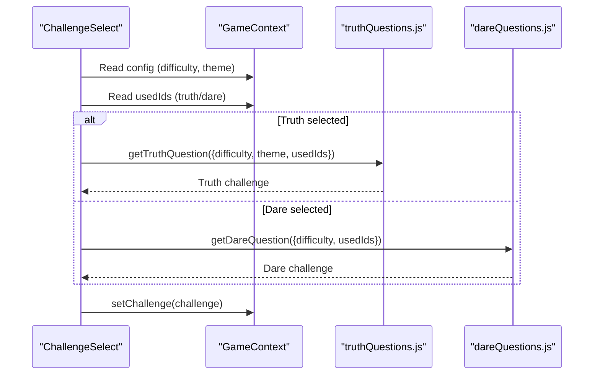
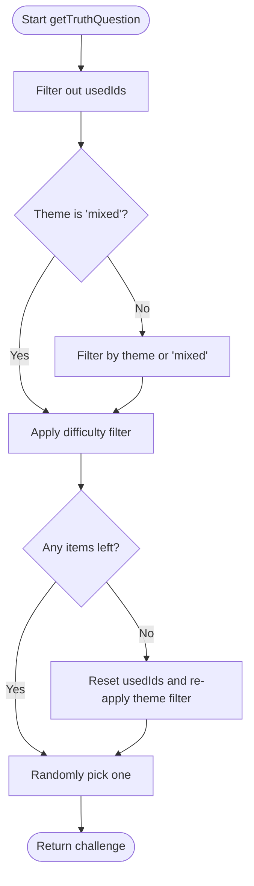
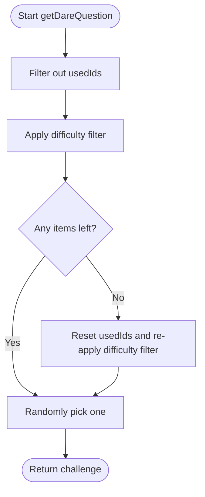
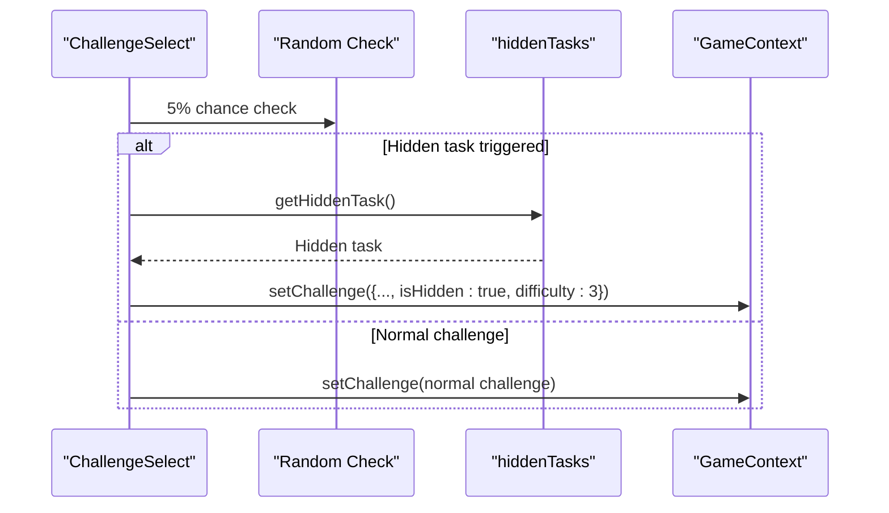
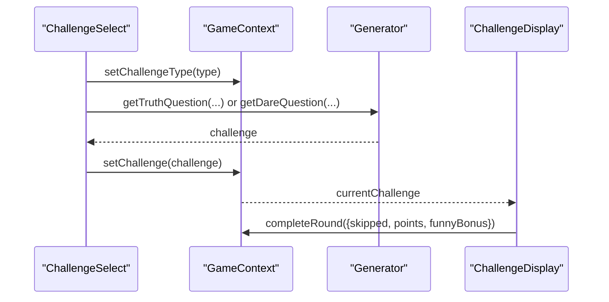
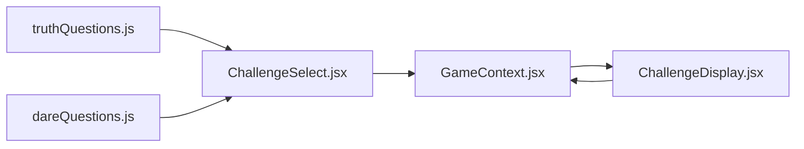

# Question Data System

<cite>
**Referenced Files in This Document**
- [truthQuestions.js](file://src/data/truthQuestions.js)
- [dareQuestions.js](file://src/data/dareQuestions.js)
- [GameContext.jsx](file://src/context/GameContext.jsx)
- [ChallengeSelect.jsx](file://src/components/GamePlay/ChallengeSelect.jsx)
- [ChallengeDisplay.jsx](file://src/components/GamePlay/ChallengeDisplay.jsx)
- [GameConfig.jsx](file://src/components/GameSetup/GameConfig.jsx)
- [App.jsx](file://src/App.jsx)
</cite>

## Table of Contents
1. [Introduction](#introduction)
2. [Project Structure](#project-structure)
3. [Core Components](#core-components)
4. [Architecture Overview](#architecture-overview)
5. [Detailed Component Analysis](#detailed-component-analysis)
6. [Dependency Analysis](#dependency-analysis)
7. [Performance Considerations](#performance-considerations)
8. [Troubleshooting Guide](#troubleshooting-guide)
9. [Conclusion](#conclusion)
10. [Appendices](#appendices)

## Introduction
This document explains the question data system powering the Truth or Dare game. It focuses on the data structures for truth and dare challenges, their categories and difficulty levels, filtering mechanisms, random selection algorithms, and the hidden task implementation. It also covers the data schema for challenges, scoring implications, category-based filtering, extensibility patterns, validation, performance considerations, and maintenance strategies.

## Project Structure
The question data system is organized around two primary data modules and integrates with the game’s React components and context.

**Diagram sources**
- [App.jsx](file://src/App.jsx#L13-L45)
- [GameContext.jsx](file://src/context/GameContext.jsx#L243-L298)
- [ChallengeSelect.jsx](file://src/components/GamePlay/ChallengeSelect.jsx#L1-L201)
- [ChallengeDisplay.jsx](file://src/components/GamePlay/ChallengeDisplay.jsx#L1-L341)
- [GameConfig.jsx](file://src/components/GameSetup/GameConfig.jsx#L1-L185)
- [truthQuestions.js](file://src/data/truthQuestions.js#L1-L134)
- [dareQuestions.js](file://src/data/dareQuestions.js#L1-L143)

**Section sources**
- [App.jsx](file://src/App.jsx#L13-L45)
- [GameContext.jsx](file://src/context/GameContext.jsx#L243-L298)

## Core Components
- Truth Questions Data Module
  - Defines the truth challenge collection with category and difficulty metadata.
  - Provides a generator function to select a truth question based on difficulty and theme filters, and avoids reusing previously used questions.
- Dare Questions Data Module
  - Defines the dare challenge collection with category, difficulty, and duration metadata.
  - Provides a generator function to select a dare task based on difficulty filters, and avoids reusing previously used tasks.
  - Includes a hidden task pool and a generator for randomly selecting a hidden task with special gameplay effects.
- Game Context
  - Manages game state, including current challenge, used question IDs, and scoring.
  - Coordinates challenge selection and display phases.
- UI Components
  - ChallengeSelect: Handles automatic or manual selection of challenge type, triggers hidden task checks, and retrieves questions/tasks.
  - ChallengeDisplay: Renders the challenge content, manages timing, voting, and scoring.

**Section sources**
- [truthQuestions.js](file://src/data/truthQuestions.js#L5-L134)
- [dareQuestions.js](file://src/data/dareQuestions.js#L5-L143)
- [GameContext.jsx](file://src/context/GameContext.jsx#L25-L44)
- [ChallengeSelect.jsx](file://src/components/GamePlay/ChallengeSelect.jsx#L38-L71)
- [ChallengeDisplay.jsx](file://src/components/GamePlay/ChallengeDisplay.jsx#L62-L99)

## Architecture Overview
The data system is decoupled from UI rendering. Truth and dare data modules expose pure functions that accept configuration options and return a single challenge item. The UI components orchestrate the flow, passing configuration from the context and invoking the generators.

**Diagram sources**
- [ChallengeSelect.jsx](file://src/components/GamePlay/ChallengeSelect.jsx#L56-L69)
- [truthQuestions.js](file://src/data/truthQuestions.js#L104-L133)
- [dareQuestions.js](file://src/data/dareQuestions.js#L106-L128)
- [GameContext.jsx](file://src/context/GameContext.jsx#L129-L138)

## Detailed Component Analysis

### Truth Questions Data Structure
- Schema
  - id: Unique identifier string.
  - content: Challenge text.
  - category: One of emotion, funny, school, work, mixed.
  - difficulty: Integer 1–5.
- Filtering Mechanisms
  - Theme filtering: Selects challenges matching the chosen theme or mixed.
  - Difficulty filtering: Uses a difficulty map to allow easy, standard, or hard ranges.
  - Used ID exclusion: Filters out previously used truth question IDs.
- Random Selection
  - After applying filters, selects a random item from the resulting list.
  - If no items remain after filtering, resets the used record to allow reuse.
- Scoring Implications
  - Truth challenges contribute to scoring during the voting phase.

**Diagram sources**
- [truthQuestions.js](file://src/data/truthQuestions.js#L104-L133)

**Section sources**
- [truthQuestions.js](file://src/data/truthQuestions.js#L5-L101)
- [truthQuestions.js](file://src/data/truthQuestions.js#L104-L133)

### Dare Questions Data Structure
- Schema
  - id: Unique identifier string.
  - content: Task text.
  - category: One of perform, interact, funny, talent, punishment, special.
  - difficulty: Integer 1–5.
  - duration: Optional integer representing seconds for timing display.
- Filtering Mechanisms
  - Difficulty filtering: Uses a difficulty map to allow easy, standard, or hard ranges.
  - Used ID exclusion: Filters out previously used dare task IDs.
- Random Selection
  - After applying filters, selects a random item from the resulting list.
  - If no items remain after filtering, resets the used record to allow reuse.
- Hidden Tasks
  - Special hidden tasks with special gameplay effects and types.
  - Hidden task generator returns a random hidden task.

**Diagram sources**
- [dareQuestions.js](file://src/data/dareQuestions.js#L106-L128)

**Section sources**
- [dareQuestions.js](file://src/data/dareQuestions.js#L5-L103)
- [dareQuestions.js](file://src/data/dareQuestions.js#L106-L128)
- [dareQuestions.js](file://src/data/dareQuestions.js#L131-L142)

### Hidden Task Implementation
- Hidden Task Pool
  - Contains special challenges with types such as all_participate, double_points, chain, team, and all_truth.
- Trigger Mechanism
  - During challenge selection, a small probability triggers a hidden task instead of a normal challenge.
  - Hidden tasks are marked with an isHidden flag and a fixed difficulty level for UI presentation.
- Effects
  - Hidden tasks alter gameplay dynamics (e.g., doubling points, chaining challenges, team participation).

**Diagram sources**
- [ChallengeSelect.jsx](file://src/components/GamePlay/ChallengeSelect.jsx#L29-L56)
- [dareQuestions.js](file://src/data/dareQuestions.js#L131-L142)
- [GameContext.jsx](file://src/context/GameContext.jsx#L129-L138)

**Section sources**
- [dareQuestions.js](file://src/data/dareQuestions.js#L131-L142)
- [ChallengeSelect.jsx](file://src/components/GamePlay/ChallengeSelect.jsx#L29-L56)

### Challenge Selection and Display Flow
- Challenge Selection
  - Players choose truth or dare; if no choice is made within a countdown, a random selection occurs.
  - The selected challenge type determines which generator is invoked.
- Challenge Display
  - Displays the challenge content with difficulty stars and a timer.
  - Supports skipping with skip cards and using道具 (props).
  - Triggers voting after completion, determining pass/funny/explain outcomes and scoring.

**Diagram sources**
- [ChallengeSelect.jsx](file://src/components/GamePlay/ChallengeSelect.jsx#L38-L71)
- [ChallengeDisplay.jsx](file://src/components/GamePlay/ChallengeDisplay.jsx#L62-L99)
- [GameContext.jsx](file://src/context/GameContext.jsx#L129-L138)

**Section sources**
- [ChallengeSelect.jsx](file://src/components/GamePlay/ChallengeSelect.jsx#L38-L71)
- [ChallengeDisplay.jsx](file://src/components/GamePlay/ChallengeDisplay.jsx#L62-L99)
- [GameContext.jsx](file://src/context/GameContext.jsx#L146-L180)

## Dependency Analysis
- Data Modules
  - truthQuestions.js exports the truth challenge array and the getTruthQuestion generator.
  - dareQuestions.js exports the dare challenge array, getDareQuestion generator, hidden task pool, and getHiddenTask generator.
- UI Components
  - ChallengeSelect imports getTruthQuestion and getDareQuestion and reads config and usedIds from GameContext.
  - ChallengeDisplay renders the current challenge and interacts with GameContext for scoring and state transitions.
- Context
  - GameContext holds usedQuestions truth/dare arrays and exposes actions to set challenges and update scores.

**Diagram sources**
- [truthQuestions.js](file://src/data/truthQuestions.js#L104-L133)
- [dareQuestions.js](file://src/data/dareQuestions.js#L106-L128)
- [ChallengeSelect.jsx](file://src/components/GamePlay/ChallengeSelect.jsx#L4-L5)
- [ChallengeDisplay.jsx](file://src/components/GamePlay/ChallengeDisplay.jsx#L1-L4)
- [GameContext.jsx](file://src/context/GameContext.jsx#L129-L138)

**Section sources**
- [truthQuestions.js](file://src/data/truthQuestions.js#L104-L133)
- [dareQuestions.js](file://src/data/dareQuestions.js#L106-L128)
- [ChallengeSelect.jsx](file://src/components/GamePlay/ChallengeSelect.jsx#L4-L5)
- [ChallengeDisplay.jsx](file://src/components/GamePlay/ChallengeDisplay.jsx#L1-L4)
- [GameContext.jsx](file://src/context/GameContext.jsx#L129-L138)

## Performance Considerations
- Filtering Complexity
  - Both generators apply linear-time filters over the question/task arrays. For moderate question counts, this is efficient.
- Used ID Tracking
  - usedQuestions arrays grow over time. For very long sessions, consider periodic cleanup or pagination strategies.
- Random Selection
  - Random selection is O(1) after filtering. No significant overhead.
- UI Rendering
  - Framer Motion animations are lightweight for typical device loads.
- Recommendations
  - For large question banks, consider precomputing category and difficulty indices to reduce repeated filtering costs.
  - Implement lazy loading or chunking of question pools if the dataset grows substantially.
  - Add a maximum used history length to cap memory usage.

[No sources needed since this section provides general guidance]

## Troubleshooting Guide
- No Challenges Available
  - Symptom: getTruthQuestion or getDareQuestion returns undefined or throws.
  - Cause: All questions/tasks have been used up.
  - Resolution: The generators reset used records when filters yield no results. Ensure usedQuestions are populated and that the reset logic runs.
- Incorrect Difficulty Range
  - Symptom: Selected challenges are unexpectedly easy or hard.
  - Cause: difficulty option mismatch with difficultyMap.
  - Resolution: Verify difficulty values (easy, standard, hard) align with the intended ranges.
- Theme Not Applied
  - Symptom: Truth challenges outside the selected theme appear.
  - Cause: theme filter not applied or mixed fallback not functioning.
  - Resolution: Confirm theme is not 'mixed' and that mixed fallback logic executes when needed.
- Hidden Task Not Triggering
  - Symptom: Hidden tasks do not appear.
  - Cause: Low probability threshold or incorrect trigger logic.
  - Resolution: Check the 5% probability and ensure setChallenge is called with isHidden and difficulty set for hidden tasks.
- Scoring Mismatch
  - Symptom: Scores do not match expectations.
  - Cause: Double points from props or funny bonus not applied consistently.
  - Resolution: Review completeRound logic and activeProps handling.

**Section sources**
- [truthQuestions.js](file://src/data/truthQuestions.js#L123-L128)
- [dareQuestions.js](file://src/data/dareQuestions.js#L120-L123)
- [ChallengeSelect.jsx](file://src/components/GamePlay/ChallengeSelect.jsx#L29-L56)
- [GameContext.jsx](file://src/context/GameContext.jsx#L146-L180)

## Conclusion
The question data system cleanly separates data generation from UI rendering. Truth and dare data modules provide robust filtering and randomization, while hidden tasks add dynamic gameplay. The system scales with configurable difficulty and theme settings and can be extended with minimal changes to the data structures and generators.

[No sources needed since this section summarizes without analyzing specific files]

## Appendices

### Extensibility Patterns
- Adding New Truth/Dare Questions
  - Extend the respective arrays with new objects following the schema.
  - Assign category and difficulty values aligned with existing taxonomy.
- Difficulty Scaling
  - Adjust difficultyMap ranges to change allowed difficulties per mode.
  - Consider adding new difficulty tiers (e.g., extreme) and updating generators accordingly.
- Theme-Specific Content
  - Introduce new categories (e.g., travel, food) and ensure theme filtering includes mixed fallback.
- Hidden Task Expansion
  - Add new hidden task types and effects, ensuring they integrate with setChallenge and display logic.

[No sources needed since this section provides general guidance]

### Data Validation Checklist
- Ensure each challenge object has id, content, category, difficulty.
- Verify difficulty values are integers within 1–5.
- Confirm category values are valid enumerations.
- Validate hidden task objects include id, content, and type.
- Test filtering logic with edge cases (no matches, all used).

[No sources needed since this section provides general guidance]