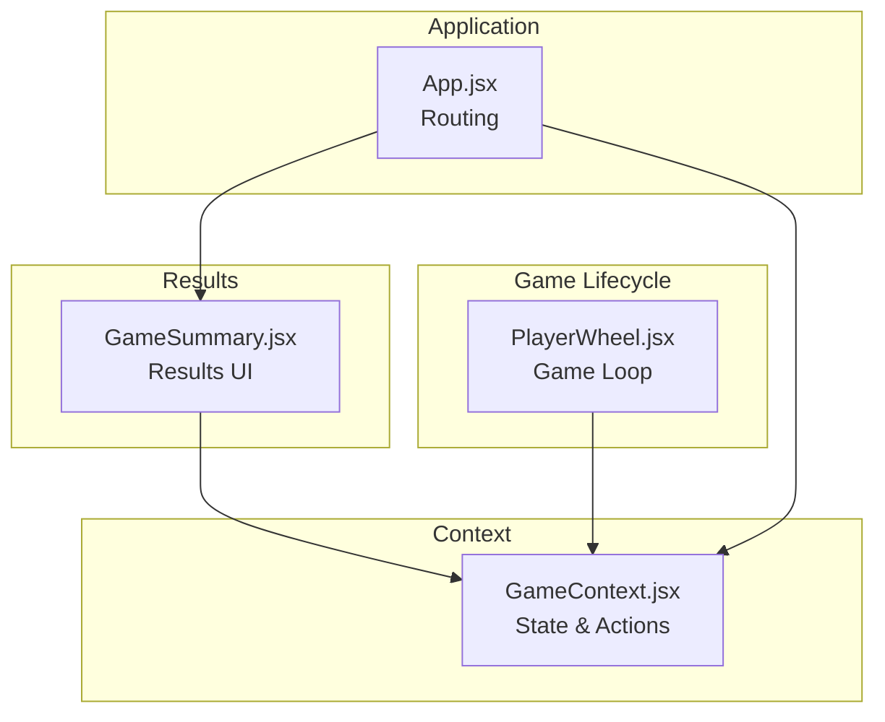
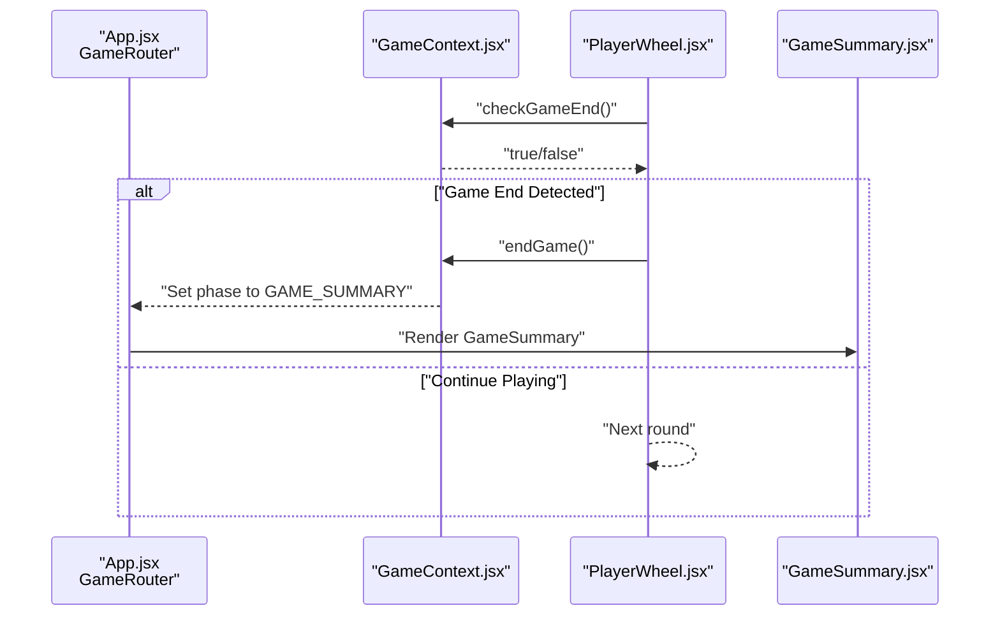
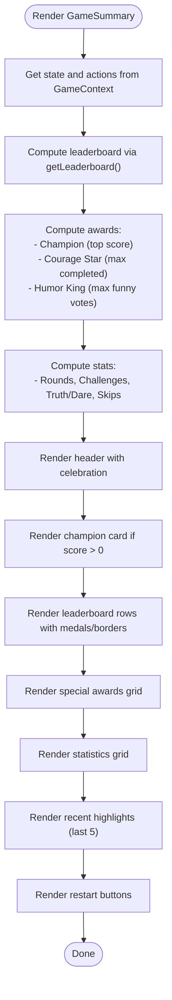
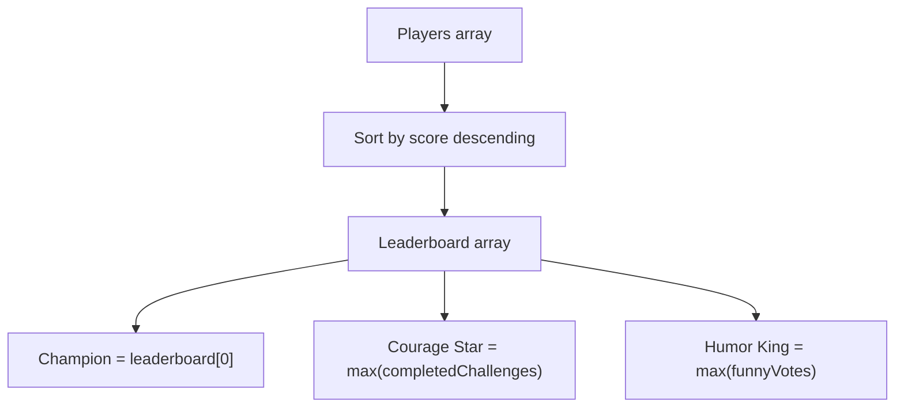
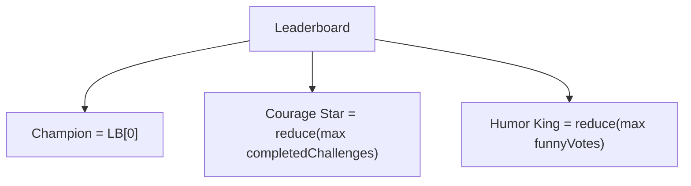
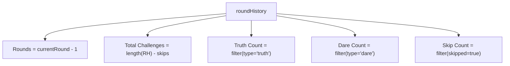
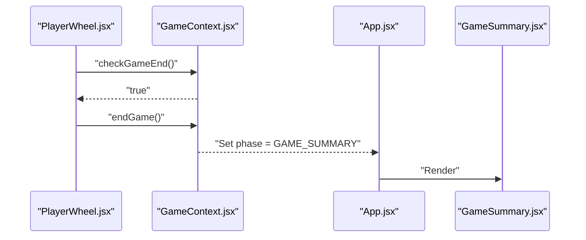
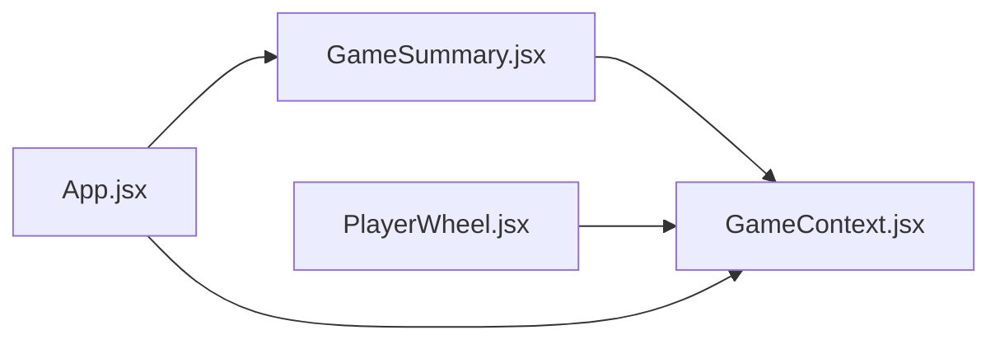

# Results Components

<cite>
**Referenced Files in This Document**
- [GameSummary.jsx](file://src/components/Results/GameSummary.jsx)
- [GameContext.jsx](file://src/context/GameContext.jsx)
- [App.jsx](file://src/App.jsx)
- [PlayerWheel.jsx](file://src/components/GamePlay/PlayerWheel.jsx)
- [index.css](file://src/index.css)
</cite>

## Table of Contents
1. [Introduction](#introduction)
2. [Project Structure](#project-structure)
3. [Core Components](#core-components)
4. [Architecture Overview](#architecture-overview)
5. [Detailed Component Analysis](#detailed-component-analysis)
6. [Dependency Analysis](#dependency-analysis)
7. [Performance Considerations](#performance-considerations)
8. [Troubleshooting Guide](#troubleshooting-guide)
9. [Conclusion](#conclusion)
10. [Appendices](#appendices)

## Introduction
This document describes the Results Components system, with a focus on the GameSummary component. It explains how final scores, player rankings, and game statistics are presented, how the leaderboard is computed, how winners are determined, and how performance metrics are displayed. It also covers the component’s role in the game lifecycle, data aggregation from GameContext, user interface patterns for game completion, responsive design considerations, visual hierarchy, integration with restart functionality, and accessibility and mobile-friendly design patterns.

## Project Structure
The Results system centers around the GameSummary component, which is rendered by the application router when the game reaches the summary phase. The GameContext provides state and actions consumed by GameSummary, including the leaderboard computation and game lifecycle controls.

**Diagram sources**
- [App.jsx](file://src/App.jsx#L13-L45)
- [GameSummary.jsx](file://src/components/Results/GameSummary.jsx#L1-L223)
- [GameContext.jsx](file://src/context/GameContext.jsx#L1-L308)
- [PlayerWheel.jsx](file://src/components/GamePlay/PlayerWheel.jsx#L1-L293)

**Section sources**
- [App.jsx](file://src/App.jsx#L1-L58)
- [GameContext.jsx](file://src/context/GameContext.jsx#L1-L308)

## Core Components
- GameSummary: Renders the final game results, including the champion display, leaderboard, special awards, statistics, recent highlights, and restart controls.
- GameContext: Provides state, actions, and helper functions (including leaderboard computation and game-end checks) to all components.

Key responsibilities:
- Aggregate and present final scores and rankings.
- Compute and display special awards (courage star, humor king).
- Present game statistics and recent highlights.
- Offer restart options to continue with the same players or return to the welcome screen.
- Integrate with GameContext for data and lifecycle control.

**Section sources**
- [GameSummary.jsx](file://src/components/Results/GameSummary.jsx#L1-L223)
- [GameContext.jsx](file://src/context/GameContext.jsx#L240-L308)

## Architecture Overview
The Results system participates in the game lifecycle through the routing mechanism. When the game ends (either by duration or explicit end), the router switches to the GameSummary component, which renders the results page.

**Diagram sources**
- [App.jsx](file://src/App.jsx#L13-L45)
- [GameContext.jsx](file://src/context/GameContext.jsx#L280-L285)
- [PlayerWheel.jsx](file://src/components/GamePlay/PlayerWheel.jsx#L21-L26)
- [GameSummary.jsx](file://src/components/Results/GameSummary.jsx#L1-L223)

## Detailed Component Analysis

### GameSummary Component
Responsibilities:
- Render the final game page with animations and responsive layout.
- Compute and display the champion, leaderboard, special awards, statistics, and recent highlights.
- Provide restart controls to continue with the same players or return to the welcome screen.

Data Aggregation from GameContext:
- Leaderboard: Sorted by score descending.
- Awards:
  - Courage Star: Player with the highest completed challenges count.
  - Humor King: Player with the highest funny votes count.
  - Champion: Top-ranked player by score.
- Statistics:
  - Total rounds: currentRound - 1.
  - Total challenges: length of roundHistory.
  - Truth/Dare counts: filtered from roundHistory.
  - Skip count: filtered from roundHistory.
- Recent highlights: Last five rounds from roundHistory.

UI Patterns:
- Motion-driven entrance and staggered item reveals.
- Responsive card layout with padding and max-width constraints.
- Visual hierarchy with emoji, gradient backgrounds, and borders for emphasis.
- Grid-based statistics and award cards.
- Scrollable recent highlights panel.

Restart Integration:
- Play Again: Resets game state and navigates to player setup.
- New Game: Resets game state and navigates to welcome page.

Accessibility and Mobile-Friendly Design:
- Semantic headings and labels.
- Sufficient touch targets for buttons.
- Responsive breakpoints via Tailwind utilities.
- Reduced motion considerations via Framer Motion defaults.

**Diagram sources**
- [GameSummary.jsx](file://src/components/Results/GameSummary.jsx#L1-L223)
- [GameContext.jsx](file://src/context/GameContext.jsx#L275-L278)

**Section sources**
- [GameSummary.jsx](file://src/components/Results/GameSummary.jsx#L1-L223)

### Leaderboard Implementation
- Computed via a sort on player scores (descending).
- Used to determine the champion and to render the ranking list.
- Special awards derive from the sorted list.

**Diagram sources**
- [GameContext.jsx](file://src/context/GameContext.jsx#L275-L278)
- [GameSummary.jsx](file://src/components/Results/GameSummary.jsx#L8-L18)

**Section sources**
- [GameContext.jsx](file://src/context/GameContext.jsx#L275-L278)
- [GameSummary.jsx](file://src/components/Results/GameSummary.jsx#L8-L18)

### Winner Determination Logic
- Champion: Top score in the leaderboard.
- Courage Star: Highest number of completed challenges.
- Humor King: Highest number of funny votes.

**Diagram sources**
- [GameSummary.jsx](file://src/components/Results/GameSummary.jsx#L8-L18)

**Section sources**
- [GameSummary.jsx](file://src/components/Results/GameSummary.jsx#L8-L18)

### Performance Metrics Presentation
- Rounds: currentRound - 1.
- Challenges: total entries in roundHistory minus skips.
- Truth/Dare counts: filtered by type.
- Skip count: filtered by skipped flag.

**Diagram sources**
- [GameSummary.jsx](file://src/components/Results/GameSummary.jsx#L20-L27)

**Section sources**
- [GameSummary.jsx](file://src/components/Results/GameSummary.jsx#L20-L27)

### Component Role in Game Lifecycle
- Triggered by the router when the game phase transitions to GAME_SUMMARY.
- Data is sourced from GameContext state and actions.
- Provides restart controls that reset the game and navigate to the appropriate phase.

**Diagram sources**
- [PlayerWheel.jsx](file://src/components/GamePlay/PlayerWheel.jsx#L21-L26)
- [GameContext.jsx](file://src/context/GameContext.jsx#L264)
- [App.jsx](file://src/App.jsx#L33-L34)
- [GameSummary.jsx](file://src/components/Results/GameSummary.jsx#L1-L223)

**Section sources**
- [App.jsx](file://src/App.jsx#L13-L45)
- [PlayerWheel.jsx](file://src/components/GamePlay/PlayerWheel.jsx#L21-L26)
- [GameContext.jsx](file://src/context/GameContext.jsx#L264)

### UI Patterns and Visual Hierarchy
- Header with celebratory emoji and title.
- Champion card with prominent gradient and border.
- Leaderboard rows with medal icons and conditional borders.
- Special awards grid with distinct color accents.
- Statistics grid with category/value pairs.
- Recent highlights panel with scrollable container.
- Restart buttons with hover/tap animations.

Responsive Design Considerations:
- Container uses padding and max-width constraints.
- Buttons and cards adapt to larger screens with increased padding.
- Grid layouts adjust to two-column award cards on small screens.

Accessibility Features:
- Semantic headings and labels.
- Sufficient contrast for text and backgrounds.
- Touch-friendly button sizes and spacing.

Mobile-Friendly Design Patterns:
- Centered card layout with full-width buttons.
- Staggered animations to avoid overwhelming the viewport.
- Scrollable areas for long lists.

**Section sources**
- [GameSummary.jsx](file://src/components/Results/GameSummary.jsx#L39-L221)
- [index.css](file://src/index.css#L53-L73)

## Dependency Analysis
The GameSummary component depends on GameContext for state and actions. The App router orchestrates rendering based on the current game phase. PlayerWheel triggers the end-of-game transition.

**Diagram sources**
- [GameSummary.jsx](file://src/components/Results/GameSummary.jsx#L1-L223)
- [GameContext.jsx](file://src/context/GameContext.jsx#L1-L308)
- [App.jsx](file://src/App.jsx#L13-L45)
- [PlayerWheel.jsx](file://src/components/GamePlay/PlayerWheel.jsx#L1-L293)

**Section sources**
- [GameSummary.jsx](file://src/components/Results/GameSummary.jsx#L1-L223)
- [GameContext.jsx](file://src/context/GameContext.jsx#L1-L308)
- [App.jsx](file://src/App.jsx#L13-L45)
- [PlayerWheel.jsx](file://src/components/GamePlay/PlayerWheel.jsx#L1-L293)

## Performance Considerations
- Leaderboard computation: Sorting is O(n log n); acceptable for typical player counts.
- Stats computation: Filtering roundHistory is O(n); efficient for reasonable history lengths.
- Animations: Framer Motion adds smoothness; keep staggered delays minimal to avoid jank on lower-end devices.
- Rendering: Grid and list rendering are straightforward; avoid unnecessary re-renders by relying on stable props from GameContext.

## Troubleshooting Guide
Common issues and resolutions:
- No results displayed:
  - Ensure the game phase is GAME_SUMMARY.
  - Verify that roundHistory contains entries and players have scores.
- Incorrect rankings:
  - Confirm leaderboard sorting by score descending.
  - Check that player scores are updated during rounds.
- Awards not shown:
  - Courage Star requires completed challenges > 0.
  - Humor King requires funny votes > 0.
- Restart not working:
  - Ensure resetGame and setPhase actions are dispatched correctly.
  - Verify that the router responds to phase changes.

**Section sources**
- [GameSummary.jsx](file://src/components/Results/GameSummary.jsx#L8-L37)
- [GameContext.jsx](file://src/context/GameContext.jsx#L247-L265)
- [App.jsx](file://src/App.jsx#L13-L45)

## Conclusion
The GameSummary component provides a polished, animated, and responsive presentation of game results. It integrates tightly with GameContext to compute leaderboards, determine winners, and present statistics and highlights. Its restart controls enable seamless continuation or a fresh start. The component’s design emphasizes clarity, visual hierarchy, and accessibility, making it suitable for a wide range of devices and user needs.

## Appendices
- Styling foundation: Tailwind utilities and custom game-card styles support responsive and accessible UI patterns.
- Animation framework: Framer Motion enhances user experience with entrance and interaction animations.

**Section sources**
- [index.css](file://src/index.css#L1-L73)