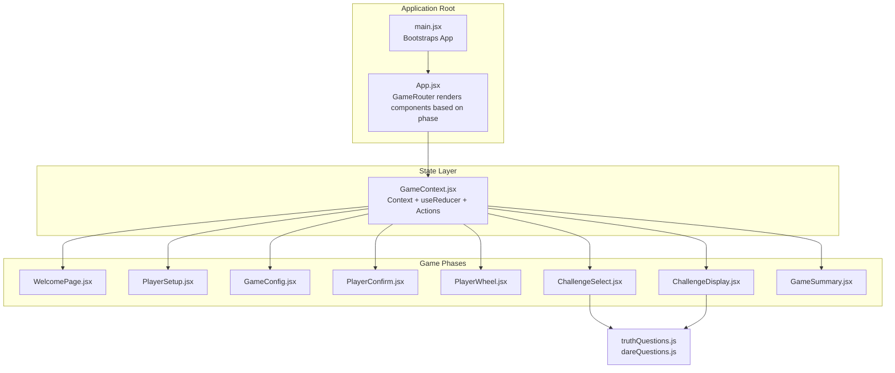
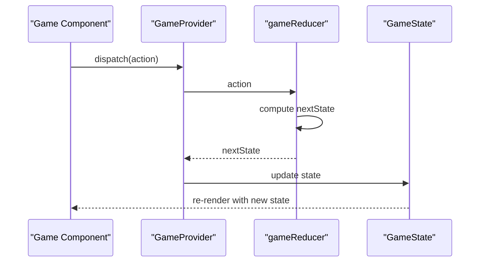
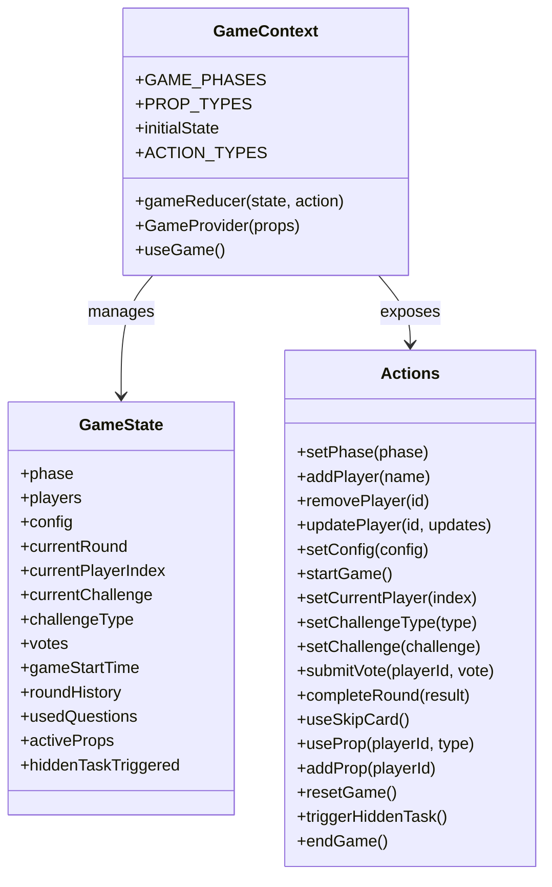
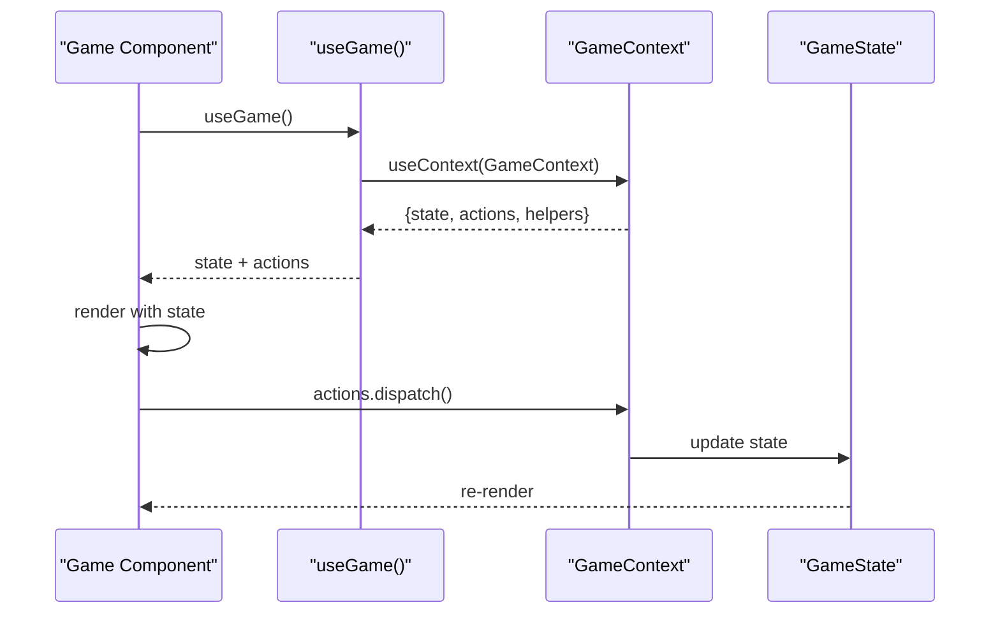
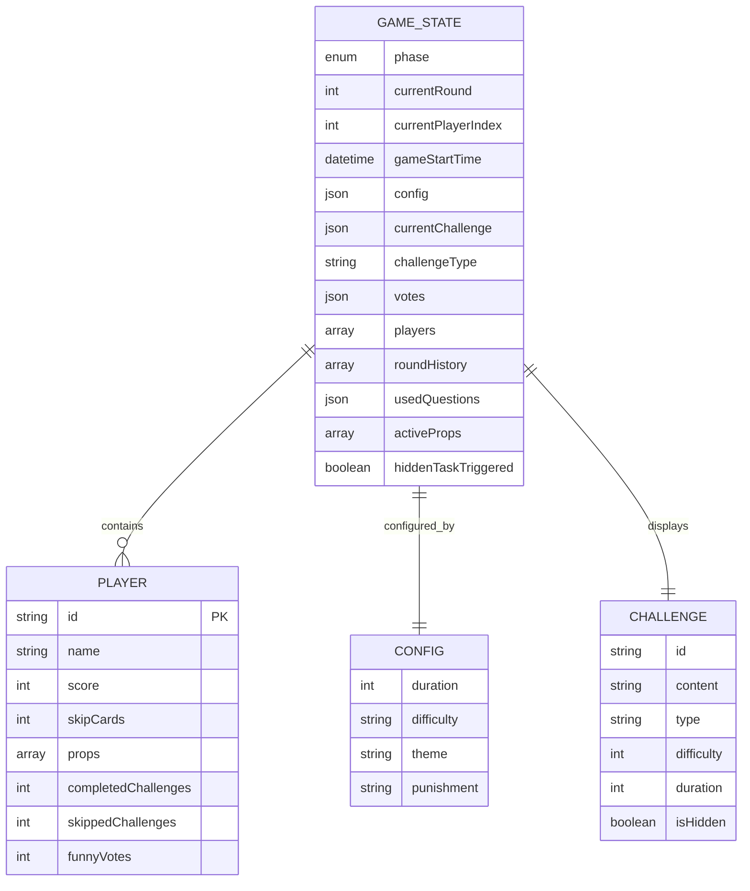
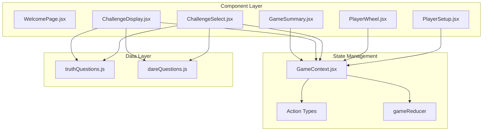

# State Management System

<cite>
**Referenced Files in This Document**
- [GameContext.jsx](file://src/context/GameContext.jsx)
- [App.jsx](file://src/App.jsx)
- [main.jsx](file://src/main.jsx)
- [WelcomePage.jsx](file://src/components/GameSetup/WelcomePage.jsx)
- [PlayerSetup.jsx](file://src/components/GameSetup/PlayerSetup.jsx)
- [PlayerWheel.jsx](file://src/components/GamePlay/PlayerWheel.jsx)
- [ChallengeSelect.jsx](file://src/components/GamePlay/ChallengeSelect.jsx)
- [ChallengeDisplay.jsx](file://src/components/GamePlay/ChallengeDisplay.jsx)
- [GameSummary.jsx](file://src/components/Results/GameSummary.jsx)
- [truthQuestions.js](file://src/data/truthQuestions.js)
- [dareQuestions.js](file://src/data/dareQuestions.js)
</cite>

## Table of Contents
1. [Introduction](#introduction)
2. [Project Structure](#project-structure)
3. [Core Components](#core-components)
4. [Architecture Overview](#architecture-overview)
5. [Detailed Component Analysis](#detailed-component-analysis)
6. [Dependency Analysis](#dependency-analysis)
7. [Performance Considerations](#performance-considerations)
8. [Troubleshooting Guide](#troubleshooting-guide)
9. [Conclusion](#conclusion)

## Introduction
This document provides comprehensive documentation for the GameContext state management system used in the Truth or Dare party game application. The system implements a centralized state architecture using React Context combined with the useReducer pattern to manage game phases, player data, challenges, configuration, and gameplay mechanics. The documentation covers the state structure, action types, reducer implementation, provider pattern, custom hooks, component subscription patterns, state update mechanisms, performance considerations, debugging strategies, persistence, reset functionality, and lifecycle integration.

## Project Structure
The state management system is encapsulated within a dedicated context module and is consumed by various game components across different phases of the game flow. The application bootstraps the GameProvider at the root level, making the state globally accessible to all components.

**Diagram sources**
- [main.jsx](file://src/main.jsx#L1-L11)
- [App.jsx](file://src/App.jsx#L1-L58)
- [GameContext.jsx](file://src/context/GameContext.jsx#L1-L308)
- [truthQuestions.js](file://src/data/truthQuestions.js#L1-L134)
- [dareQuestions.js](file://src/data/dareQuestions.js#L1-L143)

**Section sources**
- [main.jsx](file://src/main.jsx#L1-L11)
- [App.jsx](file://src/App.jsx#L1-L58)
- [GameContext.jsx](file://src/context/GameContext.jsx#L1-L308)

## Core Components
The GameContext module defines the centralized state architecture with the following core elements:

### State Structure
The state maintains a comprehensive game model with the following key properties:
- Phase management for game progression
- Player collection with scoring and道具 tracking
- Game configuration (duration, difficulty, theme, punishment)
- Round tracking and history
- Challenge selection and display state
- Voting and道具 activation
- Hidden task triggers

### Action Types
The system defines a comprehensive set of action types for state mutations:
- Phase transitions (SET_PHASE, START_GAME, END_GAME)
- Player management (ADD_PLAYER, REMOVE_PLAYER, UPDATE_PLAYER)
- Configuration updates (SET_CONFIG)
- Challenge lifecycle (SET_CHALLENGE_TYPE, SET_CHALLENGE, COMPLETE_ROUND)
- Voting and道具 mechanics (SUBMIT_VOTE, USE_PROP, ADD_PROP, USE_SKIP_CARD)
- Game lifecycle (RESET_GAME, TRIGGER_HIDDEN_TASK)

### Reducer Implementation
The reducer implements pure state transformations with predictable updates for each action type, maintaining immutability and ensuring consistent state updates across the application.

**Section sources**
- [GameContext.jsx](file://src/context/GameContext.jsx#L24-L64)

## Architecture Overview
The GameContext follows a unidirectional data flow pattern with explicit state transitions and deterministic updates.

**Diagram sources**
- [GameContext.jsx](file://src/context/GameContext.jsx#L67-L237)

The architecture ensures:
- Centralized state management with single source of truth
- Predictable state transitions through explicit actions
- Component subscription through custom hooks
- Immutable state updates preserving referential integrity

## Detailed Component Analysis

### GameContext Provider Pattern
The GameProvider implements the complete state management infrastructure:

**Diagram sources**
- [GameContext.jsx](file://src/context/GameContext.jsx#L24-L298)

### Custom Hooks Implementation
The useGame hook provides seamless component integration with error handling for proper context usage.

**Section sources**
- [GameContext.jsx](file://src/context/GameContext.jsx#L242-L307)

### Component Subscription Patterns
Components subscribe to state changes through the useGame hook, enabling selective re-rendering based on state updates.

**Diagram sources**
- [App.jsx](file://src/App.jsx#L13-L45)
- [GameContext.jsx](file://src/context/GameContext.jsx#L242-L298)

**Section sources**
- [App.jsx](file://src/App.jsx#L13-L45)
- [WelcomePage.jsx](file://src/components/GameSetup/WelcomePage.jsx#L1-L88)
- [PlayerSetup.jsx](file://src/components/GameSetup/PlayerSetup.jsx#L1-L194)

### State Update Mechanisms
The system implements comprehensive state update mechanisms across all game phases:

#### Player Management
- Dynamic player addition with automatic ID generation and default attributes
- Player removal with state cleanup
- Player attribute updates with partial state merging

#### Challenge Lifecycle
- Challenge type selection with automatic question fetching
- Challenge display with configurable timing
- Voting system for challenge validation
- Round completion with scoring calculations

#### Game Configuration
- Duration-based game ending detection
- Difficulty and theme-based question filtering
- Prop-based gameplay mechanics

**Section sources**
- [GameContext.jsx](file://src/context/GameContext.jsx#L67-L237)
- [ChallengeSelect.jsx](file://src/components/GamePlay/ChallengeSelect.jsx#L1-L201)
- [ChallengeDisplay.jsx](file://src/components/GamePlay/ChallengeDisplay.jsx#L1-L341)

### Data Model Architecture
The state model encompasses multiple interconnected data structures:

**Diagram sources**
- [GameContext.jsx](file://src/context/GameContext.jsx#L25-L44)

**Section sources**
- [GameContext.jsx](file://src/context/GameContext.jsx#L25-L44)

## Dependency Analysis
The GameContext system exhibits well-defined dependencies and relationships:

**Diagram sources**
- [GameContext.jsx](file://src/context/GameContext.jsx#L1-L308)
- [ChallengeSelect.jsx](file://src/components/GamePlay/ChallengeSelect.jsx#L1-L201)
- [ChallengeDisplay.jsx](file://src/components/GamePlay/ChallengeDisplay.jsx#L1-L341)
- [truthQuestions.js](file://src/data/truthQuestions.js#L1-L134)
- [dareQuestions.js](file://src/data/dareQuestions.js#L1-L143)

**Section sources**
- [GameContext.jsx](file://src/context/GameContext.jsx#L1-L308)
- [ChallengeSelect.jsx](file://src/components/GamePlay/ChallengeSelect.jsx#L1-L201)
- [ChallengeDisplay.jsx](file://src/components/GamePlay/ChallengeDisplay.jsx#L1-L341)

## Performance Considerations
The GameContext implementation incorporates several performance optimization strategies:

### State Update Optimization
- Pure reducer functions ensure predictable state transitions
- Immutable state updates prevent unnecessary re-renders
- Selective state consumption through custom hooks reduces component subscriptions

### Memory Management
- Automatic cleanup of timeouts and intervals in components
- Efficient player data structures with minimal property overhead
- Conditional rendering prevents excessive DOM updates

### Rendering Performance
- Component-level memoization through selective state consumption
- Animation libraries integrated with state-driven transitions
- Debounced updates for frequently changing state properties

### Data Access Patterns
- Helper methods (getCurrentPlayer, getLeaderboard) encapsulate state computations
- Lazy evaluation of expensive operations (sorting, filtering)
- Efficient question selection with used question tracking

**Section sources**
- [PlayerWheel.jsx](file://src/components/GamePlay/PlayerWheel.jsx#L21-L67)
- [ChallengeDisplay.jsx](file://src/components/GamePlay/ChallengeDisplay.jsx#L24-L33)

## Troubleshooting Guide
Common issues and debugging strategies for the GameContext system:

### Context Provider Issues
- **Error: useGame must be used within a GameProvider**
  - Ensure GameProvider wraps the entire application
  - Verify proper import/export of GameProvider in App.jsx

### State Synchronization Problems
- **Components not updating with state changes**
  - Verify useGame hook is called within GameProvider scope
  - Check action dispatch patterns and action type correctness
  - Ensure state updates are immutable and properly structured

### Performance Issues
- **Excessive re-renders**
  - Review component subscription patterns and state granularity
  - Implement proper memoization for expensive computations
  - Optimize animation timing and transition durations

### Game Logic Bugs
- **Challenge selection not working correctly**
  - Verify question filtering logic with difficulty and theme parameters
  - Check used question tracking and reset mechanisms
  - Validate prop usage and activation effects

### Debugging Strategies
- Enable React DevTools for state inspection
- Use console logging for action dispatch verification
- Implement state snapshots for complex game scenarios
- Test edge cases with empty player lists and boundary conditions

**Section sources**
- [GameContext.jsx](file://src/context/GameContext.jsx#L301-L307)
- [PlayerSetup.jsx](file://src/components/GameSetup/PlayerSetup.jsx#L10-L27)

## Conclusion
The GameContext state management system provides a robust, scalable foundation for the Truth or Dare game application. The implementation demonstrates best practices in React state management through:

- Clear separation of concerns with dedicated context and reducer
- Comprehensive action type coverage for all game mechanics
- Efficient component integration through custom hooks
- Performance-conscious design with immutable updates and selective re-renders
- Extensible architecture supporting future game feature additions

The system successfully manages complex game state transitions while maintaining simplicity for developers and optimal performance for users. The modular design enables easy testing, debugging, and extension of game functionality.