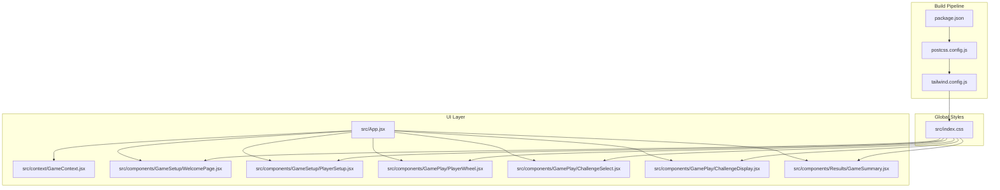
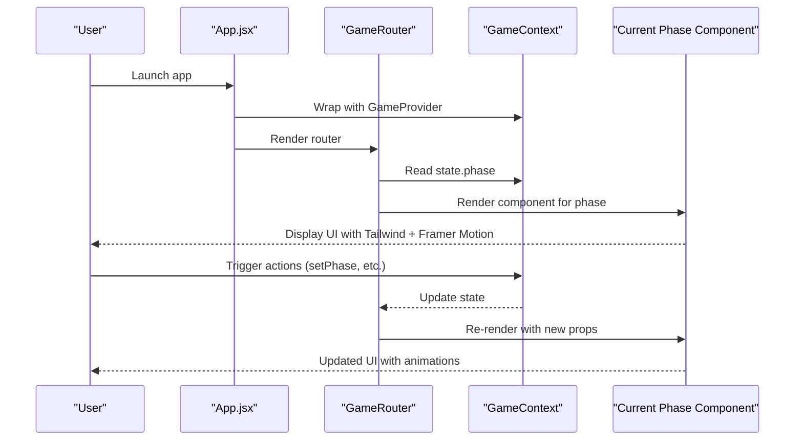
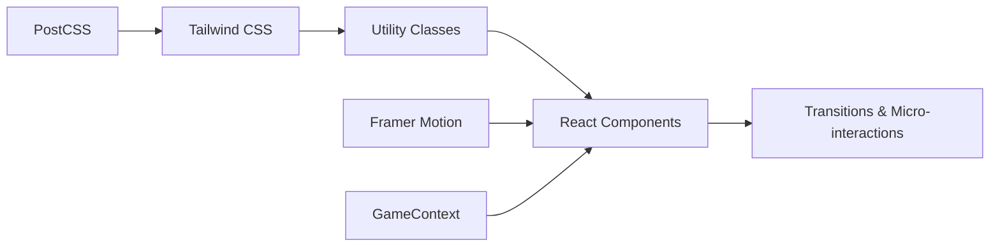

# Styling and UI Framework

<cite>
**Referenced Files in This Document**
- [tailwind.config.js](file://tailwind.config.js)
- [postcss.config.js](file://postcss.config.js)
- [package.json](file://package.json)
- [src/index.css](file://src/index.css)
- [src/App.jsx](file://src/App.jsx)
- [src/context/GameContext.jsx](file://src/context/GameContext.jsx)
- [src/components/GameSetup/WelcomePage.jsx](file://src/components/GameSetup/WelcomePage.jsx)
- [src/components/GameSetup/PlayerSetup.jsx](file://src/components/GameSetup/PlayerSetup.jsx)
- [src/components/GamePlay/PlayerWheel.jsx](file://src/components/GamePlay/PlayerWheel.jsx)
- [src/components/GamePlay/ChallengeSelect.jsx](file://src/components/GamePlay/ChallengeSelect.jsx)
- [src/components/GamePlay/ChallengeDisplay.jsx](file://src/components/GamePlay/ChallengeDisplay.jsx)
- [src/components/Results/GameSummary.jsx](file://src/components/Results/GameSummary.jsx)
- [src/data/truthQuestions.js](file://src/data/truthQuestions.js)
- [src/data/dareQuestions.js](file://src/data/dareQuestions.js)
</cite>

## Table of Contents
1. [Introduction](#introduction)
2. [Project Structure](#project-structure)
3. [Core Components](#core-components)
4. [Architecture Overview](#architecture-overview)
5. [Detailed Component Analysis](#detailed-component-analysis)
6. [Dependency Analysis](#dependency-analysis)
7. [Performance Considerations](#performance-considerations)
8. [Troubleshooting Guide](#troubleshooting-guide)
9. [Conclusion](#conclusion)

## Introduction
This document explains the styling and UI framework of the Truth or Dare application. It covers the Tailwind CSS configuration, utility-first styling approach, responsive design patterns, component styling strategies, animations via Framer Motion, and visual consistency across game phases. It also documents color schemes, typography choices, interactive element styling, responsive breakpoints, mobile-first design principles, accessibility considerations, custom CSS overrides, animation timing, and performance optimization for visual effects.

## Project Structure
The styling and UI system is organized around:
- Tailwind CSS configuration and PostCSS pipeline
- Global CSS for base styles, custom animations, and reusable utilities
- React components styled with Tailwind utilities and animated with Framer Motion
- A centralized game context managing state and transitions across UI phases

**Diagram sources**
- [package.json](file://package.json#L12-L30)
- [postcss.config.js](file://postcss.config.js#L1-L7)
- [tailwind.config.js](file://tailwind.config.js#L1-L12)
- [src/index.css](file://src/index.css#L1-L73)
- [src/App.jsx](file://src/App.jsx#L1-L58)
- [src/context/GameContext.jsx](file://src/context/GameContext.jsx#L1-L308)
- [src/components/GameSetup/WelcomePage.jsx](file://src/components/GameSetup/WelcomePage.jsx#L1-L88)
- [src/components/GameSetup/PlayerSetup.jsx](file://src/components/GameSetup/PlayerSetup.jsx#L1-L194)
- [src/components/GamePlay/PlayerWheel.jsx](file://src/components/GamePlay/PlayerWheel.jsx#L1-L293)
- [src/components/GamePlay/ChallengeSelect.jsx](file://src/components/GamePlay/ChallengeSelect.jsx#L1-L201)
- [src/components/GamePlay/ChallengeDisplay.jsx](file://src/components/GamePlay/ChallengeDisplay.jsx#L1-L341)
- [src/components/Results/GameSummary.jsx](file://src/components/Results/GameSummary.jsx#L1-L223)

**Section sources**
- [package.json](file://package.json#L12-L30)
- [postcss.config.js](file://postcss.config.js#L1-L7)
- [tailwind.config.js](file://tailwind.config.js#L1-L12)
- [src/index.css](file://src/index.css#L1-L73)
- [src/App.jsx](file://src/App.jsx#L1-L58)

## Core Components
- Tailwind CSS and PostCSS pipeline: configured for content scanning and autoprefixing; no theme extensions are defined.
- Global CSS: defines CSS variables for primary and semantic colors, global body styles, custom keyframe animations, reusable utility classes, and card styling.
- Framer Motion integration: used for page transitions, per-element micro-interactions, and phase transitions.
- Game phases: managed by a central context, driving which component renders and how animations behave.

Key styling assets:
- Tailwind configuration scans HTML and JSX under src and index.html.
- Global gradients and typography are applied to the body.
- Custom animations include pulse glow and bounce-in.
- Utility classes define hover/scale transitions and glass-morphism card styles.

**Section sources**
- [tailwind.config.js](file://tailwind.config.js#L1-L12)
- [postcss.config.js](file://postcss.config.js#L1-L7)
- [src/index.css](file://src/index.css#L5-L73)
- [src/App.jsx](file://src/App.jsx#L1-L58)
- [src/context/GameContext.jsx](file://src/context/GameContext.jsx#L3-L14)

## Architecture Overview
The UI architecture follows a phase-driven routing pattern:
- App wraps the entire app with GameProvider.
- GameRouter selects the current component based on the game phase.
- AnimatePresence coordinates cross-fade transitions between phases.
- Each component composes Tailwind utilities and Framer Motion primitives to deliver smooth, consistent interactions.

**Diagram sources**
- [src/App.jsx](file://src/App.jsx#L13-L44)
- [src/context/GameContext.jsx](file://src/context/GameContext.jsx#L287-L297)

**Section sources**
- [src/App.jsx](file://src/App.jsx#L1-L58)
- [src/context/GameContext.jsx](file://src/context/GameContext.jsx#L1-L308)

## Detailed Component Analysis

### Tailwind CSS Configuration and Global Styles
- Content scanning targets index.html and all src files, ensuring purge-safe utility usage.
- Theme extension is empty; colors and spacing are derived from defaults and custom CSS variables.
- Global base styles:
  - Body uses a full-viewport gradient background and a readable font stack.
  - CSS variables define primary, secondary, success, danger, and warning palettes for consistent theming.
- Custom animations:
  - Pulse glow and bounce-in animations are defined and attached to utility classes.
- Reusable utilities:
  - Glass-morphism card class with backdrop blur and shadow.
  - Button hover-scale effect with transition and active press-down transform.

Responsive patterns:
- Mobile-first approach using Tailwind’s responsive prefixes (e.g., md: for medium screens).
- Consistent padding and spacing scales across breakpoints.

Accessibility:
- Focus-visible outlines are not overridden; default browser focus styles remain.
- Sufficient color contrast maintained via semantic color classes and gradients.

**Section sources**
- [tailwind.config.js](file://tailwind.config.js#L3-L6)
- [src/index.css](file://src/index.css#L5-L73)

### Welcome Page
- Uses motion wrappers for entrance and logo spring animation.
- Implements a centered card layout with responsive padding and max-width constraints.
- Gradient buttons with hover and tap scaling for interactive feedback.
- Lists game flow steps and version info with appropriate text sizes and weights.

Responsive behavior:
- Uses md: variants for larger typography and increased paddings on tablets and above.

Animation timing:
- Logo spring uses a natural spring easing and a moderate duration.
- Button hover/tap scale is immediate but subtle.

**Section sources**
- [src/components/GameSetup/WelcomePage.jsx](file://src/components/GameSetup/WelcomePage.jsx#L7-L87)

### Player Setup
- Animated entrance/exit with slide transitions.
- Input field with focus border highlighting and Enter-key submission support.
- Dynamic error messaging with AnimatePresence for smooth fade.
- Player list with per-item slide animations and removal controls.
- Quick-add buttons with disabled states when limits are reached.
- Navigation buttons conditionally enabled based on player count.

Responsive behavior:
- Grid and flex layouts adapt to smaller screens; md: paddings increase on larger devices.

Animation timing:
- List items animate in/out with slide transitions; button interactions use short transforms.

**Section sources**
- [src/components/GameSetup/PlayerSetup.jsx](file://src/components/GameSetup/PlayerSetup.jsx#L37-L193)

### Player Wheel (Spinning Phase)
- Centralized animation orchestration for wheel rotation with a long-duration cubic-bezier easing curve.
- SVG-based wheel with dynamic gradients per segment; text labels auto-truncate for readability.
- Progress bar tracks game duration with motion-driven width animation.
- Selected player announcement uses bounce-in animation.
- Disabled button during spin; re-enabled after timeout.
- Leaderboard preview highlights top scorers.

Responsive behavior:
- Fixed container size with proportional SVG sizing; md: paddings increase.

Animation timing:
- Wheel spin lasts approximately 4 seconds with easing tailored for deceleration.
- Selection announcement uses a short bounce-in animation.

**Section sources**
- [src/components/GamePlay/PlayerWheel.jsx](file://src/components/GamePlay/PlayerWheel.jsx#L28-L58)
- [src/components/GamePlay/PlayerWheel.jsx](file://src/components/GamePlay/PlayerWheel.jsx#L166-L233)
- [src/components/GamePlay/PlayerWheel.jsx](file://src/components/GamePlay/PlayerWheel.jsx#L235-L247)

### Challenge Select
- Countdown timer with color change when time is low.
- Two-column selection grid for Truth vs Dare with gradient backgrounds and selection states.
- Auto-selection after countdown with randomized choice.
- Player stats display (skip cards, score, props) for contextual awareness.

Responsive behavior:
- Grid layout stacks on small screens; md: paddings adjust.

Animation timing:
- Spring-based entrance for player badge; selection feedback uses immediate scale changes.

**Section sources**
- [src/components/GamePlay/ChallengeSelect.jsx](file://src/components/GamePlay/ChallengeSelect.jsx#L77-L200)

### Challenge Display
- Conditional rendering for hidden tasks and voting phases.
- Timer with color-coded background based on remaining time.
- Voting panel with three options (pass, funny, explain) and animated transitions.
- Prop usage menu with animated expand/collapse.
- Completion actions with skip and prop usage; results confirm and award points.

Responsive behavior:
- Card layout adapts with md: paddings; grid layouts for voting options.

Animation timing:
- Voting panel slides in/out with motion transitions; button interactions use short transforms.

**Section sources**
- [src/components/GamePlay/ChallengeDisplay.jsx](file://src/components/GamePlay/ChallengeDisplay.jsx#L106-L341)

### Game Summary
- Spring-based entrance for celebratory header.
- Ranked player cards with special styling for top-three positions.
- Special awards display with themed backgrounds.
- Statistics and recent round history with staggered animations.
- Action buttons for replay or returning home.

Responsive behavior:
- Staggered animations for leaderboard items; md: paddings increase.

Animation timing:
- Spring entrance for header; staggered entries for leaderboard items.

**Section sources**
- [src/components/Results/GameSummary.jsx](file://src/components/Results/GameSummary.jsx#L39-L222)

### Game Context and Phase Transitions
- Centralized phase enumeration and reducer actions.
- AnimatePresence wrapper in App.jsx ensures smooth transitions between phases.
- getCurrentPlayer, getLeaderboard, and checkGameEnd helpers provide component-friendly accessors.

**Section sources**
- [src/context/GameContext.jsx](file://src/context/GameContext.jsx#L3-L14)
- [src/context/GameContext.jsx](file://src/context/GameContext.jsx#L267-L286)
- [src/App.jsx](file://src/App.jsx#L13-L44)

## Dependency Analysis
The styling and UI framework depends on:
- Tailwind CSS and PostCSS for utility-first CSS generation and autoprefixing.
- Framer Motion for declarative animations and page transitions.
- React context for state-driven UI decisions.

**Diagram sources**
- [package.json](file://package.json#L12-L30)
- [postcss.config.js](file://postcss.config.js#L1-L7)
- [tailwind.config.js](file://tailwind.config.js#L1-L12)
- [src/App.jsx](file://src/App.jsx#L1-L58)
- [src/context/GameContext.jsx](file://src/context/GameContext.jsx#L1-L308)

**Section sources**
- [package.json](file://package.json#L12-L30)
- [postcss.config.js](file://postcss.config.js#L1-L7)
- [tailwind.config.js](file://tailwind.config.js#L1-L12)
- [src/App.jsx](file://src/App.jsx#L1-L58)
- [src/context/GameContext.jsx](file://src/context/GameContext.jsx#L1-L308)

## Performance Considerations
- Prefer transform-based animations (scale, translate) for GPU acceleration; most components use transform and opacity.
- Keep animation durations reasonable (typical 0.2–0.8s) to avoid jank on lower-end devices.
- Use responsive breakpoints judiciously to prevent excessive reflows.
- Limit heavy CSS filters (e.g., blur) to essential cases; backdrop-filter is used sparingly on cards.
- Avoid animating layout-affecting properties (width, height) when possible; use transforms instead.
- Use motion variants (whileHover, whileTap) for lightweight interactivity; reserve complex timelines for key moments.

[No sources needed since this section provides general guidance]

## Troubleshooting Guide
Common styling and animation issues:
- Animations not triggering: ensure AnimatePresence wraps the root of each phase and keys are unique per phase.
- Tailwind utilities not applied: verify content paths in Tailwind config include the relevant files.
- Hover/scale effects not smooth: confirm transition classes are present and not overridden by later styles.
- SVG wheel rotation feels off: review easing curves and ensure consistent duration across spin cycles.
- Text truncation: adjust truncation thresholds based on number of players and screen size.

**Section sources**
- [src/App.jsx](file://src/App.jsx#L40-L44)
- [tailwind.config.js](file://tailwind.config.js#L3-L6)
- [src/components/GamePlay/PlayerWheel.jsx](file://src/components/GamePlay/PlayerWheel.jsx#L171-L174)

## Conclusion
The Truth or Dare application employs a clean, utility-first styling approach powered by Tailwind CSS and PostCSS, complemented by Framer Motion for fluid animations and transitions. The design is mobile-first, responsive, and visually consistent across game phases through shared utilities, color variables, and animation patterns. Interactive elements are intuitive, and performance is optimized through transform-based animations and careful use of visual effects.