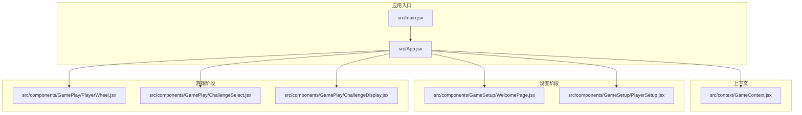
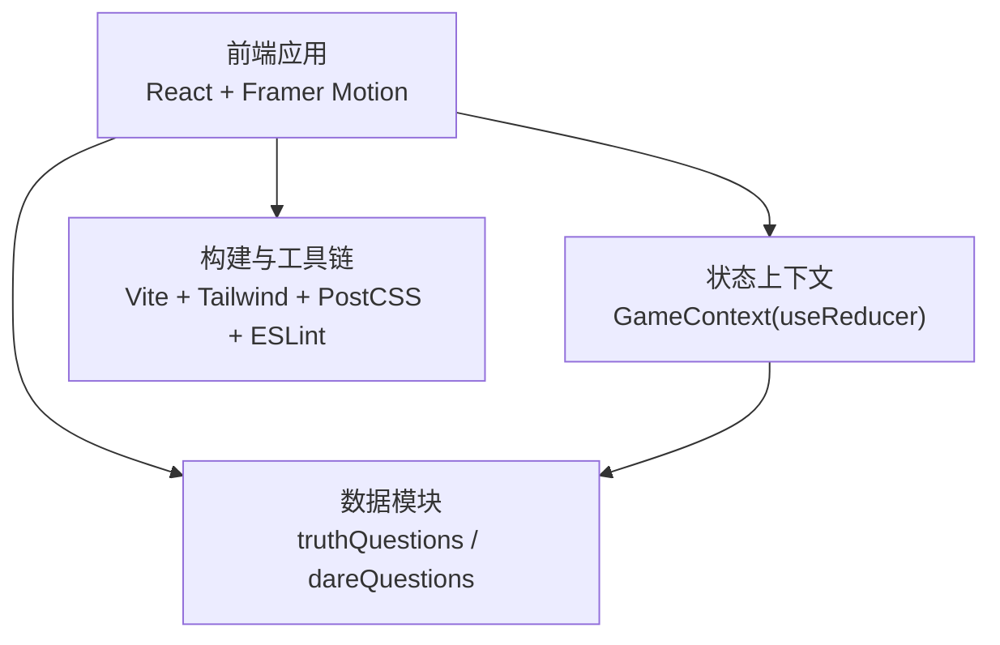
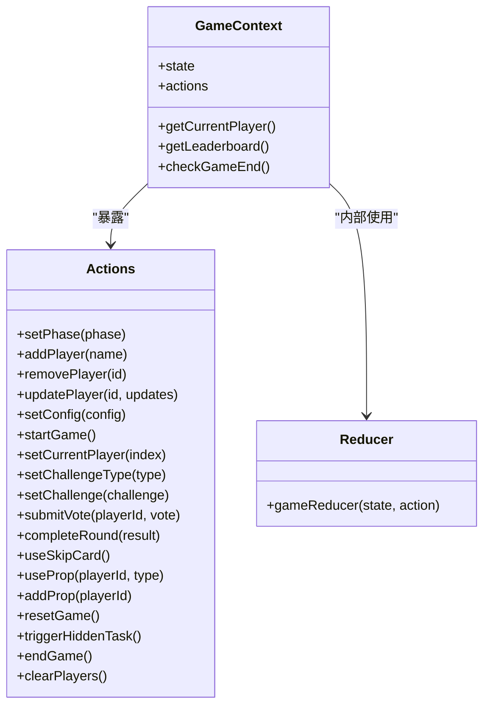
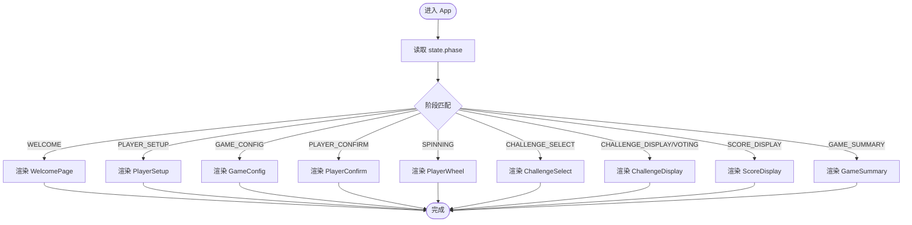
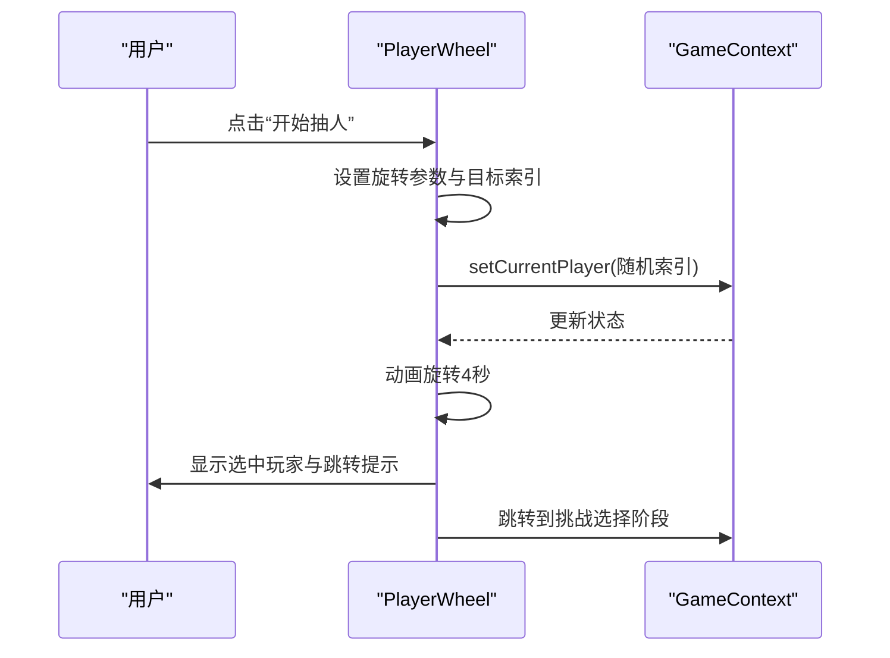
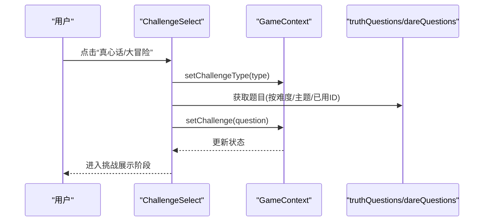
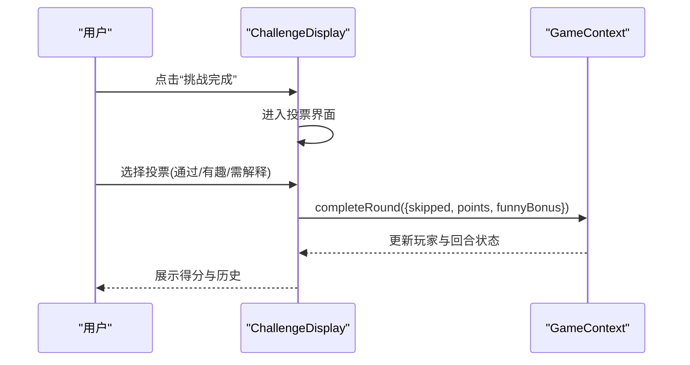
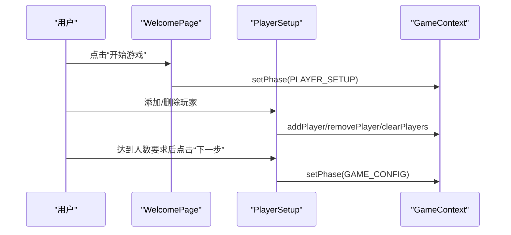
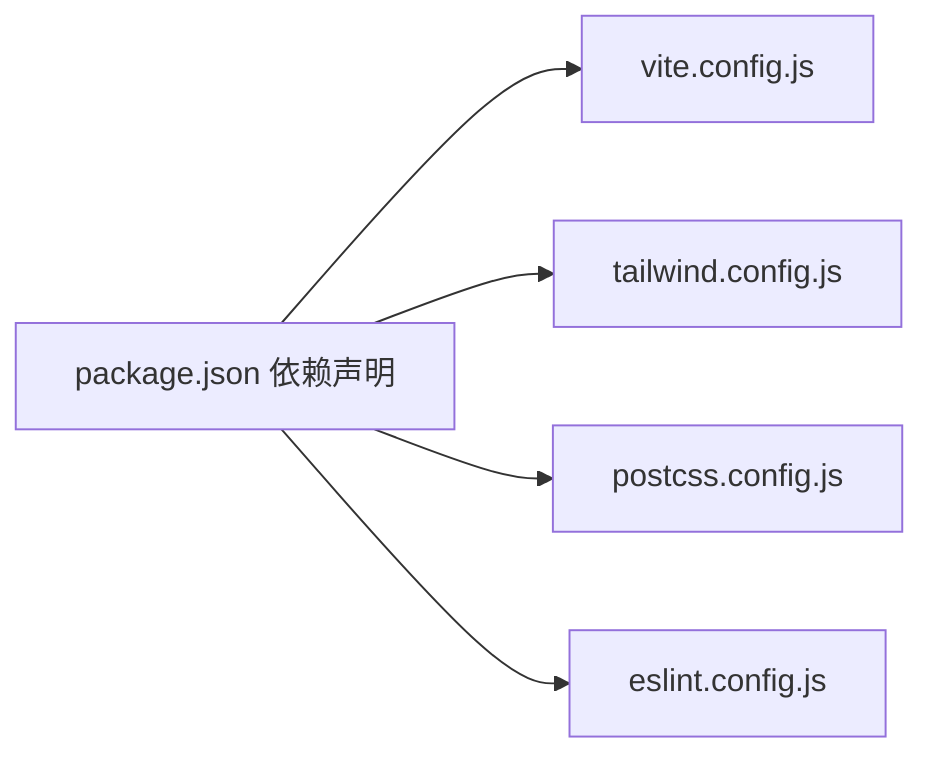

# 开发指南

<cite>
**本文引用的文件**
- [package.json](file://package.json)
- [eslint.config.js](file://eslint.config.js)
- [vite.config.js](file://vite.config.js)
- [tailwind.config.js](file://tailwind.config.js)
- [postcss.config.js](file://postcss.config.js)
- [README.md](file://README.md)
- [src/App.jsx](file://src/App.jsx)
- [src/main.jsx](file://src/main.jsx)
- [src/context/GameContext.jsx](file://src/context/GameContext.jsx)
- [src/data/truthQuestions.js](file://src/data/truthQuestions.js)
- [src/data/dareQuestions.js](file://src/data/dareQuestions.js)
- [src/components/GameSetup/WelcomePage.jsx](file://src/components/GameSetup/WelcomePage.jsx)
- [src/components/GameSetup/PlayerSetup.jsx](file://src/components/GameSetup/PlayerSetup.jsx)
- [src/components/GamePlay/ChallengeSelect.jsx](file://src/components/GamePlay/ChallengeSelect.jsx)
- [src/components/GamePlay/ChallengeDisplay.jsx](file://src/components/GamePlay/ChallengeDisplay.jsx)
- [src/components/GamePlay/PlayerWheel.jsx](file://src/components/GamePlay/PlayerWheel.jsx)
</cite>

## 目录
1. [简介](#简介)
2. [项目结构](#项目结构)
3. [核心组件](#核心组件)
4. [架构总览](#架构总览)
5. [详细组件分析](#详细组件分析)
6. [依赖关系分析](#依赖关系分析)
7. [性能考虑](#性能考虑)
8. [故障排查指南](#故障排查指南)
9. [结论](#结论)
10. [附录](#附录)

## 简介
本指南面向 Truth or Dare 项目的开发者，系统阐述代码规范与最佳实践（ESLint 规则与 JavaScript 编码标准）、开发环境设置（IDE 配置、插件推荐、调试工具）、代码组织与文件命名规范、组件开发流程（从需求到测试验证）、性能优化与内存管理建议、调试技巧与工具使用（浏览器开发者工具与 React DevTools），以及版本控制与协作开发的最佳实践。

## 项目结构
项目采用基于功能的模块化组织方式，核心目录与职责如下：
- src/components：按功能域划分的 React 组件，如 GameSetup（游戏设置）、GamePlay（游戏进行中）、Results（结果页）
- src/context：集中式状态管理（React Context + useReducer）
- src/data：游戏数据与算法（真心话/大冒险题库、隐藏任务）
- 根级配置：Vite、Tailwind、PostCSS、ESLint 等

图表来源
- [src/main.jsx](file://src/main.jsx#L1-L11)
- [src/App.jsx](file://src/App.jsx#L1-L61)
- [src/context/GameContext.jsx](file://src/context/GameContext.jsx#L1-L323)
- [src/components/GameSetup/WelcomePage.jsx](file://src/components/GameSetup/WelcomePage.jsx#L1-L88)
- [src/components/GameSetup/PlayerSetup.jsx](file://src/components/GameSetup/PlayerSetup.jsx#L1-L197)
- [src/components/GamePlay/PlayerWheel.jsx](file://src/components/GamePlay/PlayerWheel.jsx#L1-L300)
- [src/components/GamePlay/ChallengeSelect.jsx](file://src/components/GamePlay/ChallengeSelect.jsx#L1-L201)
- [src/components/GamePlay/ChallengeDisplay.jsx](file://src/components/GamePlay/ChallengeDisplay.jsx#L1-L356)

章节来源
- [src/main.jsx](file://src/main.jsx#L1-L11)
- [src/App.jsx](file://src/App.jsx#L1-L61)

## 核心组件
- 应用根与路由：App.jsx 通过 useGame 读取状态并根据 GAME_PHASES 渲染不同阶段组件；使用动画库实现页面切换过渡
- 上下文与状态：GameContext.jsx 定义 GAME_PHASES、道具类型、初始状态、Action 类型与 reducer；提供 setPhase、addPlayer、startGame、setChallenge 等动作；封装 getCurrentPlayer、getLeaderboard、checkGameEnd 等辅助函数
- 数据层：truthQuestions.js 与 dareQuestions.js 提供题库与筛选逻辑；dareQuestions.js 还包含隐藏任务集合与获取函数
- 组件层：各阶段组件负责 UI、交互与业务流程推进（如转盘抽人、挑战选择、挑战展示与投票）

章节来源
- [src/App.jsx](file://src/App.jsx#L1-L61)
- [src/context/GameContext.jsx](file://src/context/GameContext.jsx#L1-L323)
- [src/data/truthQuestions.js](file://src/data/truthQuestions.js#L1-L156)
- [src/data/dareQuestions.js](file://src/data/dareQuestions.js#L1-L167)

## 架构总览
整体采用“组件驱动 + Context 状态”的前端架构，Vite 提供开发与构建，Tailwind 用于样式，ESLint 保障代码质量。

图表来源
- [src/App.jsx](file://src/App.jsx#L1-L61)
- [src/context/GameContext.jsx](file://src/context/GameContext.jsx#L1-L323)
- [src/data/truthQuestions.js](file://src/data/truthQuestions.js#L1-L156)
- [src/data/dareQuestions.js](file://src/data/dareQuestions.js#L1-L167)
- [vite.config.js](file://vite.config.js#L1-L8)
- [tailwind.config.js](file://tailwind.config.js#L1-L12)
- [postcss.config.js](file://postcss.config.js#L1-L7)
- [eslint.config.js](file://eslint.config.js#L1-L30)

## 详细组件分析

### 状态与上下文（GameContext）
- 设计要点
  - 使用 useReducer 管理复杂状态与派生数据（如当前玩家、排行榜、游戏结束判断）
  - 将动作封装为对象，避免在组件中直接分散 dispatch
  - 提供辅助函数（getCurrentPlayer、getLeaderboard、checkGameEnd）减少重复计算
- 关键流程
  - 轮次推进：completeRound 计算积分、更新回合历史、重置投票与挑战
  - 道具系统：useProp、addProp、activeProps 控制道具生效与移除
  - 隐藏任务：triggerHiddenTask 与 getHiddenTask 协作触发特殊事件

图表来源
- [src/context/GameContext.jsx](file://src/context/GameContext.jsx#L257-L322)

章节来源
- [src/context/GameContext.jsx](file://src/context/GameContext.jsx#L1-L323)

### 游戏阶段路由（App.jsx）
- 设计要点
  - 通过 useGame 获取 state.phase 并渲染对应组件
  - 使用动画库实现页面切换的流畅过渡
- 流程图

图表来源
- [src/App.jsx](file://src/App.jsx#L14-L48)

章节来源
- [src/App.jsx](file://src/App.jsx#L1-L61)

### 转盘抽人（PlayerWheel）
- 设计要点
  - 使用 SVG 绘制扇形区域，动态计算颜色与文本位置
  - 通过 CSS 动画与定时器控制旋转与选中反馈
  - 结合游戏时长检查，自动结束游戏
- 时序图

图表来源
- [src/components/GamePlay/PlayerWheel.jsx](file://src/components/GamePlay/PlayerWheel.jsx#L31-L62)
- [src/context/GameContext.jsx](file://src/context/GameContext.jsx#L117-L123)

章节来源
- [src/components/GamePlay/PlayerWheel.jsx](file://src/components/GamePlay/PlayerWheel.jsx#L1-L300)

### 挑战选择（ChallengeSelect）
- 设计要点
  - 支持手动选择或倒计时自动随机选择
  - 触发隐藏任务的概率逻辑与题库选择
- 时序图

图表来源
- [src/components/GamePlay/ChallengeSelect.jsx](file://src/components/GamePlay/ChallengeSelect.jsx#L38-L71)
- [src/data/truthQuestions.js](file://src/data/truthQuestions.js#L126-L155)
- [src/data/dareQuestions.js](file://src/data/dareQuestions.js#L129-L151)

章节来源
- [src/components/GamePlay/ChallengeSelect.jsx](file://src/components/GamePlay/ChallengeSelect.jsx#L1-L201)

### 挑战展示与投票（ChallengeDisplay）
- 设计要点
  - 根据挑战类型设置倒计时
  - 支持完成/失败、跳过卡、道具使用
  - 投票确认机制与积分结算
- 时序图

图表来源
- [src/components/GamePlay/ChallengeDisplay.jsx](file://src/components/GamePlay/ChallengeDisplay.jsx#L62-L99)
- [src/context/GameContext.jsx](file://src/context/GameContext.jsx#L148-L182)

章节来源
- [src/components/GamePlay/ChallengeDisplay.jsx](file://src/components/GamePlay/ChallengeDisplay.jsx#L1-L356)

### 欢迎页与玩家设置（WelcomePage / PlayerSetup）
- 设计要点
  - 欢迎页引导流程与特性介绍
  - 玩家设置表单校验、快速填充与导航
- 时序图

图表来源
- [src/components/GameSetup/WelcomePage.jsx](file://src/components/GameSetup/WelcomePage.jsx#L52-L61)
- [src/components/GameSetup/PlayerSetup.jsx](file://src/components/GameSetup/PlayerSetup.jsx#L10-L27)
- [src/context/GameContext.jsx](file://src/context/GameContext.jsx#L261-L280)

章节来源
- [src/components/GameSetup/WelcomePage.jsx](file://src/components/GameSetup/WelcomePage.jsx#L1-L88)
- [src/components/GameSetup/PlayerSetup.jsx](file://src/components/GameSetup/PlayerSetup.jsx#L1-L197)

## 依赖关系分析
- 构建与工具链
  - Vite 提供开发服务器与打包
  - Tailwind + PostCSS 实现原子化样式
  - ESLint + 插件保证代码风格与 Hooks/刷新安全
- 运行时依赖
  - React 19、React DOM、Framer Motion 用于动画与过渡
  - Tailwind CSS 作为样式基础

图表来源
- [package.json](file://package.json#L12-L31)
- [vite.config.js](file://vite.config.js#L1-L8)
- [tailwind.config.js](file://tailwind.config.js#L1-L12)
- [postcss.config.js](file://postcss.config.js#L1-L7)
- [eslint.config.js](file://eslint.config.js#L1-L30)

章节来源
- [package.json](file://package.json#L1-L33)
- [vite.config.js](file://vite.config.js#L1-L8)
- [tailwind.config.js](file://tailwind.config.js#L1-L12)
- [postcss.config.js](file://postcss.config.js#L1-L7)
- [eslint.config.js](file://eslint.config.js#L1-L30)

## 性能考虑
- 渲染与动画
  - 合理使用动画库的过渡与退出动画，避免不必要的重绘
  - 在大型列表渲染时，优先使用虚拟滚动或分页策略（当前项目中玩家列表已限制数量）
- 状态更新
  - 使用 useReducer 集中处理复杂状态，减少子组件重复渲染
  - 对派生数据（如排行榜）进行缓存，避免每次渲染都重新计算
- 计时器与副作用
  - 在组件卸载时清理定时器，防止内存泄漏
  - 对高频定时器（如倒计时）使用节流或在依赖变更时及时重置
- 资源加载
  - 图片与字体资源尽量压缩与懒加载
  - Tailwind 按需扫描内容，避免生成冗余样式

## 故障排查指南
- ESLint 报错
  - 检查规则配置与忽略项，确保遵循 no-unused-vars 等规则
  - 使用命令行执行 lint，定位具体文件与行号
- 构建与热更新
  - 若热更新异常，尝试重启开发服务器或清理缓存
- 样式问题
  - 确认 Tailwind 内容扫描路径与 PostCSS 插件顺序
- 动画与交互
  - 检查动画库版本兼容性与过渡参数
  - 对于 SVG 动画，确认角度与缓动函数设置

章节来源
- [eslint.config.js](file://eslint.config.js#L1-L30)
- [README.md](file://README.md#L1-L20)

## 结论
本指南提供了 Truth or Dare 项目的开发规范、架构理解、组件流程与性能优化建议。遵循本文档可显著提升开发效率与代码质量，并为后续扩展（如多人联机、云端存储、统计分析）奠定坚实基础。

## 附录

### 代码规范与最佳实践
- ESLint 配置要点
  - 推荐规则：no-unused-vars（忽略大写字母开头变量模式）、React Hooks/刷新相关插件
  - 语言选项：ECMAScript 2020，启用 JSX
- JavaScript 编码标准
  - 函数式与不可变更新：优先使用不可变更新与纯函数
  - 组件拆分：单一职责、可复用性强
  - 命名约定：组件首字母大写、常量全大写、变量与函数小驼峰
  - 注释与文档：为复杂逻辑与边界条件补充注释
- 文件与目录命名
  - 组件文件：PascalCase.jsx；数据文件：camelCase.js；上下文：PascalCase.jsx
  - 目录按功能域划分（GameSetup、GamePlay、Results）

章节来源
- [eslint.config.js](file://eslint.config.js#L16-L27)

### 开发环境设置
- 包管理与脚本
  - 使用 npm scripts 进行开发、构建与预览
- IDE 推荐插件
  - ESLint、Tailwind CSS IntelliSense、ES7+ React/Redux/React-Native snippets
- 调试工具
  - 浏览器开发者工具：Elements、Console、Network、Performance
  - React DevTools：查看组件树、Props、State、Profiler

章节来源
- [package.json](file://package.json#L6-L11)
- [README.md](file://README.md#L1-L20)

### 组件开发标准流程
- 需求分析：明确阶段与交互
- 设计与原型：确定组件结构与状态
- 实现：编写组件与上下文逻辑，接入数据模块
- 测试验证：单元测试与端到端交互测试
- 文档与评审：完善注释与变更说明

### 版本控制与协作
- 分支策略：主分支保护、功能分支、热修复分支
- 提交规范：语义化提交信息（feat/fix/docs/chore）
- 代码评审：强制审查与自动化检查（ESLint、构建）