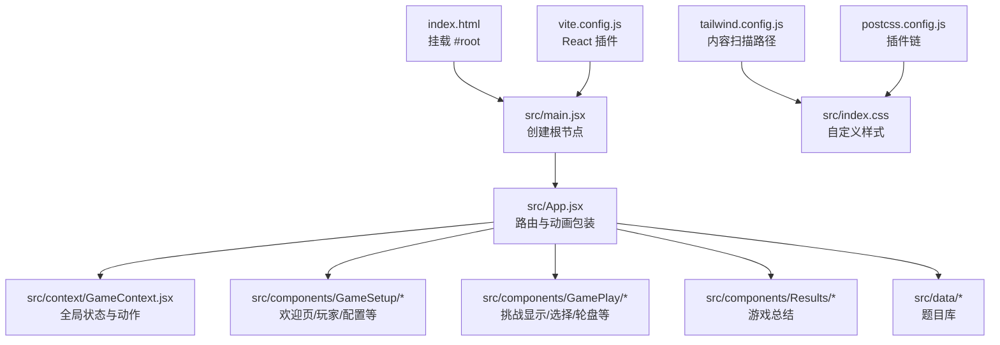
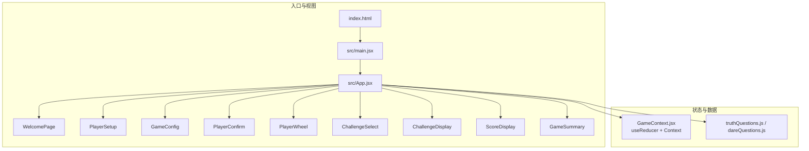
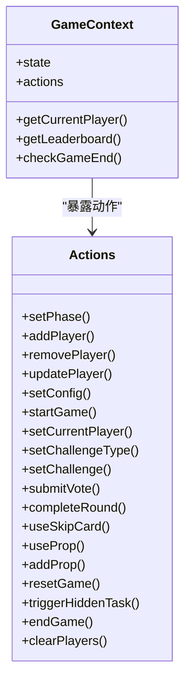
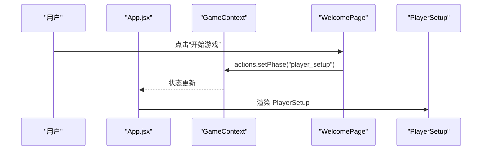
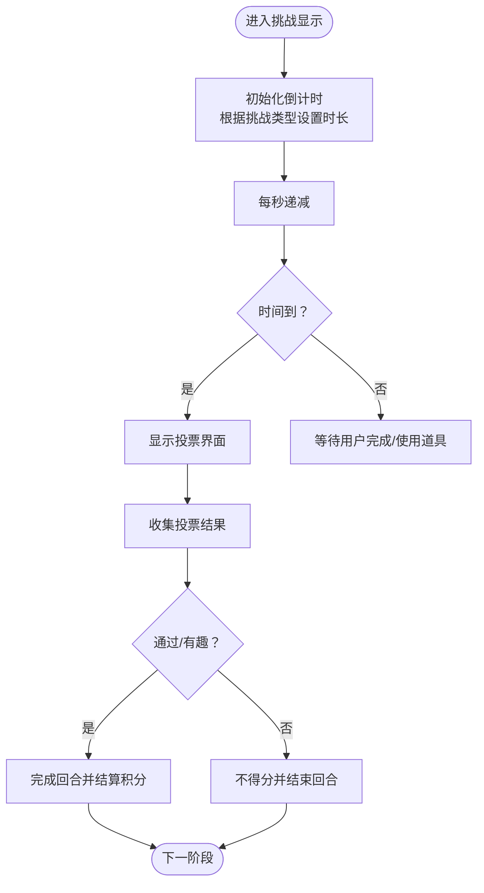
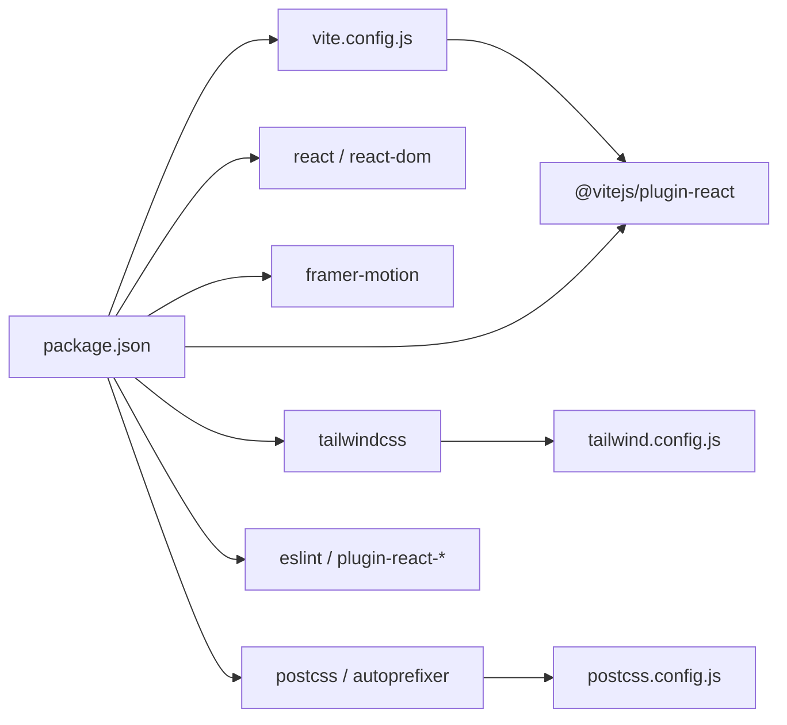

# 快速开始

<cite>
**本文引用的文件**
- [package.json](file://package.json)
- [README.md](file://README.md)
- [vite.config.js](file://vite.config.js)
- [index.html](file://index.html)
- [src/main.jsx](file://src/main.jsx)
- [src/App.jsx](file://src/App.jsx)
- [src/context/GameContext.jsx](file://src/context/GameContext.jsx)
- [src/components/GameSetup/WelcomePage.jsx](file://src/components/GameSetup/WelcomePage.jsx)
- [src/components/GamePlay/ChallengeDisplay.jsx](file://src/components/GamePlay/ChallengeDisplay.jsx)
- [src/data/truthQuestions.js](file://src/data/truthQuestions.js)
- [tailwind.config.js](file://tailwind.config.js)
- [postcss.config.js](file://postcss.config.js)
- [src/index.css](file://src/index.css)
</cite>

## 目录
1. [简介](#简介)
2. [项目结构](#项目结构)
3. [核心组件](#核心组件)
4. [架构总览](#架构总览)
5. [详细组件分析](#详细组件分析)
6. [依赖关系分析](#依赖关系分析)
7. [性能考虑](#性能考虑)
8. [故障排除指南](#故障排除指南)
9. [结论](#结论)
10. [附录](#附录)

## 简介
本指南面向新手开发者，帮助您快速搭建并运行 Truth or Dare（真心话大冒险）项目。项目基于 React 19、Vite 4、TailwindCSS 3 与 Framer Motion 动画，提供本地开发、构建打包以及 Netlify 部署的完整流程。您将学会：
- 安装 Node.js 环境与项目依赖
- 启动本地开发服务器并访问
- 构建静态站点产物
- 将产物部署到 Netlify 平台
- 排查常见安装与运行问题

## 项目结构
项目采用“按功能域分层”的组织方式，核心入口与上下文管理位于 src 目录，构建工具与样式配置位于根目录。关键文件职责如下：
- package.json：定义脚本命令、依赖与版本
- vite.config.js：Vite 构建配置（集成 React 插件）
- index.html：应用入口 HTML，挂载 #root 容器
- src/main.jsx：React 根节点，渲染 App
- src/App.jsx：路由与动画包装，根据游戏阶段渲染不同页面
- src/context/GameContext.jsx：全局游戏状态与动作（useReducer + Context）
- src/components：按功能域划分的组件（GameSetup、GamePlay、Results）
- src/data：游戏数据（真心话/大冒险题目库）
- tailwind.config.js/postcss.config.js：TailwindCSS 与 PostCSS 配置
- src/index.css：自定义样式与动画

图表来源
- [index.html](file://index.html#L1-L14)
- [src/main.jsx](file://src/main.jsx#L1-L11)
- [src/App.jsx](file://src/App.jsx#L1-L61)
- [src/context/GameContext.jsx](file://src/context/GameContext.jsx#L1-L323)
- [tailwind.config.js](file://tailwind.config.js#L1-L12)
- [postcss.config.js](file://postcss.config.js#L1-L7)
- [vite.config.js](file://vite.config.js#L1-L8)

章节来源
- [package.json](file://package.json#L1-L33)
- [vite.config.js](file://vite.config.js#L1-L8)
- [index.html](file://index.html#L1-L14)
- [src/main.jsx](file://src/main.jsx#L1-L11)
- [src/App.jsx](file://src/App.jsx#L1-L61)
- [tailwind.config.js](file://tailwind.config.js#L1-L12)
- [postcss.config.js](file://postcss.config.js#L1-L7)
- [src/index.css](file://src/index.css#L1-L73)

## 核心组件
- 游戏状态与动作：通过 useReducer 维护全局状态，提供统一的动作接口（添加玩家、设置配置、切换阶段、完成回合等），并在 Provider 中暴露给子组件使用。
- 路由与动画：根据当前阶段渲染对应页面，并使用 Framer Motion 实现页面切换动画。
- 页面组件：WelcomePage、PlayerSetup、GameConfig、PlayerConfirm、PlayerWheel、ChallengeSelect、ChallengeDisplay、ScoreDisplay、GameSummary 等。
- 数据层：truthQuestions/dareQuestions 提供题目库，支持按主题与难度筛选。

章节来源
- [src/context/GameContext.jsx](file://src/context/GameContext.jsx#L1-L323)
- [src/App.jsx](file://src/App.jsx#L1-L61)
- [src/components/GameSetup/WelcomePage.jsx](file://src/components/GameSetup/WelcomePage.jsx#L1-L88)
- [src/components/GamePlay/ChallengeDisplay.jsx](file://src/components/GamePlay/ChallengeDisplay.jsx#L1-L200)
- [src/data/truthQuestions.js](file://src/data/truthQuestions.js#L1-L156)

## 架构总览
应用采用“上下文驱动的状态管理 + 组件分层”的架构：
- 入口：index.html -> main.jsx -> App.jsx
- 状态：GameContext 提供全局状态与动作
- 视图：按阶段渲染不同页面组件
- 样式：TailwindCSS + 自定义 CSS 动画
- 构建：Vite 打包与预览

图表来源
- [index.html](file://index.html#L1-L14)
- [src/main.jsx](file://src/main.jsx#L1-L11)
- [src/App.jsx](file://src/App.jsx#L1-L61)
- [src/context/GameContext.jsx](file://src/context/GameContext.jsx#L1-L323)
- [src/data/truthQuestions.js](file://src/data/truthQuestions.js#L1-L156)

## 详细组件分析

### 游戏上下文（GameContext）
- 状态模型：包含阶段、玩家列表、配置、当前轮次、当前挑战、投票、道具、隐藏任务等字段
- 动作类型：集中管理所有状态变更，如设置阶段、添加/移除玩家、设置配置、开始游戏、设置挑战、提交投票、完成回合、使用跳过卡/道具、重置游戏等
- 工具函数：获取当前玩家、排行榜、检查游戏是否结束

图表来源
- [src/context/GameContext.jsx](file://src/context/GameContext.jsx#L254-L323)

章节来源
- [src/context/GameContext.jsx](file://src/context/GameContext.jsx#L1-L323)

### 应用路由与动画（App.jsx）
- 根据 GAME_PHASES 渲染不同页面组件
- 使用 AnimatePresence 实现页面切换动画
- 包裹 GameProvider 提供全局状态

图表来源
- [src/App.jsx](file://src/App.jsx#L1-L61)
- [src/context/GameContext.jsx](file://src/context/GameContext.jsx#L254-L323)
- [src/components/GameSetup/WelcomePage.jsx](file://src/components/GameSetup/WelcomePage.jsx#L1-L88)

章节来源
- [src/App.jsx](file://src/App.jsx#L1-L61)
- [src/components/GameSetup/WelcomePage.jsx](file://src/components/GameSetup/WelcomePage.jsx#L1-L88)

### 挑战显示组件（ChallengeDisplay）
- 展示当前挑战内容与难度星级
- 倒计时逻辑与交互
- 投票机制与结果处理
- 道具使用（保护卡、跳过卡等）

图表来源
- [src/components/GamePlay/ChallengeDisplay.jsx](file://src/components/GamePlay/ChallengeDisplay.jsx#L1-L200)
- [src/context/GameContext.jsx](file://src/context/GameContext.jsx#L148-L182)

章节来源
- [src/components/GamePlay/ChallengeDisplay.jsx](file://src/components/GamePlay/ChallengeDisplay.jsx#L1-L200)
- [src/context/GameContext.jsx](file://src/context/GameContext.jsx#L148-L182)

## 依赖关系分析
- 构建工具：Vite 4（React 插件）
- 前端框架：React 19 与 React DOM 19
- 动画：Framer Motion
- 样式：TailwindCSS 3、PostCSS、Autoprefixer
- 代码质量：ESLint、React Hooks/Refresh 插件
- Tailwind 内容扫描范围覆盖 index.html 与 src 下所有 JSX/TSX 文件

图表来源
- [package.json](file://package.json#L1-L33)
- [vite.config.js](file://vite.config.js#L1-L8)
- [tailwind.config.js](file://tailwind.config.js#L1-L12)
- [postcss.config.js](file://postcss.config.js#L1-L7)

章节来源
- [package.json](file://package.json#L1-L33)
- [vite.config.js](file://vite.config.js#L1-L8)
- [tailwind.config.js](file://tailwind.config.js#L1-L12)
- [postcss.config.js](file://postcss.config.js#L1-L7)

## 性能考虑
- 构建优化：Vite 默认启用模块热替换与快速打包；生产构建自动进行代码分割与压缩
- 样式体积：TailwindCSS 通过内容扫描仅打包实际使用的类，建议保持内容扫描路径准确
- 动画性能：Framer Motion 的页面切换与元素动画应避免过度复杂，确保在移动端流畅
- 数据加载：题目库在内存中，无需网络请求，减少首屏延迟

## 故障排除指南
- 端口占用（默认端口 5173）
  - 现象：启动时报端口被占用
  - 解决：修改 Vite 配置中的端口或关闭占用进程
  - 参考：Vite 默认开发服务器端口为 5173
- 依赖安装失败
  - 现象：npm install 报错
  - 解决：清理缓存后重试；确保 Node.js 版本满足 package.json 中的要求；必要时更换镜像源
- 浏览器无法访问
  - 现象：localhost:5173 无法打开
  - 解决：检查防火墙/杀毒软件；确认开发服务器已成功启动；尝试使用 127.0.0.1 或禁用 IPv6
- 样式未生效
  - 现象：页面无 Tailwind 样式
  - 解决：确认 tailwind.config.js 的 content 路径包含当前文件；重新安装依赖；检查 PostCSS 插件顺序
- 道具/积分异常
  - 现象：使用道具或计分不符合预期
  - 解决：检查 GameContext 中的动作实现；确认 ChallengeDisplay 的投票与计分逻辑

章节来源
- [vite.config.js](file://vite.config.js#L1-L8)
- [tailwind.config.js](file://tailwind.config.js#L1-L12)
- [postcss.config.js](file://postcss.config.js#L1-L7)
- [src/context/GameContext.jsx](file://src/context/GameContext.jsx#L148-L182)
- [src/components/GamePlay/ChallengeDisplay.jsx](file://src/components/GamePlay/ChallengeDisplay.jsx#L1-L200)

## 结论
本指南提供了从环境准备到部署上线的完整路径。建议先在本地验证开发流程，再进行构建与部署。如遇问题，优先检查端口占用、依赖安装与 Tailwind 内容扫描路径。

## 附录

### 安装与运行步骤
- 环境要求
  - Node.js：请使用稳定版本（建议 LTS）
- 克隆仓库
  - 在终端执行克隆命令（此处省略具体命令）
- 安装依赖
  - 在项目根目录执行安装命令（此处省略具体命令）
- 本地开发运行
  - 在项目根目录执行开发命令（此处省略具体命令）
  - 访问地址：http://localhost:5173
- 打包为静态文件
  - 在项目根目录执行构建命令（此处省略具体命令）
  - 生成的 dist 文件夹即为可部署的静态文件
- 部署到 Netlify
  - 先执行构建命令
  - 将 dist 文件夹拖拽到 netlify.com 即可获得部署链接

章节来源
- [README.md](file://README.md#L1-L20)
- [package.json](file://package.json#L6-L11)

### 目录结构与主要文件说明
- src/main.jsx：应用根节点，挂载 App
- src/App.jsx：根据游戏阶段渲染页面，包裹 GameProvider
- src/context/GameContext.jsx：全局状态与动作
- src/components/GameSetup/*：欢迎页、玩家设置、游戏配置、确认页面
- src/components/GamePlay/*：轮盘、挑战选择、挑战显示、计分展示
- src/components/Results/*：游戏总结
- src/data/*：题目库（真心话/大冒险）
- index.html：入口 HTML，挂载 #root
- vite.config.js：Vite 配置（React 插件）
- tailwind.config.js：Tailwind 内容扫描与主题扩展
- postcss.config.js：PostCSS 插件链（TailwindCSS + Autoprefixer）
- src/index.css：自定义样式与动画

章节来源
- [src/main.jsx](file://src/main.jsx#L1-L11)
- [src/App.jsx](file://src/App.jsx#L1-L61)
- [src/context/GameContext.jsx](file://src/context/GameContext.jsx#L1-L323)
- [src/components/GameSetup/WelcomePage.jsx](file://src/components/GameSetup/WelcomePage.jsx#L1-L88)
- [src/components/GamePlay/ChallengeDisplay.jsx](file://src/components/GamePlay/ChallengeDisplay.jsx#L1-L200)
- [src/data/truthQuestions.js](file://src/data/truthQuestions.js#L1-L156)
- [index.html](file://index.html#L1-L14)
- [vite.config.js](file://vite.config.js#L1-L8)
- [tailwind.config.js](file://tailwind.config.js#L1-L12)
- [postcss.config.js](file://postcss.config.js#L1-L7)
- [src/index.css](file://src/index.css#L1-L73)