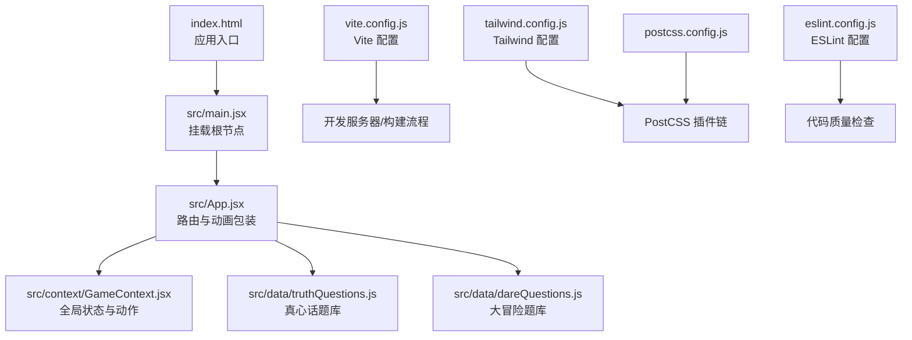
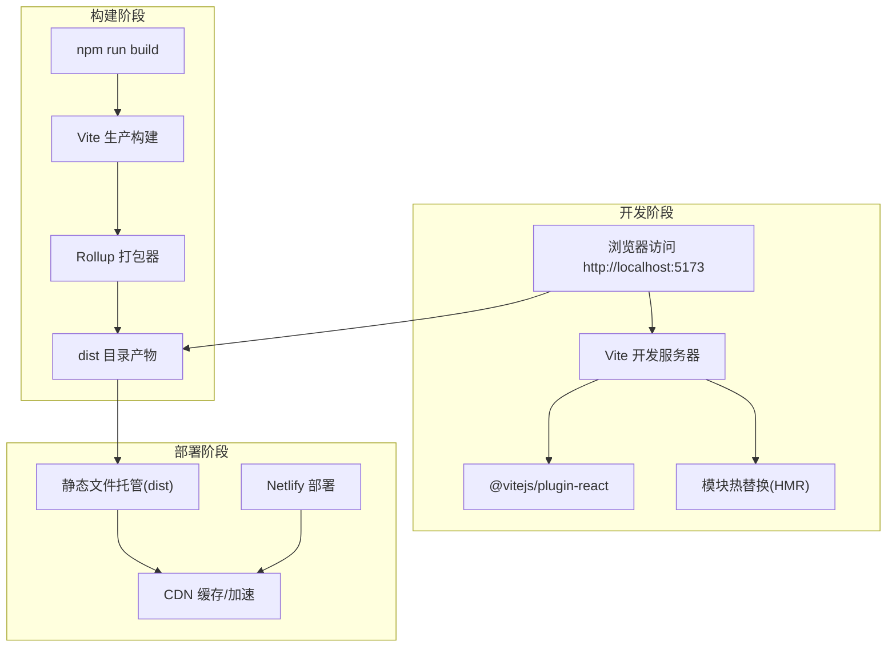
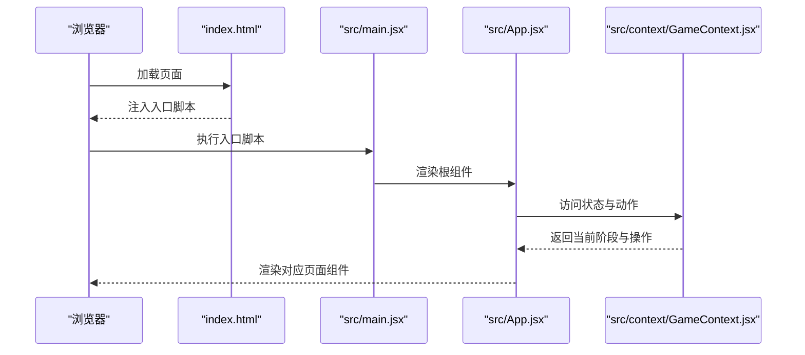
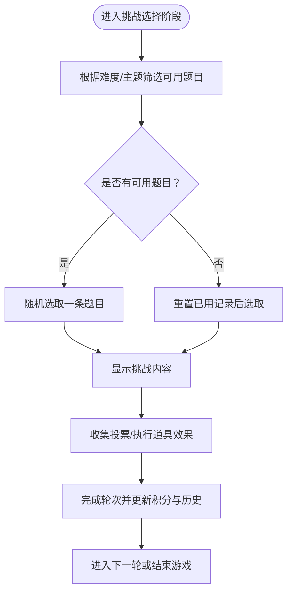
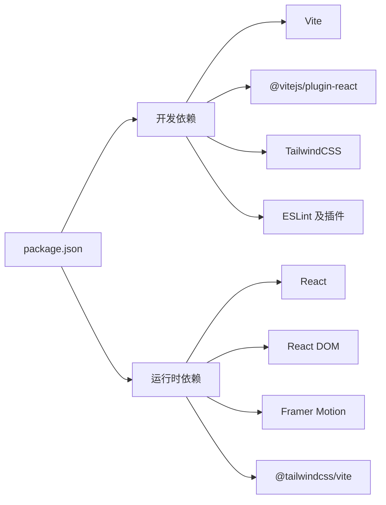

# 构建与部署

<cite>
**本文引用的文件**
- [package.json](file://package.json)
- [vite.config.js](file://vite.config.js)
- [index.html](file://index.html)
- [README.md](file://README.md)
- [tailwind.config.js](file://tailwind.config.js)
- [postcss.config.js](file://postcss.config.js)
- [eslint.config.js](file://eslint.config.js)
- [src/main.jsx](file://src/main.jsx)
- [src/App.jsx](file://src/App.jsx)
- [src/context/GameContext.jsx](file://src/context/GameContext.jsx)
- [src/data/truthQuestions.js](file://src/data/truthQuestions.js)
- [src/data/dareQuestions.js](file://src/data/dareQuestions.js)
</cite>

## 目录
1. [简介](#简介)
2. [项目结构](#项目结构)
3. [核心组件](#核心组件)
4. [架构总览](#架构总览)
5. [详细组件分析](#详细组件分析)
6. [依赖关系分析](#依赖关系分析)
7. [性能考虑](#性能考虑)
8. [故障排查指南](#故障排查指南)
9. [结论](#结论)
10. [附录](#附录)

## 简介
本指南面向 Truth or Dare 项目的构建与部署，覆盖以下目标：
- 基于 Vite 的开发服务器设置、生产构建优化与代码分割策略
- package.json 脚本命令与依赖管理策略
- 三种部署方式：本地开发运行、静态文件打包、Netlify 托管平台部署
- 构建过程中的性能优化技巧（代码压缩、资源优化、缓存策略）
- 部署后的测试与验证方法
- 常见部署问题排查与解决方案

## 项目结构
该项目采用 React + Vite + TailwindCSS 的前端技术栈，核心入口为 HTML 页面与 React 应用根组件，数据层通过上下文与 reducer 实现全局状态管理。

图表来源
- [index.html](file://index.html#L1-L14)
- [src/main.jsx](file://src/main.jsx#L1-L11)
- [src/App.jsx](file://src/App.jsx#L1-L61)
- [src/context/GameContext.jsx](file://src/context/GameContext.jsx#L1-L323)
- [src/data/truthQuestions.js](file://src/data/truthQuestions.js#L1-L156)
- [src/data/dareQuestions.js](file://src/data/dareQuestions.js#L1-L167)
- [vite.config.js](file://vite.config.js#L1-L8)
- [tailwind.config.js](file://tailwind.config.js#L1-L12)
- [postcss.config.js](file://postcss.config.js#L1-L7)
- [eslint.config.js](file://eslint.config.js#L1-L30)

章节来源
- [index.html](file://index.html#L1-L14)
- [src/main.jsx](file://src/main.jsx#L1-L11)
- [src/App.jsx](file://src/App.jsx#L1-L61)
- [vite.config.js](file://vite.config.js#L1-L8)
- [tailwind.config.js](file://tailwind.config.js#L1-L12)
- [postcss.config.js](file://postcss.config.js#L1-L7)
- [eslint.config.js](file://eslint.config.js#L1-L30)

## 核心组件
- 开发服务器与构建工具：Vite 提供快速热更新与生产构建能力，当前配置启用 React 插件。
- 应用入口与渲染：HTML 中仅包含根容器与入口脚本；React 在 main.jsx 中挂载根组件。
- 全局状态：GameContext 使用 useReducer 维护游戏阶段、玩家信息、配置与轮次历史等。
- 数据层：truthQuestions 与 dareQuestions 提供按难度与主题筛选的随机抽取逻辑。
- 样式管线：Tailwind 通过 PostCSS 插件链自动处理，content 覆盖 src 与 index.html。

章节来源
- [vite.config.js](file://vite.config.js#L1-L8)
- [index.html](file://index.html#L1-L14)
- [src/main.jsx](file://src/main.jsx#L1-L11)
- [src/App.jsx](file://src/App.jsx#L1-L61)
- [src/context/GameContext.jsx](file://src/context/GameContext.jsx#L1-L323)
- [src/data/truthQuestions.js](file://src/data/truthQuestions.js#L1-L156)
- [src/data/dareQuestions.js](file://src/data/dareQuestions.js#L1-L167)
- [tailwind.config.js](file://tailwind.config.js#L1-L12)
- [postcss.config.js](file://postcss.config.js#L1-L7)

## 架构总览
下图展示了从浏览器请求到应用渲染的关键路径，以及构建产物的生成与发布流程。

图表来源
- [package.json](file://package.json#L6-L11)
- [vite.config.js](file://vite.config.js#L1-L8)
- [README.md](file://README.md#L1-L20)

## 详细组件分析

### Vite 配置与优化策略
- 插件启用：当前配置仅启用 React 插件，满足 JSX 与 HMR 需求。
- 优化建议（基于现有配置）：
  - 代码分割：利用 Vite 默认的动态导入与路由级拆分，避免单页体积过大。
  - 资源优化：结合构建产物分析，开启压缩与资源内联策略。
  - 缓存策略：通过构建哈希命名与 CDN 缓存头实现长效缓存。
- 当前配置文件路径：[vite.config.js](file://vite.config.js#L1-L8)

章节来源
- [vite.config.js](file://vite.config.js#L1-L8)

### 应用入口与渲染流程
- HTML 入口：仅包含根容器与入口脚本，确保最小化模板。
- React 渲染：main.jsx 创建根节点并渲染 App；App 使用动画库进行页面切换。
- 路由与阶段：App.jsx 内部根据 GameContext 的 phase 渲染不同组件，配合动画库实现平滑过渡。

图表来源
- [index.html](file://index.html#L1-L14)
- [src/main.jsx](file://src/main.jsx#L1-L11)
- [src/App.jsx](file://src/App.jsx#L1-L61)
- [src/context/GameContext.jsx](file://src/context/GameContext.jsx#L1-L323)

章节来源
- [index.html](file://index.html#L1-L14)
- [src/main.jsx](file://src/main.jsx#L1-L11)
- [src/App.jsx](file://src/App.jsx#L1-L61)
- [src/context/GameContext.jsx](file://src/context/GameContext.jsx#L1-L323)

### 全局状态与数据层
- 状态模型：GameContext 定义了游戏阶段枚举、玩家状态、配置、轮次历史与道具系统。
- 动作与派发：通过 useReducer 的 action 类型驱动状态变更，支持开始游戏、设置挑战、提交投票、完成轮次等。
- 数据库：truthQuestions 与 dareQuestions 提供按难度与主题筛选的随机抽取函数，支持“已用题目”去重与回退策略。

图表来源
- [src/context/GameContext.jsx](file://src/context/GameContext.jsx#L1-L323)
- [src/data/truthQuestions.js](file://src/data/truthQuestions.js#L125-L156)
- [src/data/dareQuestions.js](file://src/data/dareQuestions.js#L129-L167)

章节来源
- [src/context/GameContext.jsx](file://src/context/GameContext.jsx#L1-L323)
- [src/data/truthQuestions.js](file://src/data/truthQuestions.js#L1-L156)
- [src/data/dareQuestions.js](file://src/data/dareQuestions.js#L1-L167)

### 样式与构建管线
- Tailwind 配置：content 覆盖 index.html 与 src 下所有 React 文件，确保按需生成样式。
- PostCSS 插件链：启用 tailwindcss 与 autoprefixer，保证现代 CSS 语法与浏览器兼容。
- 构建产物：Vite 将样式与脚本打包至 dist 目录，供静态托管或平台部署使用。

章节来源
- [tailwind.config.js](file://tailwind.config.js#L1-L12)
- [postcss.config.js](file://postcss.config.js#L1-L7)

## 依赖关系分析
- 运行时依赖：React、React DOM、Framer Motion（动画）、Tailwind Vite 插件。
- 开发依赖：Vite、@vitejs/plugin-react、TailwindCSS、Autoprefixer、ESLint 及相关插件。
- 脚本命令：dev、build、lint、preview，分别用于开发、构建、代码检查与本地预览。

图表来源
- [package.json](file://package.json#L1-L33)

章节来源
- [package.json](file://package.json#L1-L33)

## 性能考虑
- 代码压缩与资源优化
  - 生产构建默认启用压缩，建议在 Vite 配置中明确启用压缩与资源内联策略，减少首屏阻塞。
  - 对图片与字体进行压缩与格式优化，优先使用现代格式（如 WebP、AVIF）并在降级场景提供回退。
- 代码分割
  - 将大型页面或组件按路由拆分，利用动态导入降低初始包体。
  - 对第三方库进行外部化（externals），结合 CDN 缓存提升复用效率。
- 缓存策略
  - 构建产物采用内容哈希命名，结合 CDN 长效缓存与浏览器缓存头，提升二次加载速度。
  - 静态资源与 HTML 设置合适的 Cache-Control 与 ETag，避免不必要的重复下载。
- 图片与媒体
  - 使用响应式图片与懒加载，减少首屏渲染压力。
  - 对动画与过渡使用 GPU 加速属性，避免主线程阻塞。

[本节为通用性能指导，不直接分析具体文件]

## 故障排查指南
- 构建失败
  - 检查 Node.js 与 npm 版本是否满足依赖要求；清理 node_modules 并重新安装依赖。
  - 查看 Vite 配置文件语法与插件版本兼容性；确保 React 插件正确启用。
- 资源加载错误
  - 确认 public 目录下的静态资源路径正确；在 HTML 中使用绝对路径或 Vite 提供的别名。
  - 检查构建输出目录与部署路径一致；静态托管平台需正确指向 dist 目录。
- 开发服务器无法启动
  - 端口占用时更换端口或关闭占用进程；确保防火墙未拦截本地端口。
  - 清理浏览器缓存或使用隐身模式访问，排除缓存导致的脚本加载异常。
- Netlify 部署问题
  - 确保构建命令与输出目录正确配置；在 Netlify 控制台检查构建日志与环境变量。
  - 若出现路由问题，检查 SPA 路由回退配置（通常需要在 Netlify 中设置 404 页面回退到 index.html）。

章节来源
- [README.md](file://README.md#L1-L20)
- [vite.config.js](file://vite.config.js#L1-L8)

## 结论
本指南基于现有配置与项目结构，提供了 Truth or Dare 项目的构建与部署实践路径。通过合理配置 Vite、Tailwind 与 PostCSS，结合静态文件托管与 Netlify 平台，可实现快速迭代与稳定上线。建议在后续迭代中逐步引入更细粒度的代码分割、资源优化与缓存策略，持续提升用户体验与性能表现。

[本节为总结性内容，不直接分析具体文件]

## 附录

### 三种部署方式详解
- 本地开发运行
  - 步骤：安装依赖后运行开发命令，访问本地地址即可。
  - 参考路径：[README.md](file://README.md#L2-L7)
- 打包为静态文件
  - 步骤：执行构建命令生成 dist 目录，将其部署至任意静态托管平台。
  - 参考路径：[README.md](file://README.md#L9-L13)
- Netlify 托管平台部署
  - 步骤：先执行构建，再将 dist 目录上传至 Netlify 即可获得部署链接。
  - 参考路径：[README.md](file://README.md#L15-L20)

章节来源
- [README.md](file://README.md#L1-L20)

### package.json 脚本与依赖管理
- 脚本命令
  - dev：启动 Vite 开发服务器
  - build：执行生产构建
  - lint：运行 ESLint 检查
  - preview：本地预览构建产物
- 依赖管理策略
  - 运行时依赖：React 生态与动画库，确保最小化核心依赖。
  - 开发依赖：Vite、React 插件、TailwindCSS、PostCSS、ESLint，保障开发体验与代码质量。
- 参考路径
  - [package.json](file://package.json#L6-L11)
  - [package.json](file://package.json#L12-L31)

章节来源
- [package.json](file://package.json#L1-L33)