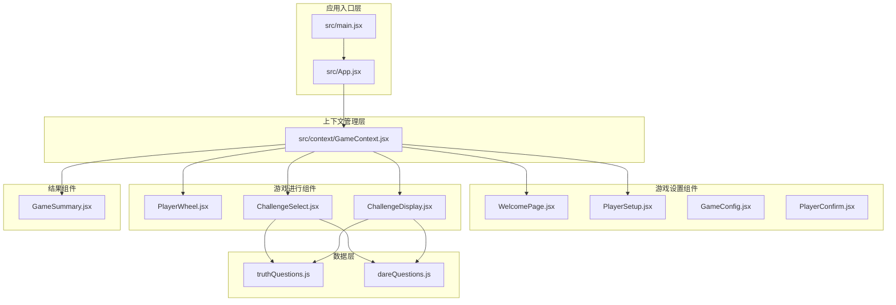
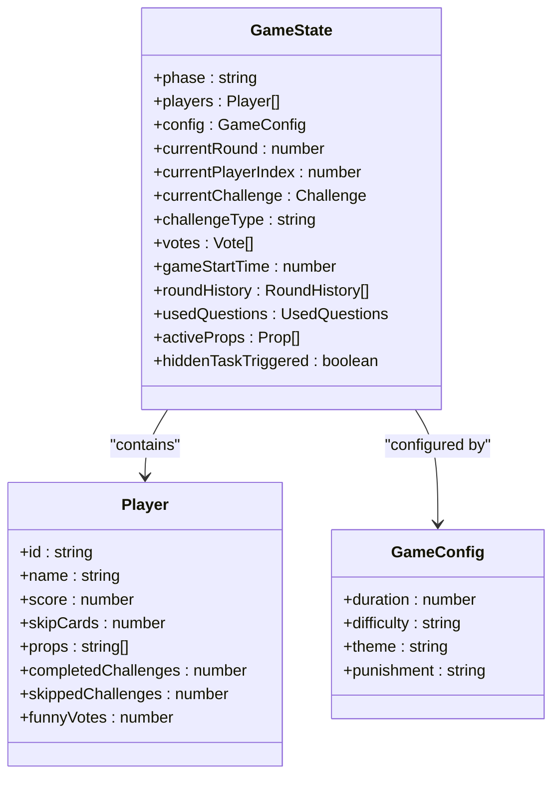
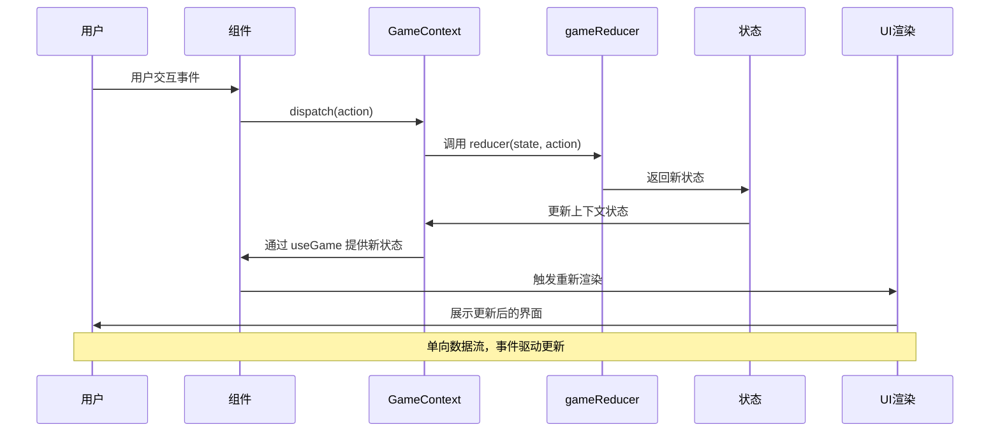
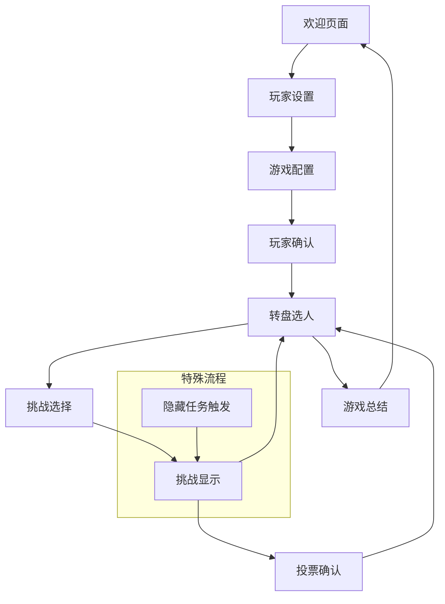
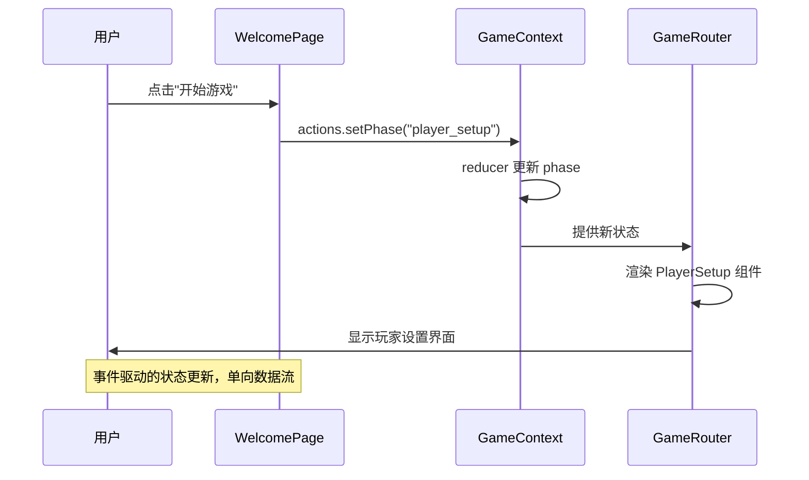
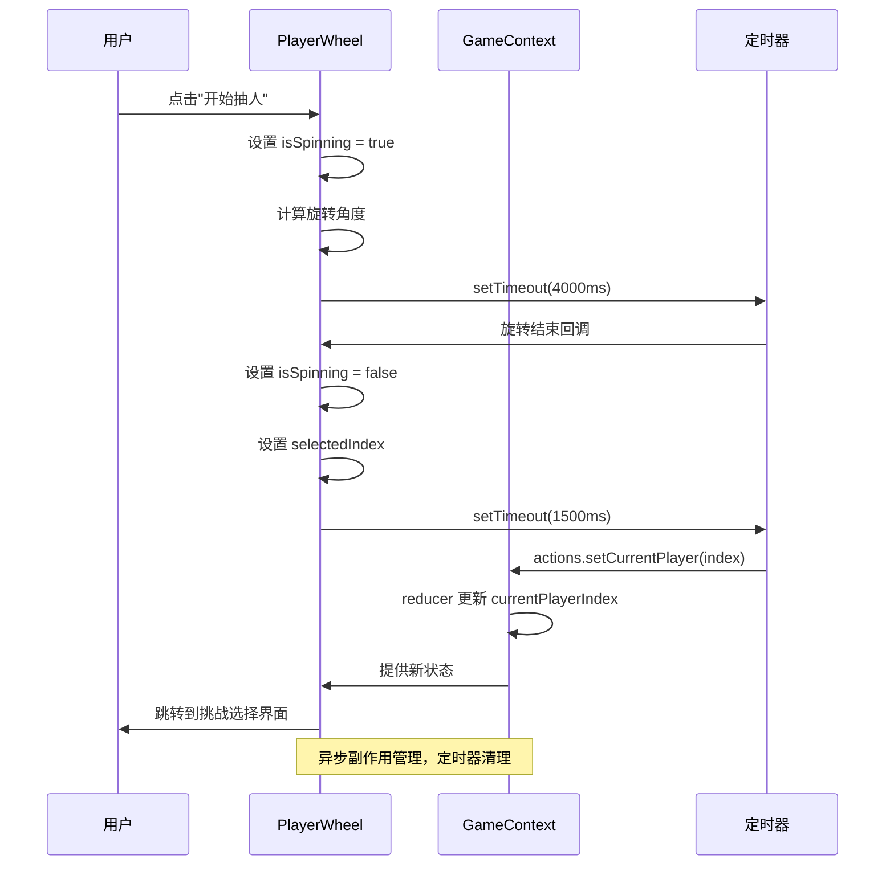
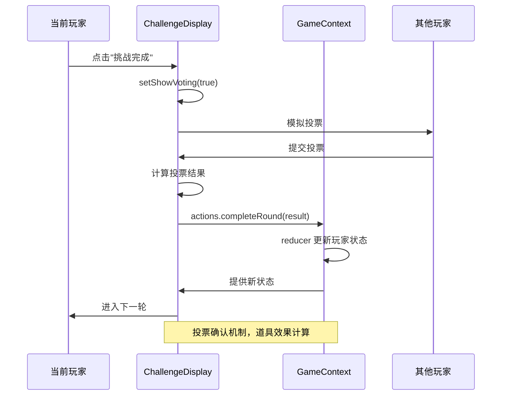
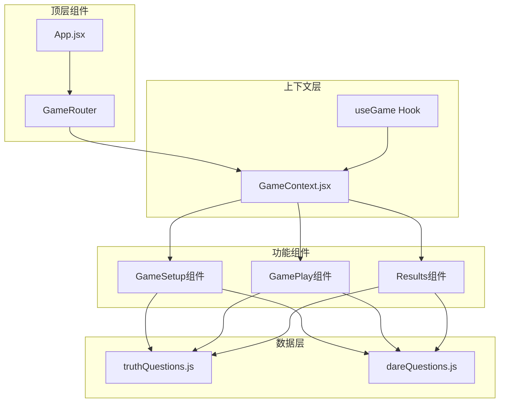
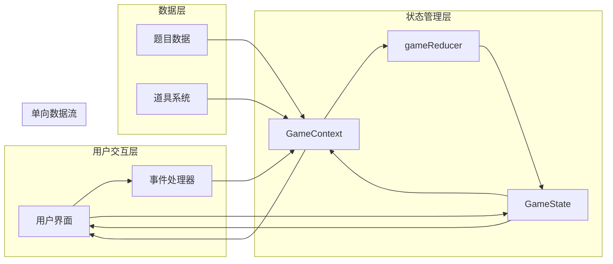

# 数据流架构

<cite>
**本文档引用的文件**
- [src/App.jsx](file://src/App.jsx)
- [src/context/GameContext.jsx](file://src/context/GameContext.jsx)
- [src/main.jsx](file://src/main.jsx)
- [src/components/GameSetup/WelcomePage.jsx](file://src/components/GameSetup/WelcomePage.jsx)
- [src/components/GameSetup/PlayerSetup.jsx](file://src/components/GameSetup/PlayerSetup.jsx)
- [src/components/GamePlay/PlayerWheel.jsx](file://src/components/GamePlay/PlayerWheel.jsx)
- [src/components/GamePlay/ChallengeSelect.jsx](file://src/components/GamePlay/ChallengeSelect.jsx)
- [src/components/GamePlay/ChallengeDisplay.jsx](file://src/components/GamePlay/ChallengeDisplay.jsx)
- [src/components/Results/GameSummary.jsx](file://src/components/Results/GameSummary.jsx)
- [src/data/truthQuestions.js](file://src/data/truthQuestions.js)
- [src/data/dareQuestions.js](file://src/data/dareQuestions.js)
</cite>

## 目录
1. [引言](#引言)
2. [项目结构](#项目结构)
3. [核心组件](#核心组件)
4. [架构概览](#架构概览)
5. [详细组件分析](#详细组件分析)
6. [依赖关系分析](#依赖关系分析)
7. [性能考虑](#性能考虑)
8. [故障排除指南](#故障排除指南)
9. [结论](#结论)

## 引言

Truth or Dare 项目是一个基于 React 的派对游戏应用，采用事件驱动的数据流架构。该系统通过 GameContext 实现集中状态管理，确保数据流向的单向性和可预测性。本文档深入分析从用户交互到状态更新再到组件重新渲染的完整数据流过程，解释事件驱动的数据更新机制，阐述数据流向的单向性设计，以及异步数据处理和副作用管理的实现方式。

## 项目结构

该项目采用功能模块化的组织方式，主要分为以下几个层次：



**图表来源**
- [src/main.jsx](file://src/main.jsx#L1-L11)
- [src/App.jsx](file://src/App.jsx#L1-L58)
- [src/context/GameContext.jsx](file://src/context/GameContext.jsx#L1-L322)

**章节来源**
- [src/main.jsx](file://src/main.jsx#L1-L11)
- [src/App.jsx](file://src/App.jsx#L1-L58)

## 核心组件

### GameContext - 数据流中枢

GameContext 是整个应用的核心，实现了集中式状态管理和事件驱动的数据更新机制。它包含以下关键特性：

#### 状态结构设计
- **阶段管理**：通过 GAME_PHASES 枚举控制游戏生命周期
- **玩家状态**：管理玩家列表、分数、道具等个人信息
- **游戏配置**：控制游戏时长、难度、主题等全局设置
- **挑战系统**：跟踪当前挑战、投票状态、轮次历史

#### 动作类型系统
系统定义了完整的 ACTION_TYPES，涵盖从基础 CRUD 操作到复杂游戏逻辑的所有场景：



**图表来源**
- [src/context/GameContext.jsx](file://src/context/GameContext.jsx#L25-L44)

#### 单向数据流实现
GameContext 严格遵循单向数据流原则：
1. 用户交互触发 action
2. action 通过 reducer 更新状态
3. 状态变化触发组件重新渲染
4. 新状态通过 props 传递给子组件

**章节来源**
- [src/context/GameContext.jsx](file://src/context/GameContext.jsx#L1-L322)

## 架构概览

### 整体数据流架构



**图表来源**
- [src/context/GameContext.jsx](file://src/context/GameContext.jsx#L256-L321)
- [src/App.jsx](file://src/App.jsx#L13-L45)

### 游戏阶段转换流程



**图表来源**
- [src/context/GameContext.jsx](file://src/context/GameContext.jsx#L4-L14)
- [src/App.jsx](file://src/App.jsx#L17-L37)

## 详细组件分析

### 用户交互到状态更新的完整流程

#### 欢迎页面到玩家设置



**图表来源**
- [src/components/GameSetup/WelcomePage.jsx](file://src/components/GameSetup/WelcomePage.jsx#L52-L61)
- [src/context/GameContext.jsx](file://src/context/GameContext.jsx#L260-L261)

#### 玩家设置中的数据验证

PlayerSetup 组件展示了完整的数据验证和错误处理机制：

```mermaid
flowchart TD
UserInput[用户输入] --> ValidateName{验证名称}
ValidateName --> |为空| ShowError1[显示错误: 请输入玩家名称]
ValidateName --> |重复| ShowError2[显示错误: 玩家名称已存在]
ValidateName --> |超过上限| ShowError3[显示错误: 最多只能添加10名玩家]
ValidateName --> |有效| AddPlayer[actions.addPlayer(name)]
AddPlayer --> UpdateState[更新状态]
UpdateState --> ClearInput[清空输入框]
UpdateState --> HideError[隐藏错误信息]
ShowError1 --> WaitInput[等待用户修正]
ShowError2 --> WaitInput
ShowError3 --> WaitInput
WaitInput --> UserInput
```

**图表来源**
- [src/components/GameSetup/PlayerSetup.jsx](file://src/components/GameSetup/PlayerSetup.jsx#L10-L27)

#### 转盘选人中的异步处理

PlayerWheel 组件展示了复杂的异步数据处理和副作用管理：



**图表来源**
- [src/components/GamePlay/PlayerWheel.jsx](file://src/components/GamePlay/PlayerWheel.jsx#L31-L62)

#### 挑战选择中的随机性和概率控制

ChallengeSelect 组件展示了随机选择和隐藏任务触发的算法实现：

```mermaid
flowchart TD
Start[开始挑战选择] --> Countdown[倒计时10秒]
Countdown --> AutoSelect{倒计时结束?}
AutoSelect --> |是| RandomSelect[随机选择类型]
AutoSelect --> |否| UserSelect[用户手动选择]
RandomSelect --> CheckHidden{触发隐藏任务?}
UserSelect --> CheckHidden
CheckHidden --> |是| TriggerHidden[actions.triggerHiddenTask]
CheckHidden --> |否| GetQuestion[获取题目]
TriggerHidden --> GetHiddenTask[getHiddenTask()]
GetHiddenTask --> SetChallenge[actions.setChallenge]
CheckHidden --> |否| GetQuestion
GetQuestion --> SetChallenge
SetChallenge --> NextPhase[进入挑战显示阶段]
subgraph "隐藏任务概率"
HiddenTask[5%概率触发]
end
```

**图表来源**
- [src/components/GamePlay/ChallengeSelect.jsx](file://src/components/GamePlay/ChallengeSelect.jsx#L14-L71)

#### 挑战显示中的投票和道具系统

ChallengeDisplay 组件展示了复杂的投票机制和道具使用的完整流程：



**图表来源**
- [src/components/GamePlay/ChallengeDisplay.jsx](file://src/components/GamePlay/ChallengeDisplay.jsx#L62-L99)

**章节来源**
- [src/components/GameSetup/WelcomePage.jsx](file://src/components/GameSetup/WelcomePage.jsx#L1-L88)
- [src/components/GameSetup/PlayerSetup.jsx](file://src/components/GameSetup/PlayerSetup.jsx#L1-L197)
- [src/components/GamePlay/PlayerWheel.jsx](file://src/components/GamePlay/PlayerWheel.jsx#L1-L300)
- [src/components/GamePlay/ChallengeSelect.jsx](file://src/components/GamePlay/ChallengeSelect.jsx#L1-L201)
- [src/components/GamePlay/ChallengeDisplay.jsx](file://src/components/GamePlay/ChallengeDisplay.jsx#L1-L356)

### 数据验证和错误处理机制

系统在多个层面实现了数据验证和错误处理：

#### 组件级验证
- **输入验证**：检查用户输入的有效性
- **业务规则验证**：确保符合游戏规则
- **状态验证**：防止非法状态转换

#### 上下文级验证
- **状态一致性检查**：确保状态结构的完整性
- **边界条件处理**：处理数组越界等异常情况
- **异步操作安全**：防止竞态条件

#### 错误处理策略
- **即时反馈**：通过 UI 提供实时错误提示
- **优雅降级**：在错误情况下提供替代方案
- **状态恢复**：允许用户纠正错误并继续游戏

**章节来源**
- [src/components/GameSetup/PlayerSetup.jsx](file://src/components/GameSetup/PlayerSetup.jsx#L10-L27)
- [src/components/GamePlay/ChallengeDisplay.jsx](file://src/components/GamePlay/ChallengeDisplay.jsx#L43-L48)

## 依赖关系分析

### 组件间依赖关系



**图表来源**
- [src/App.jsx](file://src/App.jsx#L1-L11)
- [src/context/GameContext.jsx](file://src/context/GameContext.jsx#L1-L322)

### 数据流向图



**图表来源**
- [src/context/GameContext.jsx](file://src/context/GameContext.jsx#L68-L250)

**章节来源**
- [src/context/GameContext.jsx](file://src/context/GameContext.jsx#L1-L322)

## 性能考虑

### 状态更新优化

1. **不可变状态更新**：使用展开运算符确保状态的不可变性
2. **选择性重新渲染**：通过精确的状态订阅减少不必要的渲染
3. **批量更新**：合并相关的状态更新操作

### 异步操作管理

1. **定时器清理**：及时清理定时器防止内存泄漏
2. **副作用隔离**：将副作用封装在组件内部
3. **异步状态同步**：确保异步操作完成后的状态一致性

### 数据访问优化

1. **计算属性缓存**：避免重复计算复杂数据结构
2. **数据预处理**：在 reducer 中进行必要的数据转换
3. **懒加载策略**：按需加载大量数据资源

## 故障排除指南

### 常见问题诊断

#### 状态不同步问题
- **症状**：UI 显示与实际状态不符
- **排查**：检查 action 类型是否正确，reducer 是否返回新状态
- **解决方案**：确保所有分支都返回新的状态对象

#### 异步操作竞态条件
- **症状**：异步操作结果混乱
- **排查**：检查定时器清理逻辑，确保操作顺序
- **解决方案**：使用标志位控制异步操作的执行顺序

#### 内存泄漏问题
- **症状**：组件卸载后仍有定时器运行
- **排查**：检查 useEffect 的清理函数
- **解决方案**：在清理函数中清除所有定时器和订阅

### 调试技巧

1. **状态追踪**：使用浏览器开发者工具监控状态变化
2. **日志记录**：在关键节点添加调试日志
3. **单元测试**：为关键逻辑编写测试用例

**章节来源**
- [src/components/GamePlay/PlayerWheel.jsx](file://src/components/GamePlay/PlayerWheel.jsx#L65-L74)

## 结论

Truth or Dare 项目展现了优秀的数据流架构设计，通过以下关键特性实现了高可预测性和可维护性：

### 架构优势

1. **单向数据流**：严格的单向数据流确保了状态的可预测性
2. **集中式状态管理**：GameContext 提供统一的状态访问点
3. **事件驱动更新**：清晰的事件-动作映射简化了状态变更逻辑
4. **模块化设计**：功能组件独立，便于测试和维护

### 设计原则

1. **单一职责**：每个组件专注于特定的功能领域
2. **状态提升**：将共享状态提升到最近的共同祖先
3. **局部状态管理**：仅在必要时使用组件内部状态
4. **数据验证**：在数据进入系统前进行验证

### 可扩展性

该架构为未来的功能扩展提供了良好的基础：
- 新的游戏阶段可以轻松添加到 GAME_PHASES 枚举中
- 新的挑战类型可以通过扩展数据源实现
- 新的道具系统可以在现有框架内集成
- 性能优化可以在不影响整体架构的情况下进行

通过这种精心设计的数据流架构，Truth or Dare 项目不仅实现了复杂的游戏逻辑，还保持了代码的清晰性和可维护性，为类似的应用程序提供了优秀的参考模型。