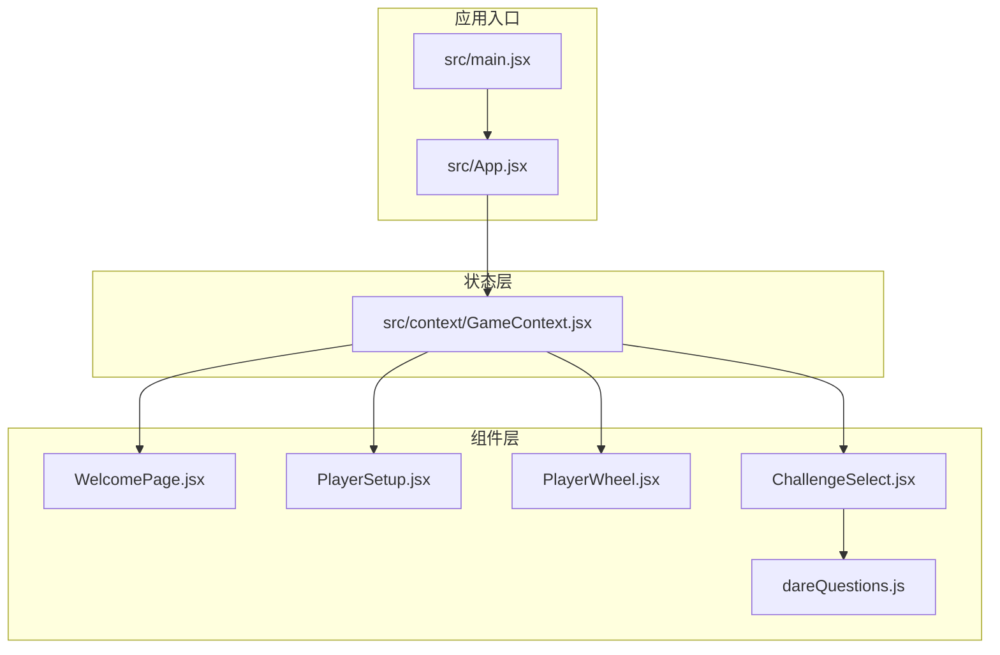
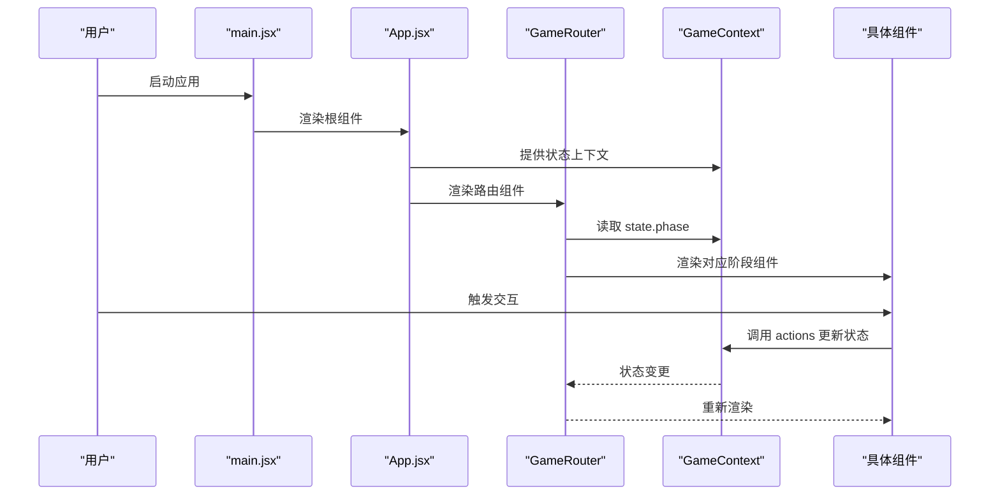
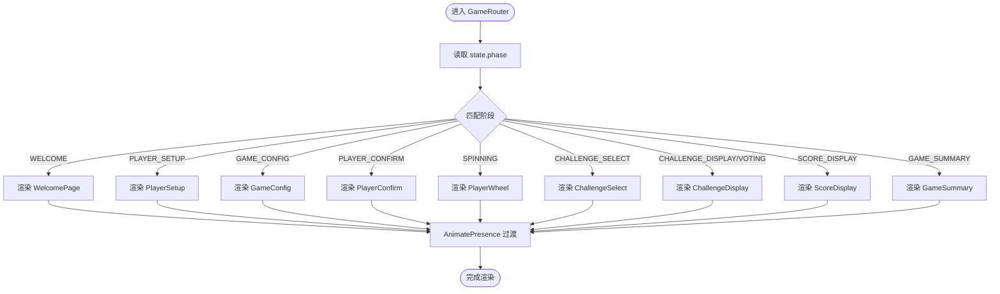
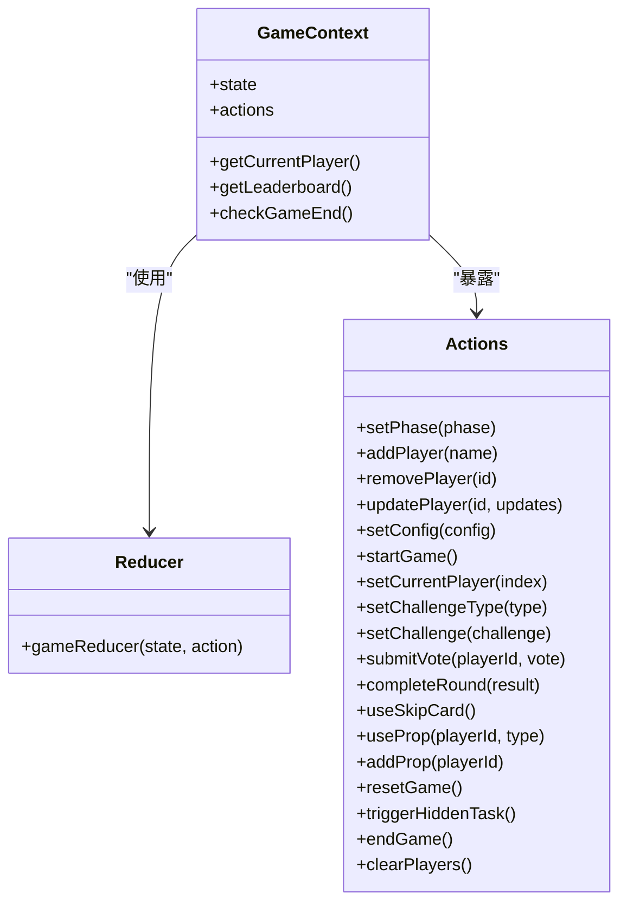
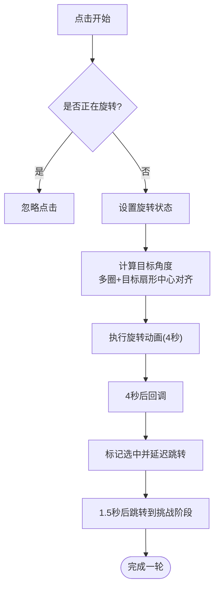
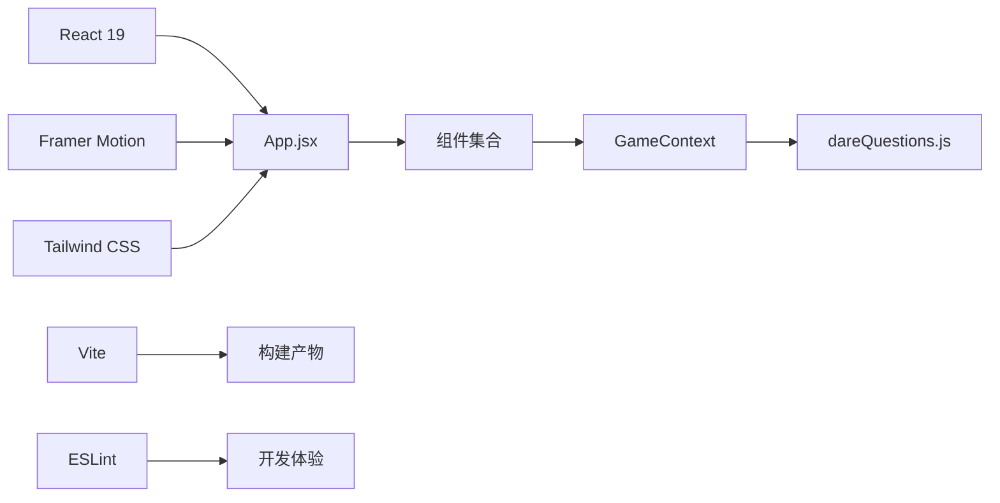

# 整体架构

<cite>
**本文档引用的文件**
- [package.json](file://package.json)
- [vite.config.js](file://vite.config.js)
- [src/App.jsx](file://src/App.jsx)
- [src/main.jsx](file://src/main.jsx)
- [src/context/GameContext.jsx](file://src/context/GameContext.jsx)
- [src/index.css](file://src/index.css)
- [tailwind.config.js](file://tailwind.config.js)
- [src/components/GameSetup/WelcomePage.jsx](file://src/components/GameSetup/WelcomePage.jsx)
- [src/components/GamePlay/PlayerWheel.jsx](file://src/components/GamePlay/PlayerWheel.jsx)
- [src/components/GameSetup/PlayerSetup.jsx](file://src/components/GameSetup/PlayerSetup.jsx)
- [src/components/GamePlay/ChallengeSelect.jsx](file://src/components/GamePlay/ChallengeSelect.jsx)
- [src/data/dareQuestions.js](file://src/data/dareQuestions.js)
- [README.md](file://README.md)
</cite>

## 目录
1. [简介](#简介)
2. [项目结构](#项目结构)
3. [核心组件](#核心组件)
4. [架构总览](#架构总览)
5. [详细组件分析](#详细组件分析)
6. [依赖关系分析](#依赖关系分析)
7. [性能考虑](#性能考虑)
8. [故障排除指南](#故障排除指南)
9. [结论](#结论)

## 简介
Truth or Dare 是一款基于 React 19 的单页应用（SPA），采用组件化设计与模块化组织方式，结合 Framer Motion 实现流畅动画体验，并通过 Tailwind CSS 进行现代化样式管理。项目使用 Vite 作为构建工具，提供快速开发与高效的生产构建优化。系统围绕游戏生命周期的多个阶段进行路由管理，通过上下文状态驱动各组件协作，形成清晰的状态流与交互链路。

## 项目结构
项目采用按功能域划分的目录结构，便于扩展与维护：
- src/components：按功能域拆分的组件集合
  - GameSetup：游戏初始化相关组件（欢迎页、玩家设置、配置等）
  - GamePlay：游戏进行期组件（转盘、挑战选择、挑战展示等）
  - Results：结果展示组件（积分与总结）
- src/context：全局状态管理（GameContext）
- src/data：游戏数据与题库
- src/index.css：样式入口与自定义样式
- vite.config.js：Vite 构建配置
- tailwind.config.js：Tailwind CSS 配置

图表来源
- [src/main.jsx](file://src/main.jsx#L1-L11)
- [src/App.jsx](file://src/App.jsx#L1-L61)
- [src/context/GameContext.jsx](file://src/context/GameContext.jsx#L1-L323)
- [src/components/GameSetup/WelcomePage.jsx](file://src/components/GameSetup/WelcomePage.jsx#L1-L88)
- [src/components/GameSetup/PlayerSetup.jsx](file://src/components/GameSetup/PlayerSetup.jsx#L1-L197)
- [src/components/GamePlay/PlayerWheel.jsx](file://src/components/GamePlay/PlayerWheel.jsx#L1-L300)
- [src/components/GamePlay/ChallengeSelect.jsx](file://src/components/GamePlay/ChallengeSelect.jsx#L1-L200)
- [src/data/dareQuestions.js](file://src/data/dareQuestions.js#L1-L167)

章节来源
- [src/main.jsx](file://src/main.jsx#L1-L11)
- [src/App.jsx](file://src/App.jsx#L1-L61)
- [vite.config.js](file://vite.config.js#L1-L8)

## 核心组件
- App.jsx：应用根组件，负责包裹全局状态提供者并渲染 GameRouter，后者根据游戏阶段动态切换视图。
- GameContext：集中式状态管理，包含游戏阶段枚举、玩家数据、配置、挑战与投票等状态，以及对应的 reducer 与 actions。
- GameRouter：基于 useGame 返回的状态，使用 Framer Motion 的 AnimatePresence 实现阶段间的平滑过渡与等待模式。
- 各功能组件：WelcomePage、PlayerSetup、PlayerWheel、ChallengeSelect 等，分别承担不同游戏阶段的 UI 与交互逻辑。

章节来源
- [src/App.jsx](file://src/App.jsx#L1-L61)
- [src/context/GameContext.jsx](file://src/context/GameContext.jsx#L1-L323)

## 架构总览
应用采用“根组件 + 上下文 + 路由组件”的三层架构：
- 入口层：main.jsx 创建根节点并挂载 App。
- 根组件层：App.jsx 包裹 GameProvider 并渲染 GameRouter。
- 路由层：GameRouter 根据 state.phase 决定渲染哪个阶段组件，并通过 AnimatePresence 控制动画过渡。
- 状态层：GameContext 使用 useReducer 管理复杂状态，提供统一的 actions 与查询方法（如 getCurrentPlayer、getLeaderboard、checkGameEnd）。

图表来源
- [src/main.jsx](file://src/main.jsx#L1-L11)
- [src/App.jsx](file://src/App.jsx#L1-L61)
- [src/context/GameContext.jsx](file://src/context/GameContext.jsx#L1-L323)

## 详细组件分析

### App.jsx 与 GameRouter
- 设计思路：App.jsx 仅负责提供全局状态与根布局，实际的阶段路由逻辑集中在 GameRouter 中，实现关注点分离与更好的可测试性。
- 动画过渡：GameRouter 使用 Framer Motion 的 AnimatePresence，并启用 wait 模式，确保同一时刻只渲染一个阶段组件，避免动画冲突。
- 阶段映射：通过 switch(state.phase) 将每个阶段映射到对应组件，保证路由逻辑清晰且易于扩展。

图表来源
- [src/App.jsx](file://src/App.jsx#L14-L48)

章节来源
- [src/App.jsx](file://src/App.jsx#L1-L61)

### GameContext：状态管理与业务逻辑
- 状态模型：包含 phase、players、config、currentRound、currentPlayerIndex、currentChallenge、votes、gameStartTime、roundHistory、usedQuestions、activeProps、hiddenTaskTriggered 等字段，覆盖游戏全生命周期。
- 动作类型：通过 ACTION_TYPES 统一管理所有状态更新操作，便于追踪与调试。
- Reducer：集中处理状态变更，包含玩家增删改、配置更新、回合推进、道具使用、隐藏任务触发、游戏重置等逻辑。
- 查询与检查：提供 getCurrentPlayer、getLeaderboard、checkGameEnd 等辅助函数，简化组件侧逻辑。

图表来源
- [src/context/GameContext.jsx](file://src/context/GameContext.jsx#L1-L323)

章节来源
- [src/context/GameContext.jsx](file://src/context/GameContext.jsx#L1-L323)

### PlayerWheel：转盘组件与动画
- 功能职责：实现随机选人动画，计算旋转角度与缓动曲线，控制选中后的跳转时机。
- 动画实现：使用 Framer Motion 的 motion 与 SVG 动画，配合定时器清理，确保状态与 DOM 生命周期一致。
- 游戏进度：根据游戏开始时间和配置时长计算进度条，支持提前结束。

图表来源
- [src/components/GamePlay/PlayerWheel.jsx](file://src/components/GamePlay/PlayerWheel.jsx#L30-L74)

章节来源
- [src/components/GamePlay/PlayerWheel.jsx](file://src/components/GamePlay/PlayerWheel.jsx#L1-L300)

### ChallengeSelect：挑战选择与隐藏任务
- 功能职责：提供倒计时自动选择与手动选择，随机生成挑战内容，支持隐藏任务触发。
- 数据来源：从 dareQuestions 与 truthQuestions 中按难度与主题过滤并随机抽取。
- 用户反馈：通过视觉反馈与动画强调当前选择，同时展示玩家道具与积分信息。

章节来源
- [src/components/GamePlay/ChallengeSelect.jsx](file://src/components/GamePlay/ChallengeSelect.jsx#L1-L200)
- [src/data/dareQuestions.js](file://src/data/dareQuestions.js#L129-L167)

### PlayerSetup：玩家管理
- 功能职责：添加/移除玩家，校验名称唯一性与数量限制，支持快速添加与返回上一阶段。
- 动画与交互：使用 AnimatePresence 与 Framer Motion 提供流畅的列表增删与按钮交互反馈。

章节来源
- [src/components/GameSetup/PlayerSetup.jsx](file://src/components/GameSetup/PlayerSetup.jsx#L1-L197)

### WelcomePage：欢迎页
- 功能职责：展示游戏介绍、特色功能与开始按钮，引导进入玩家设置阶段。
- 动画与样式：使用 Framer Motion 的初始与过渡动画，结合 Tailwind CSS 卡片样式与渐变背景。

章节来源
- [src/components/GameSetup/WelcomePage.jsx](file://src/components/GameSetup/WelcomePage.jsx#L1-L88)

## 依赖关系分析
- React 19：提供最新的并发特性与改进的渲染模型，提升用户体验与性能。
- Framer Motion：用于组件级动画与过渡，增强交互表现力。
- Tailwind CSS：原子化样式框架，提供一致的样式体系与响应式能力。
- Vite：快速开发服务器与高效生产构建，支持热更新与模块联邦等现代特性。
- ESLint：代码质量保障，配合 React Hooks 与 React Refresh 插件提升开发效率。

图表来源
- [package.json](file://package.json#L12-L31)
- [vite.config.js](file://vite.config.js#L1-L8)
- [src/App.jsx](file://src/App.jsx#L1-L61)
- [src/context/GameContext.jsx](file://src/context/GameContext.jsx#L1-L323)
- [src/data/dareQuestions.js](file://src/data/dareQuestions.js#L1-L167)

章节来源
- [package.json](file://package.json#L1-L33)
- [vite.config.js](file://vite.config.js#L1-L8)

## 性能考虑
- 组件懒加载与按需渲染：GameRouter 仅渲染当前阶段组件，减少不必要的重渲染。
- 动画优化：使用 Framer Motion 的内置优化与缓存策略，避免重复计算与抖动。
- 样式优化：Tailwind CSS 通过内容扫描与 Purge 配置（在生产构建中生效）减少 CSS 体积。
- 构建优化：Vite 使用 Rollup 进行生产打包，支持 Tree Shaking 与代码分割，缩短首屏加载时间。
- 状态粒度：GameContext 将复杂状态集中管理，避免组件间重复计算与状态同步问题。

## 故障排除指南
- 开发服务器无法启动
  - 检查端口占用与网络权限，确认 package.json 中的 dev 脚本正确。
  - 参考：[README.md](file://README.md#L1-L20)
- 页面空白或组件未渲染
  - 确认 main.jsx 正确挂载 App，App.jsx 中 GameProvider 包裹完整。
  - 检查 GameRouter 是否正确读取 state.phase 并返回默认值。
- 动画异常
  - 确保 Framer Motion 的 motion 组件与 AnimatePresence 正确使用，避免在同一层级重复包裹。
- 样式未生效
  - 确认 Tailwind CSS 已正确引入，content 路径包含 src 目录。
  - 检查自定义动画与类名拼写，确保未被 Purge 移除。

章节来源
- [README.md](file://README.md#L1-L20)
- [src/main.jsx](file://src/main.jsx#L1-L11)
- [src/App.jsx](file://src/App.jsx#L1-L61)
- [tailwind.config.js](file://tailwind.config.js#L1-L12)

## 结论
Truth or Dare 项目通过 React 19 的现代化特性、Framer Motion 的动画支持与 Tailwind CSS 的样式体系，构建了一个结构清晰、交互流畅的单页应用。GameContext 将复杂的游戏状态集中管理，GameRouter 实现了阶段化的路由与动画过渡，组件按功能域模块化组织，具备良好的可扩展性与可维护性。结合 Vite 的开发与构建优势，项目在开发体验与生产性能之间取得了平衡，适合进一步扩展更多游戏阶段与功能模块。