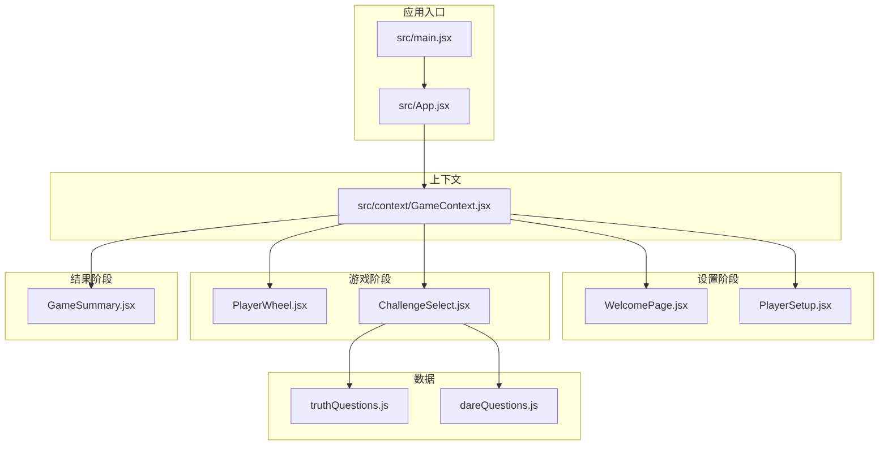
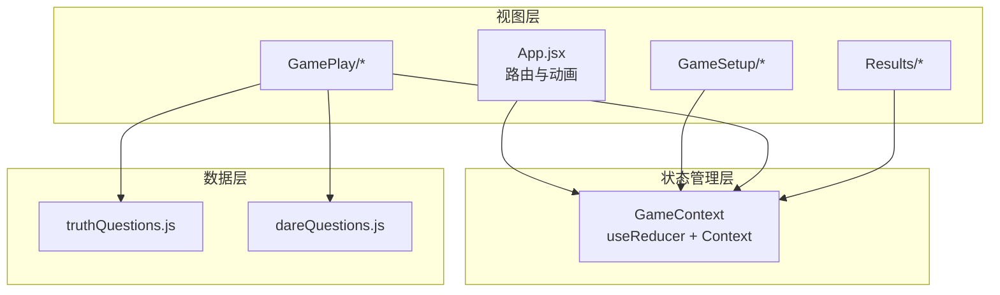
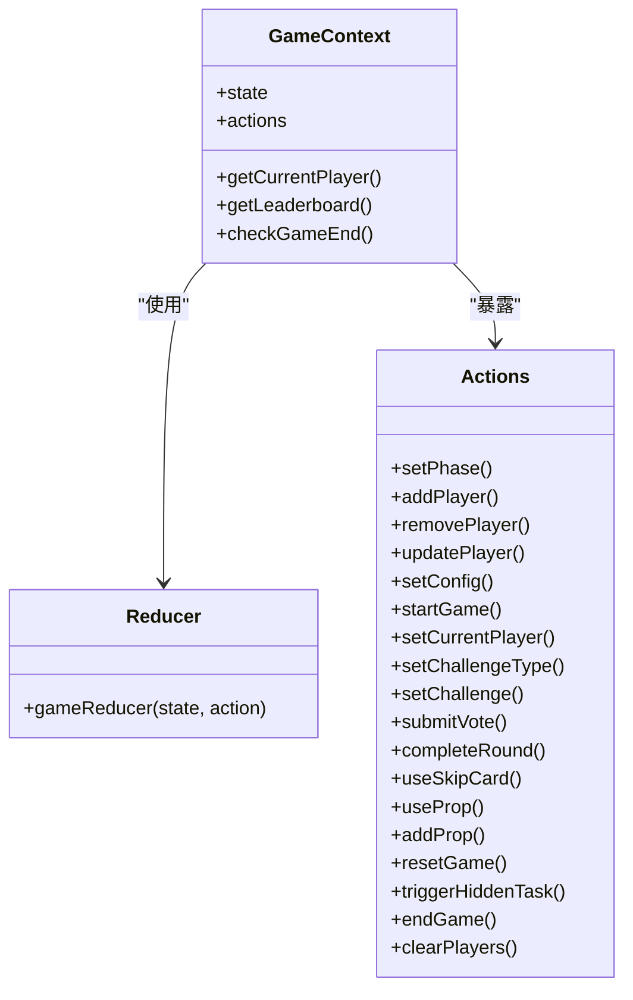
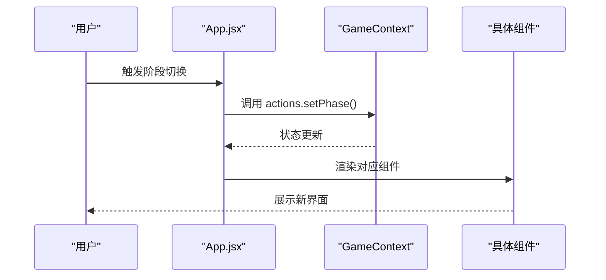
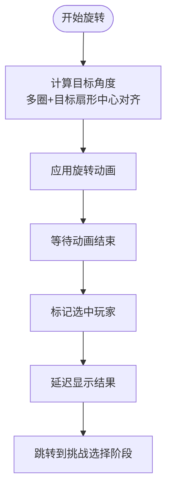
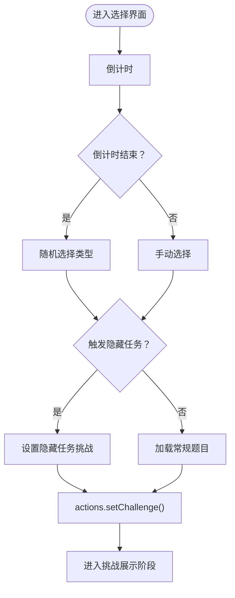
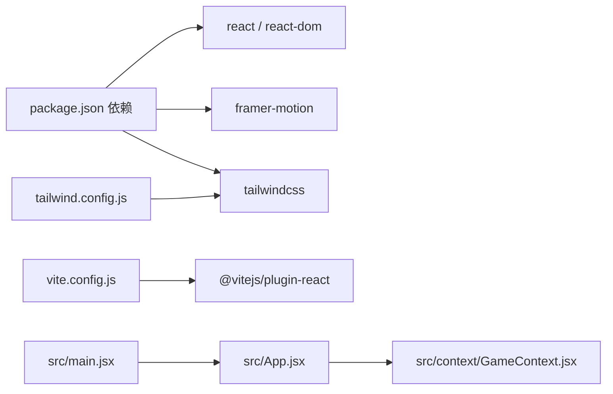

# 架构设计

<cite>
**本文引用的文件**
- [README.md](file://README.md)
- [package.json](file://package.json)
- [vite.config.js](file://vite.config.js)
- [tailwind.config.js](file://tailwind.config.js)
- [src/main.jsx](file://src/main.jsx)
- [src/App.jsx](file://src/App.jsx)
- [src/context/GameContext.jsx](file://src/context/GameContext.jsx)
- [src/components/GameSetup/WelcomePage.jsx](file://src/components/GameSetup/WelcomePage.jsx)
- [src/components/GameSetup/PlayerSetup.jsx](file://src/components/GameSetup/PlayerSetup.jsx)
- [src/components/GamePlay/PlayerWheel.jsx](file://src/components/GamePlay/PlayerWheel.jsx)
- [src/components/GamePlay/ChallengeSelect.jsx](file://src/components/GamePlay/ChallengeSelect.jsx)
- [src/components/Results/GameSummary.jsx](file://src/components/Results/GameSummary.jsx)
- [src/data/truthQuestions.js](file://src/data/truthQuestions.js)
- [src/data/dareQuestions.js](file://src/data/dareQuestions.js)
- [src/index.css](file://src/index.css)
</cite>

## 目录
1. [简介](#简介)
2. [项目结构](#项目结构)
3. [核心组件](#核心组件)
4. [架构总览](#架构总览)
5. [组件详细分析](#组件详细分析)
6. [依赖关系分析](#依赖关系分析)
7. [性能考量](#性能考量)
8. [故障排查指南](#故障排查指南)
9. [结论](#结论)
10. [附录](#附录)

## 简介
Truth or Dare 是一款基于浏览器的派对互动游戏，采用 React 19 + Vite + Framer Motion + Tailwind CSS 技术栈构建。系统通过 React Context API 与 useReducer 实现集中式状态管理，围绕“欢迎页 -> 玩家设置 -> 游戏配置 -> 玩家确认 -> 轮转抽人 -> 选择挑战 -> 展示挑战 -> 计分展示 -> 游戏总结”的流程推进。数据层包含真心话与大冒险两类题库，并支持难度、主题与道具等扩展机制。

## 项目结构
项目采用按功能域划分的目录结构，清晰分离上下文、组件、数据与样式资源：
- src/context：集中式状态管理（GameContext）
- src/components：按功能域拆分的组件（GameSetup、GamePlay、Results）
- src/data：题库与辅助逻辑（truthQuestions.js、dareQuestions.js）
- src/index.css：Tailwind 基础与自定义样式
- 根配置：vite.config.js、tailwind.config.js、package.json

图表来源
- [src/main.jsx](file://src/main.jsx#L1-L11)
- [src/App.jsx](file://src/App.jsx#L1-L61)
- [src/context/GameContext.jsx](file://src/context/GameContext.jsx#L1-L323)
- [src/components/GameSetup/WelcomePage.jsx](file://src/components/GameSetup/WelcomePage.jsx#L1-L88)
- [src/components/GameSetup/PlayerSetup.jsx](file://src/components/GameSetup/PlayerSetup.jsx#L1-L197)
- [src/components/GamePlay/PlayerWheel.jsx](file://src/components/GamePlay/PlayerWheel.jsx#L1-L300)
- [src/components/GamePlay/ChallengeSelect.jsx](file://src/components/GamePlay/ChallengeSelect.jsx#L1-L201)
- [src/components/Results/GameSummary.jsx](file://src/components/Results/GameSummary.jsx#L1-L224)
- [src/data/truthQuestions.js](file://src/data/truthQuestions.js#L1-L156)
- [src/data/dareQuestions.js](file://src/data/dareQuestions.js#L1-L167)

章节来源
- [src/main.jsx](file://src/main.jsx#L1-L11)
- [src/App.jsx](file://src/App.jsx#L1-L61)
- [vite.config.js](file://vite.config.js#L1-L8)
- [tailwind.config.js](file://tailwind.config.js#L1-L12)
- [package.json](file://package.json#L1-L33)

## 核心组件
- App.jsx：根组件，负责路由渲染与页面切换动画
- GameContext.jsx：提供全局状态与动作，封装 reducer 与自定义 Hook
- 各功能组件：WelcomePage、PlayerSetup、PlayerWheel、ChallengeSelect、GameSummary
- 数据模块：truthQuestions.js、dareQuestions.js

章节来源
- [src/App.jsx](file://src/App.jsx#L1-L61)
- [src/context/GameContext.jsx](file://src/context/GameContext.jsx#L1-L323)
- [src/components/GameSetup/WelcomePage.jsx](file://src/components/GameSetup/WelcomePage.jsx#L1-L88)
- [src/components/GameSetup/PlayerSetup.jsx](file://src/components/GameSetup/PlayerSetup.jsx#L1-L197)
- [src/components/GamePlay/PlayerWheel.jsx](file://src/components/GamePlay/PlayerWheel.jsx#L1-L300)
- [src/components/GamePlay/ChallengeSelect.jsx](file://src/components/GamePlay/ChallengeSelect.jsx#L1-L201)
- [src/components/Results/GameSummary.jsx](file://src/components/Results/GameSummary.jsx#L1-L224)
- [src/data/truthQuestions.js](file://src/data/truthQuestions.js#L1-L156)
- [src/data/dareQuestions.js](file://src/data/dareQuestions.js#L1-L167)

## 架构总览
系统采用“组件化 + 集中式状态管理”的架构模式：
- 组件化设计：按功能域拆分组件，职责单一，便于维护与复用
- 状态管理：React Context + useReducer，统一管理游戏阶段、玩家、配置、挑战与历史
- 数据流：用户交互触发动作（dispatch），reducer 更新状态，组件订阅状态变化并重新渲染
- 动画与样式：Framer Motion 提供流畅过渡，Tailwind CSS 提供一致的视觉风格

图表来源
- [src/context/GameContext.jsx](file://src/context/GameContext.jsx#L1-L323)
- [src/App.jsx](file://src/App.jsx#L1-L61)
- [src/components/GameSetup/WelcomePage.jsx](file://src/components/GameSetup/WelcomePage.jsx#L1-L88)
- [src/components/GameSetup/PlayerSetup.jsx](file://src/components/GameSetup/PlayerSetup.jsx#L1-L197)
- [src/components/GamePlay/PlayerWheel.jsx](file://src/components/GamePlay/PlayerWheel.jsx#L1-L300)
- [src/components/GamePlay/ChallengeSelect.jsx](file://src/components/GamePlay/ChallengeSelect.jsx#L1-L201)
- [src/components/Results/GameSummary.jsx](file://src/components/Results/GameSummary.jsx#L1-L224)
- [src/data/truthQuestions.js](file://src/data/truthQuestions.js#L1-L156)
- [src/data/dareQuestions.js](file://src/data/dareQuestions.js#L1-L167)

## 组件详细分析

### GameContext：全局状态管理中心
- 角色定位：提供状态、动作与工具函数，封装 reducer 与自定义 Hook
- 状态结构：包含游戏阶段、玩家数组、配置、当前轮次、当前玩家索引、挑战、投票、历史、已用题目、道具等
- 动作类型：覆盖玩家增删改、配置设置、游戏启动、轮次推进、挑战选择、投票提交、道具使用与添加、重置与结束等
- 工具方法：getCurrentPlayer、getLeaderboard、checkGameEnd
- 设计要点：通过 Provider 将状态与动作注入子树；使用 useReducer 保证状态更新的可预测性与可追踪性

图表来源
- [src/context/GameContext.jsx](file://src/context/GameContext.jsx#L1-L323)

章节来源
- [src/context/GameContext.jsx](file://src/context/GameContext.jsx#L1-L323)

### App.jsx：路由与动画
- 角色定位：根据当前游戏阶段渲染对应组件，并通过 Framer Motion 实现页面切换动画
- 控制流：useGame 获取 state，switch 渲染不同阶段组件，AnimatePresence 包裹实现淡入淡出与等待模式
- 设计要点：将动画与状态解耦，确保切换过程平滑且可预测

图表来源
- [src/App.jsx](file://src/App.jsx#L1-L61)
- [src/context/GameContext.jsx](file://src/context/GameContext.jsx#L1-L323)

章节来源
- [src/App.jsx](file://src/App.jsx#L1-L61)

### WelcomePage：欢迎页
- 功能：引导用户开始游戏，展示特性与流程说明
- 交互：点击按钮切换到玩家设置阶段
- 动画：Framer Motion 提供入场与悬停反馈

章节来源
- [src/components/GameSetup/WelcomePage.jsx](file://src/components/GameSetup/WelcomePage.jsx#L1-L88)

### PlayerSetup：玩家设置
- 功能：添加/移除玩家、校验数量与名称唯一性、批量快速添加
- 交互：输入回车添加、下一步按钮启用条件判断
- 动画：列表项入场/出场动画，错误提示淡入

章节来源
- [src/components/GameSetup/PlayerSetup.jsx](file://src/components/GameSetup/PlayerSetup.jsx#L1-L197)

### PlayerWheel：轮转抽人
- 功能：基于玩家数量动态生成扇形区域，执行旋转动画并随机选中玩家
- 交互：开始按钮控制旋转，倒计时与进度条展示
- 逻辑：检查游戏结束条件，选中后延时跳转到挑战选择阶段

图表来源
- [src/components/GamePlay/PlayerWheel.jsx](file://src/components/GamePlay/PlayerWheel.jsx#L1-L300)

章节来源
- [src/components/GamePlay/PlayerWheel.jsx](file://src/components/GamePlay/PlayerWheel.jsx#L1-L300)

### ChallengeSelect：挑战选择
- 功能：当前玩家选择真心话或大冒险，支持倒计时自动选择与隐藏任务触发
- 交互：按钮禁用与选中态反馈，道具与积分信息展示
- 数据：根据配置与已用题目筛选合适的问题

图表来源
- [src/components/GamePlay/ChallengeSelect.jsx](file://src/components/GamePlay/ChallengeSelect.jsx#L1-L201)
- [src/data/truthQuestions.js](file://src/data/truthQuestions.js#L1-L156)
- [src/data/dareQuestions.js](file://src/data/dareQuestions.js#L1-L167)

章节来源
- [src/components/GamePlay/ChallengeSelect.jsx](file://src/components/GamePlay/ChallengeSelect.jsx#L1-L201)
- [src/data/truthQuestions.js](file://src/data/truthQuestions.js#L1-L156)
- [src/data/dareQuestions.js](file://src/data/dareQuestions.js#L1-L167)

### GameSummary：游戏总结
- 功能：展示最终排名、特别奖项、游戏统计与精彩回顾
- 交互：重新开始与返回首页两种操作
- 数据：基于 roundHistory 与玩家统计计算

章节来源
- [src/components/Results/GameSummary.jsx](file://src/components/Results/GameSummary.jsx#L1-L224)

## 依赖关系分析
- 运行时依赖：React 19、React DOM、Framer Motion、Tailwind CSS
- 构建工具：Vite、@vitejs/plugin-react
- 样式框架：Tailwind CSS，content 指向 src 与 index.html
- 入口：main.jsx 渲染 App，StrictMode 包裹确保严格模式

图表来源
- [package.json](file://package.json#L1-L33)
- [vite.config.js](file://vite.config.js#L1-L8)
- [tailwind.config.js](file://tailwind.config.js#L1-L12)
- [src/main.jsx](file://src/main.jsx#L1-L11)
- [src/App.jsx](file://src/App.jsx#L1-L61)
- [src/context/GameContext.jsx](file://src/context/GameContext.jsx#L1-L323)

章节来源
- [package.json](file://package.json#L1-L33)
- [vite.config.js](file://vite.config.js#L1-L8)
- [tailwind.config.js](file://tailwind.config.js#L1-L12)
- [src/main.jsx](file://src/main.jsx#L1-L11)

## 性能考量
- 状态更新粒度：useReducer 将复杂状态更新收敛到单一 reducer，避免细碎更新导致的多次重渲染
- 组件订阅：useGame 自定义 Hook 仅暴露必要字段，减少无关订阅
- 动画与渲染：Framer Motion 使用 transform/opacity 等高优属性，避免强制同步布局
- 样式体积：Tailwind 通过 content 精确扫描，按需生成样式，降低体积
- 构建优化：Vite 基于 ESM 的快速冷启动与热更新，适合开发体验

## 故障排查指南
- 状态未更新：确认调用 actions.* 是否在 GameProvider 上下文中，useGame 在组件树中正确使用
- 动画异常：检查 AnimatePresence 的 key 与 mode="wait" 配置，避免同一组件重复渲染未触发过渡
- 样式未生效：确认 tailwind.config.js 的 content 路径包含当前组件文件，执行构建清理后重试
- 题目用尽：当题目池为空时，题库逻辑会重置使用记录，确保流程可继续
- 游戏结束：checkGameEnd 基于配置时长与开始时间判断，注意时区与时间同步

章节来源
- [src/context/GameContext.jsx](file://src/context/GameContext.jsx#L1-L323)
- [src/components/GamePlay/PlayerWheel.jsx](file://src/components/GamePlay/PlayerWheel.jsx#L1-L300)
- [src/data/truthQuestions.js](file://src/data/truthQuestions.js#L1-L156)
- [src/data/dareQuestions.js](file://src/data/dareQuestions.js#L1-L167)
- [tailwind.config.js](file://tailwind.config.js#L1-L12)

## 结论
该架构以 React 19 为核心，结合 Context + useReducer 实现集中式状态管理，配合 Framer Motion 与 Tailwind CSS 提供良好的交互与视觉一致性。组件按功能域拆分，职责清晰，具备良好的扩展性与可维护性。通过题库模块化与道具系统，可进一步拓展玩法与规则。

## 附录
- 运行与部署：参考 README 的本地开发与构建说明
- 样式定制：通过 src/index.css 与 Tailwind 配置进行扩展

章节来源
- [README.md](file://README.md#L1-L20)
- [src/index.css](file://src/index.css#L1-L73)
- [tailwind.config.js](file://tailwind.config.js#L1-L12)