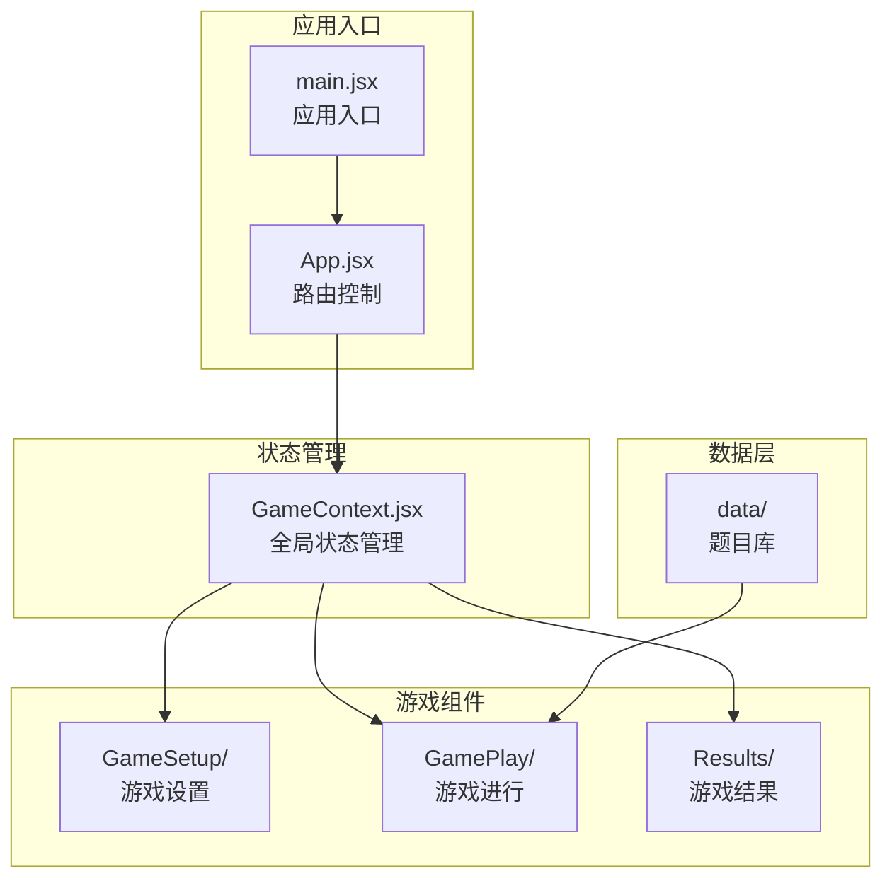
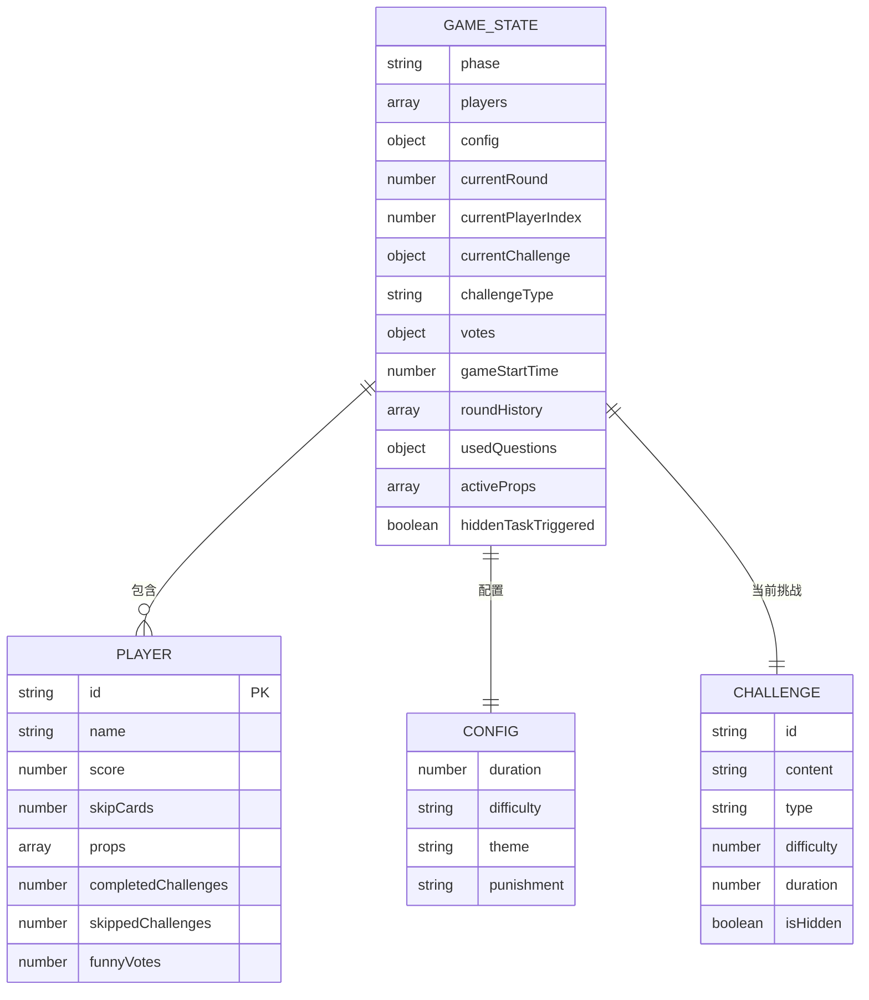
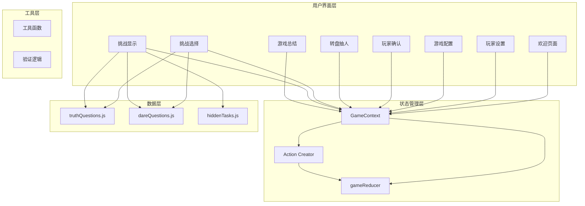
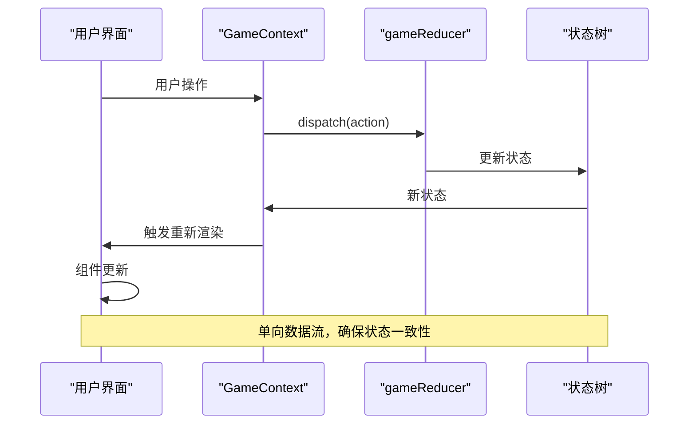
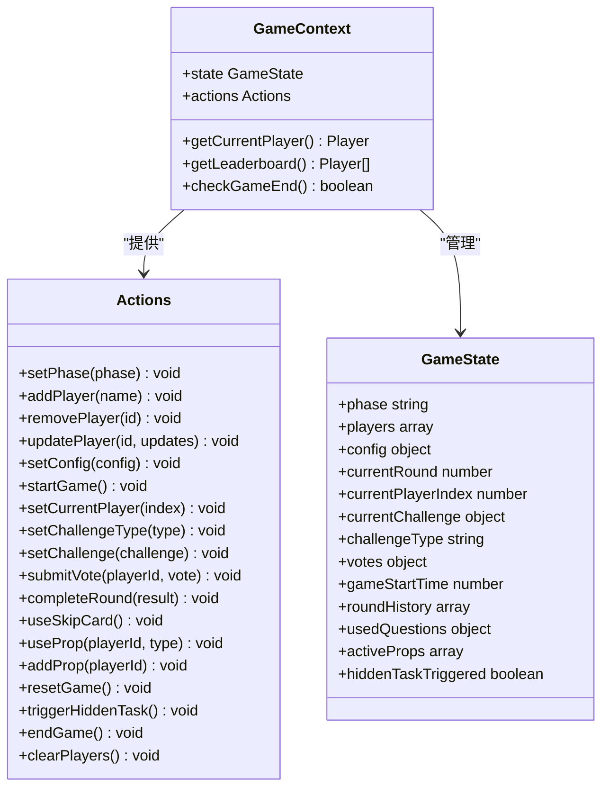
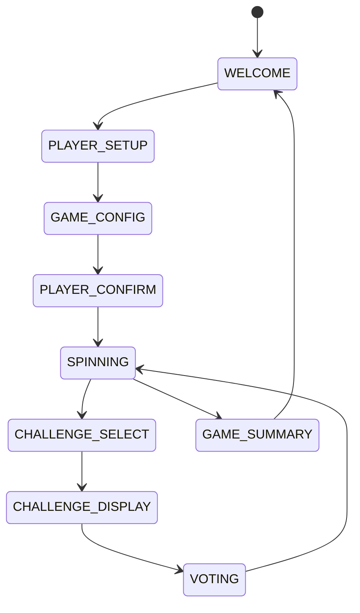
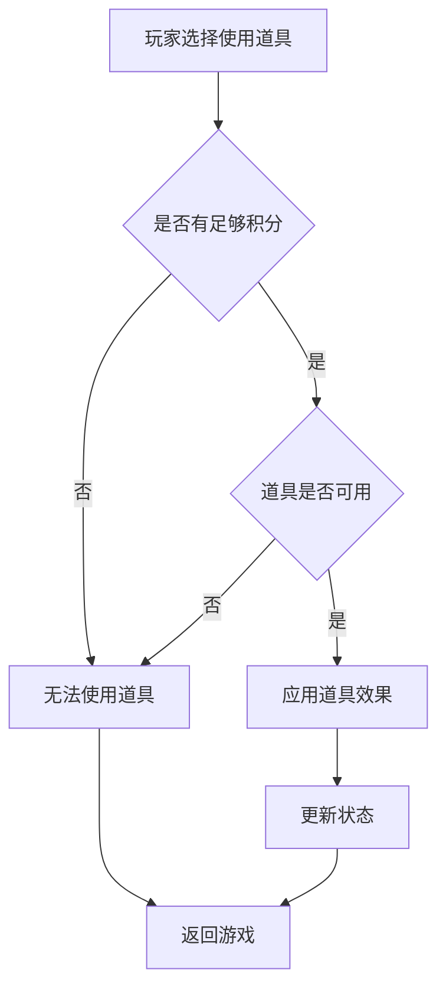
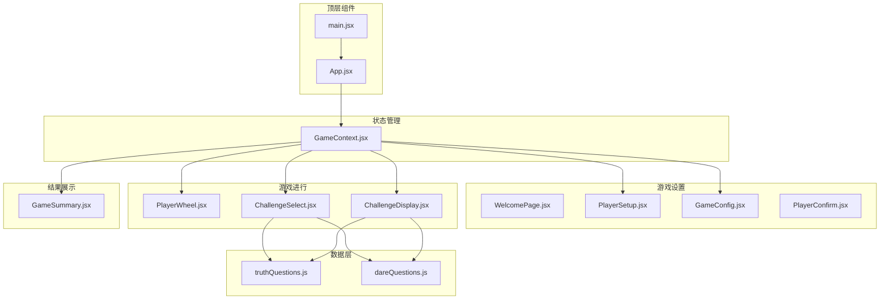

# 状态管理架构

<cite>
**本文档引用的文件**
- [GameContext.jsx](file://src/context/GameContext.jsx)
- [App.jsx](file://src/App.jsx)
- [main.jsx](file://src/main.jsx)
- [GameConfig.jsx](file://src/components/GameSetup/GameConfig.jsx)
- [PlayerSetup.jsx](file://src/components/GameSetup/PlayerSetup.jsx)
- [PlayerWheel.jsx](file://src/components/GamePlay/PlayerWheel.jsx)
- [ChallengeSelect.jsx](file://src/components/GamePlay/ChallengeSelect.jsx)
- [ChallengeDisplay.jsx](file://src/components/GamePlay/ChallengeDisplay.jsx)
- [GameSummary.jsx](file://src/components/Results/GameSummary.jsx)
- [truthQuestions.js](file://src/data/truthQuestions.js)
- [dareQuestions.js](file://src/data/dareQuestions.js)
- [package.json](file://package.json)
</cite>

## 目录
1. [简介](#简介)
2. [项目结构](#项目结构)
3. [核心组件](#核心组件)
4. [架构概览](#架构概览)
5. [详细组件分析](#详细组件分析)
6. [依赖关系分析](#依赖关系分析)
7. [性能考量](#性能考量)
8. [故障排除指南](#故障排除指南)
9. [结论](#结论)

## 简介

Truth or Dare 项目采用 React Context API 与 useReducer Hook 的组合实现全局状态管理。该架构通过单一数据源管理复杂的多玩家游戏状态，实现了响应式的组件更新和状态持久化机制。系统支持多人游戏、道具系统、挑战机制和实时计分等功能。

## 项目结构

项目采用功能模块化的组织方式，主要包含以下核心目录：

**图表来源**
- [main.jsx](file://src/main.jsx#L1-L11)
- [App.jsx](file://src/App.jsx#L1-L58)
- [GameContext.jsx](file://src/context/GameContext.jsx#L1-L322)

**章节来源**
- [main.jsx](file://src/main.jsx#L1-L11)
- [App.jsx](file://src/App.jsx#L1-L58)

## 核心组件

### GameContext 架构设计

GameContext 实现了完整的状态管理模式，包含以下关键要素：

#### 状态树结构设计

**图表来源**
- [GameContext.jsx](file://src/context/GameContext.jsx#L24-L44)

#### 状态管理模式原理

系统采用 Flux 架构模式，通过以下机制实现状态管理：

1. **单一数据源**：所有游戏状态集中存储在 GameContext 中
2. **不可变更新**：使用纯函数 reducer 确保状态更新的可预测性
3. **集中式调度**：通过 dispatch 分发 action，避免组件间直接修改状态
4. **响应式更新**：useReducer 自动触发组件重新渲染

**章节来源**
- [GameContext.jsx](file://src/context/GameContext.jsx#L68-L250)

## 架构概览

### 系统架构图

**图表来源**
- [GameContext.jsx](file://src/context/GameContext.jsx#L1-L322)
- [App.jsx](file://src/App.jsx#L13-L45)

### 数据流图

**图表来源**
- [GameContext.jsx](file://src/context/GameContext.jsx#L256-L321)

## 详细组件分析

### GameContext Provider 组件

#### 状态初始化与管理

GameContext 作为全局状态提供者，负责：

1. **状态初始化**：使用 initialState 定义默认游戏状态
2. **状态更新**：通过 useReducer 管理状态变更
3. **动作分发**：提供丰富的 action creator 方法
4. **计算属性**：暴露 getLeaderboard、getCurrentPlayer 等计算方法

#### 核心功能实现

**图表来源**
- [GameContext.jsx](file://src/context/GameContext.jsx#L256-L321)

**章节来源**
- [GameContext.jsx](file://src/context/GameContext.jsx#L256-L321)

### 游戏阶段管理

#### 阶段枚举设计

系统定义了完整的游戏流程阶段：

**图表来源**
- [GameContext.jsx](file://src/context/GameContext.jsx#L4-L14)

#### 阶段转换机制

每个阶段都有明确的职责和转换条件：

1. **WELCOME**：欢迎页面，引导用户开始游戏
2. **PLAYER_SETUP**：添加和管理玩家
3. **GAME_CONFIG**：设置游戏参数
4. **PLAYER_CONFIRM**：确认玩家名单
5. **SPINNING**：转盘抽取当前玩家
6. **CHALLENGE_SELECT**：选择挑战类型
7. **CHALLENGE_DISPLAY**：显示挑战内容和处理投票
8. **VOTING**：玩家投票环节
9. **GAME_SUMMARY**：游戏结束统计

**章节来源**
- [GameContext.jsx](file://src/context/GameContext.jsx#L4-L14)

### 道具系统设计

#### 道具类型定义

系统支持四种不同类型的道具：

| 道具ID | 名称 | 描述 | 效果 |
|--------|------|------|------|
| reverse | 反转卡 | 让提问者回答这个问题 | 改变挑战执行者 |
| protect | 保护卡 | 跳过本轮挑战 | 直接跳过挑战 |
| double | 双倍卡 | 本轮积分×2 | 增加积分倍数 |
| trouble | 捣乱卡 | 指定他人完成额外任务 | 强制他人挑战 |

#### 道具使用机制

**图表来源**
- [GameContext.jsx](file://src/context/GameContext.jsx#L193-L202)

**章节来源**
- [GameContext.jsx](file://src/context/GameContext.jsx#L17-L22)

### 题库管理系统

#### 真心话题库结构

truthQuestions.js 提供了丰富的真心话题库，按难度和主题分类：

- **难度等级**：1-5星，对应不同的挑战强度
- **主题分类**：情感、搞笑、校园、职场、混合
- **数量规模**：超过80个不同类型的真心话题

#### 大冒险题库结构

dareQuestions.js 包含了各种挑战任务：

- **表演类**：唱歌、跳舞、模仿等
- **互动类**：拥抱、表白、聊天等
- **搞笑类**：做表情、学动物等
- **才艺类**：展示技能、创作等
- **惩罚类**：特殊规则和限制

**章节来源**
- [truthQuestions.js](file://src/data/truthQuestions.js#L1-L156)
- [dareQuestions.js](file://src/data/dareQuestions.js#L1-L167)

## 依赖关系分析

### 组件依赖图

**图表来源**
- [App.jsx](file://src/App.jsx#L1-L11)
- [GameContext.jsx](file://src/context/GameContext.jsx#L1-L3)

### 外部依赖

项目使用的主要外部库：

| 依赖库 | 版本 | 用途 |
|--------|------|------|
| react | ^19.2.0 | 核心框架 |
| react-dom | ^19.2.0 | DOM渲染 |
| framer-motion | ^12.29.0 | 动画效果 |
| @tailwindcss/vite | ^4.1.18 | 样式框架 |

**章节来源**
- [package.json](file://package.json#L12-L31)

## 性能考量

### 状态更新优化

1. **不可变更新**：每次状态更新都创建新的对象，确保 React 正确识别变化
2. **选择性渲染**：useReducer 只在状态变化时触发重新渲染
3. **计算属性缓存**：getLeaderboard 等计算方法避免重复计算

### 内存管理

1. **状态清理**：游戏结束后自动清理定时器和事件监听器
2. **资源释放**：组件卸载时清除所有定时器和订阅
3. **数据复用**：合理使用 React.memo 和 useMemo 优化渲染

### 性能监控建议

1. **状态大小控制**：避免存储不必要的大型数据结构
2. **批量更新**：合并多个相关的状态更新操作
3. **懒加载**：对大型数据集实施懒加载策略

## 故障排除指南

### 常见问题诊断

#### 状态不更新问题

**症状**：组件不响应状态变化
**可能原因**：
1. 未正确使用 useGame hook
2. 状态更新未通过 action creator
3. 组件未正确订阅状态变化

**解决方案**：
1. 确保在组件中正确导入和使用 useGame
2. 通过 actions 对象进行状态更新
3. 检查组件的依赖数组设置

#### 道具使用异常

**症状**：道具无法正常使用
**可能原因**：
1. 道具积分不足
2. 道具冷却时间未结束
3. 道具类型不匹配

**解决方案**：
1. 检查玩家积分是否足够
2. 确认道具使用条件满足
3. 验证道具类型有效性

#### 游戏循环中断

**症状**：游戏流程卡在某个阶段
**可能原因**：
1. 状态阶段未正确切换
2. 条件检查逻辑错误
3. 异步操作未正确处理

**解决方案**：
1. 检查阶段转换逻辑
2. 验证条件判断语句
3. 确保异步操作正确完成

**章节来源**
- [GameContext.jsx](file://src/context/GameContext.jsx#L282-L300)

## 结论

Truth or Dare 项目的状态管理架构展现了现代 React 应用的最佳实践。通过 Context API 与 useReducer 的完美结合，实现了：

1. **清晰的状态结构**：单一数据源确保状态一致性
2. **可预测的状态更新**：纯函数 reducer 提供确定性行为
3. **响应式组件更新**：自动化的重新渲染机制
4. **可扩展的架构设计**：模块化的组件结构便于维护和扩展

该架构为多玩家游戏提供了坚实的技术基础，支持复杂的游戏逻辑和丰富的交互体验。通过合理的状态管理和性能优化，系统能够稳定地处理并发操作和大量数据更新。

未来可以考虑的改进方向包括：
- 实现状态持久化到 localStorage
- 添加状态回放功能
- 优化大数据量场景下的性能表现
- 增强错误边界和异常处理机制