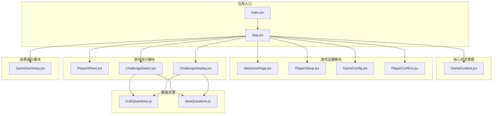
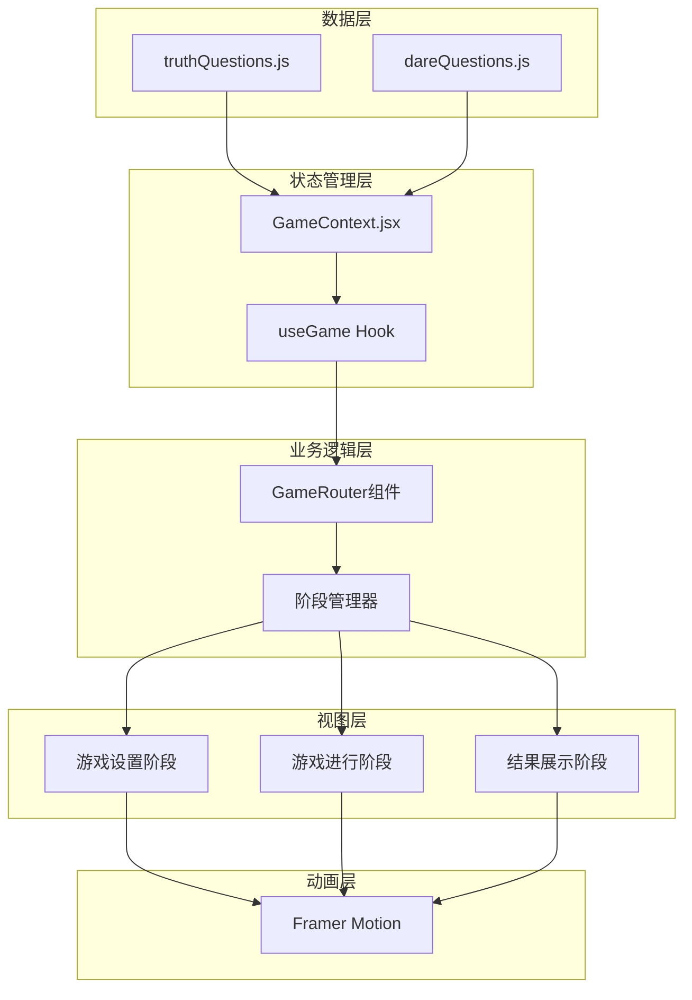
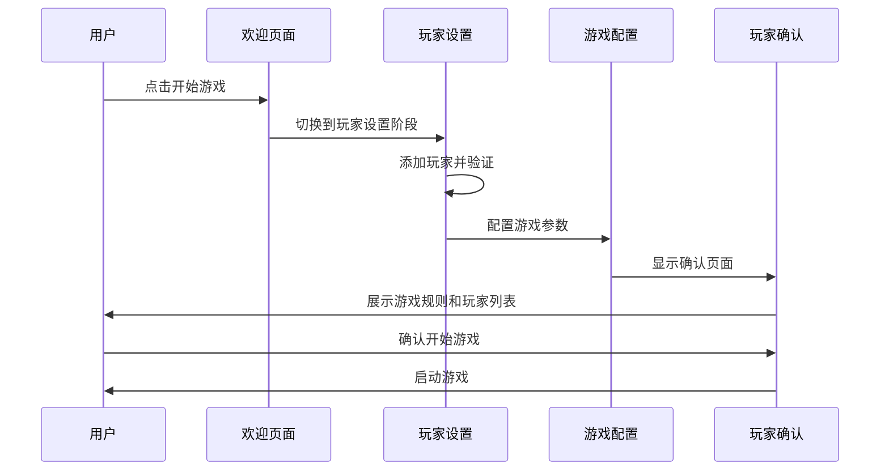
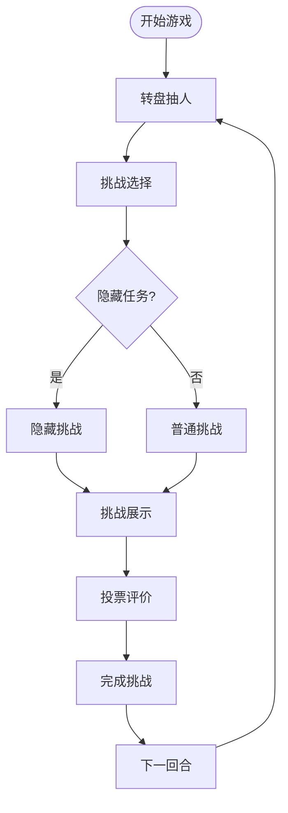
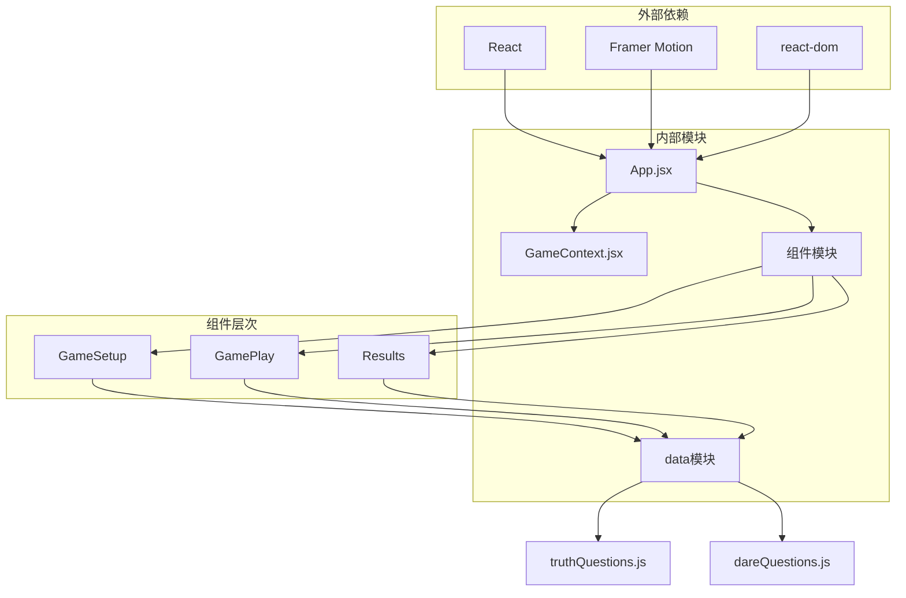

# 组件架构

<cite>
**本文档引用的文件**
- [App.jsx](file://src/App.jsx)
- [GameContext.jsx](file://src/context/GameContext.jsx)
- [main.jsx](file://src/main.jsx)
- [WelcomePage.jsx](file://src/components/GameSetup/WelcomePage.jsx)
- [PlayerSetup.jsx](file://src/components/GameSetup/PlayerSetup.jsx)
- [GameConfig.jsx](file://src/components/GameSetup/GameConfig.jsx)
- [PlayerConfirm.jsx](file://src/components/GameSetup/PlayerConfirm.jsx)
- [PlayerWheel.jsx](file://src/components/GamePlay/PlayerWheel.jsx)
- [ChallengeSelect.jsx](file://src/components/GamePlay/ChallengeSelect.jsx)
- [ChallengeDisplay.jsx](file://src/components/GamePlay/ChallengeDisplay.jsx)
- [GameSummary.jsx](file://src/components/Results/GameSummary.jsx)
- [truthQuestions.js](file://src/data/truthQuestions.js)
- [dareQuestions.js](file://src/data/dareQuestions.js)
</cite>

## 目录
1. [简介](#简介)
2. [项目结构](#项目结构)
3. [核心组件](#核心组件)
4. [架构概览](#架构概览)
5. [详细组件分析](#详细组件分析)
6. [依赖关系分析](#依赖关系分析)
7. [性能考量](#性能考量)
8. [故障排除指南](#故障排除指南)
9. [结论](#结论)

## 简介
Truth or Dare 是一款基于 React 的派对游戏应用，采用现代前端技术栈构建。该项目通过清晰的组件层次结构和上下文管理模式，实现了从游戏设置到进行再到结果展示的完整流程。系统采用 Framer Motion 实现流畅的动画过渡，通过自定义 Hook 和 Context 提供状态管理，确保组件间通信的简洁性和可维护性。

## 项目结构
项目采用按功能模块组织的目录结构，主要分为以下几个核心部分：

**图表来源**
- [main.jsx](file://src/main.jsx#L1-L11)
- [App.jsx](file://src/App.jsx#L1-L58)
- [GameContext.jsx](file://src/context/GameContext.jsx#L1-L322)

**章节来源**
- [main.jsx](file://src/main.jsx#L1-L11)
- [App.jsx](file://src/App.jsx#L1-L58)

## 核心组件
系统的核心由三个主要组件构成，每个组件都有明确的职责分工：

### App.jsx - 应用根组件
作为整个应用的入口点，App.jsx 采用路由模式管理游戏的不同阶段。它通过 GameProvider 包装整个应用，确保所有子组件都能访问全局状态。

### GameContext.jsx - 状态管理中心
实现了一个完整的 Redux 风格的状态管理方案，包含：
- 游戏阶段枚举管理
- 玩家状态跟踪
- 游戏配置管理
- 道具系统支持
- 动作分发机制

### 组件通信模式
系统采用自上而下的 props 传递和自下而上的回调处理相结合的方式，通过 useGame Hook 提供统一的状态访问接口。

**章节来源**
- [App.jsx](file://src/App.jsx#L1-L58)
- [GameContext.jsx](file://src/context/GameContext.jsx#L1-L322)

## 架构概览
系统采用分层架构设计，从底层的数据层到顶层的用户界面层形成了清晰的职责边界：

**图表来源**
- [GameContext.jsx](file://src/context/GameContext.jsx#L1-L322)
- [App.jsx](file://src/App.jsx#L13-L45)

## 详细组件分析

### 游戏设置模块 (GameSetup)
游戏设置模块负责初始化游戏环境，包含四个关键组件：

#### WelcomePage - 欢迎页面
作为游戏的起点，提供基础的游戏介绍和开始按钮。采用 Framer Motion 实现渐入式动画效果，营造欢迎氛围。

#### PlayerSetup - 玩家设置
实现玩家添加、验证和管理功能，包含：
- 玩家名称输入验证
- 重复名称检测
- 最大玩家数量限制
- 批量添加功能

#### GameConfig - 游戏配置
提供丰富的游戏自定义选项：
- 游戏时长设置（30/45/60分钟）
- 难度级别选择（轻松/标准/挑战）
- 主题选择（情感/搞笑/校园/职场/混合）
- 惩罚机制配置

#### PlayerConfirm - 玩家确认
展示游戏规则和注意事项，提供最终确认开始游戏的功能。

**图表来源**
- [WelcomePage.jsx](file://src/components/GameSetup/WelcomePage.jsx#L1-L88)
- [PlayerSetup.jsx](file://src/components/GameSetup/PlayerSetup.jsx#L1-L197)
- [GameConfig.jsx](file://src/components/GameSetup/GameConfig.jsx#L1-L185)
- [PlayerConfirm.jsx](file://src/components/GameSetup/PlayerConfirm.jsx#L1-L159)

**章节来源**
- [WelcomePage.jsx](file://src/components/GameSetup/WelcomePage.jsx#L1-L88)
- [PlayerSetup.jsx](file://src/components/GameSetup/PlayerSetup.jsx#L1-L197)
- [GameConfig.jsx](file://src/components/GameSetup/GameConfig.jsx#L1-L185)
- [PlayerConfirm.jsx](file://src/components/GameSetup/PlayerConfirm.jsx#L1-L159)

### 游戏进行模块 (GamePlay)
游戏进行模块包含三个核心组件，实现完整的挑战流程：

#### PlayerWheel - 转盘抽人
实现智能的随机选择算法，包含：
- SVG 转盘绘制和动画
- 物理引擎般的旋转效果
- 实时进度条显示
- 排名榜预览功能

#### ChallengeSelect - 挑战选择
提供挑战类型选择界面，包含：
- 倒计时自动选择机制
- 隐藏任务触发概率
- 玩家道具和积分状态显示
- 视觉反馈和动画效果

#### ChallengeDisplay - 挑战展示
实现挑战执行和评价系统：
- 动态计时器管理
- 投票评价机制
- 道具使用系统
- 结果确认流程

**图表来源**
- [PlayerWheel.jsx](file://src/components/GamePlay/PlayerWheel.jsx#L1-L300)
- [ChallengeSelect.jsx](file://src/components/GamePlay/ChallengeSelect.jsx#L1-L201)
- [ChallengeDisplay.jsx](file://src/components/GamePlay/ChallengeDisplay.jsx#L1-L356)

**章节来源**
- [PlayerWheel.jsx](file://src/components/GamePlay/PlayerWheel.jsx#L1-L300)
- [ChallengeSelect.jsx](file://src/components/GamePlay/ChallengeSelect.jsx#L1-L201)
- [ChallengeDisplay.jsx](file://src/components/GamePlay/ChallengeDisplay.jsx#L1-L356)

### 结果展示模块 (Results)
结果展示模块提供游戏结束后的统计和回顾功能：

#### GameSummary - 游戏总结
实现全面的统计分析：
- 冠军和获奖者展示
- 最终排名列表
- 特别奖项颁发
- 游戏统计数据
- 精彩瞬间回顾

**章节来源**
- [GameSummary.jsx](file://src/components/Results/GameSummary.jsx#L1-L224)

### 数据管理模块
系统包含两个数据文件，提供挑战内容的完整库：

#### truthQuestions.js - 真心话题库
包含超过90个精心设计的问题，按难度和主题分类：
- 情感类问题（轻松-挑战）
- 搞笑类问题（轻松-挑战）
- 校园类问题（轻松-挑战）
- 职场类问题（轻松-挑战）
- 混合主题问题

#### dareQuestions.js - 大冒险题库
包含80多个互动性强的任务：
- 表演类任务（轻松-挑战）
- 互动类任务（轻松-挑战）
- 搞笑类任务（轻松-挑战）
- 才艺类任务（轻松-挑战）
- 惩罚类任务（轻度-挑战）

**章节来源**
- [truthQuestions.js](file://src/data/truthQuestions.js#L1-L156)
- [dareQuestions.js](file://src/data/dareQuestions.js#L1-L167)

## 依赖关系分析
系统采用模块化的依赖管理，各组件间保持低耦合高内聚：

**图表来源**
- [App.jsx](file://src/App.jsx#L1-L11)
- [GameContext.jsx](file://src/context/GameContext.jsx#L1-L322)

**章节来源**
- [App.jsx](file://src/App.jsx#L1-L58)
- [GameContext.jsx](file://src/context/GameContext.jsx#L1-L322)

## 性能考量
系统在性能优化方面采用了多项策略：

### 渲染优化
- 使用 Framer Motion 实现硬件加速的动画
- 通过 AnimatePresence 管理组件的进入和离开动画
- 合理的 re-render 优化，避免不必要的状态更新

### 状态管理优化
- 使用 useReducer 替代复杂的 useState
- 通过 useGame Hook 提供精确的状态订阅
- 避免深层嵌套的状态结构

### 数据加载优化
- 挑战问题按需加载和缓存
- 使用对象映射替代数组查找
- 合理的内存管理策略

## 故障排除指南
常见问题及解决方案：

### 状态同步问题
**症状**: 组件状态不同步或更新延迟
**解决**: 检查 useGame Hook 的使用方式，确保正确订阅状态变化

### 动画性能问题
**症状**: 动画卡顿或不流畅
**解决**: 减少复杂动画层级，使用 transform 替代 position 改变

### 内存泄漏问题
**症状**: 页面切换后内存持续增长
**解决**: 确保清理定时器和事件监听器，使用 useEffect 的清理函数

### 数据一致性问题
**症状**: 挑战题目重复或配置不生效
**解决**: 检查 usedQuestions 数组的更新逻辑，验证配置参数的有效性

**章节来源**
- [GameContext.jsx](file://src/context/GameContext.jsx#L68-L250)

## 结论
Truth or Dare 项目展现了现代 React 应用的最佳实践。通过清晰的组件层次结构、完善的上下文管理模式和优雅的动画效果，系统实现了良好的用户体验和代码可维护性。

项目的成功之处在于：
- **模块化设计**: 清晰的功能模块划分，便于维护和扩展
- **状态管理**: 采用 Context + useReducer 的组合，平衡了简单性和复杂性
- **用户体验**: 流畅的动画过渡和直观的操作流程
- **可扩展性**: 良好的架构设计为未来功能扩展奠定了基础

该架构为类似的游戏应用提供了优秀的参考模板，特别是在状态管理、组件通信和用户体验方面的设计思路值得借鉴。