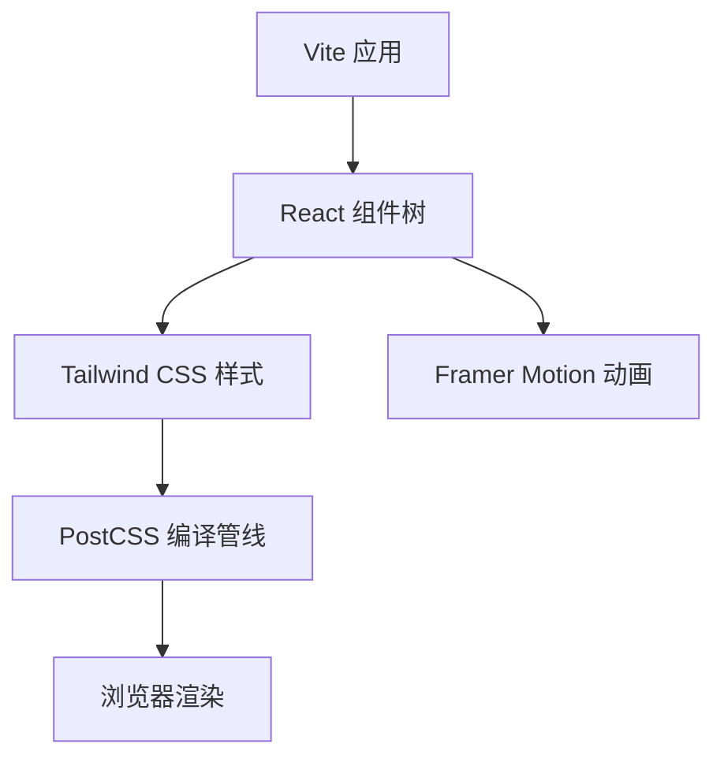
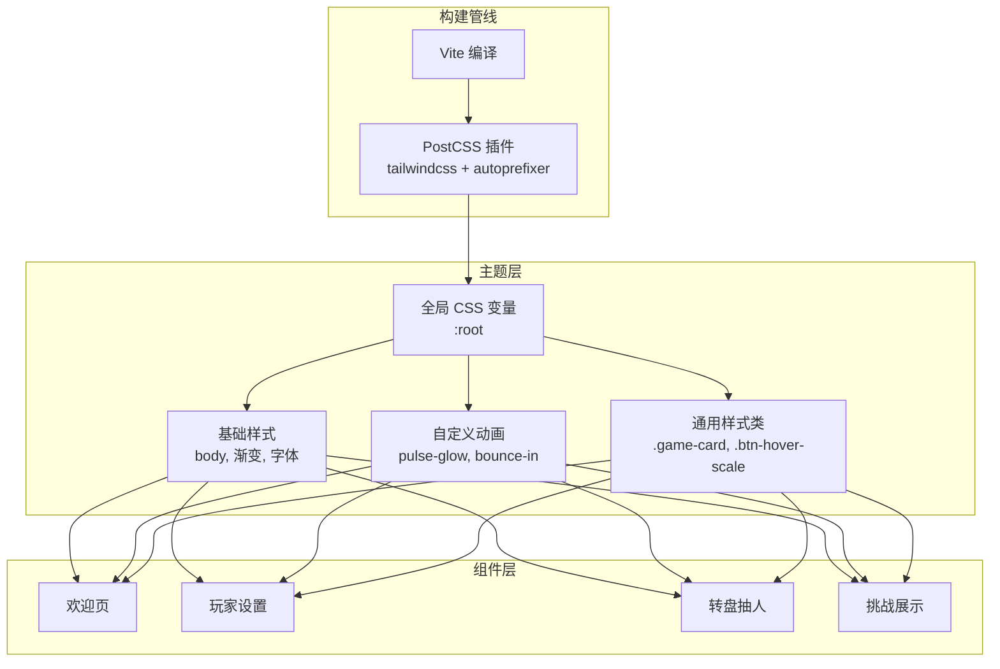
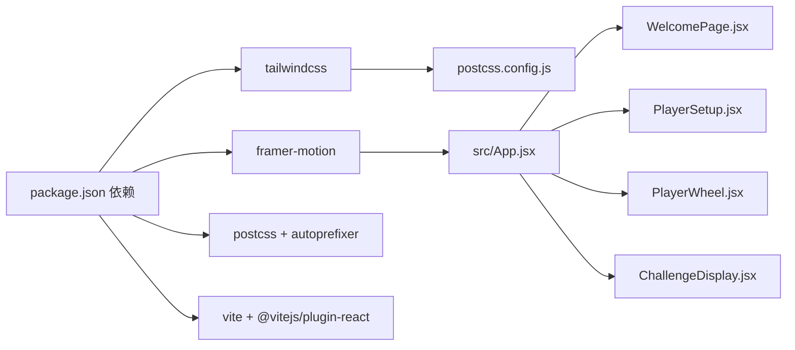

# 样式与主题

<cite>
**本文引用的文件**
- [tailwind.config.js](file://tailwind.config.js)
- [src/index.css](file://src/index.css)
- [package.json](file://package.json)
- [postcss.config.js](file://postcss.config.js)
- [vite.config.js](file://vite.config.js)
- [src/App.jsx](file://src/App.jsx)
- [src/components/GameSetup/WelcomePage.jsx](file://src/components/GameSetup/WelcomePage.jsx)
- [src/components/GamePlay/ChallengeDisplay.jsx](file://src/components/GamePlay/ChallengeDisplay.jsx)
- [src/components/GameSetup/PlayerSetup.jsx](file://src/components/GameSetup/PlayerSetup.jsx)
- [src/components/GamePlay/PlayerWheel.jsx](file://src/components/GamePlay/PlayerWheel.jsx)
- [src/context/GameContext.jsx](file://src/context/GameContext.jsx)
</cite>

## 目录
1. [简介](#简介)
2. [项目结构](#项目结构)
3. [核心组件](#核心组件)
4. [架构总览](#架构总览)
5. [详细组件分析](#详细组件分析)
6. [依赖关系分析](#依赖关系分析)
7. [性能考量](#性能考量)
8. [故障排查指南](#故障排查指南)
9. [结论](#结论)
10. [附录](#附录)

## 简介
本文件聚焦 Truth or Dare 项目的样式与主题系统，围绕 Tailwind CSS 的配置与使用、自定义断点与颜色系统、字体与动画集成、组件样式组织与命名约定、主题定制方法、移动端适配与性能优化、以及样式调试与维护指导进行系统化说明。文档同时结合项目实际代码，给出可视化图示与实操建议，帮助开发者快速理解并扩展样式体系。

## 项目结构
该项目采用 Vite + React + Tailwind CSS 构建，PostCSS 负责编译与自动前缀处理。样式入口位于全局 CSS，组件内通过 Tailwind 类名与少量自定义类组合实现视觉呈现；动画方面引入 Framer Motion 实现流畅的页面切换与交互动效，并与 Tailwind CSS 的过渡类协同使用。

图表来源
- [vite.config.js](file://vite.config.js#L1-L8)
- [postcss.config.js](file://postcss.config.js#L1-L7)
- [src/App.jsx](file://src/App.jsx#L1-L61)

章节来源
- [package.json](file://package.json#L1-L33)
- [postcss.config.js](file://postcss.config.js#L1-L7)
- [vite.config.js](file://vite.config.js#L1-L8)

## 核心组件
- Tailwind CSS 配置：默认配置，未启用自定义断点与颜色扩展，内容扫描范围覆盖 HTML 与 src 目录。
- 全局样式：定义根变量、基础排版、背景渐变、自定义动画与通用卡片样式。
- 动画集成：使用 Framer Motion 进行页面级与元素级动画，配合 Tailwind 的过渡与阴影类。
- 组件样式：广泛使用 Tailwind 原子类，辅以少量自定义类（如卡片、按钮悬停缩放）。

章节来源
- [tailwind.config.js](file://tailwind.config.js#L1-L12)
- [src/index.css](file://src/index.css#L1-L73)
- [src/App.jsx](file://src/App.jsx#L1-L61)

## 架构总览
样式系统由“构建管线 + 主题层 + 组件层”三层构成：
- 构建管线：Vite + PostCSS + Tailwind CSS，负责从源码到浏览器的样式编译。
- 主题层：全局 CSS 变量与基础样式，定义色彩、字体、动画与通用视觉规范。
- 组件层：各页面组件通过 Tailwind 类与少量自定义类实现一致的视觉风格与交互动效。

图表来源
- [postcss.config.js](file://postcss.config.js#L1-L7)
- [src/index.css](file://src/index.css#L1-L73)
- [src/components/GameSetup/WelcomePage.jsx](file://src/components/GameSetup/WelcomePage.jsx#L1-L88)
- [src/components/GameSetup/PlayerSetup.jsx](file://src/components/GameSetup/PlayerSetup.jsx#L1-L197)
- [src/components/GamePlay/PlayerWheel.jsx](file://src/components/GamePlay/PlayerWheel.jsx#L1-L300)
- [src/components/GamePlay/ChallengeDisplay.jsx](file://src/components/GamePlay/ChallengeDisplay.jsx#L1-L356)

## 详细组件分析

### Tailwind CSS 配置与使用
- 内容扫描：默认扫描 HTML 与 src 目录，确保按需生成类名，避免无用样式。
- 主题扩展：当前未扩展断点与颜色，保持最小化配置，便于快速迭代。
- 插件：未启用插件，简化构建流程。

章节来源
- [tailwind.config.js](file://tailwind.config.js#L1-L12)

### 全局样式与主题系统
- 根变量：定义主色、次色、成功/危险/警告色，作为组件与动画的基础色彩来源。
- 基础排版：统一字体族，支持中英混排；body 设置最小高度与全屏背景渐变。
- 自定义动画：定义脉冲发光与弹入动画，用于强调状态变化与视觉反馈。
- 通用卡片：定义圆角、模糊、阴影的卡片样式，提升卡片层级感与可读性。
- 按钮悬停：统一的缩放过渡，增强交互反馈。

章节来源
- [src/index.css](file://src/index.css#L1-L73)

### 动画与过渡集成（Framer Motion + Tailwind）
- 页面级切换：使用 AnimatePresence 控制组件进出，配合淡入淡出与位移过渡。
- 元素级动效：按钮 hover/tap、转盘旋转、选中弹出、进度条动画等，均通过 Framer Motion 实现自然物理感。
- 与 Tailwind 协同：在动画属性之外，仍使用 Tailwind 的过渡类与阴影类，保证一致性与可维护性。

章节来源
- [src/App.jsx](file://src/App.jsx#L1-L61)
- [src/components/GameSetup/WelcomePage.jsx](file://src/components/GameSetup/WelcomePage.jsx#L1-L88)
- [src/components/GamePlay/PlayerWheel.jsx](file://src/components/GamePlay/PlayerWheel.jsx#L1-L300)
- [src/components/GamePlay/ChallengeDisplay.jsx](file://src/components/GamePlay/ChallengeDisplay.jsx#L1-L356)

### 组件样式组织与命名约定
- 原子类优先：组件内部大量使用 Tailwind 原子类，遵循“语义化 + 可读性”的命名方式。
- 通用类复用：通过 .game-card、.btn-hover-scale 等类在多个组件间共享样式，降低重复。
- 断点策略：使用 md 前缀在中等及以上屏幕调整内边距与字号，保证桌面端体验。
- 颜色映射：根据挑战类型（真心话/大冒险）动态选择背景与边框色，强化视觉区分。

章节来源
- [src/components/GameSetup/WelcomePage.jsx](file://src/components/GameSetup/WelcomePage.jsx#L1-L88)
- [src/components/GameSetup/PlayerSetup.jsx](file://src/components/GameSetup/PlayerSetup.jsx#L1-L197)
- [src/components/GamePlay/ChallengeDisplay.jsx](file://src/components/GamePlay/ChallengeDisplay.jsx#L1-L356)
- [src/components/GamePlay/PlayerWheel.jsx](file://src/components/GamePlay/PlayerWheel.jsx#L1-L300)
- [src/index.css](file://src/index.css#L53-L73)

### 主题定制方法
- 修改配色方案：通过 :root 变量调整主色、次色与状态色，影响动画与组件颜色映射。
- 字体大小与排版：在基础样式中统一调整字体族与字号，确保全局一致性。
- 布局参数：通过 .game-card 的圆角、阴影与模糊参数，统一卡片风格；必要时可在组件内微调。
- 动画参数：调整自定义动画的关键帧时长与缓动，或新增动画类以满足新场景。

章节来源
- [src/index.css](file://src/index.css#L5-L73)

### 响应式设计策略
- 断点使用：md 前缀用于中等及以上屏幕，适配平板与桌面端的更大可视区域。
- 容器宽度：使用 max-w-* 限制最大宽度，保证在大屏下的阅读舒适度。
- 间距与留白：通过 p-*/m-* 在不同屏幕下保持合适的内边距与外边距比例。
- 图表与复杂布局：转盘组件通过相对定位与 SVG 实现响应式布局，文字截断逻辑随玩家数量动态调整字号。

章节来源
- [src/components/GameSetup/WelcomePage.jsx](file://src/components/GameSetup/WelcomePage.jsx#L1-L88)
- [src/components/GamePlay/PlayerWheel.jsx](file://src/components/GamePlay/PlayerWheel.jsx#L1-L300)

### 移动端适配最佳实践
- 触摸目标尺寸：按钮与输入框的最小触控面积符合移动端可用性要求。
- 滚动区域：列表容器设置最大高度与滚动条，避免页面过长导致的滚动冲突。
- 动画性能：避免在移动端执行昂贵的滤镜与阴影叠加，优先使用 transform 与 opacity。
- 字体渲染：在基础样式中指定中文字体栈，减少跨设备渲染差异。

章节来源
- [src/components/GameSetup/PlayerSetup.jsx](file://src/components/GameSetup/PlayerSetup.jsx#L1-L197)
- [src/components/GamePlay/ChallengeDisplay.jsx](file://src/components/GamePlay/ChallengeDisplay.jsx#L1-L356)
- [src/index.css](file://src/index.css#L14-L19)

### 性能优化建议
- 按需生成：保持 Tailwind 的内容扫描范围，避免生成未使用的类。
- 减少重绘：优先使用 transform 与 opacity 实现动画，避免频繁触发布局与绘制。
- 合理使用模糊与阴影：在移动端适当降低模糊强度与阴影深度，提升渲染性能。
- 组件拆分：将复杂布局拆分为更小的组件，减少不必要的重渲染。

章节来源
- [tailwind.config.js](file://tailwind.config.js#L3-L6)
- [src/components/GamePlay/PlayerWheel.jsx](file://src/components/GamePlay/PlayerWheel.jsx#L174-L182)

## 依赖关系分析
- 构建工具链：Vite 负责开发服务器与打包；PostCSS 通过 tailwindcss 与 autoprefixer 插件处理样式。
- 样式框架：Tailwind CSS 提供原子类与实用工具；自定义 CSS 作为补充。
- 动画库：Framer Motion 提供页面与元素级动画能力，与 Tailwind 的过渡类互补。

图表来源
- [package.json](file://package.json#L12-L31)
- [postcss.config.js](file://postcss.config.js#L1-L7)
- [src/App.jsx](file://src/App.jsx#L1-L61)
- [src/components/GameSetup/WelcomePage.jsx](file://src/components/GameSetup/WelcomePage.jsx#L1-L88)
- [src/components/GameSetup/PlayerSetup.jsx](file://src/components/GameSetup/PlayerSetup.jsx#L1-L197)
- [src/components/GamePlay/PlayerWheel.jsx](file://src/components/GamePlay/PlayerWheel.jsx#L1-L300)
- [src/components/GamePlay/ChallengeDisplay.jsx](file://src/components/GamePlay/ChallengeDisplay.jsx#L1-L356)

章节来源
- [package.json](file://package.json#L1-L33)
- [postcss.config.js](file://postcss.config.js#L1-L7)
- [vite.config.js](file://vite.config.js#L1-L8)

## 性能考量
- 原子类体积控制：通过内容扫描与按需生成，避免产生冗余样式。
- 动画与过渡：优先使用 transform 与 opacity，减少布局抖动；在移动端适度降低动画强度。
- 渐变与阴影：合理使用渐变与阴影，避免在低端设备上造成卡顿。
- 组件渲染：使用 React 的 key 与 AnimatePresence 控制组件切换，减少不必要的重渲染。

章节来源
- [tailwind.config.js](file://tailwind.config.js#L3-L6)
- [src/App.jsx](file://src/App.jsx#L14-L48)
- [src/components/GamePlay/PlayerWheel.jsx](file://src/components/GamePlay/PlayerWheel.jsx#L174-L182)

## 故障排查指南
- Tailwind 类不生效
  - 检查内容扫描路径是否包含当前组件文件。
  - 确认 PostCSS 插件顺序正确，tailwindcss 在 autoprefixer 之前。
- 动画异常
  - 检查 Framer Motion 的版本与导入方式是否正确。
  - 确认动画属性与过渡类不冲突。
- 移动端触摸交互问题
  - 确保按钮与输入框的最小触控面积达标。
  - 避免在移动端使用过于复杂的滤镜与阴影。
- 样式调试
  - 使用浏览器开发者工具检查元素的最终样式计算。
  - 通过临时注释或替换类名验证样式来源。

章节来源
- [tailwind.config.js](file://tailwind.config.js#L3-L6)
- [postcss.config.js](file://postcss.config.js#L1-L7)
- [src/components/GameSetup/PlayerSetup.jsx](file://src/components/GameSetup/PlayerSetup.jsx#L52-L62)
- [src/components/GamePlay/ChallengeDisplay.jsx](file://src/components/GamePlay/ChallengeDisplay.jsx#L252-L260)

## 结论
Truth or Dare 的样式与主题系统以 Tailwind CSS 为核心，结合少量自定义 CSS 与 Framer Motion 动画，实现了简洁、一致且富有表现力的视觉体验。通过合理的断点策略、通用类复用与动画集成，项目在移动端与桌面端均具备良好的可用性与性能表现。后续可在保持最小化配置的前提下，逐步扩展主题系统与动画库，以满足更丰富的视觉需求。

## 附录
- 快速参考
  - Tailwind 配置：内容扫描路径、主题扩展点、插件启用。
  - 全局样式：根变量、基础排版、自定义动画、通用卡片与按钮悬停。
  - 动画集成：页面级切换与元素级动效的实现要点。
  - 响应式策略：断点使用、容器宽度、间距与布局适配。
  - 主题定制：配色、字体、布局参数与动画参数的修改路径。
  - 移动端最佳实践：触控目标、滚动区域、动画性能与字体渲染。
  - 性能优化：按需生成、动画与过渡、渐变与阴影、组件渲染。
  - 故障排查：常见问题定位与解决思路。