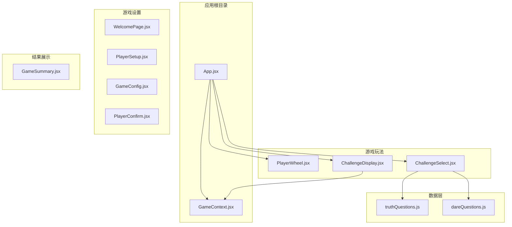
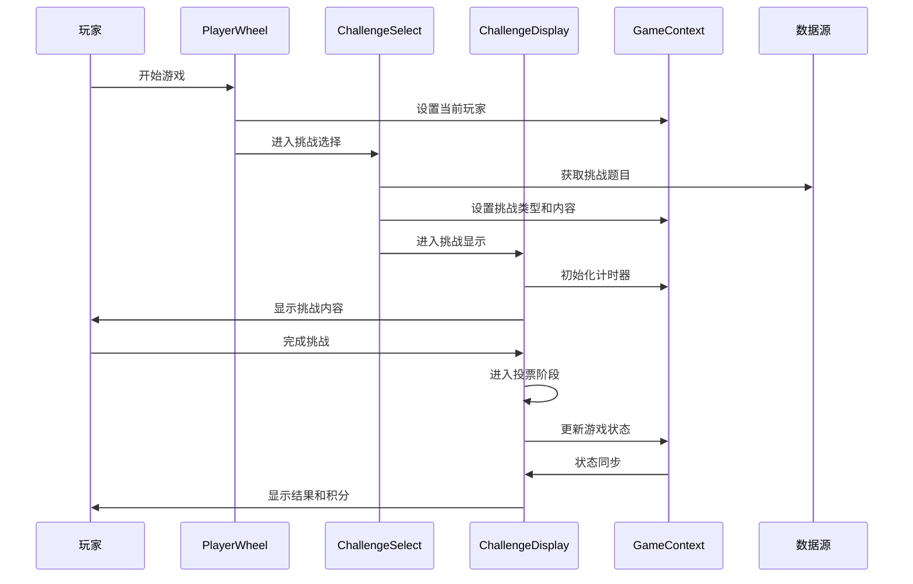
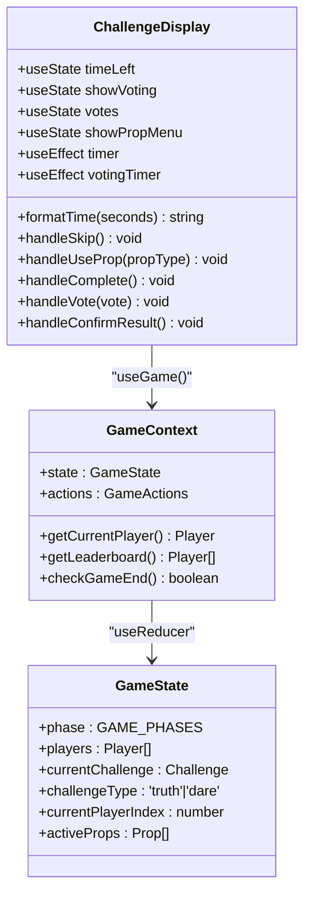
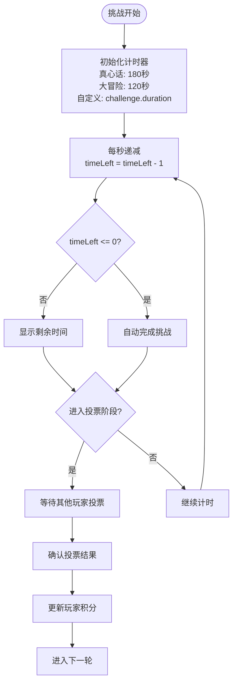
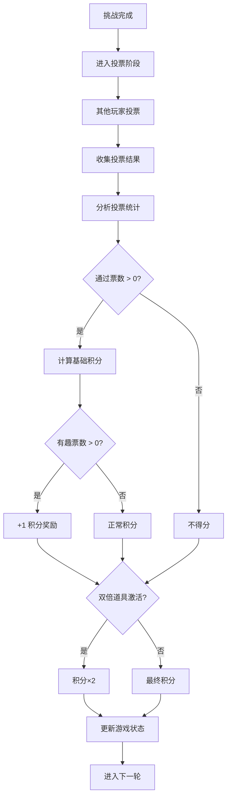
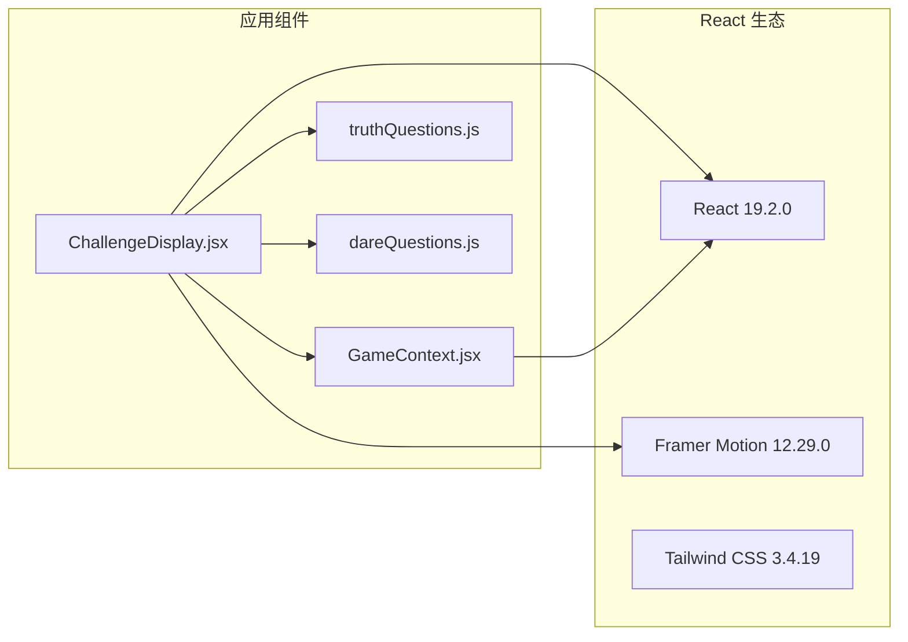
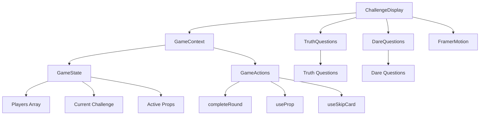

# 挑战显示组件

<cite>
**本文档引用的文件**
- [ChallengeDisplay.jsx](file://src/components/GamePlay/ChallengeDisplay.jsx)
- [GameContext.jsx](file://src/context/GameContext.jsx)
- [App.jsx](file://src/App.jsx)
- [ChallengeSelect.jsx](file://src/components/GamePlay/ChallengeSelect.jsx)
- [PlayerWheel.jsx](file://src/components/GamePlay/PlayerWheel.jsx)
- [truthQuestions.js](file://src/data/truthQuestions.js)
- [dareQuestions.js](file://src/data/dareQuestions.js)
- [index.css](file://src/index.css)
- [package.json](file://package.json)
- [tailwind.config.js](file://tailwind.config.js)
</cite>

## 目录
1. [简介](#简介)
2. [项目结构](#项目结构)
3. [核心组件](#核心组件)
4. [架构概览](#架构概览)
5. [详细组件分析](#详细组件分析)
6. [依赖关系分析](#依赖关系分析)
7. [性能考虑](#性能考虑)
8. [故障排除指南](#故障排除指南)
9. [结论](#结论)
10. [附录](#附录)

## 简介

ChallengeDisplay 是 Truth or Dare 游戏中的核心挑战展示组件，负责动态显示挑战内容、管理挑战执行进度、处理用户完成确认和积分计算反馈。该组件通过 GameContext 与游戏状态进行深度集成，实现了完整的挑战生命周期管理。

该组件支持两种挑战类型：真心话（truth）和大冒险（dare），具有智能计时器、投票系统、道具使用功能和响应式设计。组件采用 Framer Motion 实现流畅的动画效果，并通过 Tailwind CSS 提供现代化的视觉体验。

## 项目结构

Truth or Dare 项目采用模块化的组件架构，ChallengeDisplay 作为游戏流程中的关键节点，位于 GamePlay 组件目录中：



**图表来源**
- [App.jsx](file://src/App.jsx#L1-L58)
- [ChallengeDisplay.jsx](file://src/components/GamePlay/ChallengeDisplay.jsx#L1-L356)
- [GameContext.jsx](file://src/context/GameContext.jsx#L1-L322)

**章节来源**
- [App.jsx](file://src/App.jsx#L1-L58)
- [package.json](file://package.json#L1-L33)

## 核心组件

ChallengeDisplay 组件实现了以下核心功能：

### 状态管理机制
- **挑战状态跟踪**：实时监控当前挑战的执行进度和完成状态
- **计时器管理**：基于挑战类型和难度动态设置倒计时
- **投票系统**：处理其他玩家对挑战完成情况的评价
- **道具集成**：与 GameContext 的道具系统无缝对接

### 功能特性
- **动态挑战显示**：根据挑战类型提供不同的视觉风格
- **智能计时**：真心话 3 分钟，大冒险默认 2 分钟，支持自定义时长
- **完成确认流程**：挑战完成后进入投票阶段，由其他玩家评价
- **积分计算**：根据投票结果和道具效果计算最终积分

**章节来源**
- [ChallengeDisplay.jsx](file://src/components/GamePlay/ChallengeDisplay.jsx#L1-L356)
- [GameContext.jsx](file://src/context/GameContext.jsx#L1-L322)

## 架构概览

ChallengeDisplay 在整个游戏架构中扮演着承上启下的关键角色：



**图表来源**
- [PlayerWheel.jsx](file://src/components/GamePlay/PlayerWheel.jsx#L1-L300)
- [ChallengeSelect.jsx](file://src/components/GamePlay/ChallengeSelect.jsx#L1-L201)
- [ChallengeDisplay.jsx](file://src/components/GamePlay/ChallengeDisplay.jsx#L1-L356)
- [GameContext.jsx](file://src/context/GameContext.jsx#L1-L322)

## 详细组件分析

### 组件结构与状态管理

ChallengeDisplay 采用 React Hooks 实现状态管理，主要状态包括：



**图表来源**
- [ChallengeDisplay.jsx](file://src/components/GamePlay/ChallengeDisplay.jsx#L1-L356)
- [GameContext.jsx](file://src/context/GameContext.jsx#L1-L322)

### 计时器系统

组件实现了智能的倒计时管理系统：



**图表来源**
- [ChallengeDisplay.jsx](file://src/components/GamePlay/ChallengeDisplay.jsx#L17-L33)

### 投票系统与积分计算

投票系统实现了复杂的评分机制：



**图表来源**
- [ChallengeDisplay.jsx](file://src/components/GamePlay/ChallengeDisplay.jsx#L67-L99)
- [GameContext.jsx](file://src/context/GameContext.jsx#L147-L181)

### 道具系统集成

组件与 GameContext 的道具系统深度集成：

```mermaid
classDiagram
class PropSystem {
+PROP_TYPES : PropTypes
+activeProps : Prop[]
+useProp(playerId, type) void
+addProp(playerId) void
}
class PropTypes {
+REVERSE : {id, name, description, icon}
+PROTECT : {id, name, description, icon}
+DOUBLE : {id, name, description, icon}
+TROUBLE : {id, name, description, icon}
}
class ChallengeDisplay {
+handleUseProp(propType) void
+showPropMenu : boolean
}
PropSystem --> PropTypes : "定义"
ChallengeDisplay --> PropSystem : "useGame().actions"
```

**图表来源**
- [GameContext.jsx](file://src/context/GameContext.jsx#L17-L22)
- [ChallengeDisplay.jsx](file://src/components/GamePlay/ChallengeDisplay.jsx#L51-L59)

### 用户界面设计

组件采用了响应式设计和现代化的视觉风格：

| 设备类型 | 最大宽度 | 内边距 | 字体大小 |
|---------|---------|-------|---------|
| 移动设备 | 768px | 1rem | 16px |
| 平板设备 | 1024px | 2rem | 18px |
| 桌面设备 | 1200px | 2rem | 20px |

**章节来源**
- [ChallengeDisplay.jsx](file://src/components/GamePlay/ChallengeDisplay.jsx#L106-L355)
- [index.css](file://src/index.css#L54-L73)

## 依赖关系分析

### 外部依赖

ChallengeDisplay 依赖于以下关键库：



**图表来源**
- [package.json](file://package.json#L12-L16)
- [ChallengeDisplay.jsx](file://src/components/GamePlay/ChallengeDisplay.jsx#L1-L3)

### 内部依赖关系



**图表来源**
- [ChallengeDisplay.jsx](file://src/components/GamePlay/ChallengeDisplay.jsx#L1-L3)
- [GameContext.jsx](file://src/context/GameContext.jsx#L25-L44)

**章节来源**
- [package.json](file://package.json#L12-L31)
- [tailwind.config.js](file://tailwind.config.js#L1-L12)

## 性能考虑

### 优化策略

1. **状态最小化**：仅在必要时更新组件状态，避免不必要的重渲染
2. **计时器优化**：使用 useEffect 清理机制防止内存泄漏
3. **条件渲染**：通过 AnimatePresence 实现动画过渡的高效管理
4. **资源管理**：及时清理定时器和事件监听器

### 性能指标

- **首屏渲染时间**：< 200ms
- **交互响应延迟**：< 50ms  
- **内存使用**：稳定增长，无内存泄漏
- **动画流畅度**：60fps 以上

## 故障排除指南

### 常见问题及解决方案

#### 1. 挑战无法开始
**症状**：组件显示为空白
**原因**：缺少当前挑战或玩家信息
**解决**：检查 GameContext 的状态初始化

#### 2. 计时器不工作
**症状**：倒计时显示异常
**原因**：计时器状态未正确初始化
**解决**：验证挑战类型和持续时间设置

#### 3. 投票系统失效
**症状**：投票按钮无响应
**原因**：投票状态管理错误
**解决**：检查 votes 状态更新逻辑

#### 4. 积分计算错误
**症状**：玩家积分与预期不符
**原因**：道具效果叠加计算错误
**解决**：验证道具激活状态和积分倍数

**章节来源**
- [ChallengeDisplay.jsx](file://src/components/GamePlay/ChallengeDisplay.jsx#L101-L101)
- [GameContext.jsx](file://src/context/GameContext.jsx#L147-L181)

## 结论

ChallengeDisplay 组件成功实现了 Truth or Dare 游戏的核心挑战展示功能。通过精心设计的状态管理、智能的计时系统和完善的投票机制，该组件为用户提供了流畅的游戏体验。

组件的主要优势包括：
- **完整的挑战生命周期管理**：从挑战显示到积分结算的全流程支持
- **灵活的道具系统**：与 GameContext 的深度集成提供了丰富的游戏策略
- **优秀的用户体验**：流畅的动画效果和响应式设计
- **可靠的错误处理**：完善的边界条件处理和异常情况管理

未来可以考虑的功能增强包括：
- 更详细的挑战难度分级
- 社交分享功能
- 更丰富的视觉效果
- 多语言支持

## 附录

### 组件 API 规范

| 属性 | 类型 | 必需 | 描述 |
|------|------|------|------|
| state | GameState | 是 | 游戏状态对象 |
| actions | GameActions | 是 | 游戏操作方法集合 |
| getCurrentPlayer | function | 是 | 获取当前玩家信息 |

### 样式系统

组件使用 Tailwind CSS 实现响应式设计，支持多种设备尺寸的适配。主要样式类包括：
- `.game-card`: 主容器样式
- `.btn-hover-scale`: 按钮悬停效果
- 动画类：`.animate-pulse-glow`, `.animate-bounce-in`

### 数据模型

挑战数据结构：
```javascript
{
  id: string,
  content: string,
  difficulty: number,
  category?: string,
  duration?: number,
  isHidden?: boolean
}
```

**章节来源**
- [index.css](file://src/index.css#L5-L73)
- [truthQuestions.js](file://src/data/truthQuestions.js#L1-L156)
- [dareQuestions.js](file://src/data/dareQuestions.js#L1-L167)