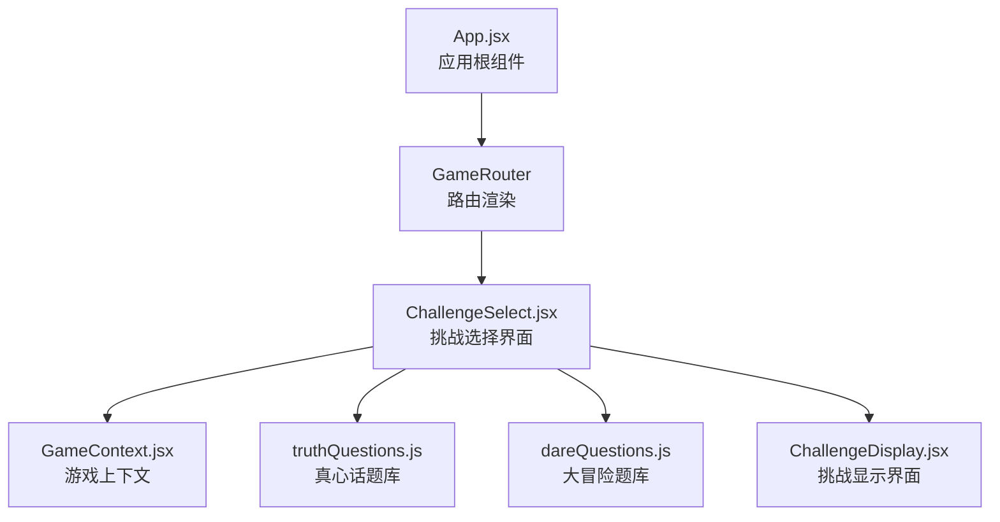
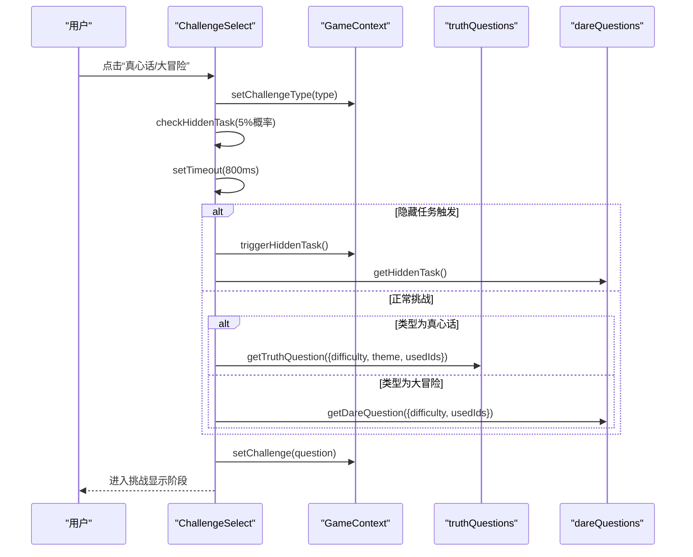
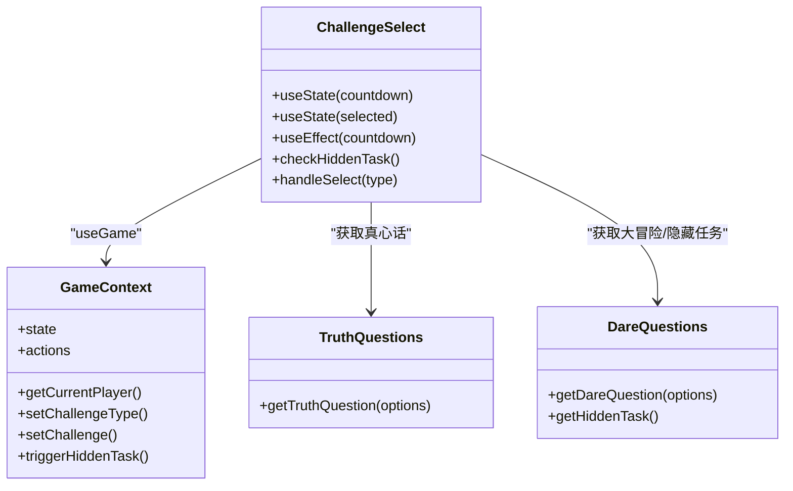

# 挑战选择组件

<cite>
**本文档引用的文件**
- [ChallengeSelect.jsx](file://src/components/GamePlay/ChallengeSelect.jsx)
- [GameContext.jsx](file://src/context/GameContext.jsx)
- [truthQuestions.js](file://src/data/truthQuestions.js)
- [dareQuestions.js](file://src/data/dareQuestions.js)
- [ChallengeDisplay.jsx](file://src/components/GamePlay/ChallengeDisplay.jsx)
- [App.jsx](file://src/App.jsx)
- [index.css](file://src/index.css)
</cite>

## 目录
1. [简介](#简介)
2. [项目结构](#项目结构)
3. [核心组件](#核心组件)
4. [架构总览](#架构总览)
5. [详细组件分析](#详细组件分析)
6. [依赖关系分析](#依赖关系分析)
7. [性能考虑](#性能考虑)
8. [故障排除指南](#故障排除指南)
9. [结论](#结论)
10. [附录](#附录)

## 简介
本文件为 ChallengeSelect 组件的详细技术文档，聚焦于挑战选择界面的实现细节，包括：
- Framer Motion 卡片翻转与入场/出场动画
- 悬停与按压交互效果
- 点击响应与状态流转
- 组件状态管理（挑战类型选择、动画状态控制、用户反馈）
- 从 GameContext 获取挑战数据并进行筛选
- 动画自定义配置与性能优化建议
- 响应式设计与移动端适配
- 可访问性与键盘导航支持
- 常见动画问题的解决方案与调试方法

## 项目结构
ChallengeSelect 组件位于游戏玩法模块中，与 GameContext 共享全局状态，并通过 Framer Motion 实现流畅的动画体验。整体结构如下图所示：

图表来源
- [App.jsx](file://src/App.jsx#L13-L45)
- [ChallengeSelect.jsx](file://src/components/GamePlay/ChallengeSelect.jsx#L1-L201)
- [GameContext.jsx](file://src/context/GameContext.jsx#L1-L322)
- [truthQuestions.js](file://src/data/truthQuestions.js#L1-L156)
- [dareQuestions.js](file://src/data/dareQuestions.js#L1-L167)
- [ChallengeDisplay.jsx](file://src/components/GamePlay/ChallengeDisplay.jsx#L1-L356)

章节来源
- [App.jsx](file://src/App.jsx#L13-L45)
- [ChallengeSelect.jsx](file://src/components/GamePlay/ChallengeSelect.jsx#L1-L201)

## 核心组件
ChallengeSelect 是游戏流程中的关键节点，负责：
- 展示当前玩家信息与提示
- 提供“真心话/大冒险”二选一按钮
- 实现倒计时自动选择逻辑
- 触发隐藏任务的概率事件
- 从题库中筛选并生成挑战内容
- 将挑战类型与挑战内容传递至下一阶段

章节来源
- [ChallengeSelect.jsx](file://src/components/GamePlay/ChallengeSelect.jsx#L7-L75)
- [GameContext.jsx](file://src/context/GameContext.jsx#L108-L139)

## 架构总览
ChallengeSelect 的工作流如下：

图表来源
- [ChallengeSelect.jsx](file://src/components/GamePlay/ChallengeSelect.jsx#L38-L71)
- [GameContext.jsx](file://src/context/GameContext.jsx#L124-L139)
- [truthQuestions.js](file://src/data/truthQuestions.js#L125-L155)
- [dareQuestions.js](file://src/data/dareQuestions.js#L129-L151)

## 详细组件分析

### 状态管理与生命周期
- 倒计时状态 countdown：用于自动选择挑战类型，10 秒后随机选择“真心话/大冒险”，并在倒计时结束时触发 handleSelect。
- 选择状态 selected：防止重复选择；一旦选定，按钮禁用并高亮显示。
- 通过 useGame 获取当前玩家信息与全局动作，确保与游戏流程一致。

章节来源
- [ChallengeSelect.jsx](file://src/components/GamePlay/ChallengeSelect.jsx#L9-L27)
- [ChallengeSelect.jsx](file://src/components/GamePlay/ChallengeSelect.jsx#L38-L42)

### 动画与交互
- 入场/出场动画：组件使用 Framer Motion 的 initial/animate/exist 控制整屏卡片的淡入与淡出。
- 玩家头像动画：使用 spring 类型过渡，增强视觉反馈。
- 倒计时数字动画：每次数值变化时，通过 key 标记触发独立动画，避免闪烁。
- 按钮交互：whileHover/whileTap 提供悬停放大与按压缩小的触觉反馈；disabled 状态阻止二次选择。

章节来源
- [ChallengeSelect.jsx](file://src/components/GamePlay/ChallengeSelect.jsx#L77-L82)
- [ChallengeSelect.jsx](file://src/components/GamePlay/ChallengeSelect.jsx#L87-L95)
- [ChallengeSelect.jsx](file://src/components/GamePlay/ChallengeSelect.jsx#L103-L114)
- [ChallengeSelect.jsx](file://src/components/GamePlay/ChallengeSelect.jsx#L120-L124)
- [ChallengeSelect.jsx](file://src/components/GamePlay/ChallengeSelect.jsx#L147-L151)

### 数据筛选与挑战生成
- 隐藏任务：5% 概率触发，生成特殊挑战并标记 isHidden。
- 真心话：根据难度与主题过滤题库，结合已使用 ID 避免重复；若无可用题则重置使用记录。
- 大冒险：根据难度过滤题库，结合已使用 ID 避免重复；若无可用任务则重置使用记录。
- 生成后通过 setChallenge 写入 GameContext，驱动下一阶段渲染。

章节来源
- [ChallengeSelect.jsx](file://src/components/GamePlay/ChallengeSelect.jsx#L29-L36)
- [ChallengeSelect.jsx](file://src/components/GamePlay/ChallengeSelect.jsx#L48-L70)
- [truthQuestions.js](file://src/data/truthQuestions.js#L125-L155)
- [dareQuestions.js](file://src/data/dareQuestions.js#L129-L151)

### 用户反馈机制
- 选中状态高亮：按钮在选中后放大并切换主色，配合对勾图标明确反馈。
- 倒计时颜色变化：当剩余时间小于等于 3 秒时，数字变为红色，提醒时间紧迫。
- 玩家信息展示：实时显示跳过卡数量与当前积分，以及拥有的道具列表。

章节来源
- [ChallengeSelect.jsx](file://src/components/GamePlay/ChallengeSelect.jsx#L126-L130)
- [ChallengeSelect.jsx](file://src/components/GamePlay/ChallengeSelect.jsx#L107-L110)
- [ChallengeSelect.jsx](file://src/components/GamePlay/ChallengeSelect.jsx#L175-L191)

### 与 GameContext 的集成
- 通过 useGame 获取 state/actions/getCurrentPlayer，确保与全局状态同步。
- setChallengeType 与 setChallenge 在 ChallengeSelect 中被调用，驱动 phase 切换至挑战显示阶段。
- triggerHiddenTask 用于标记隐藏任务触发，便于后续渲染与逻辑处理。

章节来源
- [ChallengeSelect.jsx](file://src/components/GamePlay/ChallengeSelect.jsx#L8-L11)
- [GameContext.jsx](file://src/context/GameContext.jsx#L260-L279)
- [GameContext.jsx](file://src/context/GameContext.jsx#L124-L139)

### 与题库的数据交互
- 真心话题库：按难度与主题过滤，支持混合主题；若过滤后为空则仅按主题重置。
- 大冒险题库：按难度过滤；若过滤后为空则按难度重置。
- 隐藏任务：固定集合，随机抽取。

章节来源
- [truthQuestions.js](file://src/data/truthQuestions.js#L125-L155)
- [dareQuestions.js](file://src/data/dareQuestions.js#L129-L151)
- [dareQuestions.js](file://src/data/dareQuestions.js#L154-L166)

### 动画效果自定义配置
- 入场/出场：opacity/scale 缓动，适合全屏卡片切换。
- 玩家头像：spring 类型，持续时间可调整，增强欢迎感。
- 倒计时数字：每次 key 变化触发独立动画，避免重复渲染抖动。
- 按钮交互：scale 变化范围与过渡时长可微调，平衡触觉反馈与性能。

章节来源
- [ChallengeSelect.jsx](file://src/components/GamePlay/ChallengeSelect.jsx#L77-L82)
- [ChallengeSelect.jsx](file://src/components/GamePlay/ChallengeSelect.jsx#L87-L95)
- [ChallengeSelect.jsx](file://src/components/GamePlay/ChallengeSelect.jsx#L103-L114)
- [ChallengeSelect.jsx](file://src/components/GamePlay/ChallengeSelect.jsx#L120-L124)
- [ChallengeSelect.jsx](file://src/components/GamePlay/ChallengeSelect.jsx#L147-L151)

### 响应式设计与移动端适配
- 使用 Tailwind 的响应式断点（md: p-8），在桌面端提供更大内边距。
- grid-cols-2 在小屏设备上自动换行，保证按钮布局稳定。
- 卡片容器 game-card 提供圆角与阴影，提升移动端可读性。
- 文字大小与间距采用相对单位，适配不同屏幕尺寸。

章节来源
- [ChallengeSelect.jsx](file://src/components/GamePlay/ChallengeSelect.jsx#L84)
- [ChallengeSelect.jsx](file://src/components/GamePlay/ChallengeSelect.jsx#L118-L172)
- [index.css](file://src/index.css#L54-L59)

### 可访问性与键盘导航支持
- 当前实现主要依赖鼠标交互（hover/tap），未显式添加键盘导航属性（如 tabIndex、aria-*）。
- 建议补充：
  - 为按钮添加 role="button" 与 aria-disabled，确保屏幕阅读器正确识别禁用状态。
  - 为可交互元素添加 tabIndex，支持键盘 Tab 导航与 Enter/Space 触发。
  - 为倒计时与提示文本添加 aria-live 或 aria-label，提升动态信息的可访问性。

章节来源
- [ChallengeSelect.jsx](file://src/components/GamePlay/ChallengeSelect.jsx#L120-L124)
- [ChallengeSelect.jsx](file://src/components/GamePlay/ChallengeSelect.jsx#L147-L151)

## 依赖关系分析

图表来源
- [ChallengeSelect.jsx](file://src/components/GamePlay/ChallengeSelect.jsx#L1-L201)
- [GameContext.jsx](file://src/context/GameContext.jsx#L256-L321)
- [truthQuestions.js](file://src/data/truthQuestions.js#L125-L155)
- [dareQuestions.js](file://src/data/dareQuestions.js#L129-L166)

章节来源
- [ChallengeSelect.jsx](file://src/components/GamePlay/ChallengeSelect.jsx#L1-L201)
- [GameContext.jsx](file://src/context/GameContext.jsx#L1-L322)

## 性能考虑
- 动画性能
  - 合理使用 opacity/scale，避免复杂阴影与滤镜导致的重绘开销。
  - 对频繁更新的数字（倒计时）使用 key 变化触发独立动画，减少不必要的重排。
- 状态更新
  - useEffect 中的定时器在组件卸载时清理，避免内存泄漏。
  - 通过 selected 状态防重复选择，减少无效渲染。
- 数据筛选
  - 题库过滤后若为空，优先按主题/难度重置，避免无限循环或阻塞。
- 渲染优化
  - 使用 Framer Motion 的 exit 动画与 AnimatePresence 结合，确保组件切换时的流畅性。
  - 在 ChallengeDisplay 中，投票区域使用 AnimatePresence 控制显隐，避免不必要的 DOM 更新。

章节来源
- [ChallengeSelect.jsx](file://src/components/GamePlay/ChallengeSelect.jsx#L14-L27)
- [ChallengeSelect.jsx](file://src/components/GamePlay/ChallengeSelect.jsx#L38-L71)
- [truthQuestions.js](file://src/data/truthQuestions.js#L145-L150)
- [dareQuestions.js](file://src/data/dareQuestions.js#L144-L147)
- [App.jsx](file://src/App.jsx#L41-L44)

## 故障排除指南
- 动画不生效
  - 检查 Framer Motion 是否正确引入与版本兼容。
  - 确认组件包裹在 AnimatePresence 中，且 key 发生变化。
- 倒计时不更新
  - 确保 useEffect 的依赖数组包含 countdown，且在倒计时结束时正确触发 handleSelect。
- 无法选择挑战类型
  - 检查 selected 状态是否被提前设置；disabled 属性是否正确绑定。
- 题库为空
  - 确认 usedIds 是否正确传入；若过滤后为空，应触发重置逻辑。
- 隐藏任务未触发
  - 检查概率阈值与 triggerHiddenTask 是否被调用；确认 setChallenge 中 isHidden 字段存在。

章节来源
- [ChallengeSelect.jsx](file://src/components/GamePlay/ChallengeSelect.jsx#L14-L27)
- [ChallengeSelect.jsx](file://src/components/GamePlay/ChallengeSelect.jsx#L38-L71)
- [truthQuestions.js](file://src/data/truthQuestions.js#L145-L150)
- [dareQuestions.js](file://src/data/dareQuestions.js#L144-L147)

## 结论
ChallengeSelect 组件通过清晰的状态管理与 Framer Motion 动画，实现了流畅的挑战选择体验。其与 GameContext 的紧密耦合确保了全局状态的一致性，与题库的数据交互提供了丰富的挑战内容。建议在后续迭代中增强可访问性支持与性能监控，以进一步提升用户体验与稳定性。

## 附录
- 与下一阶段的衔接：ChallengeSelect 完成挑战类型与内容的选择后，通过 setChallenge 将挑战写入上下文，驱动路由切换至 ChallengeDisplay，进入挑战展示与投票环节。
- 动画配置参考：入场/出场、spring 过渡、scale 变化等参数可根据产品需求进行微调，以达到最佳的视觉与性能平衡。

章节来源
- [ChallengeSelect.jsx](file://src/components/GamePlay/ChallengeSelect.jsx#L48-L70)
- [GameContext.jsx](file://src/context/GameContext.jsx#L130-L139)
- [ChallengeDisplay.jsx](file://src/components/GamePlay/ChallengeDisplay.jsx#L1-L356)