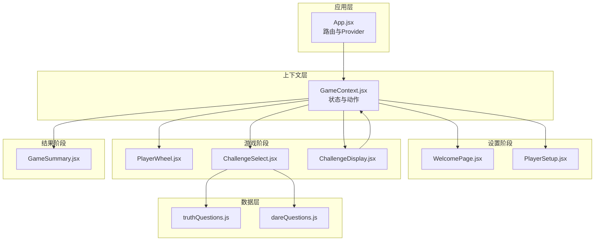
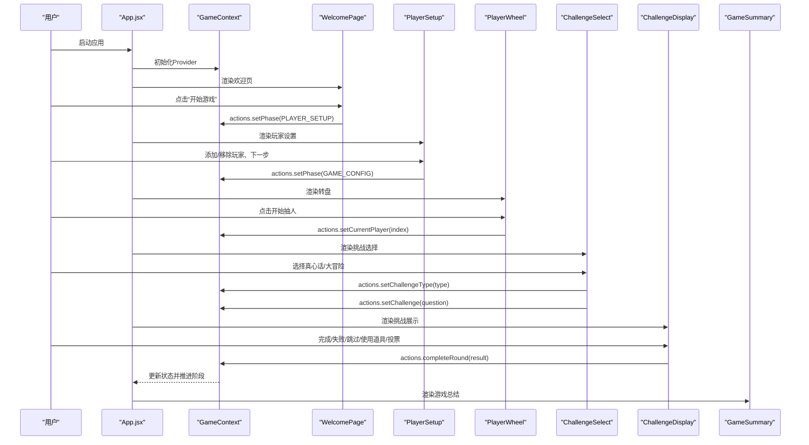
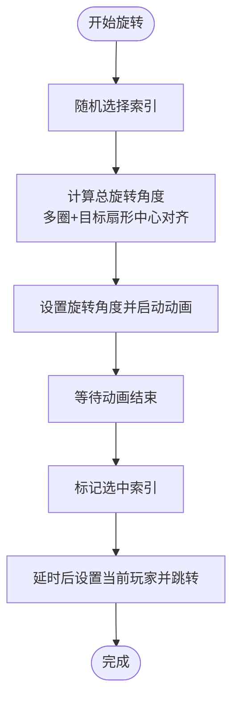
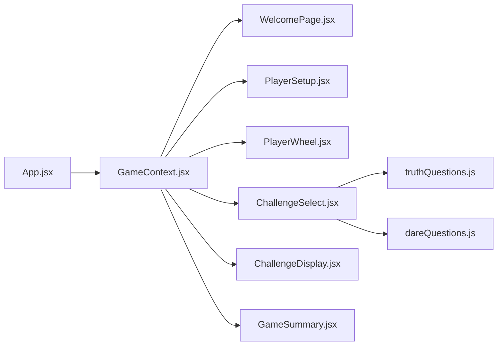

# 核心组件

<cite>
**本文引用的文件**
- [App.jsx](file://src/App.jsx)
- [GameContext.jsx](file://src/context/GameContext.jsx)
- [WelcomePage.jsx](file://src/components/GameSetup/WelcomePage.jsx)
- [PlayerSetup.jsx](file://src/components/GameSetup/PlayerSetup.jsx)
- [PlayerWheel.jsx](file://src/components/GamePlay/PlayerWheel.jsx)
- [ChallengeSelect.jsx](file://src/components/GamePlay/ChallengeSelect.jsx)
- [ChallengeDisplay.jsx](file://src/components/GamePlay/ChallengeDisplay.jsx)
- [GameSummary.jsx](file://src/components/Results/GameSummary.jsx)
- [truthQuestions.js](file://src/data/truthQuestions.js)
- [dareQuestions.js](file://src/data/dareQuestions.js)
</cite>

## 目录
1. [简介](#简介)
2. [项目结构](#项目结构)
3. [核心组件](#核心组件)
4. [架构总览](#架构总览)
5. [详细组件分析](#详细组件分析)
6. [依赖关系分析](#依赖关系分析)
7. [性能考量](#性能考量)
8. [故障排查指南](#故障排查指南)
9. [结论](#结论)
10. [附录](#附录)

## 简介
本文件面向 Truth or Dare 项目的前端核心组件，围绕 WelcomePage、PlayerSetup、PlayerWheel、ChallengeSelect、ChallengeDisplay 与 GameSummary 进行深入解析。内容涵盖：
- 组件职责与数据流
- Props 接口与状态管理
- 生命周期与动画实现（重点在 PlayerWheel 与 ChallengeSelect 的 Framer Motion 使用）
- 组件间通信与数据传递
- 使用示例与最佳实践
- 可复用性与扩展性设计
- 调试与测试建议

## 项目结构
应用采用 React + Framer Motion + TailwindCSS 架构，使用自定义 GameContext 管理全局游戏状态与动作，App.jsx 作为路由入口，按游戏阶段渲染不同页面组件。

图表来源
- [App.jsx](file://src/App.jsx#L14-L48)
- [GameContext.jsx](file://src/context/GameContext.jsx#L257-L313)
- [WelcomePage.jsx](file://src/components/GameSetup/WelcomePage.jsx#L1-L88)
- [PlayerSetup.jsx](file://src/components/GameSetup/PlayerSetup.jsx#L1-L197)
- [PlayerWheel.jsx](file://src/components/GamePlay/PlayerWheel.jsx#L1-L300)
- [ChallengeSelect.jsx](file://src/components/GamePlay/ChallengeSelect.jsx#L1-L201)
- [ChallengeDisplay.jsx](file://src/components/GamePlay/ChallengeDisplay.jsx#L1-L356)
- [GameSummary.jsx](file://src/components/Results/GameSummary.jsx#L1-L224)
- [truthQuestions.js](file://src/data/truthQuestions.js#L125-L155)
- [dareQuestions.js](file://src/data/dareQuestions.js#L129-L166)

章节来源
- [App.jsx](file://src/App.jsx#L1-L61)
- [GameContext.jsx](file://src/context/GameContext.jsx#L1-L323)

## 核心组件
本节概述各组件的职责、状态与交互要点，并指出其在整体流程中的位置。

- WelcomePage：欢迎页，引导进入玩家设置阶段；使用 Framer Motion 实现入场与悬停/点击反馈。
- PlayerSetup：玩家添加与校验，支持快速填充与返回/下一步导航。
- PlayerWheel：转盘选人，含旋转动画、选中反馈、进度条与排行榜预览。
- ChallengeSelect：挑战类型选择，含倒计时自动选择与隐藏任务触发逻辑。
- ChallengeDisplay：挑战展示与计时，投票确认、道具使用、跳过卡与结果结算。
- GameSummary：游戏结束统计与奖励展示，支持“原班人马再玩”与“返回首页”。

章节来源
- [WelcomePage.jsx](file://src/components/GameSetup/WelcomePage.jsx#L1-L88)
- [PlayerSetup.jsx](file://src/components/GameSetup/PlayerSetup.jsx#L1-L197)
- [PlayerWheel.jsx](file://src/components/GamePlay/PlayerWheel.jsx#L1-L300)
- [ChallengeSelect.jsx](file://src/components/GamePlay/ChallengeSelect.jsx#L1-L201)
- [ChallengeDisplay.jsx](file://src/components/GamePlay/ChallengeDisplay.jsx#L1-L356)
- [GameSummary.jsx](file://src/components/Results/GameSummary.jsx#L1-L224)

## 架构总览
组件间通过 GameContext 提供的状态与动作进行解耦通信。App.jsx 使用 AnimatePresence 控制页面切换动画，按 GAME_PHASES 渲染对应组件。

图表来源
- [App.jsx](file://src/App.jsx#L14-L48)
- [GameContext.jsx](file://src/context/GameContext.jsx#L261-L300)
- [PlayerWheel.jsx](file://src/components/GamePlay/PlayerWheel.jsx#L31-L62)
- [ChallengeSelect.jsx](file://src/components/GamePlay/ChallengeSelect.jsx#L38-L71)
- [ChallengeDisplay.jsx](file://src/components/GamePlay/ChallengeDisplay.jsx#L62-L99)
- [GameSummary.jsx](file://src/components/Results/GameSummary.jsx#L29-L38)

## 详细组件分析

### WelcomePage 组件
- 职责：欢迎页入口，引导进入玩家设置阶段。
- 动画：入场透明度与位移动画；Logo 弹簧动画；按钮悬停/点击缩放反馈。
- 数据与通信：通过 useGame 获取 actions，调用 setPhase 切换到 PLAYER_SETUP。
- 可复用性：可作为通用欢迎页模板，仅需替换文案与跳转阶段。

章节来源
- [WelcomePage.jsx](file://src/components/GameSetup/WelcomePage.jsx#L1-L88)
- [GameContext.jsx](file://src/context/GameContext.jsx#L261-L262)

### PlayerSetup 组件
- 职责：添加/移除玩家，校验重复与数量上限，快速填充，导航至配置阶段。
- 状态：本地表单状态（新玩家名称、错误提示），受 GameContext 管理的全局玩家列表驱动。
- 动画：列表项入场/退出动画，错误提示 AnimatePresence 控制显隐。
- 交互：回车添加、下一步按钮禁用逻辑（人数≥4）、快速添加按钮去重与上限控制。
- 最佳实践：输入校验与错误提示应与用户期望一致；列表滚动与占位图提升体验。

章节来源
- [PlayerSetup.jsx](file://src/components/GameSetup/PlayerSetup.jsx#L1-L197)
- [GameContext.jsx](file://src/context/GameContext.jsx#L261-L267)

### PlayerWheel 组件
- 职责：转盘选人，计算扇形角度与颜色，执行旋转动画，展示选中结果与排行榜预览。
- 状态：旋转状态、选中索引、累计旋转角度、定时器引用。
- 动画：SVG 转盘旋转（4秒缓动曲线），选中后弹出祝贺动画，按钮悬停/点击缩放。
- 逻辑：随机选人、多圈旋转+目标扇形中心对齐；定时器清理；游戏结束检查。
- 可复用性：转盘参数（尺寸、半径、颜色数组）可抽象为配置；支持不同玩家数量的布局适配。

图表来源
- [PlayerWheel.jsx](file://src/components/GamePlay/PlayerWheel.jsx#L31-L62)

章节来源
- [PlayerWheel.jsx](file://src/components/GamePlay/PlayerWheel.jsx#L1-L300)
- [GameContext.jsx](file://src/context/GameContext.jsx#L295-L300)

### ChallengeSelect 组件
- 职责：当前玩家选择挑战类型（真心话/大冒险），倒计时自动选择，隐藏任务触发。
- 状态：倒计时、选择状态、当前玩家。
- 动画：页面切换缩放动画，倒计时数字关键帧动画，按钮悬停/点击缩放，选中态放大与勾选图标。
- 逻辑：倒计时递减，0时随机选择；隐藏任务 5% 触发概率；根据配置与已用题库获取题目并进入挑战展示阶段。
- 可复用性：可抽取“倒计时选择”为独立子组件；题库接口可注入以支持外部扩展。

章节来源
- [ChallengeSelect.jsx](file://src/components/GamePlay/ChallengeSelect.jsx#L1-L201)
- [truthQuestions.js](file://src/data/truthQuestions.js#L125-L155)
- [dareQuestions.js](file://src/data/dareQuestions.js#L129-L166)

### ChallengeDisplay 组件
- 职责：展示挑战内容与计时，处理完成/失败/跳过、投票确认、道具使用与结算。
- 状态：剩余时间、投票状态、投票结果、道具菜单开关。
- 动画：挑战内容淡入，投票区域 AnimatePresence 控制显隐，按钮悬停/点击缩放。
- 逻辑：根据挑战类型设置计时；投票规则（通过/有趣/需解释）；双倍道具生效；跳过卡消耗与扣分；隐藏任务展示。
- 可复用性：投票面板可抽取为独立组件；计时器封装为 Hook；道具系统可扩展更多类型。

章节来源
- [ChallengeDisplay.jsx](file://src/components/GamePlay/ChallengeDisplay.jsx#L1-L356)
- [GameContext.jsx](file://src/context/GameContext.jsx#L148-L182)

### GameSummary 组件
- 职责：游戏结束统计、排行榜、特别奖项与精彩回顾，提供“原班人马再玩”与“返回首页”。
- 动画：入场缩放、逐项入场延迟、卡片高亮与边框渐变。
- 逻辑：计算冠军、幽默之王、勇气之星；统计总轮数、完成挑战数、真心话/大冒险次数、跳过次数；支持重置与重新开始。
- 可复用性：奖项与统计可抽取为通用统计模块；支持导出回顾内容。

章节来源
- [GameSummary.jsx](file://src/components/Results/GameSummary.jsx#L1-L224)
- [GameContext.jsx](file://src/context/GameContext.jsx#L290-L293)

## 依赖关系分析
- 组件依赖 GameContext 提供的状态与动作，避免跨层级传递。
- App.jsx 通过 GAME_PHASES 控制渲染，配合 AnimatePresence 实现页面切换动画。
- ChallengeSelect 与 ChallengeDisplay 依赖 truthQuestions 与 dareQuestions 的题库函数。
- PlayerWheel 依赖 GameContext 的 checkGameEnd 与 getLeaderboard 辅助函数。

图表来源
- [App.jsx](file://src/App.jsx#L14-L48)
- [GameContext.jsx](file://src/context/GameContext.jsx#L257-L313)
- [ChallengeSelect.jsx](file://src/components/GamePlay/ChallengeSelect.jsx#L3-L5)
- [truthQuestions.js](file://src/data/truthQuestions.js#L125-L155)
- [dareQuestions.js](file://src/data/dareQuestions.js#L129-L166)

章节来源
- [App.jsx](file://src/App.jsx#L1-L61)
- [GameContext.jsx](file://src/context/GameContext.jsx#L1-L323)

## 性能考量
- 动画性能：PlayerWheel 的 SVG 旋转使用 CSS transition 与缓动曲线，注意避免在高频重绘场景中叠加复杂 DOM；必要时可将转盘拆分为静态背景与动态指针层。
- 列表渲染：PlayerSetup 与 GameSummary 的列表使用 AnimatePresence，确保 key 正确且列表长度可控，避免大量节点同时动画。
- 计时器：ChallengeSelect 与 ChallengeDisplay 的计时器在组件卸载时清理，防止内存泄漏与竞态。
- 题库访问：ChallengeSelect 在选择后延迟获取题目，避免阻塞 UI；题库过滤与随机选择在客户端执行，建议在题库较大时考虑分页或预过滤策略。
- 上下文更新：GameContext 使用 useReducer，合理拆分 action 类型，避免不必要的全量重渲染。

## 故障排查指南
- 页面不切换：检查 App.jsx 的 GAME_PHASES 常量与 useGame.actions.setPhase 是否正确调用。
- 玩家无法添加：检查 PlayerSetup 的输入校验与 GameContext.actions.addPlayer 的调用链。
- 转盘不旋转：确认 PlayerWheel 的旋转角度计算与定时器清理逻辑；检查 isSpinning 状态与按钮禁用条件。
- 题目重复：检查 ChallengeSelect 的 usedIds 传入与 GameContext 的 usedQuestions 更新逻辑。
- 投票无效：确认 ChallengeDisplay 的 votes 状态与投票提交逻辑；检查单机模式下的投票模拟。
- 道具未生效：检查 GameContext.actions.useProp 与 activeProps 的更新；确认道具图标与描述映射。
- 游戏未结束：检查 GameContext.checkGameEnd 的时间计算与 actions.endGame 的触发。

章节来源
- [App.jsx](file://src/App.jsx#L14-L48)
- [PlayerSetup.jsx](file://src/components/GameSetup/PlayerSetup.jsx#L10-L27)
- [PlayerWheel.jsx](file://src/components/GamePlay/PlayerWheel.jsx#L31-L74)
- [ChallengeSelect.jsx](file://src/components/GamePlay/ChallengeSelect.jsx#L38-L71)
- [ChallengeDisplay.jsx](file://src/components/GamePlay/ChallengeDisplay.jsx#L62-L99)
- [GameContext.jsx](file://src/context/GameContext.jsx#L295-L300)

## 结论
本项目通过清晰的阶段划分与上下文驱动的状态管理，实现了从欢迎页到游戏总结的完整流程。PlayerWheel 与 ChallengeSelect 的动画增强了交互体验，GameContext 将业务逻辑集中于 reducer，便于维护与扩展。建议后续在题库规模扩大时优化筛选与缓存策略，在动画性能敏感场景引入更细粒度的渲染控制。

## 附录

### 组件 Props 接口与状态管理
- 组件均通过 useGame 获取 state 与 actions，无需显式 props。
- 状态来源：GameContext 提供 phase、players、config、currentRound、currentPlayerIndex、currentChallenge、challengeType、votes、gameStartTime、roundHistory、usedQuestions、activeProps、hiddenTaskTriggered 等。
- 动作来源：setPhase、addPlayer、removePlayer、updatePlayer、setConfig、startGame、setCurrentPlayer、setChallengeType、setChallenge、submitVote、completeRound、useSkipCard、useProp、addProp、resetGame、triggerHiddenTask、endGame、clearPlayers、getCurrentPlayer、getLeaderboard、checkGameEnd。

章节来源
- [GameContext.jsx](file://src/context/GameContext.jsx#L25-L45)
- [GameContext.jsx](file://src/context/GameContext.jsx#L261-L300)

### 组件间通信与数据传递
- App.jsx 依据 GAME_PHASES 渲染对应组件，形成单向数据流。
- 子组件通过 useGame.actions 修改状态，状态变化驱动 App.jsx 重新渲染当前组件。
- PlayerWheel 与 ChallengeDisplay 通过 GameContext 的辅助函数（getCurrentPlayer、getLeaderboard、checkGameEnd）获取派生数据。

章节来源
- [App.jsx](file://src/App.jsx#L14-L48)
- [GameContext.jsx](file://src/context/GameContext.jsx#L282-L300)

### 使用示例与最佳实践
- 示例：在 WelcomePage 中点击“开始游戏”后，通过 actions.setPhase 进入 PlayerSetup。
- 最佳实践：
  - 将动画与交互逻辑分离，保持组件职责单一。
  - 对计时器与副作用进行清理，避免内存泄漏。
  - 将题库与道具配置抽象为可注入的数据源，便于扩展。
  - 使用 AnimatePresence 控制列表项的进出动画，确保 key 唯一。

章节来源
- [WelcomePage.jsx](file://src/components/GameSetup/WelcomePage.jsx#L52-L61)
- [PlayerSetup.jsx](file://src/components/GameSetup/PlayerSetup.jsx#L180-L191)
- [ChallengeSelect.jsx](file://src/components/GamePlay/ChallengeSelect.jsx#L118-L172)
- [ChallengeDisplay.jsx](file://src/components/GamePlay/ChallengeDisplay.jsx#L248-L338)

### 可复用性与扩展性
- 可复用：将“倒计时选择”、“投票面板”、“道具菜单”抽取为独立组件；将题库与隐藏任务抽象为可注入模块。
- 扩展性：GameContext 的 ACTION_TYPES 与 reducer 易于新增动作；GAME_PHASES 可扩展新阶段；PROPS_TYPES 可新增道具类型。

章节来源
- [GameContext.jsx](file://src/context/GameContext.jsx#L48-L66)
- [GameContext.jsx](file://src/context/GameContext.jsx#L18-L23)
- [GameContext.jsx](file://src/context/GameContext.jsx#L257-L313)

### 动画效果实现要点
- PlayerWheel：SVG 转盘旋转使用 transition 与缓动曲线；选中后弹出祝贺动画；按钮悬停/点击缩放。
- ChallengeSelect：页面切换缩放、倒计时数字关键帧、按钮选中态放大与勾选图标。
- 通用：使用 AnimatePresence 控制列表项显隐；motion.div/motion.button 提供基础动画能力。

章节来源
- [PlayerWheel.jsx](file://src/components/GamePlay/PlayerWheel.jsx#L133-L298)
- [ChallengeSelect.jsx](file://src/components/GamePlay/ChallengeSelect.jsx#L78-L200)

### 调试与测试指导
- 单元测试：针对 GameContext 的 reducer 与动作进行纯函数测试；对题库函数（getTruthQuestion/getDareQuestion）进行边界条件测试。
- 集成测试：模拟用户流程（欢迎页→玩家设置→转盘→挑战选择→挑战展示→游戏总结），验证阶段切换与状态一致性。
- 动画测试：使用测试框架的动画快进或禁用策略，确保动画不影响断言稳定性。
- 性能测试：监控关键组件的重渲染次数与动画帧率，识别潜在瓶颈。

[本节为通用指导，不直接分析具体文件]