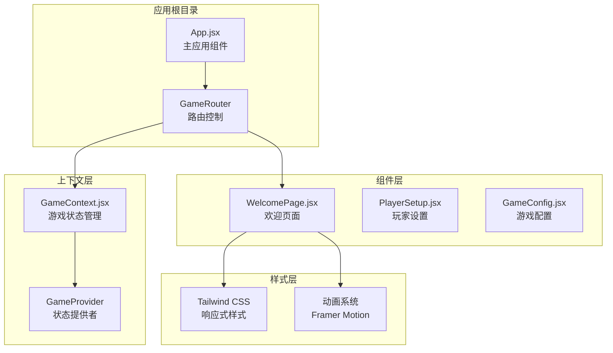
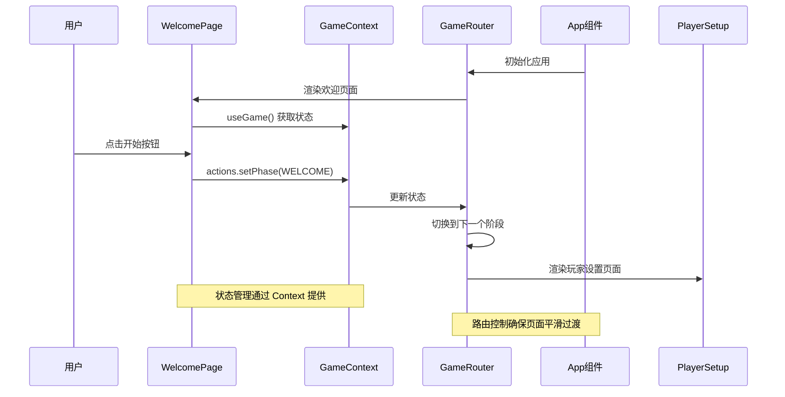
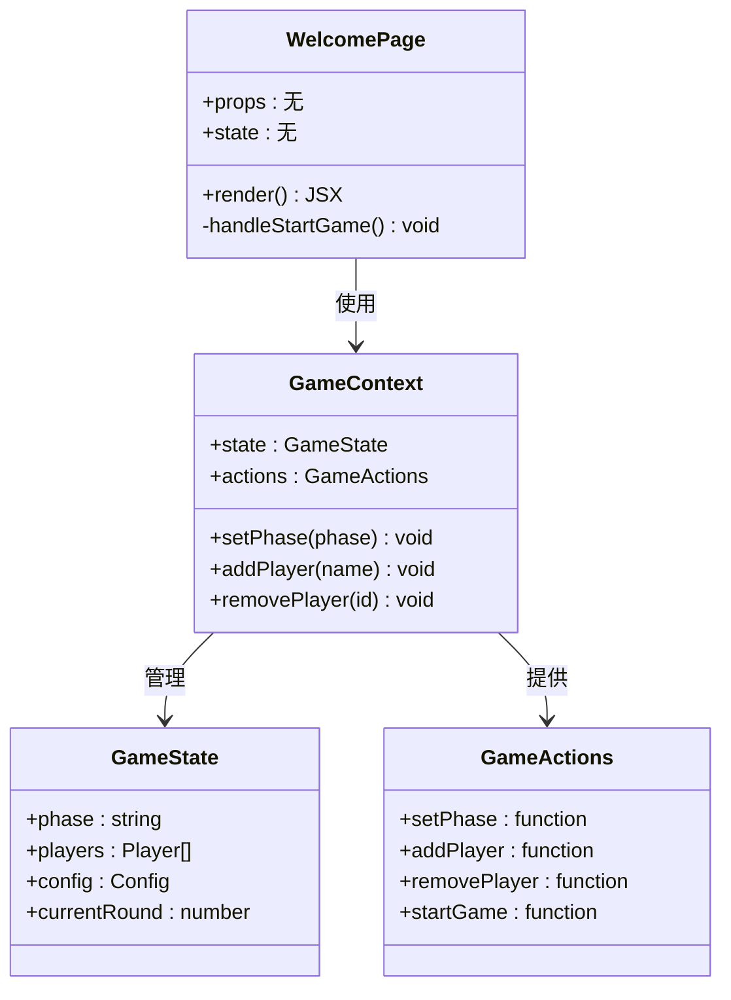
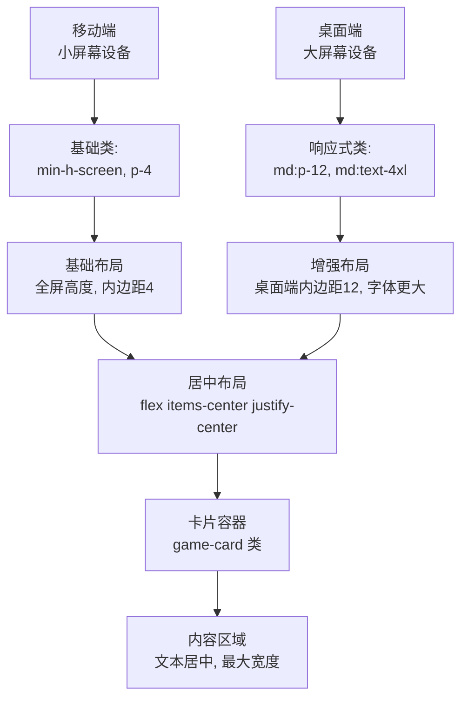
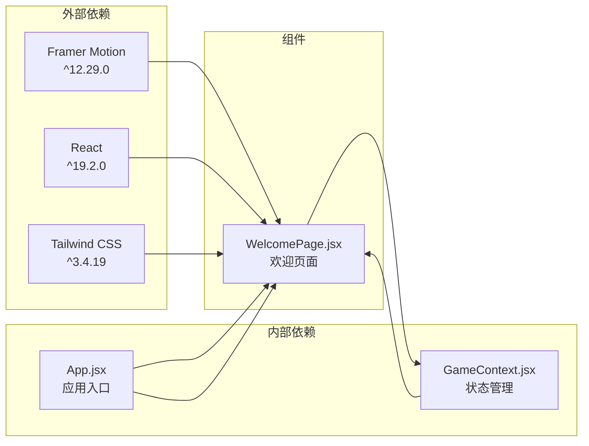

# 欢迎页面组件

<cite>
**本文档引用的文件**
- [WelcomePage.jsx](file://src/components/GameSetup/WelcomePage.jsx)
- [GameContext.jsx](file://src/context/GameContext.jsx)
- [App.jsx](file://src/App.jsx)
- [index.css](file://src/index.css)
- [package.json](file://package.json)
</cite>

## 目录
1. [简介](#简介)
2. [项目结构](#项目结构)
3. [核心组件](#核心组件)
4. [架构概览](#架构概览)
5. [详细组件分析](#详细组件分析)
6. [依赖关系分析](#依赖关系分析)
7. [性能考虑](#性能考虑)
8. [故障排除指南](#故障排除指南)
9. [结论](#结论)

## 简介

WelcomePage 是 Truth or Dare 游戏应用中的欢迎页面组件，负责向玩家展示游戏的基本信息并引导他们进入游戏流程。该组件采用现代化的 React 架构，集成了 Framer Motion 动画系统、Tailwind CSS 响应式设计和 React Context 状态管理，为用户提供流畅的视觉体验和直观的交互流程。

## 项目结构

Truth or Dare 应用采用模块化的组件架构，WelcomePage 位于 GameSetup 组件目录下，专门处理游戏初始化阶段的用户界面。

**图表来源**
- [App.jsx](file://src/App.jsx#L14-L48)
- [GameContext.jsx](file://src/context/GameContext.jsx#L257-L313)
- [WelcomePage.jsx](file://src/components/GameSetup/WelcomePage.jsx#L1-L88)

**章节来源**
- [App.jsx](file://src/App.jsx#L1-L61)
- [package.json](file://package.json#L1-L33)

## 核心组件

WelcomePage 组件是一个无状态函数组件，专注于提供美观的用户界面和流畅的动画体验。组件的核心特性包括：

### 主要功能
- **欢迎信息展示**：显示游戏标题、标语和版本信息
- **特色功能介绍**：通过图标展示游戏的核心特色
- **游戏流程说明**：清晰展示完整的游戏步骤
- **开始游戏引导**：提供直观的开始按钮和交互反馈

### 技术特性
- **响应式设计**：支持移动端和桌面端的自适应布局
- **流畅动画**：集成 Framer Motion 实现丰富的交互动画
- **状态管理**：通过 GameContext 与全局状态进行交互
- **无障碍设计**：遵循现代 Web 标准的可访问性实践

**章节来源**
- [WelcomePage.jsx](file://src/components/GameSetup/WelcomePage.jsx#L4-L88)

## 架构概览

WelcomePage 在整个应用架构中扮演着关键的入口角色，它与 GameContext 紧密协作，确保游戏状态的正确流转。

**图表来源**
- [WelcomePage.jsx](file://src/components/GameSetup/WelcomePage.jsx#L5-L55)
- [GameContext.jsx](file://src/context/GameContext.jsx#L261-L280)
- [App.jsx](file://src/App.jsx#L14-L48)

## 详细组件分析

### 组件结构分析

WelcomePage 采用分层的布局设计，每个部分都有明确的功能定位和视觉层次。

**图表来源**
- [WelcomePage.jsx](file://src/components/GameSetup/WelcomePage.jsx#L4-L88)
- [GameContext.jsx](file://src/context/GameContext.jsx#L257-L322)

### 动画系统实现

WelcomePage 充分利用了 Framer Motion 的强大功能，实现了多层次的动画效果：

#### 初始加载动画
组件在首次渲染时执行淡入效果，营造自然的页面出现感。

#### 图标弹跳动画
游戏标题区域使用弹簧动画，创造活泼的视觉反馈。

#### 按钮交互效果
开始按钮实现了悬停放大和点击缩小的物理反馈效果。

### 响应式布局设计

组件采用 Tailwind CSS 的响应式断点系统，确保在不同设备上的最佳显示效果：

**图表来源**
- [WelcomePage.jsx](file://src/components/GameSetup/WelcomePage.jsx#L11-L13)
- [WelcomePage.jsx](file://src/components/GameSetup/WelcomePage.jsx#L35-L36)

### 用户交互逻辑

组件的交互设计遵循现代用户体验原则，提供清晰的反馈和直观的操作流程。

#### 状态管理集成
组件通过 `useGame()` Hook 访问全局状态，实现与游戏流程的无缝衔接。

#### 阶段转换机制
点击开始按钮会触发 `GAME_PHASES.PLAYER_SETUP` 的状态变更，推动游戏进入下一阶段。

**章节来源**
- [WelcomePage.jsx](file://src/components/GameSetup/WelcomePage.jsx#L1-L88)
- [GameContext.jsx](file://src/context/GameContext.jsx#L4-L15)

## 依赖关系分析

WelcomePage 组件的依赖关系相对简洁，主要依赖于外部库和内部上下文。

**图表来源**
- [package.json](file://package.json#L12-L17)
- [WelcomePage.jsx](file://src/components/GameSetup/WelcomePage.jsx#L1-L2)
- [GameContext.jsx](file://src/context/GameContext.jsx#L1-L1)

### 外部依赖分析

#### Framer Motion
- **版本**: ^12.29.0
- **用途**: 提供复杂的动画系统和手势识别
- **功能**: 包括初始动画、交互动画、过渡效果等

#### Tailwind CSS
- **版本**: ^3.4.19
- **用途**: 提供实用优先的 CSS 框架
- **功能**: 响应式设计、组件样式、动画类

**章节来源**
- [package.json](file://package.json#L12-L17)
- [WelcomePage.jsx](file://src/components/GameSetup/WelcomePage.jsx#L1-L2)

## 性能考虑

WelcomePage 组件在设计时充分考虑了性能优化，采用了多项最佳实践：

### 渲染优化
- **无状态组件**: 使用函数组件减少不必要的状态管理开销
- **最小化重渲染**: 仅在状态变化时重新渲染
- **CSS 类复用**: 通过 Tailwind CSS 类实现高效的样式应用

### 动画性能
- **硬件加速**: Framer Motion 自动优化动画性能
- **延迟优化**: 合理使用动画延迟避免同时执行多个动画
- **内存管理**: 及时清理动画资源，避免内存泄漏

### 加载性能
- **懒加载**: 组件按需加载，减少初始包大小
- **缓存策略**: 利用浏览器缓存机制提升重复访问速度

## 故障排除指南

### 常见问题及解决方案

#### 动画不生效
**症状**: 页面加载时没有动画效果
**可能原因**:
- Framer Motion 未正确安装
- 组件未正确导入 motion 组件
- CSS 样式冲突

**解决方法**:
1. 确认 package.json 中的依赖版本
2. 检查组件导入语句
3. 验证 CSS 样式的优先级

#### 响应式布局异常
**症状**: 在移动设备上显示不正常
**可能原因**:
- Tailwind CSS 配置问题
- 断点类名使用错误
- 视口设置不当

**解决方法**:
1. 检查 Tailwind 配置文件
2. 验证断点类名的正确性
3. 确认 HTML 中的视口元标签

#### 状态更新失败
**症状**: 点击按钮后无法切换到下一阶段
**可能原因**:
- GameContext 未正确提供
- actions 对象未正确注入
- 状态类型不匹配

**解决方法**:
1. 确认 GameProvider 包裹了应用
2. 检查 useGame Hook 的使用
3. 验证 GAME_PHASES 常量的值

**章节来源**
- [WelcomePage.jsx](file://src/components/GameSetup/WelcomePage.jsx#L52-L61)
- [GameContext.jsx](file://src/context/GameContext.jsx#L316-L322)

## 结论

WelcomePage 组件成功地将现代前端技术与游戏应用需求相结合，创造了一个既美观又实用的用户入口界面。通过精心设计的动画系统、响应式布局和直观的交互逻辑，该组件为整个 Truth or Dare 应用奠定了良好的用户体验基础。

### 设计亮点
- **流畅的动画体验**: 通过 Framer Motion 实现的多层次动画效果
- **优秀的响应式设计**: 适配各种设备尺寸的布局系统
- **清晰的状态管理**: 与 GameContext 的无缝集成
- **可维护的代码结构**: 模块化的组件设计

### 扩展建议
- **主题定制**: 支持更多颜色主题和视觉风格
- **国际化支持**: 添加多语言文本支持
- **无障碍增强**: 进一步提升可访问性功能
- **性能监控**: 集成性能指标收集和分析

该组件为后续的游戏功能开发提供了坚实的基础，其设计理念和实现模式可以作为其他 React 组件开发的参考模板。