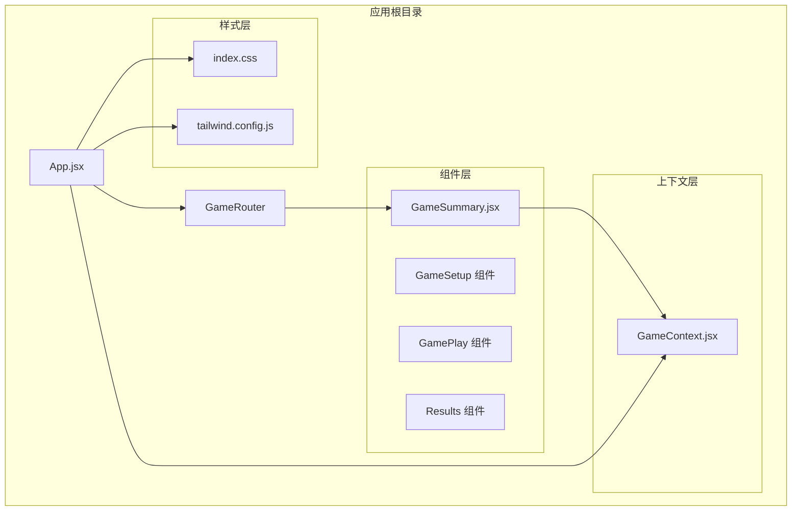
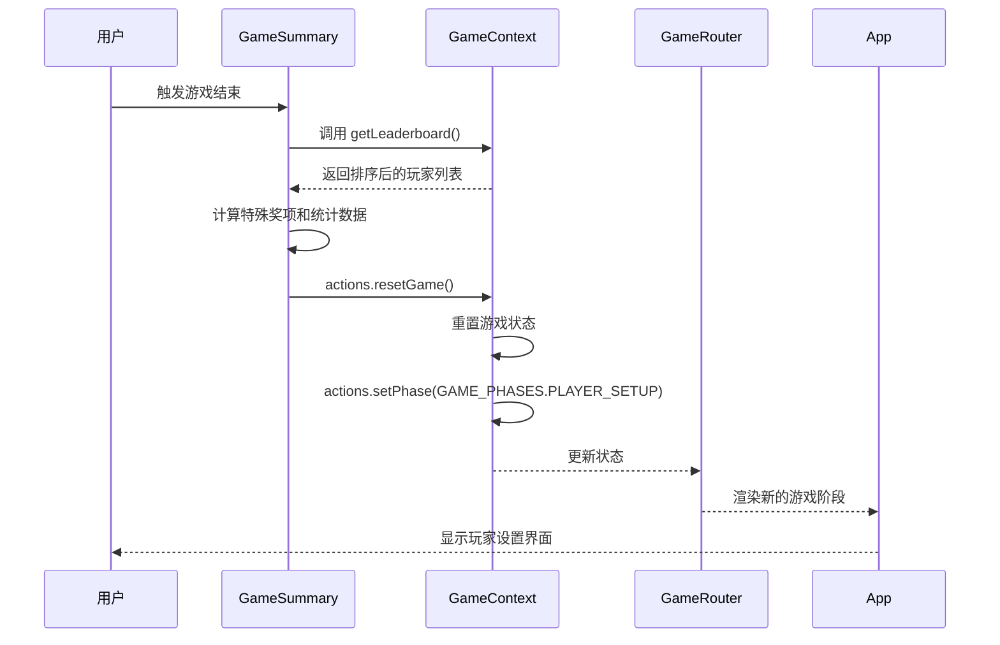
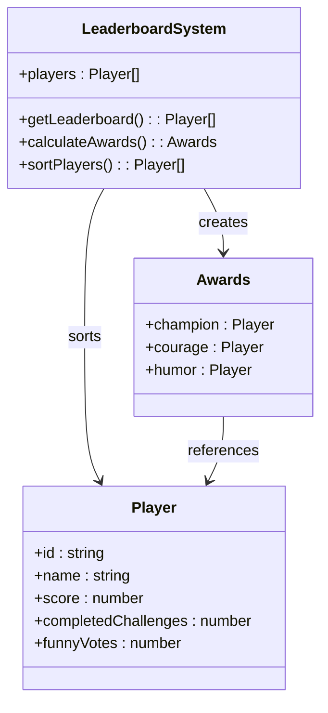
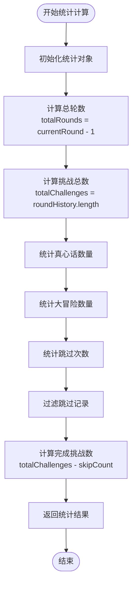
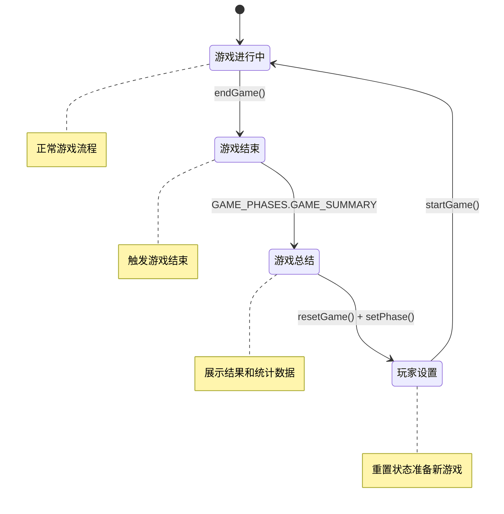
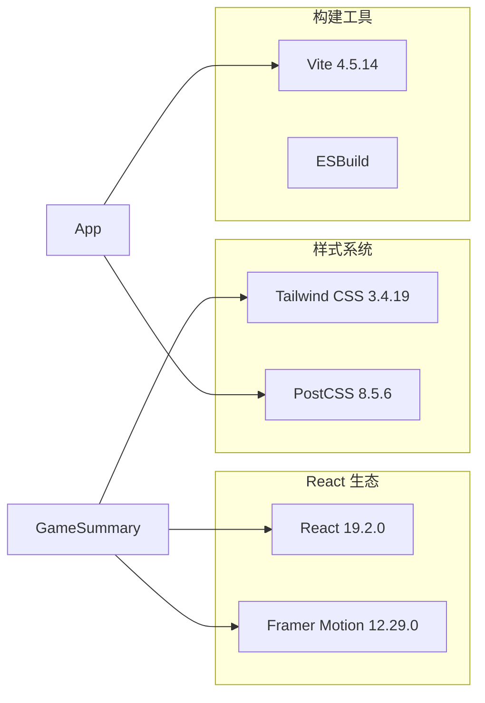
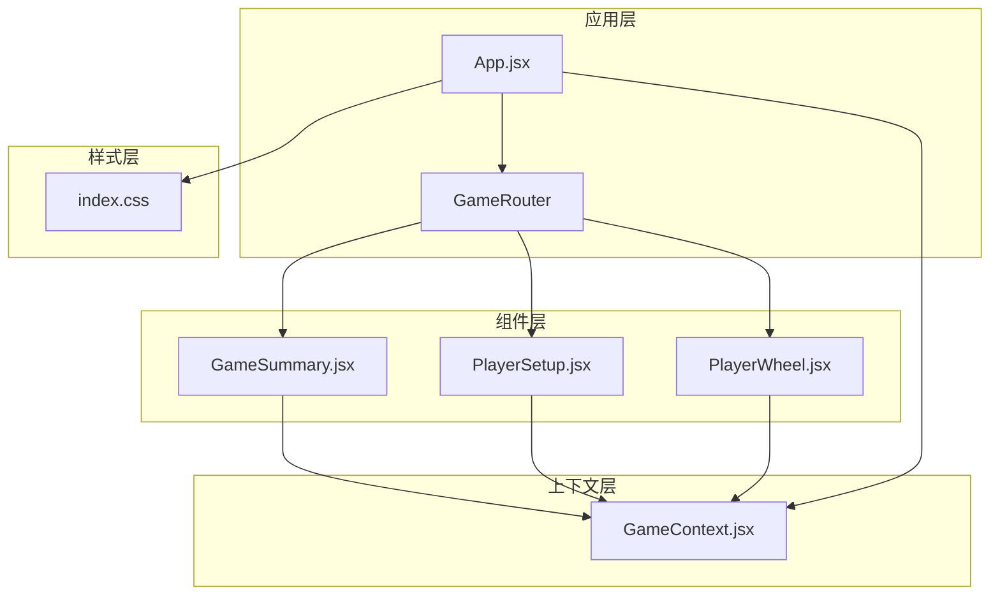

# 游戏总结组件

<cite>
**本文档引用的文件**
- [GameSummary.jsx](file://src/components/Results/GameSummary.jsx)
- [GameContext.jsx](file://src/context/GameContext.jsx)
- [App.jsx](file://src/App.jsx)
- [index.css](file://src/index.css)
- [tailwind.config.js](file://tailwind.config.js)
- [package.json](file://package.json)
- [README.md](file://README.md)
</cite>

## 目录
1. [简介](#简介)
2. [项目结构](#项目结构)
3. [核心组件](#核心组件)
4. [架构概览](#架构概览)
5. [详细组件分析](#详细组件分析)
6. [依赖关系分析](#依赖关系分析)
7. [性能考量](#性能考量)
8. [故障排除指南](#故障排除指南)
9. [结论](#结论)
10. [附录](#附录)

## 简介
GameSummary 组件是 Truth or Dare 游戏应用中的游戏结束界面，负责展示游戏结果、排行榜、统计数据和特殊奖项。该组件实现了完整的游戏总结功能，包括玩家分数排序、获胜者确定、统计数据计算和重置功能。

## 项目结构
Truth or Dare 应用采用 React + Vite 架构，使用 Context API 进行状态管理，通过 Framer Motion 实现流畅的动画效果。

**图表来源**
- [App.jsx](file://src/App.jsx#L1-L58)
- [GameSummary.jsx](file://src/components/Results/GameSummary.jsx#L1-L224)
- [GameContext.jsx](file://src/context/GameContext.jsx#L1-L322)

**章节来源**
- [App.jsx](file://src/App.jsx#L1-L58)
- [GameSummary.jsx](file://src/components/Results/GameSummary.jsx#L1-L224)
- [GameContext.jsx](file://src/context/GameContext.jsx#L1-L322)

## 核心组件
GameSummary 组件是游戏流程中的最终阶段，负责向玩家展示完整的游戏结果和统计数据。

### 主要功能特性
- **排行榜展示**：基于玩家分数进行排序，突出前三名
- **特殊奖项**：根据玩家表现颁发不同奖项
- **统计数据**：显示游戏过程的关键指标
- **重置功能**：支持重新开始或返回首页
- **响应式设计**：适配各种屏幕尺寸

### 状态管理集成
组件通过 useGame Hook 访问全局游戏状态，包括：
- 排行榜数据获取
- 游戏统计数据计算
- 重置和导航功能

**章节来源**
- [GameSummary.jsx](file://src/components/Results/GameSummary.jsx#L4-L38)
- [GameContext.jsx](file://src/context/GameContext.jsx#L289-L292)

## 架构概览
GameSummary 组件在整体应用架构中扮演着关键角色，作为游戏流程的终点和新游戏开始的起点。

**图表来源**
- [GameSummary.jsx](file://src/components/Results/GameSummary.jsx#L29-L38)
- [GameContext.jsx](file://src/context/GameContext.jsx#L275-L278)
- [App.jsx](file://src/App.jsx#L33-L34)

**章节来源**
- [GameSummary.jsx](file://src/components/Results/GameSummary.jsx#L29-L38)
- [GameContext.jsx](file://src/context/GameContext.jsx#L275-L278)
- [App.jsx](file://src/App.jsx#L33-L34)

## 详细组件分析

### 排行榜系统
GameSummary 组件实现了完整的排行榜展示功能，包括基础排序和特殊奖项计算。

**图表来源**
- [GameSummary.jsx](file://src/components/Results/GameSummary.jsx#L8-L18)
- [GameContext.jsx](file://src/context/GameContext.jsx#L289-L292)

#### 排行榜排序逻辑
组件使用分数降序排列玩家，确保最高分玩家排在首位。排序算法的时间复杂度为 O(n log n)，空间复杂度为 O(n)。

#### 特殊奖项计算
- **挑战达人**：分数最高的玩家
- **勇气之星**：完成挑战次数最多的玩家
- **幽默之王**：获得有趣投票最多的玩家

**章节来源**
- [GameSummary.jsx](file://src/components/Results/GameSummary.jsx#L8-L18)

### 数据统计系统
组件提供了全面的游戏统计数据，帮助玩家回顾游戏过程。

**图表来源**
- [GameSummary.jsx](file://src/components/Results/GameSummary.jsx#L20-L27)

#### 统计数据字段
- **总轮数**：当前轮数减一
- **完成挑战**：总挑战数减去跳过次数
- **真心话数量**：按挑战类型过滤
- **大冒险数量**：按挑战类型过滤
- **跳过次数**：统计被跳过的回合

**章节来源**
- [GameSummary.jsx](file://src/components/Results/GameSummary.jsx#L20-L27)

### 状态管理机制
GameSummary 组件通过 GameContext 提供的状态管理功能实现数据驱动的渲染。

**图表来源**
- [GameContext.jsx](file://src/context/GameContext.jsx#L277-L278)
- [GameSummary.jsx](file://src/components/Results/GameSummary.jsx#L29-L38)

#### 状态更新流程
1. 游戏结束时调用 `endGame()` 将阶段切换到 GAME_SUMMARY
2. GameRouter 根据当前阶段渲染 GameSummary 组件
3. 组件从 GameContext 获取当前状态和操作函数
4. 用户操作触发相应的 actions 函数

**章节来源**
- [GameContext.jsx](file://src/context/GameContext.jsx#L277-L278)
- [App.jsx](file://src/App.jsx#L33-L34)

### 用户交互设计
组件实现了丰富的用户交互体验，包括动画效果和响应式布局。

#### 动画系统
- **淡入效果**：整个组件的渐显动画
- **缩放动画**：标题部分的弹性动画
- **滑入动画**：各区块的顺序进入动画
- **按钮反馈**：悬停和点击的缩放效果

#### 响应式布局
- **移动端优先**：默认针对小屏幕优化
- **断点适配**：使用 md 媒体查询适配平板和桌面
- **弹性布局**：使用 Flexbox 和 Grid 实现自适应

**章节来源**
- [GameSummary.jsx](file://src/components/Results/GameSummary.jsx#L41-L46)
- [GameSummary.jsx](file://src/components/Results/GameSummary.jsx#L78-L108)

## 依赖关系分析

### 外部依赖
组件依赖以下关键库：

**图表来源**
- [package.json](file://package.json#L12-L31)

### 内部依赖关系
组件之间的依赖关系体现了清晰的分层架构：

**图表来源**
- [App.jsx](file://src/App.jsx#L1-L58)
- [GameSummary.jsx](file://src/components/Results/GameSummary.jsx#L1-L2)

**章节来源**
- [package.json](file://package.json#L12-L31)
- [App.jsx](file://src/App.jsx#L1-L58)

## 性能考量

### 渲染优化
- **条件渲染**：仅在有数据时渲染特定区块
- **动画优化**：使用 Framer Motion 的硬件加速
- **列表渲染**：使用稳定的 key 值避免不必要的重渲染

### 内存管理
- **状态清理**：游戏结束后自动清理历史记录
- **事件监听**：组件卸载时自动清理动画和定时器
- **资源释放**：避免内存泄漏和性能瓶颈

### 加载性能
- **懒加载**：组件按需加载，减少初始包大小
- **代码分割**：Vite 自动进行代码分割
- **缓存策略**：浏览器缓存静态资源

## 故障排除指南

### 常见问题及解决方案

#### 排行榜为空
**症状**：排行榜区域不显示任何内容
**原因**：玩家列表为空或分数都为零
**解决方案**：检查 GameContext 中的 players 状态，确保至少有一个玩家且分数大于零

#### 统计数据异常
**症状**：统计数据与实际游戏不符
**原因**：roundHistory 数据不完整或计算逻辑错误
**解决方案**：验证 COMPLETE_ROUND action 是否正确更新状态，检查统计数据计算逻辑

#### 动画不工作
**症状**：组件加载时没有动画效果
**原因**：Framer Motion 未正确安装或导入
**解决方案**：确认 package.json 中的依赖版本，检查导入路径

#### 响应式布局问题
**症状**：在移动设备上显示异常
**原因**：Tailwind CSS 配置或样式冲突
**解决方案**：检查 tailwind.config.js 配置，验证媒体查询断点

**章节来源**
- [GameSummary.jsx](file://src/components/Results/GameSummary.jsx#L60-L75)
- [GameSummary.jsx](file://src/components/Results/GameSummary.jsx#L167-L191)

## 结论
GameSummary 组件是一个功能完整、设计精良的游戏结束界面组件。它成功地整合了状态管理、数据展示和用户交互，为玩家提供了丰富的游戏总结体验。组件的设计充分考虑了响应式布局、动画效果和用户体验优化，是一个优秀的 React 组件实现范例。

## 附录

### 扩展功能建议
1. **多语言支持**：添加 i18n 支持，实现国际化
2. **分享功能**：集成社交媒体分享按钮
3. **数据导出**：提供游戏数据的 CSV 导出功能
4. **主题切换**：支持深色模式和自定义主题
5. **音效系统**：添加背景音乐和音效

### 自定义选项
- **样式定制**：通过 CSS 变量调整颜色方案
- **动画配置**：修改 Framer Motion 的动画参数
- **布局调整**：根据需要调整网格和间距
- **功能扩展**：添加新的统计指标和奖项类型

### 开发环境设置
- **本地开发**：运行 `npm run dev` 启动开发服务器
- **生产构建**：运行 `npm run build` 生成优化的静态文件
- **预览部署**：运行 `npm run preview` 查看构建结果

**章节来源**
- [README.md](file://README.md#L1-L20)
- [package.json](file://package.json#L6-L11)