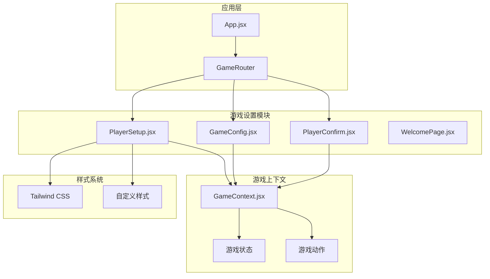
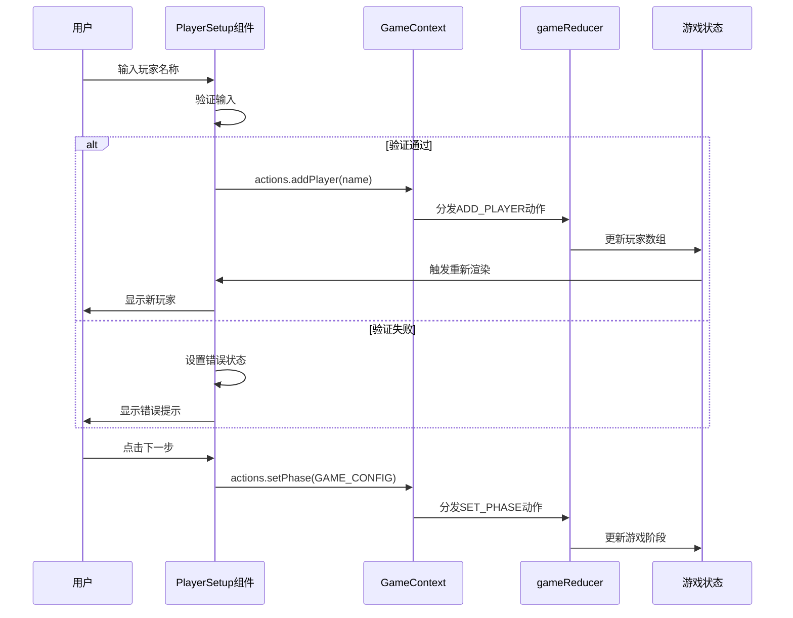
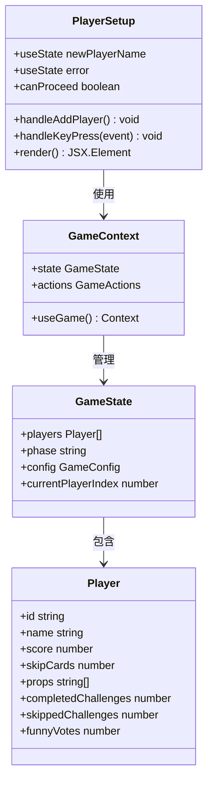
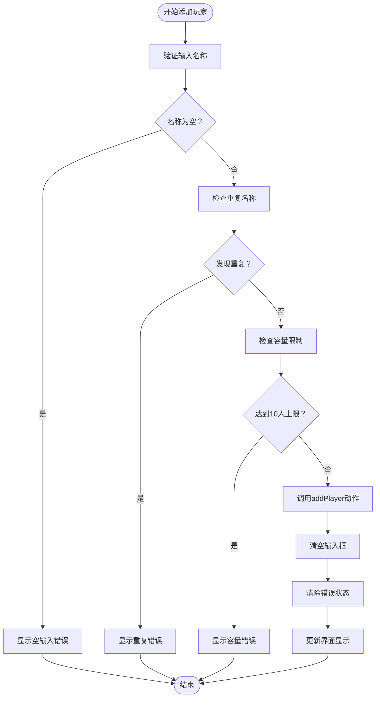
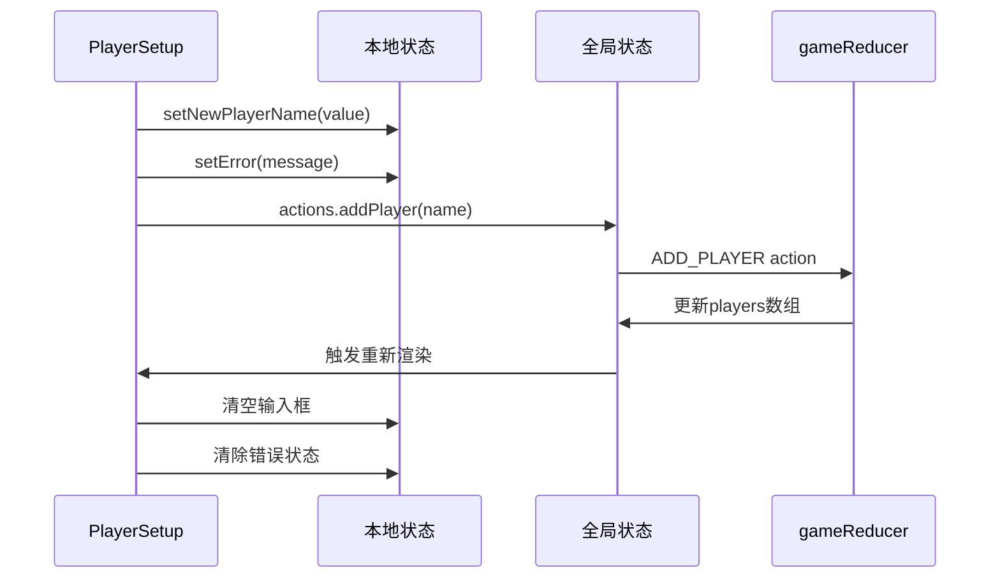
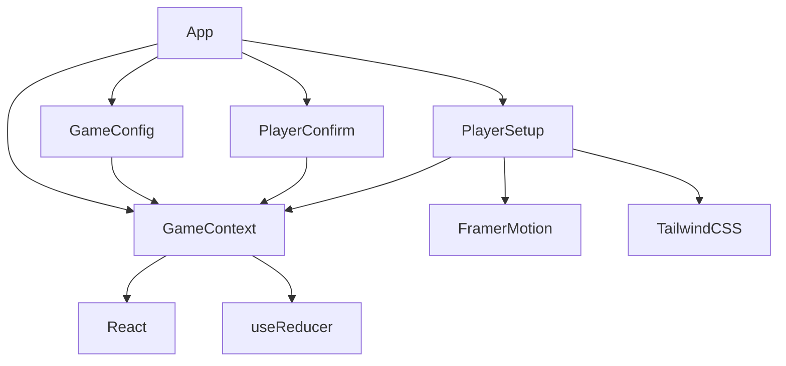

# 玩家设置组件

<cite>
**本文档引用的文件**
- [PlayerSetup.jsx](file://src/components/GameSetup/PlayerSetup.jsx)
- [GameContext.jsx](file://src/context/GameContext.jsx)
- [PlayerConfirm.jsx](file://src/components/GameSetup/PlayerConfirm.jsx)
- [GameConfig.jsx](file://src/components/GameSetup/GameConfig.jsx)
- [App.jsx](file://src/App.jsx)
- [index.css](file://src/index.css)
</cite>

## 目录
1. [简介](#简介)
2. [项目结构](#项目结构)
3. [核心组件](#核心组件)
4. [架构概览](#架构概览)
5. [详细组件分析](#详细组件分析)
6. [依赖关系分析](#依赖关系分析)
7. [性能考虑](#性能考虑)
8. [故障排除指南](#故障排除指南)
9. [结论](#结论)

## 简介

PlayerSetup 组件是 Truth or Dare 游戏中的关键界面组件，负责管理玩家设置流程。该组件实现了完整的玩家添加、验证和管理功能，包括玩家数量控制、姓名输入验证和实时预览功能。通过与 GameContext 的深度集成，组件能够维护全局游戏状态，并与其他游戏阶段组件协同工作。

## 项目结构

Truth or Dare 项目采用模块化架构，PlayerSetup 组件位于游戏设置模块中，与游戏上下文管理紧密集成：



**图表来源**
- [App.jsx](file://src/App.jsx#L13-L45)
- [PlayerSetup.jsx](file://src/components/GameSetup/PlayerSetup.jsx#L1-L197)
- [GameContext.jsx](file://src/context/GameContext.jsx#L1-L322)

**章节来源**
- [App.jsx](file://src/App.jsx#L1-L58)
- [PlayerSetup.jsx](file://src/components/GameSetup/PlayerSetup.jsx#L1-L197)

## 核心组件

PlayerSetup 组件是游戏设置流程的核心，具有以下主要特性：

### 状态管理机制
- **本地状态管理**：使用 React useState 管理输入框值和错误状态
- **全局状态同步**：通过 GameContext 与游戏状态保持同步
- **实时验证反馈**：提供即时的用户输入验证和错误提示

### 功能特性
- **玩家数量控制**：限制最少4人，最多10人的游戏参与
- **姓名输入验证**：防止重复名称和空输入
- **快速添加功能**：提供预设玩家名称的快速添加选项
- **实时预览**：动态显示当前玩家列表和进度统计

**章节来源**
- [PlayerSetup.jsx](file://src/components/GameSetup/PlayerSetup.jsx#L5-L35)

## 架构概览

PlayerSetup 组件采用 React Hooks 和 Context API 实现，形成了清晰的单向数据流架构：



**图表来源**
- [PlayerSetup.jsx](file://src/components/GameSetup/PlayerSetup.jsx#L10-L27)
- [GameContext.jsx](file://src/context/GameContext.jsx#L68-L92)

**章节来源**
- [GameContext.jsx](file://src/context/GameContext.jsx#L252-L322)

## 详细组件分析

### 组件结构分析

PlayerSetup 组件采用了模块化的结构设计，每个功能区域都有明确的职责分工：



**图表来源**
- [PlayerSetup.jsx](file://src/components/GameSetup/PlayerSetup.jsx#L5-L35)
- [GameContext.jsx](file://src/context/GameContext.jsx#L24-L44)

### 玩家管理功能

#### 添加玩家流程
组件实现了完整的玩家添加验证流程：



**图表来源**
- [PlayerSetup.jsx](file://src/components/GameSetup/PlayerSetup.jsx#L10-L27)

#### 删除玩家功能
组件提供了直观的玩家删除机制：

- **单个删除**：每个玩家条目右侧的删除按钮
- **批量清理**：一键清空所有玩家的功能
- **实时更新**：删除操作立即反映在界面中

**章节来源**
- [PlayerSetup.jsx](file://src/components/GameSetup/PlayerSetup.jsx#L119-L129)

### 状态管理机制

#### 本地状态与全局状态同步
PlayerSetup 组件巧妙地结合了本地状态和全局状态：

| 状态类型 | 管理方式 | 用途 | 生命周期 |
|---------|----------|------|----------|
| newPlayerName | 本地 useState | 输入框值管理 | 组件卸载时销毁 |
| error | 本地 useState | 错误消息显示 | 用户操作时更新 |
| players | 全局状态 | 玩家列表管理 | 应用生命周期内持久化 |

#### 状态更新流程


**图表来源**
- [PlayerSetup.jsx](file://src/components/GameSetup/PlayerSetup.jsx#L7-L26)
- [GameContext.jsx](file://src/context/GameContext.jsx#L73-L86)

**章节来源**
- [GameContext.jsx](file://src/context/GameContext.jsx#L68-L100)

### 用户界面设计

#### 响应式布局
组件采用了完全响应式的布局设计：

- **移动端优先**：使用 `min-h-screen` 和 `p-4` 确保移动设备的良好体验
- **弹性布局**：输入框和按钮使用 `flex` 和 `gap` 实现自适应排列
- **网格系统**：快速添加按钮使用 `flex-wrap` 实现自动换行

#### 动画和交互
- **入场动画**：使用 Framer Motion 实现平滑的页面切换
- **按钮反馈**：hover 和 tap 状态提供视觉反馈
- **列表动画**：使用 `AnimatePresence` 实现列表项的进出动画

**章节来源**
- [PlayerSetup.jsx](file://src/components/GameSetup/PlayerSetup.jsx#L38-L42)
- [PlayerSetup.jsx](file://src/components/GameSetup/PlayerSetup.jsx#L63-L72)

### 与 GameContext 的交互

#### 动作分发
PlayerSetup 组件通过 GameContext 提供的动作接口与全局状态交互：

| 动作类型 | 方法名 | 参数 | 功能描述 |
|---------|--------|------|----------|
| ADD_PLAYER | actions.addPlayer | name: string | 添加新玩家 |
| REMOVE_PLAYER | actions.removePlayer | id: string | 删除指定玩家 |
| CLEAR_PLAYERS | actions.clearPlayers | - | 清空所有玩家 |
| SET_PHASE | actions.setPhase | phase: string | 切换游戏阶段 |
| SET_CONFIG | actions.setConfig | config: object | 更新游戏配置 |

#### 状态订阅
组件订阅了 GameContext 中的以下状态：

- **players**: 当前玩家列表，用于渲染玩家列表和验证
- **phase**: 当前游戏阶段，用于导航控制
- **config**: 游戏配置，用于下一步按钮的可用性判断

**章节来源**
- [PlayerSetup.jsx](file://src/components/GameSetup/PlayerSetup.jsx#L6-L35)
- [GameContext.jsx](file://src/context/GameContext.jsx#L260-L279)

## 依赖关系分析

### 组件间依赖



**图表来源**
- [PlayerSetup.jsx](file://src/components/GameSetup/PlayerSetup.jsx#L1-L3)
- [GameContext.jsx](file://src/context/GameContext.jsx#L1-L3)

### 外部依赖

| 依赖包 | 版本 | 用途 | 重要性 |
|-------|------|------|--------|
| react | 最新版本 | React 核心库 | 必需 |
| framer-motion | 最新版本 | 动画和过渡效果 | 重要 |
| tailwindcss | 最新版本 | 样式框架 | 重要 |
| @tailwindcss/aspect-ratio | 最新版本 | 比例控制 | 一般 |

**章节来源**
- [package.json](file://package.json#L1-L50)

## 性能考虑

### 渲染优化
- **条件渲染**：使用 `AnimatePresence` 只渲染可见元素
- **懒加载**：组件按需加载，减少初始包大小
- **虚拟滚动**：玩家列表使用 `max-h-64` 和 `overflow-y-auto` 优化长列表性能

### 内存管理
- **状态清理**：组件卸载时自动清理本地状态
- **事件监听**：使用 React 事件系统，自动管理事件监听器
- **动画优化**：使用 GPU 加速的 CSS 属性

### 用户体验优化
- **即时反馈**：输入验证和错误提示提供即时响应
- **加载状态**：按钮禁用状态防止重复操作
- **无障碍支持**：语义化 HTML 和适当的 ARIA 属性

## 故障排除指南

### 常见问题及解决方案

#### 问题1：玩家名称重复
**症状**：添加重复名称时显示错误提示
**解决方案**：
- 检查现有玩家列表中的重复项
- 确保名称转换为小写进行比较
- 提供更友好的错误消息

#### 问题2：无法添加更多玩家
**症状**：添加按钮变灰且无法继续
**解决方案**：
- 检查当前玩家数量是否达到10人上限
- 验证 `canProceed` 条件逻辑
- 确保 `GAME_CONFIG` 阶段正确切换

#### 问题3：输入验证不生效
**症状**：空输入或特殊字符被接受
**解决方案**：
- 检查 `handleKeyPress` 函数绑定
- 验证 `maxLength` 属性设置
- 确保 `trim()` 方法正确执行

### 调试技巧

#### 开发工具使用
- **React DevTools**：检查组件状态和 props
- **Redux DevTools**：监控全局状态变化
- **浏览器开发者工具**：调试样式和布局问题

#### 日志记录
```javascript
// 在关键位置添加日志
console.log('Current players:', state.players);
console.log('Adding player:', name);
console.log('Validation result:', isValid);
```

#### 单元测试建议
- 测试输入验证函数
- 测试边界条件（4人和10人）
- 测试错误处理路径

**章节来源**
- [PlayerSetup.jsx](file://src/components/GameSetup/PlayerSetup.jsx#L10-L33)

## 结论

PlayerSetup 组件是一个设计精良的游戏设置界面，成功实现了以下目标：

### 设计优势
- **用户体验优秀**：直观的界面设计和流畅的动画效果
- **功能完整**：涵盖玩家管理的所有必要功能
- **可扩展性强**：基于 Context API 的架构便于功能扩展
- **性能优化**：合理的状态管理和渲染策略

### 技术亮点
- **状态管理**：巧妙结合本地状态和全局状态
- **验证机制**：多层次的输入验证确保数据完整性
- **响应式设计**：适配各种设备尺寸
- **动画体验**：使用 Framer Motion 提升交互质量

### 改进建议
- **国际化支持**：添加多语言支持
- **键盘导航**：增强键盘快捷键支持
- **表单验证**：添加更严格的输入格式验证
- **性能监控**：集成性能监控工具

该组件为整个 Truth or Dare 游戏奠定了坚实的基础，其设计理念和实现方式值得其他类似应用参考。