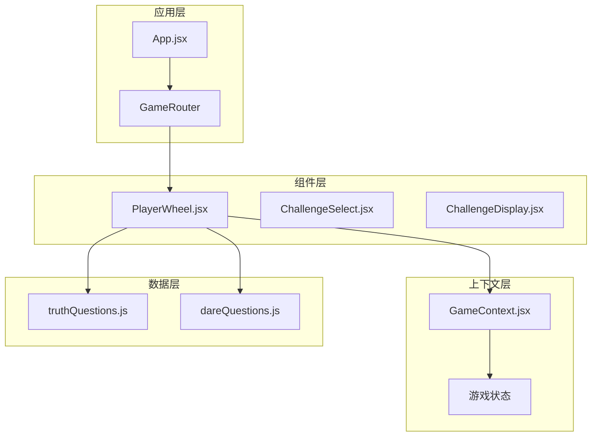
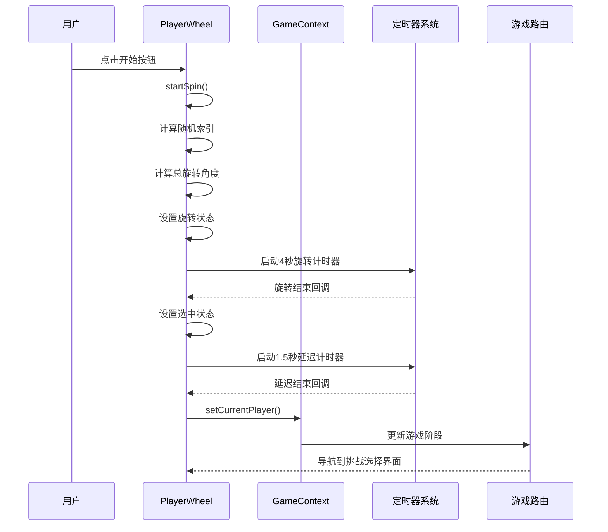
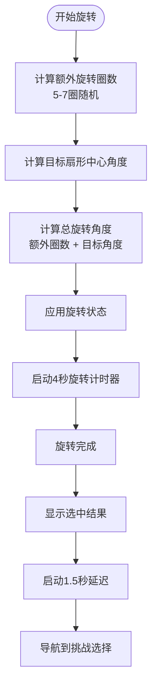
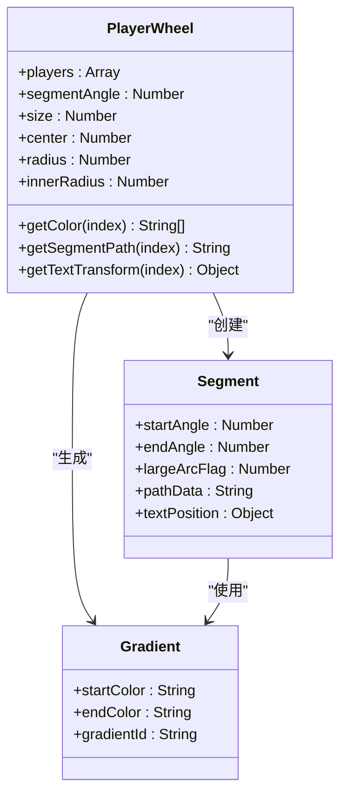
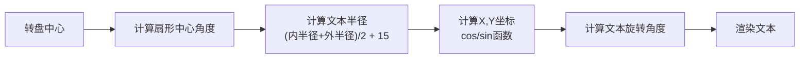
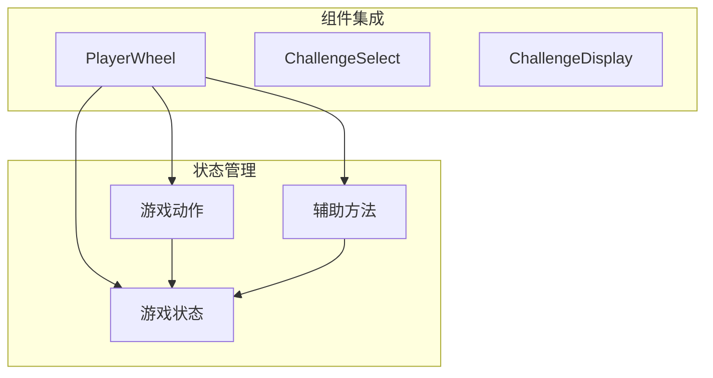
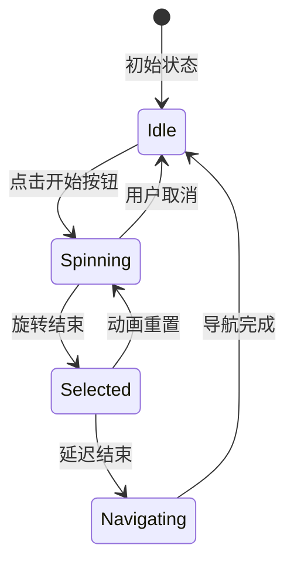
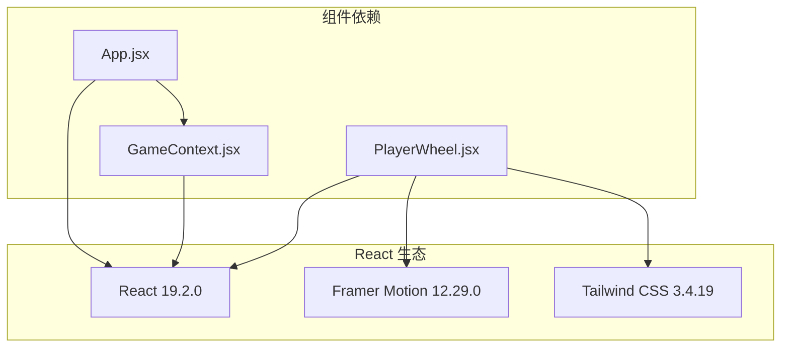

# 转盘抽人组件

<cite>
**本文档引用的文件**
- [PlayerWheel.jsx](file://src/components/GamePlay/PlayerWheel.jsx)
- [GameContext.jsx](file://src/context/GameContext.jsx)
- [App.jsx](file://src/App.jsx)
- [index.css](file://src/index.css)
- [package.json](file://package.json)
</cite>

## 目录
1. [简介](#简介)
2. [项目结构](#项目结构)
3. [核心组件](#核心组件)
4. [架构概览](#架构概览)
5. [详细组件分析](#详细组件分析)
6. [依赖关系分析](#依赖关系分析)
7. [性能考虑](#性能考虑)
8. [故障排除指南](#故障排除指南)
9. [结论](#结论)

## 简介

PlayerWheel 是 Truth or Dare 游戏中的核心转盘抽人组件，基于 Framer Motion 实现了复杂的动画系统。该组件不仅实现了流畅的旋转动画效果，还集成了完整的状态管理系统，包括当前玩家选择、动画状态控制和游戏进度跟踪。

本组件采用 React Hooks 和 Framer Motion 的 motion 组件，通过 SVG 路径绘制扇形区域，并使用 CSS 渐变实现美观的颜色过渡效果。动画系统包含了随机旋转、物理模拟和精确的停止时机控制。

## 项目结构

Truth or Dare 项目采用模块化架构设计，PlayerWheel 组件位于 GamePlay 功能模块中，与 GameContext 共同构成游戏的核心状态管理。



**图表来源**
- [App.jsx](file://src/App.jsx#L13-L57)
- [PlayerWheel.jsx](file://src/components/GamePlay/PlayerWheel.jsx#L1-L300)
- [GameContext.jsx](file://src/context/GameContext.jsx#L1-L322)

**章节来源**
- [App.jsx](file://src/App.jsx#L13-L57)
- [package.json](file://package.json#L1-L33)

## 核心组件

PlayerWheel 组件是整个游戏系统的核心交互组件，负责实现以下关键功能：

### 主要特性
- **动态转盘渲染**：根据玩家数量动态计算扇形角度和颜色
- **复杂动画系统**：基于 Framer Motion 的旋转动画和物理模拟
- **状态同步机制**：与 GameContext 实现双向状态同步
- **用户交互控制**：防重复点击和动画中断机制
- **视觉反馈系统**：包含选中动画和进度指示器

### 关键状态管理
- `isSpinning`：控制旋转动画状态
- `isSelected`：标记选中结果展示状态
- `rotation`：当前旋转角度
- `selectedIndex`：被选中的玩家索引
- `segmentAngle`：每个扇形的角度大小

**章节来源**
- [PlayerWheel.jsx](file://src/components/GamePlay/PlayerWheel.jsx#L5-L15)
- [PlayerWheel.jsx](file://src/components/GamePlay/PlayerWheel.jsx#L31-L62)

## 架构概览

PlayerWheel 组件采用自上而下的架构设计，通过 GameContext 提供的状态管理和动作分发实现组件间的解耦。



**图表来源**
- [PlayerWheel.jsx](file://src/components/GamePlay/PlayerWheel.jsx#L31-L62)
- [GameContext.jsx](file://src/context/GameContext.jsx#L260-L279)
- [App.jsx](file://src/App.jsx#L13-L45)

## 详细组件分析

### 动画系统实现

PlayerWheel 的动画系统是其最复杂的技术实现部分，采用了多层次的动画策略：

#### 旋转物理模拟



**图表来源**
- [PlayerWheel.jsx](file://src/components/GamePlay/PlayerWheel.jsx#L31-L62)

#### Framer Motion 配置

组件使用了多种 Framer Motion 特性来实现丰富的动画效果：

- **基础动画**：使用 `motion.div` 实现渐入和缩放动画
- **交互动画**：按钮使用 `whileHover` 和 `whileTap` 属性
- **CSS 过渡**：通过内联样式实现 transform 过渡
- **布局动画**：使用 `AnimatePresence` 实现组件切换动画

#### 旋转参数配置

| 参数 | 默认值 | 作用 | 调整建议 |
|------|--------|------|----------|
| 旋转持续时间 | 4秒 | 总旋转时长 | 根据玩家数量调整 |
| 额外旋转圈数 | 5-7圈 | 确保随机性 | 数量越多越随机 |
| 停止延迟 | 1.5秒 | 结果展示时间 | 保证用户体验 |
| 指针动画 | 4秒缓动曲线 | 物理真实感 | 使用 cubic-bezier |

**章节来源**
- [PlayerWheel.jsx](file://src/components/GamePlay/PlayerWheel.jsx#L174-L182)
- [PlayerWheel.jsx](file://src/components/GamePlay/PlayerWheel.jsx#L257-L268)

### 转盘渲染系统

#### SVG 扇形绘制

组件使用 SVG 路径精确绘制每个扇形区域：



**图表来源**
- [PlayerWheel.jsx](file://src/components/GamePlay/PlayerWheel.jsx#L77-L118)

#### 颜色渐变系统

组件实现了动态颜色渐变系统，为每个扇形区域生成独特的渐变效果：

- **颜色循环**：使用预定义的颜色数组实现循环渐变
- **渐变方向**：从左上到右下对角线渐变
- **颜色对比**：确保文本的可读性

#### 文本定位算法



**图表来源**
- [PlayerWheel.jsx](file://src/components/GamePlay/PlayerWheel.jsx#L109-L118)

**章节来源**
- [PlayerWheel.jsx](file://src/components/GamePlay/PlayerWheel.jsx#L94-L123)

### 状态同步机制

#### GameContext 集成

PlayerWheel 通过 `useGame` Hook 与全局状态管理建立连接：



**图表来源**
- [PlayerWheel.jsx](file://src/components/GamePlay/PlayerWheel.jsx#L6-L6)
- [GameContext.jsx](file://src/context/GameContext.jsx#L302-L309)

#### 动画状态管理

组件实现了完整的动画生命周期管理：

- **开始状态**：`isSpinning = false` → `true`
- **进行状态**：执行旋转动画
- **暂停状态**：动画完成但结果未展示
- **结束状态**：展示结果并导航

#### 用户交互控制



**图表来源**
- [PlayerWheel.jsx](file://src/components/GamePlay/PlayerWheel.jsx#L7-L12)
- [PlayerWheel.jsx](file://src/components/GamePlay/PlayerWheel.jsx#L31-L62)

**章节来源**
- [PlayerWheel.jsx](file://src/components/GamePlay/PlayerWheel.jsx#L64-L74)
- [GameContext.jsx](file://src/context/GameContext.jsx#L260-L279)

### 性能优化策略

#### 渲染优化

- **条件渲染**：仅在需要时渲染选中动画
- **状态最小化**：避免不必要的状态更新
- **引用优化**：使用 useRef 存储定时器引用

#### 动画性能

- **硬件加速**：使用 transform 属性启用 GPU 加速
- **缓动函数**：采用高效的 cubic-bezier 曲线
- **批量更新**：合并多个状态更新操作

#### 内存管理

- **清理定时器**：组件卸载时清除所有定时器
- **事件监听**：避免内存泄漏的事件绑定

**章节来源**
- [PlayerWheel.jsx](file://src/components/GamePlay/PlayerWheel.jsx#L65-L74)

## 依赖关系分析

### 外部依赖

PlayerWheel 组件依赖于以下关键库：



**图表来源**
- [package.json](file://package.json#L12-L17)
- [PlayerWheel.jsx](file://src/components/GamePlay/PlayerWheel.jsx#L1-L3)

### 内部依赖

组件之间的依赖关系相对简单，主要通过 GameContext 实现解耦：

- **PlayerWheel** → **GameContext**：状态读取和动作调用
- **GameContext** → **GameProvider**：状态提供和管理
- **App** → **GameRouter**：路由管理和组件切换

**章节来源**
- [package.json](file://package.json#L12-L17)
- [PlayerWheel.jsx](file://src/components/GamePlay/PlayerWheel.jsx#L1-L3)
- [GameContext.jsx](file://src/context/GameContext.jsx#L256-L312)

## 性能考虑

### 动画性能优化

1. **硬件加速**：使用 CSS transform 属性而非 top/left 属性
2. **缓动曲线**：采用优化的 cubic-bezier 曲线减少计算开销
3. **批量更新**：合并多个状态更新以减少重渲染

### 内存管理

1. **定时器清理**：确保组件卸载时清除所有定时器
2. **事件监听**：避免在组件卸载后继续监听事件
3. **引用优化**：使用 useRef 存储昂贵的对象引用

### 用户体验优化

1. **响应式设计**：适配不同屏幕尺寸
2. **加载状态**：提供清晰的加载和交互反馈
3. **错误处理**：优雅处理异常情况

## 故障排除指南

### 常见问题及解决方案

#### 旋转动画不生效

**症状**：点击按钮后转盘不动
**可能原因**：
- isSpinning 状态未正确更新
- 定时器被意外清除
- Framer Motion 依赖未正确安装

**解决步骤**：
1. 检查 `isSpinning` 状态逻辑
2. 验证定时器引用是否正确存储
3. 确认 Framer Motion 版本兼容性

#### 选中结果不正确

**症状**：转盘停止但显示错误的玩家
**可能原因**：
- 角度计算错误
- 玩家索引超出范围
- 状态更新顺序问题

**解决步骤**：
1. 验证 `segmentCenterAngle` 计算公式
2. 检查 `randomIndex` 的边界条件
3. 确认状态更新的原子性

#### 动画卡顿

**症状**：旋转动画出现卡顿或不流畅
**可能原因**：
- DOM 更新过于频繁
- 复杂的 CSS 过渡
- 浏览器性能问题

**解决步骤**：
1. 减少不必要的状态更新
2. 优化 CSS 过渡属性
3. 使用浏览器开发者工具分析性能

### 调试工具和技巧

#### 开发者工具使用

1. **React DevTools**：检查组件状态和 props
2. **Framer Motion 控制台**：监控动画状态
3. **浏览器性能面板**：分析渲染性能

#### 日志记录

```javascript
// 在关键位置添加日志
console.log('旋转开始:', { rotation, totalRotation });
console.log('选中玩家:', { index, name });
console.log('动画状态:', { isSpinning, isSelected });
```

#### 性能监控

1. **帧率监控**：使用浏览器内置性能工具
2. **内存使用**：监控组件卸载后的内存释放
3. **网络请求**：检查是否有不必要的数据加载

**章节来源**
- [PlayerWheel.jsx](file://src/components/GamePlay/PlayerWheel.jsx#L65-L74)

## 结论

PlayerWheel 组件是一个高度优化的动画组件，成功地将复杂的旋转物理模拟与直观的用户交互相结合。通过合理的状态管理和性能优化策略，该组件提供了流畅且可靠的用户体验。

### 主要成就

1. **动画系统完整性**：实现了从开始到结束的完整动画流程
2. **状态管理解耦**：通过 GameContext 实现了清晰的组件分离
3. **性能优化**：采用了多种优化策略确保流畅的用户体验
4. **可维护性**：代码结构清晰，易于理解和扩展

### 改进建议

1. **动画参数化**：将动画参数提取为可配置选项
2. **测试覆盖**：增加单元测试和集成测试
3. **错误边界**：添加更完善的错误处理机制
4. **可访问性**：增强键盘导航和屏幕阅读器支持

该组件为 Truth or Dare 游戏提供了坚实的基础，其设计理念和实现方案可以作为其他动画组件开发的参考模板。