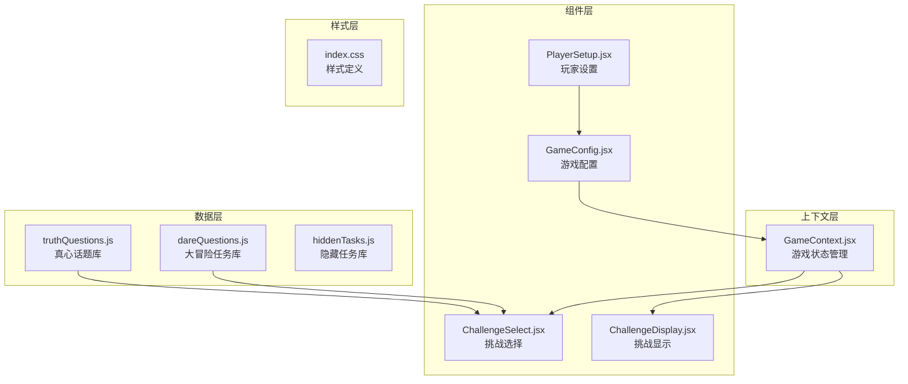
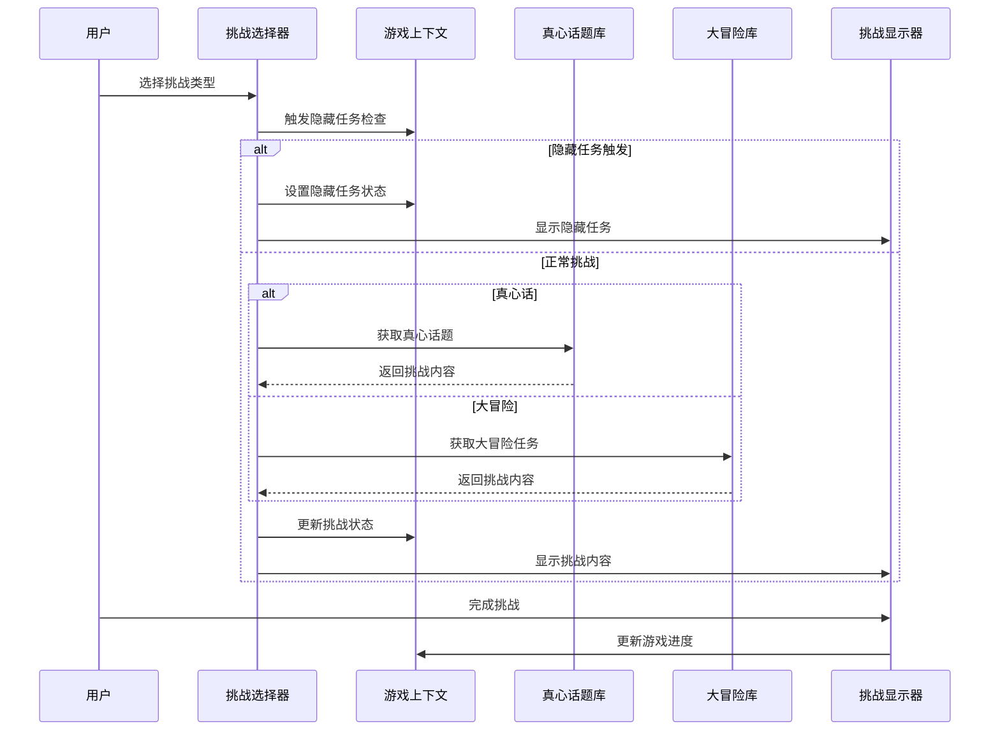
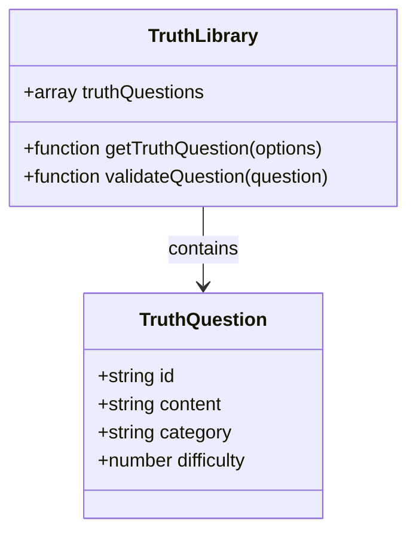
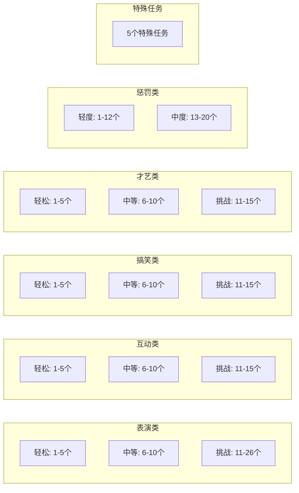
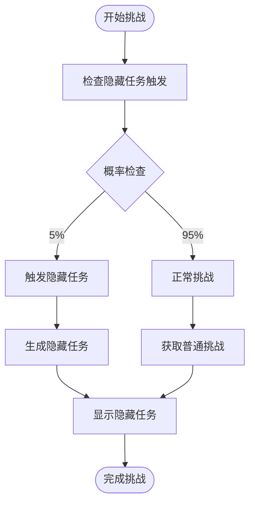
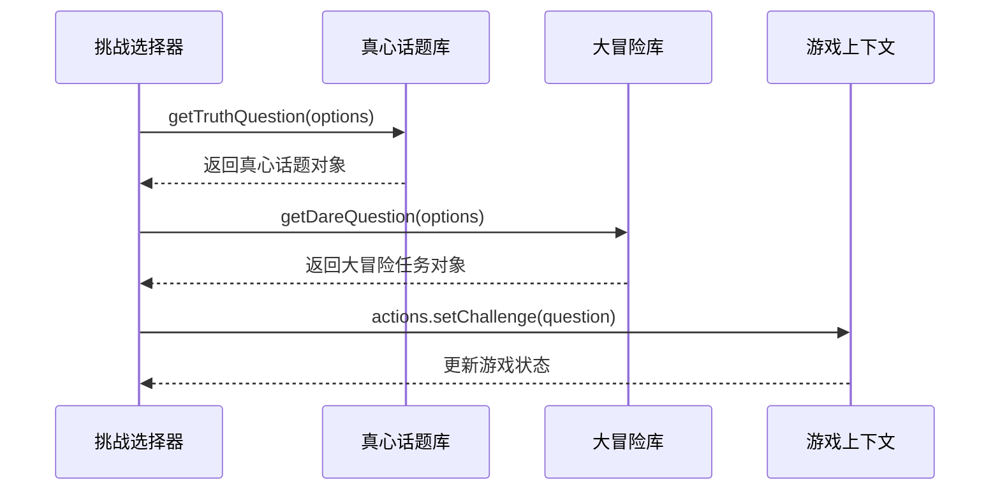
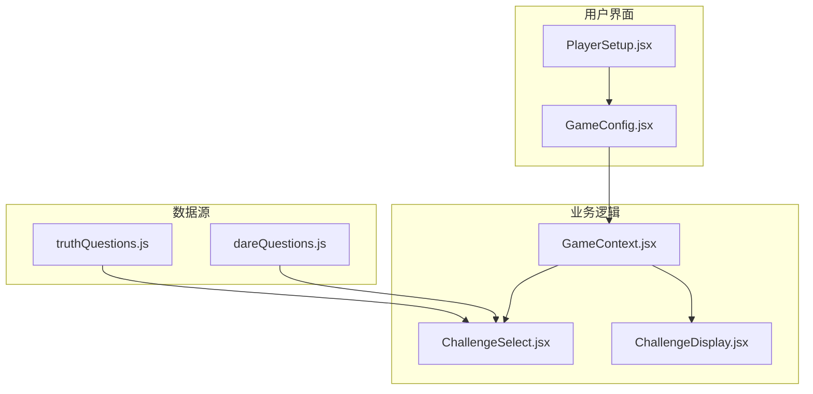

# 游戏数据系统

<cite>
**本文档引用的文件**
- [truthQuestions.js](file://src/data/truthQuestions.js)
- [dareQuestions.js](file://src/data/dareQuestions.js)
- [GameContext.jsx](file://src/context/GameContext.jsx)
- [ChallengeSelect.jsx](file://src/components/GamePlay/ChallengeSelect.jsx)
- [ChallengeDisplay.jsx](file://src/components/GamePlay/ChallengeDisplay.jsx)
- [PlayerSetup.jsx](file://src/components/GameSetup/PlayerSetup.jsx)
- [GameConfig.jsx](file://src/components/GameSetup/GameConfig.jsx)
- [README.md](file://README.md)
</cite>

## 目录
1. [简介](#简介)
2. [项目结构](#项目结构)
3. [核心组件](#核心组件)
4. [架构概览](#架构概览)
5. [详细组件分析](#详细组件分析)
6. [依赖关系分析](#依赖关系分析)
7. [性能考虑](#性能考虑)
8. [故障排除指南](#故障排除指南)
9. [结论](#结论)
10. [附录](#附录)

## 简介
Truth or Dare 游戏数据系统是一个基于 React 的交互式游戏应用，专注于提供精心设计的真心话和大冒险挑战内容。该系统采用模块化设计，将挑战数据与游戏逻辑分离，实现了高度的可扩展性和维护性。

系统的核心特色包括：
- 结构化的挑战数据模型
- 智能的难度分级系统
- 动态的主题分类机制
- 隐藏任务的随机触发机制
- 完整的数据验证和质量控制
- 灵活的扩展接口

## 项目结构
项目采用清晰的分层架构，将数据、逻辑和界面分离：

**图表来源**
- [truthQuestions.js](file://src/data/truthQuestions.js#L1-L156)
- [dareQuestions.js](file://src/data/dareQuestions.js#L1-L167)
- [GameContext.jsx](file://src/context/GameContext.jsx#L1-L323)

**章节来源**
- [truthQuestions.js](file://src/data/truthQuestions.js#L1-L156)
- [dareQuestions.js](file://src/data/dareQuestions.js#L1-L167)
- [GameContext.jsx](file://src/context/GameContext.jsx#L1-L323)

## 核心组件
游戏数据系统由四个核心组件构成，每个组件都有明确的职责分工：

### 数据存储组件
- **真心话题库**：包含123个精心设计的真心话题，按难度和主题分类
- **大冒险任务库**：包含127个创意挑战任务，支持在线和线下完成
- **隐藏任务库**：包含5种特殊游戏机制，提供额外的游戏乐趣

### 状态管理组件
- **游戏上下文**：集中管理游戏状态、玩家信息和配置选项
- **挑战选择器**：处理挑战类型选择和随机触发逻辑
- **挑战显示器**：负责挑战内容的展示和用户交互

**章节来源**
- [truthQuestions.js](file://src/data/truthQuestions.js#L5-L123)
- [dareQuestions.js](file://src/data/dareQuestions.js#L5-L127)
- [GameContext.jsx](file://src/context/GameContext.jsx#L26-L45)

## 架构概览
系统采用React Context模式，实现了数据驱动的游戏流程：

**图表来源**
- [ChallengeSelect.jsx](file://src/components/GamePlay/ChallengeSelect.jsx#L29-L71)
- [ChallengeDisplay.jsx](file://src/components/GamePlay/ChallengeDisplay.jsx#L62-L99)
- [GameContext.jsx](file://src/context/GameContext.jsx#L131-L140)

## 详细组件分析

### 真心话题数据系统

#### 数据结构设计
真心话题库采用统一的对象结构，确保数据的一致性和可扩展性：

**图表来源**
- [truthQuestions.js](file://src/data/truthQuestions.js#L7-L123)

#### 分类体系
真心话题按照四个主要类别进行组织：
- **情感类**：涉及人际关系和内心感受
- **搞笑类**：轻松幽默的话题
- **校园类**：学生时代的回忆和经历
- **职场类**：工作场所的观察和体验
- **通用类**：跨主题的普适性话题

#### 难度分级系统
难度从1星到5星递增，对应不同的挑战程度：
- **1星**：轻松话题，适合初次参与者
- **2星**：中等难度，需要一定勇气
- **3星**：挑战性话题，触及个人隐私
- **4星**：深度话题，可能引发思考
- **5星**：极限挑战，需要极大勇气

**章节来源**
- [truthQuestions.js](file://src/data/truthQuestions.js#L1-L156)

### 大冒险任务系统

#### 任务类型分类
大冒险任务库包含七个主要类别：

**图表来源**
- [dareQuestions.js](file://src/data/dareQuestions.js#L5-L127)

#### 持续时间机制
每个大冒险任务都包含持续时间属性，用于精确的时间管理：
- **表演类**：10-60秒的合理时长
- **互动类**：15-90秒的社交时间
- **搞笑类**：10-65秒的娱乐时长
- **才艺类**：10-60秒的展示时间
- **惩罚类**：0-45秒的短暂惩罚

**章节来源**
- [dareQuestions.js](file://src/data/dareQuestions.js#L1-L167)

### 隐藏任务机制

#### 随机触发算法
隐藏任务采用5%的概率触发机制，确保游戏的新鲜感和不可预测性：

**图表来源**
- [ChallengeSelect.jsx](file://src/components/GamePlay/ChallengeSelect.jsx#L29-L36)

#### 隐藏任务类型
系统包含五种不同类型的隐藏任务：
- **全员挑战**：所有玩家共同参与的挑战
- **积分翻倍**：提升本轮游戏的奖励价值
- **连环挑战**：形成挑战链的连锁反应
- **团队合作**：促进玩家间的协作
- **真心话时刻**：增强玩家间的情感交流

**章节来源**
- [dareQuestions.js](file://src/data/dareQuestions.js#L155-L166)

### 数据加载和使用机制

#### 组件集成方式
各组件通过导入函数来访问数据库，实现了松耦合的设计：

**图表来源**
- [ChallengeSelect.jsx](file://src/components/GamePlay/ChallengeSelect.jsx#L4-L6)

#### 数据过滤和筛选
系统提供了灵活的数据筛选机制：

**章节来源**
- [ChallengeSelect.jsx](file://src/components/GamePlay/ChallengeSelect.jsx#L48-L71)
- [truthQuestions.js](file://src/data/truthQuestions.js#L126-L155)
- [dareQuestions.js](file://src/data/dareQuestions.js#L129-L152)

## 依赖关系分析

### 数据依赖图
系统中的数据依赖关系清晰明确：

**图表来源**
- [GameContext.jsx](file://src/context/GameContext.jsx#L1-L323)
- [ChallengeSelect.jsx](file://src/components/GamePlay/ChallengeSelect.jsx#L1-L201)

### 组件耦合分析
- **低耦合高内聚**：数据层与逻辑层分离，便于独立维护
- **单向数据流**：通过Context提供数据，组件被动接收
- **函数式设计**：数据访问通过纯函数实现，易于测试

**章节来源**
- [GameContext.jsx](file://src/context/GameContext.jsx#L257-L323)
- [ChallengeDisplay.jsx](file://src/components/GamePlay/ChallengeDisplay.jsx#L1-L356)

## 性能考虑
系统在设计时充分考虑了性能优化：

### 内存管理
- **惰性加载**：数据在需要时才被加载和处理
- **状态复用**：通过Context避免重复的状态计算
- **垃圾回收**：及时清理不再使用的定时器和事件监听器

### 数据访问优化
- **索引机制**：使用ID进行快速查找和去重
- **缓存策略**：已使用的题目ID被缓存，避免重复
- **批量操作**：一次性更新多个状态，减少渲染次数

### 用户体验优化
- **响应式设计**：适应不同屏幕尺寸的设备
- **动画流畅**：使用CSS3硬件加速保证动画性能
- **即时反馈**：用户操作得到即时的视觉反馈

## 故障排除指南

### 常见问题诊断

#### 数据加载问题
**症状**：挑战内容无法加载或显示为空
**解决方案**：
1. 检查数据文件是否正确导入
2. 验证数据格式是否符合预期
3. 确认过滤条件是否过于严格

#### 难度匹配问题
**症状**：无法找到合适的挑战内容
**解决方案**：
1. 检查难度级别的配置
2. 验证已使用题目的缓存状态
3. 考虑重置使用记录

#### 隐藏任务触发异常
**症状**：隐藏任务触发频率过高或过低
**解决方案**：
1. 检查概率计算的准确性
2. 验证触发条件的逻辑
3. 调整触发概率参数

**章节来源**
- [truthQuestions.js](file://src/data/truthQuestions.js#L145-L150)
- [dareQuestions.js](file://src/data/dareQuestions.js#L144-L147)

### 数据验证规则

#### 字段完整性检查
系统实施了严格的字段验证：
- **ID唯一性**：确保每个挑战都有唯一的标识符
- **内容完整性**：验证挑战内容的可用性
- **难度范围**：限制难度值在1-5之间
- **分类有效性**：确保分类值在预定义集合中

#### 数据一致性维护
- **使用记录同步**：挑战ID与使用记录保持一致
- **状态更新原子性**：确保状态更新的完整性
- **边界条件处理**：妥善处理空数据和异常情况

## 结论
Truth or Dare 游戏数据系统展现了优秀的软件工程实践，通过模块化设计、清晰的架构分离和完善的扩展机制，为用户提供了一个高质量的游戏体验。系统的数据结构设计合理，功能实现稳定，具有良好的可维护性和可扩展性。

未来可以考虑的功能增强包括：
- 添加更多挑战内容和主题
- 实现用户自定义挑战功能
- 增强数据分析和统计功能
- 支持多语言国际化

## 附录

### 数据扩展指南

#### 添加新的真心话题
1. 在适当的主题分类下添加新话题
2. 为新话题分配合适的难度级别
3. 确保话题内容的适宜性和趣味性
4. 测试话题的可用性和多样性

#### 添加新的大冒险任务
1. 选择合适的任务类别和难度
2. 设计具体的执行步骤和注意事项
3. 确定合理的持续时间
4. 考虑任务的安全性和可行性

#### 隐藏任务扩展
1. 定义新的隐藏任务类型和效果
2. 设计触发条件和概率
3. 确保任务的平衡性和公平性
4. 测试任务的随机性和趣味性

### 数据备份和迁移方案

#### 备份策略
- **版本控制**：使用Git管理代码变更
- **数据导出**：定期导出挑战内容作为备份
- **增量备份**：只备份变更的数据内容
- **多地点存储**：在云端和本地同时保存

#### 迁移指南
- **数据格式兼容**：保持JSON格式的向后兼容
- **字段映射**：处理新增字段的默认值
- **数据验证**：迁移后进行全面的数据验证
- **回滚机制**：提供数据恢复的能力

**章节来源**
- [README.md](file://README.md#L1-L20)