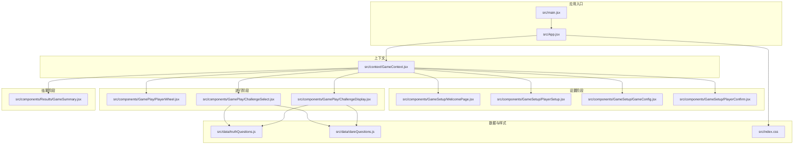
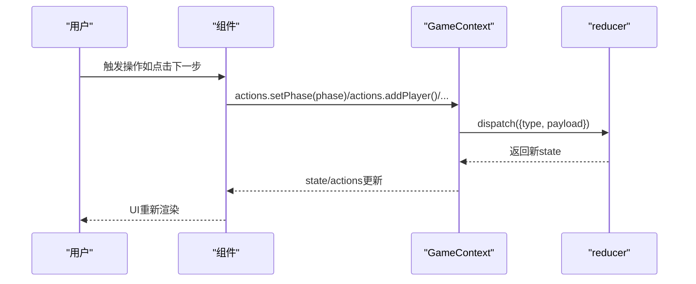
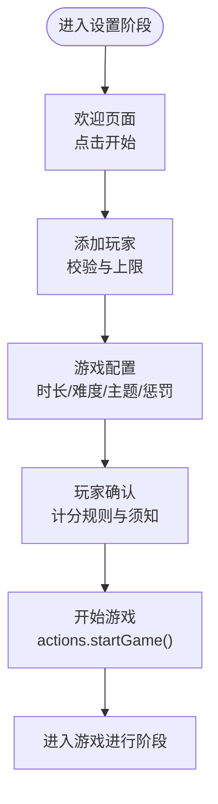
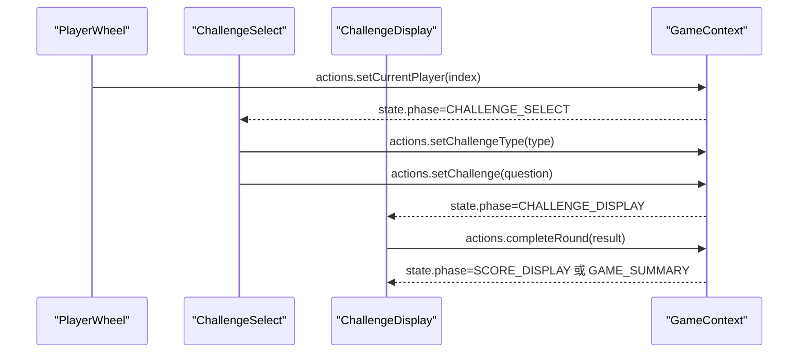
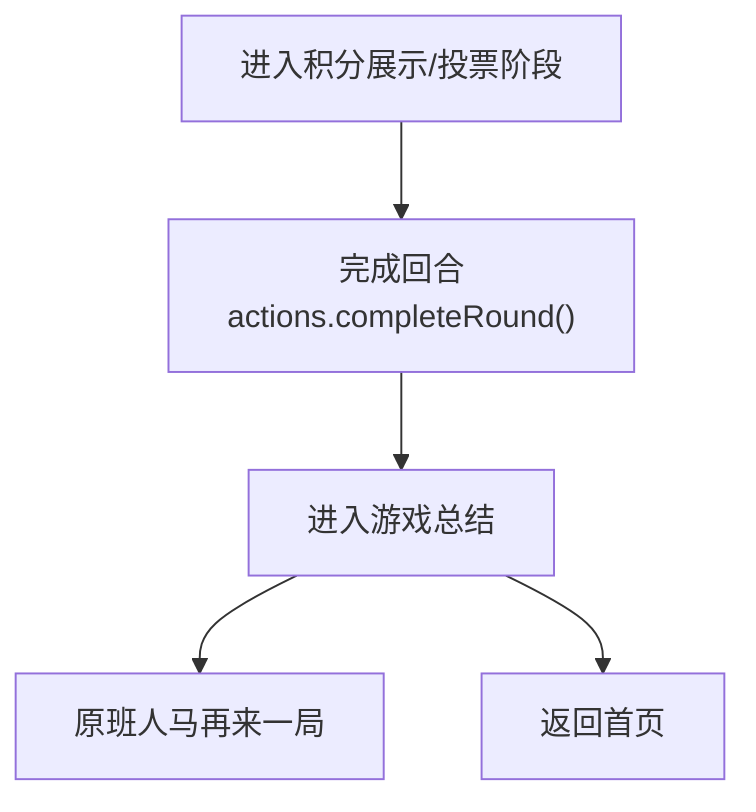
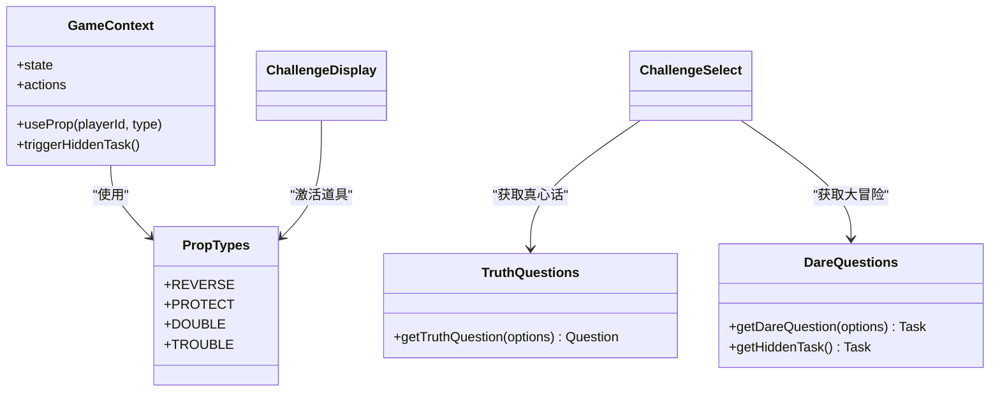
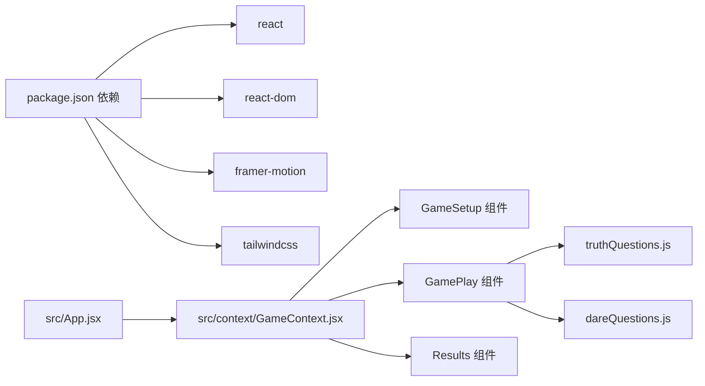

# 游戏模块

<cite>
**本文档引用的文件**
- [README.md](file://README.md)
- [package.json](file://package.json)
- [src/main.jsx](file://src/main.jsx)
- [src/App.jsx](file://src/App.jsx)
- [src/context/GameContext.jsx](file://src/context/GameContext.jsx)
- [src/components/GameSetup/WelcomePage.jsx](file://src/components/GameSetup/WelcomePage.jsx)
- [src/components/GameSetup/PlayerSetup.jsx](file://src/components/GameSetup/PlayerSetup.jsx)
- [src/components/GameSetup/GameConfig.jsx](file://src/components/GameSetup/GameConfig.jsx)
- [src/components/GameSetup/PlayerConfirm.jsx](file://src/components/GameSetup/PlayerConfirm.jsx)
- [src/components/GamePlay/PlayerWheel.jsx](file://src/components/GamePlay/PlayerWheel.jsx)
- [src/components/GamePlay/ChallengeSelect.jsx](file://src/components/GamePlay/ChallengeSelect.jsx)
- [src/components/GamePlay/ChallengeDisplay.jsx](file://src/components/GamePlay/ChallengeDisplay.jsx)
- [src/components/Results/GameSummary.jsx](file://src/components/Results/GameSummary.jsx)
- [src/data/truthQuestions.js](file://src/data/truthQuestions.js)
- [src/data/dareQuestions.js](file://src/data/dareQuestions.js)
- [src/index.css](file://src/index.css)
</cite>

## 目录
1. [简介](#简介)
2. [项目结构](#项目结构)
3. [核心组件](#核心组件)
4. [架构总览](#架构总览)
5. [详细组件分析](#详细组件分析)
6. [依赖关系分析](#依赖关系分析)
7. [性能考虑](#性能考虑)
8. [故障排除指南](#故障排除指南)
9. [结论](#结论)
10. [附录](#附录)

## 简介
本项目是一个基于 React 的 Truth or Dare（真心话/大冒险）派对游戏应用，采用 React Hooks + useReducer 的状态管理模式，结合 Framer Motion 实现流畅的动画过渡。游戏分为三个主要阶段：游戏设置（GameSetup）、游戏进行（GamePlay）和游戏结果（Results）。系统通过全局上下文管理游戏状态、玩家信息、配置参数、挑战生成与道具系统，并支持时间控制、投票评分、积分计算与奖励机制。

## 项目结构
项目采用按功能域划分的目录结构，核心模块包括：
- 组件层：按阶段拆分，GameSetup、GamePlay、Results
- 上下文层：GameContext 提供全局状态与动作
- 数据层：truthQuestions.js、dareQuestions.js 提供题目与任务库
- 样式层：Tailwind CSS + 自定义动画与卡片样式

**图表来源**
- [src/main.jsx](file://src/main.jsx#L1-L11)
- [src/App.jsx](file://src/App.jsx#L1-L61)
- [src/context/GameContext.jsx](file://src/context/GameContext.jsx#L1-L323)
- [src/components/GameSetup/WelcomePage.jsx](file://src/components/GameSetup/WelcomePage.jsx#L1-L88)
- [src/components/GameSetup/PlayerSetup.jsx](file://src/components/GameSetup/PlayerSetup.jsx#L1-L197)
- [src/components/GameSetup/GameConfig.jsx](file://src/components/GameSetup/GameConfig.jsx#L1-L185)
- [src/components/GameSetup/PlayerConfirm.jsx](file://src/components/GameSetup/PlayerConfirm.jsx#L1-L159)
- [src/components/GamePlay/PlayerWheel.jsx](file://src/components/GamePlay/PlayerWheel.jsx#L1-L300)
- [src/components/GamePlay/ChallengeSelect.jsx](file://src/components/GamePlay/ChallengeSelect.jsx#L1-L201)
- [src/components/GamePlay/ChallengeDisplay.jsx](file://src/components/GamePlay/ChallengeDisplay.jsx#L1-L356)
- [src/components/Results/GameSummary.jsx](file://src/components/Results/GameSummary.jsx#L1-L224)
- [src/data/truthQuestions.js](file://src/data/truthQuestions.js#L1-L156)
- [src/data/dareQuestions.js](file://src/data/dareQuestions.js#L1-L167)
- [src/index.css](file://src/index.css#L1-L73)

**章节来源**
- [src/main.jsx](file://src/main.jsx#L1-L11)
- [src/App.jsx](file://src/App.jsx#L1-L61)
- [src/context/GameContext.jsx](file://src/context/GameContext.jsx#L1-L323)

## 核心组件
- 游戏状态与动作：通过 useReducer 管理全局状态，提供统一的动作接口（添加玩家、更新配置、开始游戏、设置挑战、提交投票、完成回合、使用道具等），并暴露工具函数（当前玩家、排行榜、检查结束）。
- 阶段路由：根据 state.phase 动态渲染不同组件，配合 Framer Motion 实现页面切换动画。
- 数据层：truthQuestions.js 与 dareQuestions.js 提供题目/任务过滤与随机选择逻辑，支持难度与主题筛选、已用题目去重与隐藏任务触发。

**章节来源**
- [src/context/GameContext.jsx](file://src/context/GameContext.jsx#L1-L323)
- [src/App.jsx](file://src/App.jsx#L14-L48)
- [src/data/truthQuestions.js](file://src/data/truthQuestions.js#L125-L156)
- [src/data/dareQuestions.js](file://src/data/dareQuestions.js#L129-L167)

## 架构总览
系统采用“上下文驱动”的单向数据流：组件通过 useGame 获取状态与动作，触发动作修改状态，状态变化驱动 UI 更新。阶段间转换通过 setPhase 实现，数据在 reducer 中集中管理，确保一致性与可追踪性。

**图表来源**
- [src/context/GameContext.jsx](file://src/context/GameContext.jsx#L69-L251)
- [src/App.jsx](file://src/App.jsx#L14-L48)

## 详细组件分析

### 游戏设置（GameSetup）阶段
- 欢迎页面（WelcomePage）
  - 职责：引导用户进入游戏，展示特色介绍与流程说明，点击开始进入玩家设置。
  - 交互：点击“开始游戏”触发 actions.setPhase(GAME_PHASES.PLAYER_SETUP)。
- 玩家设置（PlayerSetup）
  - 职责：添加/移除玩家，校验名称唯一性与数量限制（4-10人），支持快速填充。
  - 交互：添加成功后清空输入；达到人数要求后启用“下一步”。
- 游戏配置（GameConfig）
  - 职责：设置游戏时长、难度、主题与惩罚机制，实时预览当前配置。
  - 交互：更新配置通过 actions.setConfig，进入确认阶段。
- 玩家确认（PlayerConfirm）
  - 职责：展示参与须知、隐私保护、退出机制与游戏精神，列出所有玩家，展示计分规则。
  - 交互：点击“确认开始”触发 actions.startGame()，进入游戏进行阶段。

**图表来源**
- [src/components/GameSetup/WelcomePage.jsx](file://src/components/GameSetup/WelcomePage.jsx#L55-L61)
- [src/components/GameSetup/PlayerSetup.jsx](file://src/components/GameSetup/PlayerSetup.jsx#L10-L27)
- [src/components/GameSetup/GameConfig.jsx](file://src/components/GameSetup/GameConfig.jsx#L34-L36)
- [src/components/GameSetup/PlayerConfirm.jsx](file://src/components/GameSetup/PlayerConfirm.jsx#L7-L9)

**章节来源**
- [src/components/GameSetup/WelcomePage.jsx](file://src/components/GameSetup/WelcomePage.jsx#L1-L88)
- [src/components/GameSetup/PlayerSetup.jsx](file://src/components/GameSetup/PlayerSetup.jsx#L1-L197)
- [src/components/GameSetup/GameConfig.jsx](file://src/components/GameSetup/GameConfig.jsx#L1-L185)
- [src/components/GameSetup/PlayerConfirm.jsx](file://src/components/GameSetup/PlayerConfirm.jsx#L1-L159)

### 游戏进行（GamePlay）阶段
- 转盘抽人（PlayerWheel）
  - 职责：旋转SVG转盘随机选择当前轮次挑战者，显示进度条与排行榜预览，检测游戏结束条件。
  - 交互：点击开始旋转，4秒后自动跳转至挑战选择阶段。
- 选择挑战（ChallengeSelect）
  - 职责：当前玩家选择真心话或大冒险，倒计时自动选择，触发隐藏任务概率（5%）。
  - 交互：选择后调用 actions.setChallengeType 与 actions.setChallenge。
- 显示挑战（ChallengeDisplay）
  - 职责：展示挑战内容与倒计时，支持“完成挑战”、“大冒险失败”、“跳过”、“使用道具”、“投票”等操作。
  - 逻辑：根据挑战类型与投票结果计算积分，处理保护卡、双倍卡等道具效果，进入积分展示阶段。

**图表来源**
- [src/components/GamePlay/PlayerWheel.jsx](file://src/components/GamePlay/PlayerWheel.jsx#L59-L61)
- [src/components/GamePlay/ChallengeSelect.jsx](file://src/components/GamePlay/ChallengeSelect.jsx#L42-L71)
- [src/components/GamePlay/ChallengeDisplay.jsx](file://src/components/GamePlay/ChallengeDisplay.jsx#L88-L99)

**章节来源**
- [src/components/GamePlay/PlayerWheel.jsx](file://src/components/GamePlay/PlayerWheel.jsx#L1-L300)
- [src/components/GamePlay/ChallengeSelect.jsx](file://src/components/GamePlay/ChallengeSelect.jsx#L1-L201)
- [src/components/GamePlay/ChallengeDisplay.jsx](file://src/components/GamePlay/ChallengeDisplay.jsx#L1-L356)

### 游戏结果（Results）阶段
- 游戏总结（GameSummary）
  - 职责：展示最终排名、特别奖项（勇气之星、幽默之王、挑战达人）、游戏统计与精彩回顾，提供“原班人马再来一局”与“返回首页”选项。
  - 交互：调用 actions.resetGame() 或 actions.clearPlayers() 重置状态并返回相应阶段。

**图表来源**
- [src/components/Results/GameSummary.jsx](file://src/components/Results/GameSummary.jsx#L29-L38)

**章节来源**
- [src/components/Results/GameSummary.jsx](file://src/components/Results/GameSummary.jsx#L1-L224)

### 道具系统与挑战生成
- 道具类型：反转卡、保护卡、双倍卡、捣乱卡，通过 actions.useProp 激活，影响当前轮次结果。
- 隐藏任务：5%概率触发，包含全员挑战、积分翻倍、连环挑战等特殊规则。
- 挑战生成：
  - 真心话：按难度与主题过滤，避免重复，支持“混合”主题。
  - 大冒险：按难度过滤，支持任务持续时间与分类（表演、互动、搞笑、才艺、惩罚、特殊）。
  - 隐藏任务：独立随机选择，提升趣味性与不可预测性。

**图表来源**
- [src/context/GameContext.jsx](file://src/context/GameContext.jsx#L17-L23)
- [src/data/truthQuestions.js](file://src/data/truthQuestions.js#L125-L156)
- [src/data/dareQuestions.js](file://src/data/dareQuestions.js#L129-L167)

**章节来源**
- [src/context/GameContext.jsx](file://src/context/GameContext.jsx#L17-L23)
- [src/data/truthQuestions.js](file://src/data/truthQuestions.js#L125-L156)
- [src/data/dareQuestions.js](file://src/data/dareQuestions.js#L129-L167)

## 依赖关系分析
- 运行时依赖：React、React DOM、Framer Motion、Tailwind CSS。
- 构建工具：Vite，支持开发与构建。
- 项目通过 GameContext 将组件解耦，减少跨层级通信复杂度，提高可维护性。

**图表来源**
- [package.json](file://package.json#L12-L31)
- [src/App.jsx](file://src/App.jsx#L1-L12)
- [src/context/GameContext.jsx](file://src/context/GameContext.jsx#L1-L323)
- [src/data/truthQuestions.js](file://src/data/truthQuestions.js#L1-L156)
- [src/data/dareQuestions.js](file://src/data/dareQuestions.js#L1-L167)

**章节来源**
- [package.json](file://package.json#L1-L33)
- [src/App.jsx](file://src/App.jsx#L1-L12)

## 性能考虑
- 动画优化：使用 Framer Motion 的预渲染与过渡属性，避免不必要的重绘；转盘旋转使用 CSS 动画曲线，保证流畅度。
- 状态更新：useReducer 将复杂状态收敛到单一 reducer，减少子组件重复渲染；通过精确的 dispatch payload 控制更新范围。
- 数据过滤：题目与任务过滤在客户端完成，建议在大规模数据时引入分页或缓存策略；当前实现适用于小型派对场景。
- 计时器清理：组件卸载时清理定时器，防止内存泄漏与异常状态。

[本节为通用性能建议，不直接分析具体文件]

## 故障排除指南
- 页面无法切换阶段
  - 检查 actions.setPhase 是否正确调用，确认 GAME_PHASES 常量与组件 key 一致。
- 玩家数量不足或超出限制
  - 在 PlayerSetup 中检查人数校验逻辑与错误提示是否正常显示。
- 挑战未生成或重复
  - 检查 usedQuestions 记录与过滤逻辑，确认主题/难度筛选是否生效。
- 道具无法使用
  - 确认 actions.useProp 与 activeProps 状态更新，检查道具图标与描述映射。
- 游戏未按时结束
  - 检查 checkGameEnd 与 gameStartTime 的计算逻辑，确认轮次变化触发。

**章节来源**
- [src/components/GameSetup/PlayerSetup.jsx](file://src/components/GameSetup/PlayerSetup.jsx#L10-L27)
- [src/context/GameContext.jsx](file://src/context/GameContext.jsx#L295-L300)
- [src/data/truthQuestions.js](file://src/data/truthQuestions.js#L129-L150)
- [src/data/dareQuestions.js](file://src/data/dareQuestions.js#L133-L147)

## 结论
该 Truth or Dare 游戏模块通过清晰的阶段划分与上下文驱动的状态管理，实现了从设置到进行再到结果的完整闭环。挑战生成与道具系统增强了可玩性与策略性，动画与交互提升了用户体验。建议在后续迭代中引入更多主题与任务类型、优化大数据量下的过滤性能，并扩展多端同步与社交分享能力。

[本节为总结性内容，不直接分析具体文件]

## 附录
- 运行与部署
  - 本地开发：npm run dev
  - 构建产物：npm run build，输出 dist 文件夹
  - 部署到 Netlify：构建后将 dist 文件夹上传即可

**章节来源**
- [README.md](file://README.md#L1-L20)