# 游戏结果模块

<cite>
**本文档引用的文件**
- [GameSummary.jsx](file://src/components/Results/GameSummary.jsx)
- [GameContext.jsx](file://src/context/GameContext.jsx)
- [App.jsx](file://src/App.jsx)
- [index.css](file://src/index.css)
- [truthQuestions.js](file://src/data/truthQuestions.js)
- [dareQuestions.js](file://src/data/dareQuestions.js)
- [package.json](file://package.json)
</cite>

## 目录
1. [简介](#简介)
2. [项目结构](#项目结构)
3. [核心组件](#核心组件)
4. [架构概览](#架构概览)
5. [详细组件分析](#详细组件分析)
6. [依赖关系分析](#依赖关系分析)
7. [性能考量](#性能考量)
8. [故障排除指南](#故障排除指南)
9. [结论](#结论)
10. [附录](#附录)

## 简介
游戏结果模块是 Truth or Dare 游戏的核心收尾组件，负责在游戏结束后展示最终结果、统计数据和玩家表现。该模块实现了完整的游戏总结功能，包括排行榜展示、特殊奖项颁发、游戏统计分析以及重新开始机制。

## 项目结构
游戏结果模块位于 `src/components/Results/` 目录下，采用 React 组件化架构，配合 Context 提供的状态管理实现。

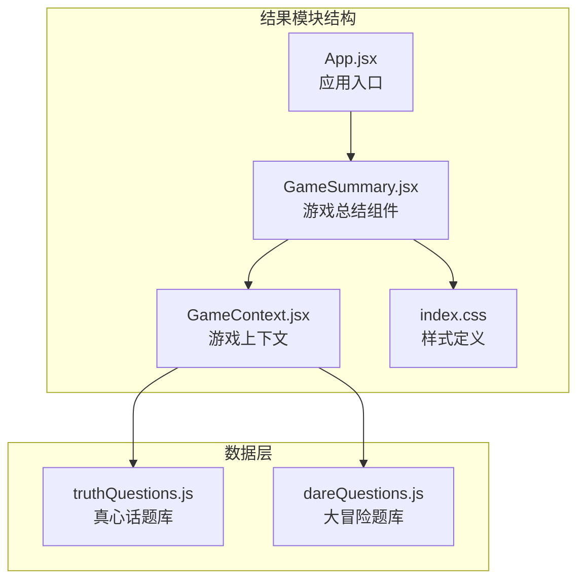

**图表来源**
- [GameSummary.jsx](file://src/components/Results/GameSummary.jsx#L1-L224)
- [GameContext.jsx](file://src/context/GameContext.jsx#L1-L322)
- [App.jsx](file://src/App.jsx#L1-L58)

**章节来源**
- [GameSummary.jsx](file://src/components/Results/GameSummary.jsx#L1-L224)
- [GameContext.jsx](file://src/context/GameContext.jsx#L1-L322)
- [App.jsx](file://src/App.jsx#L1-L58)

## 核心组件
游戏结果模块的核心是 GameSummary 组件，它负责渲染游戏结束后的所有信息展示。

### 组件职责
- **游戏结束条件判断**：基于时间限制自动结束游戏
- **排行榜计算**：根据玩家分数进行降序排序
- **统计数据展示**：总轮数、完成挑战数、挑战类型分布
- **特殊奖项颁发**：勇气之星、幽默之王等荣誉称号
- **重新开始机制**：支持原班人马继续游戏或返回首页

**章节来源**
- [GameSummary.jsx](file://src/components/Results/GameSummary.jsx#L4-L38)
- [GameContext.jsx](file://src/context/GameContext.jsx#L289-L300)

## 架构概览
游戏结果模块采用 React + Framer Motion 的现代前端架构，结合 Context API 实现全局状态管理。

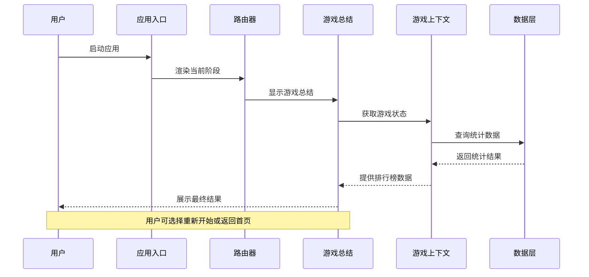

**图表来源**
- [App.jsx](file://src/App.jsx#L13-L45)
- [GameSummary.jsx](file://src/components/Results/GameSummary.jsx#L4-L6)
- [GameContext.jsx](file://src/context/GameContext.jsx#L256-L321)

## 详细组件分析

### GameSummary 组件分析

#### 数据结构与算法
游戏总结组件实现了多种数据处理算法：

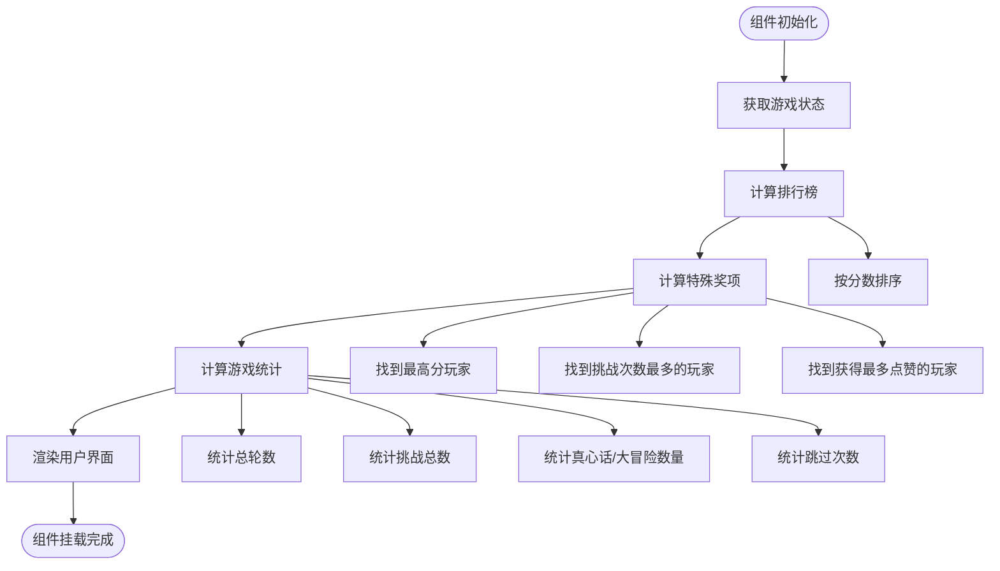

**图表来源**
- [GameSummary.jsx](file://src/components/Results/GameSummary.jsx#L8-L27)

#### 排行榜系统实现
排行榜系统采用简单的冒泡排序算法，时间复杂度为 O(n log n)，空间复杂度为 O(n)：

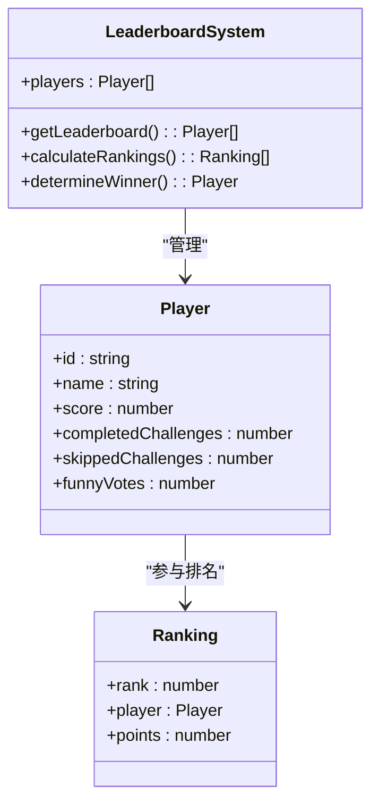

**图表来源**
- [GameContext.jsx](file://src/context/GameContext.jsx#L289-L292)
- [GameSummary.jsx](file://src/components/Results/GameSummary.jsx#L8-L18)

#### 特殊奖项系统
游戏实现了三种特殊奖项的自动颁发机制：

| 奖项类型 | 判定条件 | 获奖标准 |
|---------|---------|---------|
| 勇气之星 | 完成挑战次数最多 | completedChallenges 最大值 |
| 幽默之王 | 获得点赞最多 | funnyVotes 最大值 |
| 挑战达人 | 总分最高 | score 最高值 |

**章节来源**
- [GameSummary.jsx](file://src/components/Results/GameSummary.jsx#L8-L18)

#### 游戏统计系统
统计系统收集并计算以下关键指标：

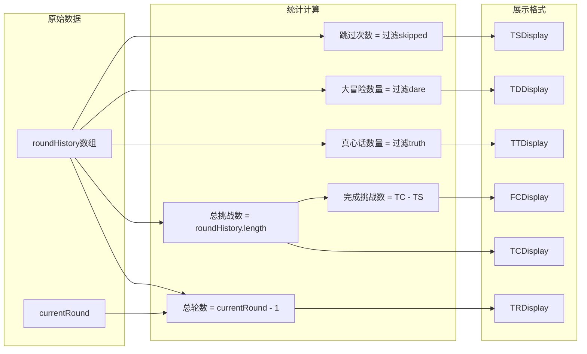

**图表来源**
- [GameSummary.jsx](file://src/components/Results/GameSummary.jsx#L21-L27)

**章节来源**
- [GameSummary.jsx](file://src/components/Results/GameSummary.jsx#L21-L27)

### 游戏结束条件判断

#### 时间限制机制
游戏采用基于时间的自动结束机制，通过比较游戏开始时间和当前时间来判断是否达到设定时长：

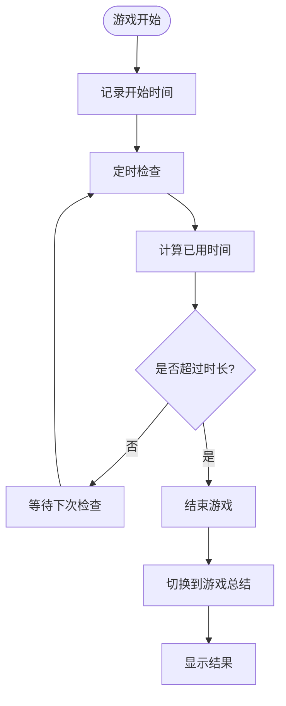

**图表来源**
- [GameContext.jsx](file://src/context/GameContext.jsx#L294-L299)

#### 结束条件逻辑
游戏结束条件的判断逻辑简洁高效，采用常量时间复杂度：

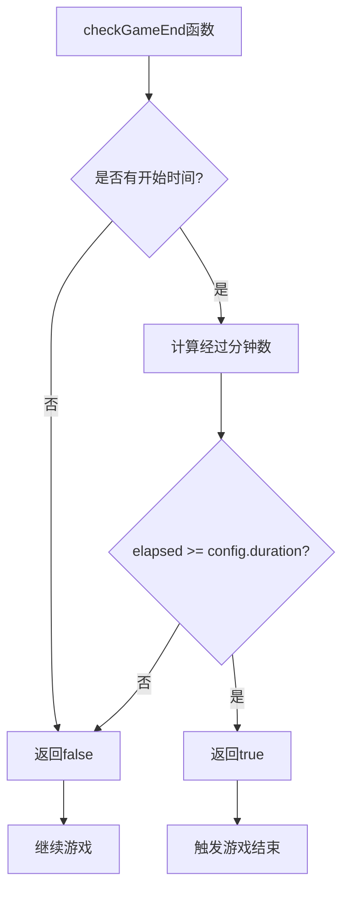

**图表来源**
- [GameContext.jsx](file://src/context/GameContext.jsx#L294-L299)

**章节来源**
- [GameContext.jsx](file://src/context/GameContext.jsx#L294-L299)

### 用户界面设计

#### 动画效果实现
游戏总结页面采用了丰富的 Framer Motion 动画效果：

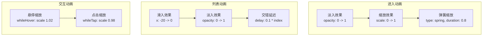

**图表来源**
- [GameSummary.jsx](file://src/components/Results/GameSummary.jsx#L41-L51)
- [GameSummary.jsx](file://src/components/Results/GameSummary.jsx#L89-L91)
- [GameSummary.jsx](file://src/components/Results/GameSummary.jsx#L196-L200)

#### 响应式布局设计
组件采用 Tailwind CSS 实现响应式设计，支持多种屏幕尺寸：

| 断点 | 最小宽度 | 内边距 | 卡片宽度 |
|------|----------|--------|----------|
| 移动端 | 0px | p-4 | w-full |
| 小屏设备 | 640px | p-6 | max-w-md |
| 大屏设备 | 768px | p-8 | max-w-lg |

**章节来源**
- [GameSummary.jsx](file://src/components/Results/GameSummary.jsx#L44-L46)
- [index.css](file://src/index.css#L54-L59)

### 重新开始机制

#### 状态重置流程
重新开始游戏涉及多个状态的重置操作：

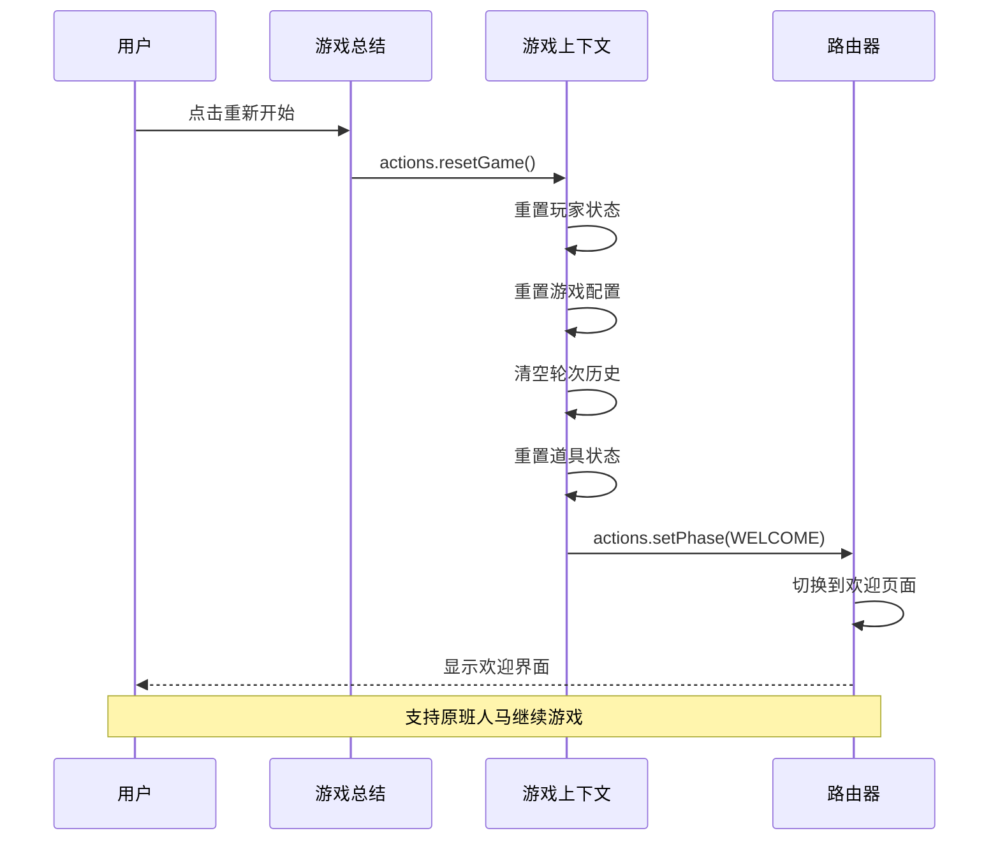

**图表来源**
- [GameSummary.jsx](file://src/components/Results/GameSummary.jsx#L29-L33)
- [GameContext.jsx](file://src/context/GameContext.jsx#L221-L233)

#### 状态重置策略
重新开始机制采用选择性重置策略：

| 状态项 | 重置方式 | 保留项 |
|--------|----------|--------|
| 玩家列表 | 保留 | 保留玩家信息 |
| 游戏配置 | 重置 | 保留配置选项 |
| 轮次历史 | 清空 | 清空历史记录 |
| 道具状态 | 重置 | 重置道具使用情况 |
| 游戏阶段 | 切换 | 返回欢迎页面 |

**章节来源**
- [GameSummary.jsx](file://src/components/Results/GameSummary.jsx#L29-L38)
- [GameContext.jsx](file://src/context/GameContext.jsx#L221-L239)

## 依赖关系分析

### 外部依赖
游戏结果模块主要依赖以下外部库：

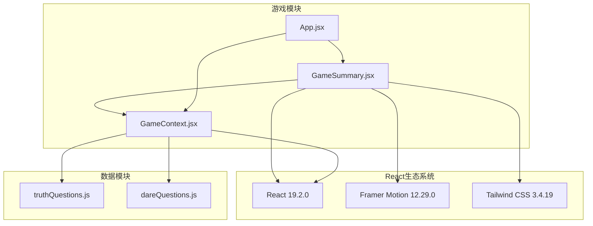

**图表来源**
- [package.json](file://package.json#L12-L16)
- [GameSummary.jsx](file://src/components/Results/GameSummary.jsx#L1-L2)
- [GameContext.jsx](file://src/context/GameContext.jsx#L1-L1)

**章节来源**
- [package.json](file://package.json#L12-L31)

### 内部依赖关系
组件间的依赖关系清晰明确，遵循单一职责原则：

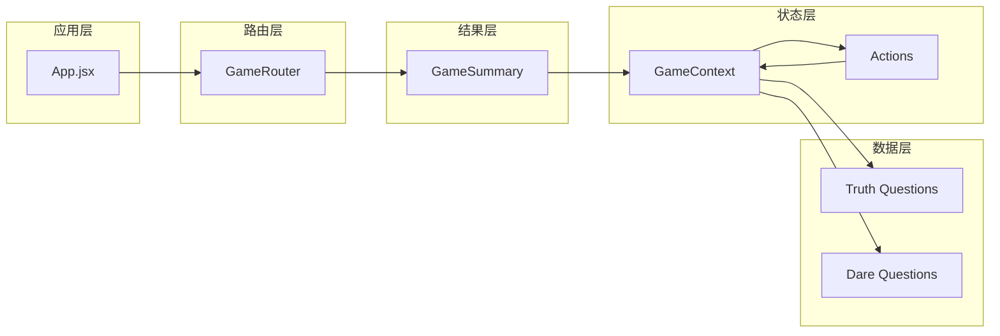

**图表来源**
- [App.jsx](file://src/App.jsx#L13-L38)
- [GameSummary.jsx](file://src/components/Results/GameSummary.jsx#L4-L6)
- [GameContext.jsx](file://src/context/GameContext.jsx#L256-L321)

**章节来源**
- [App.jsx](file://src/App.jsx#L13-L45)
- [GameContext.jsx](file://src/context/GameContext.jsx#L256-L321)

## 性能考量

### 渲染优化
游戏总结组件采用了多项性能优化策略：

1. **条件渲染**：仅在有数据时显示特定区域
2. **动画优化**：使用 Framer Motion 的硬件加速动画
3. **列表优化**：使用 key 属性确保列表项正确更新
4. **内存管理**：及时清理不需要的数据结构

### 数据处理效率
- 排行榜计算：O(n log n) 时间复杂度
- 统计计算：O(n) 线性时间复杂度
- 特殊奖项：O(n) 线性扫描复杂度

## 故障排除指南

### 常见问题及解决方案

#### 排行榜显示异常
**问题描述**：排行榜顺序不正确或重复
**解决方案**：
1. 检查玩家分数字段是否正确更新
2. 确认排序算法的稳定性
3. 验证数据结构的一致性

#### 统计数据错误
**问题描述**：统计数字与实际不符
**解决方案**：
1. 检查 roundHistory 数组的完整性
2. 验证过滤条件的正确性
3. 确认数据类型转换的准确性

#### 动画效果异常
**问题描述**：动画不流畅或显示异常
**解决方案**：
1. 检查 Framer Motion 版本兼容性
2. 验证 CSS 动画类的正确性
3. 确认响应式断点的设置

**章节来源**
- [GameSummary.jsx](file://src/components/Results/GameSummary.jsx#L8-L18)
- [GameSummary.jsx](file://src/components/Results/GameSummary.jsx#L21-L27)

## 结论
游戏结果模块是一个功能完整、设计精良的游戏收尾组件。它成功实现了以下核心功能：

1. **完整的统计分析**：提供全面的游戏数据展示
2. **智能的结束判断**：基于时间限制的自动结束机制
3. **丰富的用户交互**：流畅的动画效果和响应式设计
4. **灵活的重新开始**：支持多种游戏重启模式

该模块展现了良好的代码组织结构、清晰的职责分离和高效的性能表现，为 Truth or Dare 游戏提供了出色的用户体验。

## 附录

### 开发指南

#### 自定义统计报告开发
要扩展统计报告功能，可以按照以下步骤进行：

1. **数据收集扩展**：在 GameContext 中添加新的状态字段
2. **计算逻辑实现**：在 GameSummary 中实现相应的计算函数
3. **界面展示优化**：添加新的统计卡片和图表组件
4. **数据持久化**：考虑将统计数据保存到本地存储

#### 个性化游戏总结开发
要实现个性化总结功能，建议：

1. **主题定制**：允许用户选择不同的主题颜色方案
2. **内容定制**：支持用户自定义显示的统计项目
3. **分享功能**：集成社交分享和截图功能
4. **导出功能**：支持将总结结果导出为 PDF 或图片

#### 游戏日志记录和数据分析
扩展日志记录功能的建议：

1. **事件追踪**：记录关键游戏事件的时间戳
2. **性能监控**：监控组件渲染性能和内存使用
3. **用户行为分析**：分析用户的决策模式和偏好
4. **数据可视化**：提供更丰富的图表和仪表板