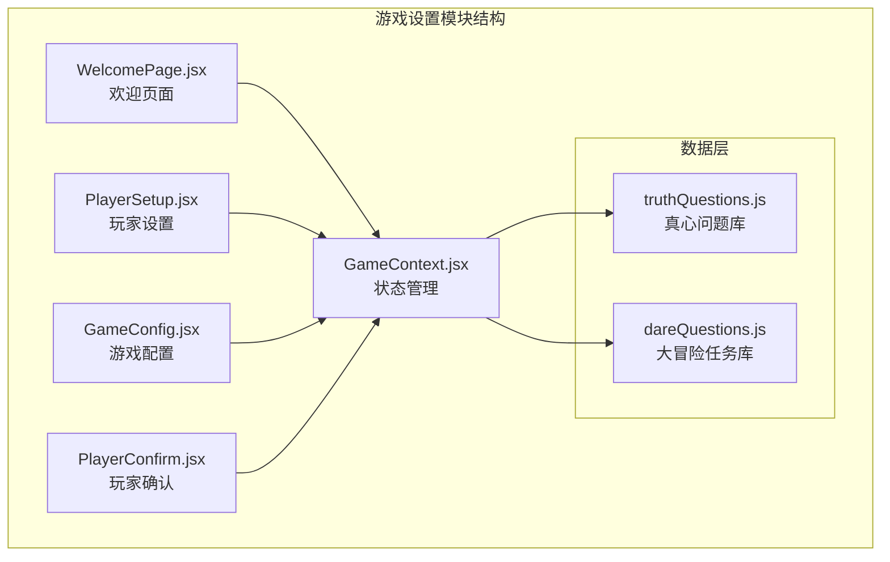
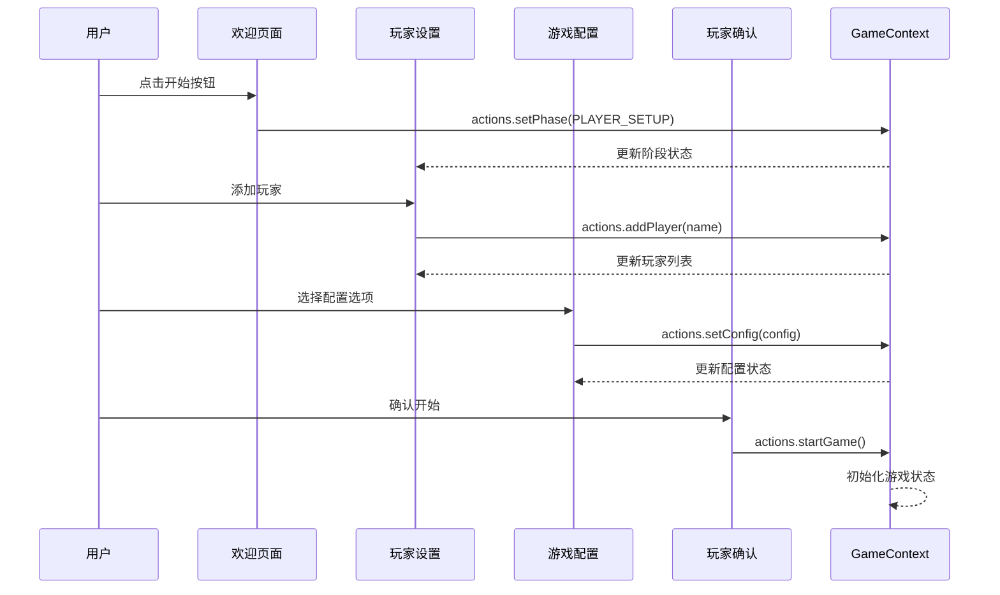
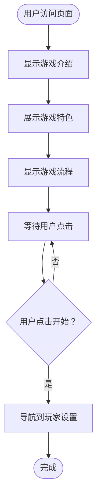
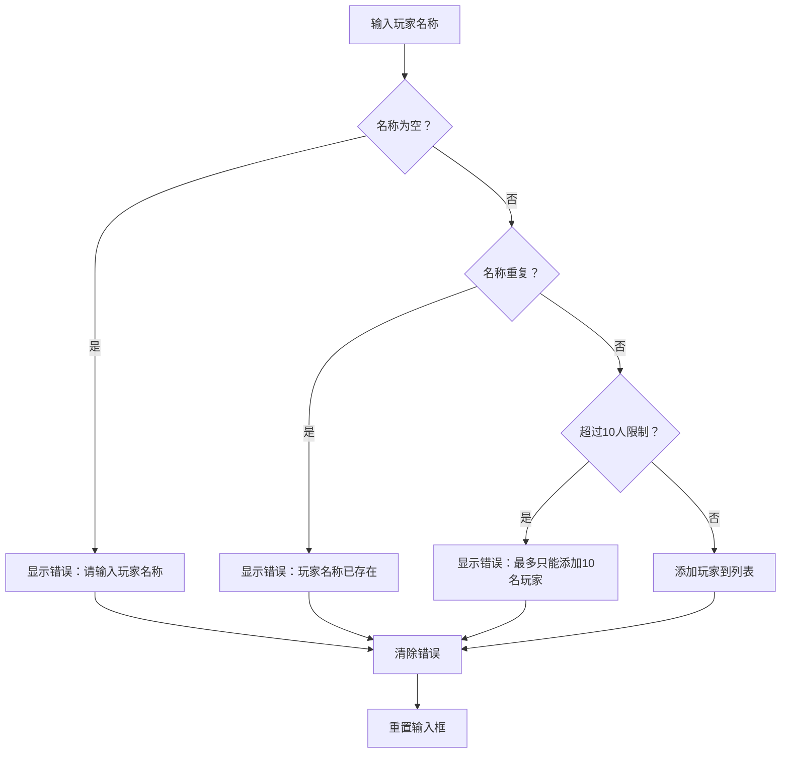
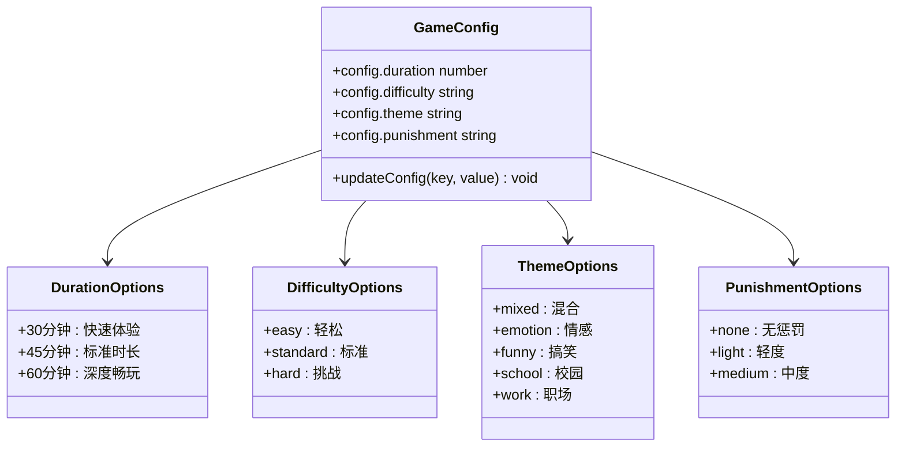
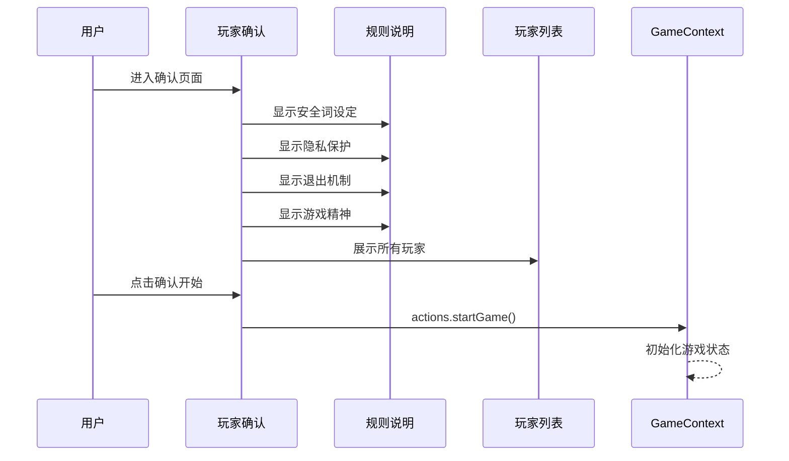
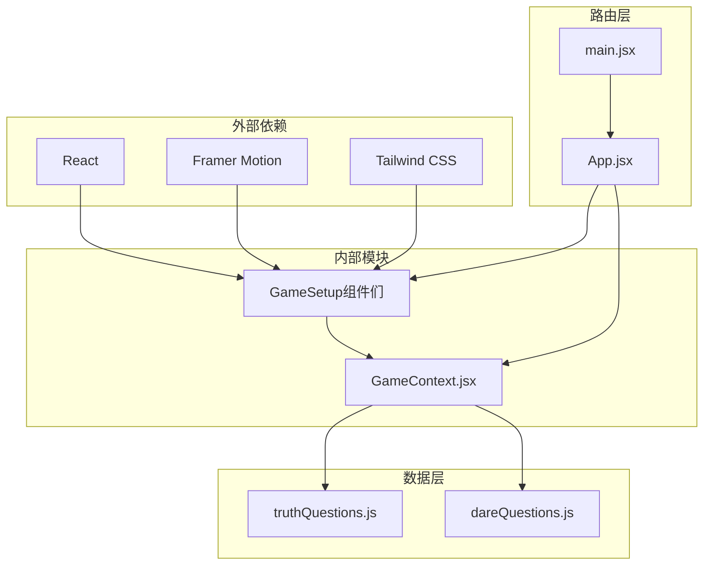
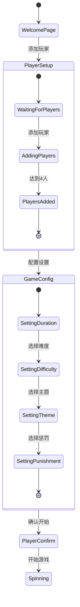

# 游戏设置模块

<cite>
**本文档引用的文件**
- [src/components/GameSetup/WelcomePage.jsx](file://src/components/GameSetup/WelcomePage.jsx)
- [src/components/GameSetup/PlayerSetup.jsx](file://src/components/GameSetup/PlayerSetup.jsx)
- [src/components/GameSetup/GameConfig.jsx](file://src/components/GameSetup/GameConfig.jsx)
- [src/components/GameSetup/PlayerConfirm.jsx](file://src/components/GameSetup/PlayerConfirm.jsx)
- [src/context/GameContext.jsx](file://src/context/GameContext.jsx)
- [src/App.jsx](file://src/App.jsx)
- [src/main.jsx](file://src/main.jsx)
- [src/data/truthQuestions.js](file://src/data/truthQuestions.js)
- [src/data/dareQuestions.js](file://src/data/dareQuestions.js)
</cite>

## 目录
1. [简介](#简介)
2. [项目结构](#项目结构)
3. [核心组件](#核心组件)
4. [架构概览](#架构概览)
5. [详细组件分析](#详细组件分析)
6. [依赖关系分析](#依赖关系分析)
7. [性能考虑](#性能考虑)
8. [故障排除指南](#故障排除指南)
9. [结论](#结论)
10. [扩展指南](#扩展指南)

## 简介

游戏设置模块是真心话大冒险游戏的核心初始化系统，负责管理游戏启动前的所有配置和准备工作。该模块包含四个关键组件：欢迎页面、玩家设置、游戏配置和玩家确认，通过GameContext提供统一的状态管理和组件间通信机制。

该模块实现了完整的游戏初始化流程，从玩家添加和验证到游戏配置设置，再到最终的开始确认，确保游戏能够按照预设规则和配置正常启动。

## 项目结构

游戏设置模块位于`src/components/GameSetup/`目录下，采用按功能分层的组织方式：



**图表来源**
- [src/components/GameSetup/WelcomePage.jsx](file://src/components/GameSetup/WelcomePage.jsx#L1-L88)
- [src/components/GameSetup/PlayerSetup.jsx](file://src/components/GameSetup/PlayerSetup.jsx#L1-L197)
- [src/components/GameSetup/GameConfig.jsx](file://src/components/GameSetup/GameConfig.jsx#L1-L185)
- [src/components/GameSetup/PlayerConfirm.jsx](file://src/components/GameSetup/PlayerConfirm.jsx#L1-L159)
- [src/context/GameContext.jsx](file://src/context/GameContext.jsx#L1-L323)

**章节来源**
- [src/components/GameSetup/WelcomePage.jsx](file://src/components/GameSetup/WelcomePage.jsx#L1-L88)
- [src/components/GameSetup/PlayerSetup.jsx](file://src/components/GameSetup/PlayerSetup.jsx#L1-L197)
- [src/components/GameSetup/GameConfig.jsx](file://src/components/GameSetup/GameConfig.jsx#L1-L185)
- [src/components/GameSetup/PlayerConfirm.jsx](file://src/components/GameSetup/PlayerConfirm.jsx#L1-L159)
- [src/context/GameContext.jsx](file://src/context/GameContext.jsx#L1-L323)

## 核心组件

游戏设置模块由四个主要组件构成，每个组件都有明确的职责和功能：

### 组件职责矩阵

| 组件 | 主要职责 | 关键功能 | 用户交互 |
|------|----------|----------|----------|
| WelcomePage | 游戏入口和引导 | 欢迎界面展示、流程说明、开始按钮 | 点击开始按钮 |
| PlayerSetup | 玩家管理 | 添加/移除玩家、数量验证、快速添加 | 输入框、按钮操作 |
| GameConfig | 游戏配置 | 时间长度、难度、主题设置 | 选项选择、配置更新 |
| PlayerConfirm | 最终确认 | 规则说明、玩家列表、开始游戏 | 确认按钮 |

**章节来源**
- [src/components/GameSetup/WelcomePage.jsx](file://src/components/GameSetup/WelcomePage.jsx#L4-L87)
- [src/components/GameSetup/PlayerSetup.jsx](file://src/components/GameSetup/PlayerSetup.jsx#L5-L196)
- [src/components/GameSetup/GameConfig.jsx](file://src/components/GameSetup/GameConfig.jsx#L30-L184)
- [src/components/GameSetup/PlayerConfirm.jsx](file://src/components/GameSetup/PlayerConfirm.jsx#L4-L158)

## 架构概览

游戏设置模块采用React Context模式，通过GameContext提供全局状态管理和组件间通信：



**图表来源**
- [src/context/GameContext.jsx](file://src/context/GameContext.jsx#L261-L280)
- [src/components/GameSetup/WelcomePage.jsx](file://src/components/GameSetup/WelcomePage.jsx#L52-L61)
- [src/components/GameSetup/PlayerSetup.jsx](file://src/components/GameSetup/PlayerSetup.jsx#L10-L27)
- [src/components/GameSetup/GameConfig.jsx](file://src/components/GameSetup/GameConfig.jsx#L34-L36)
- [src/components/GameSetup/PlayerConfirm.jsx](file://src/components/GameSetup/PlayerConfirm.jsx#L7-L9)

## 详细组件分析

### 欢迎页面（WelcomePage）

WelcomePage作为游戏的入口页面，负责向用户展示游戏的基本信息和开始引导：

#### 功能特性
- **视觉设计**：使用Framer Motion实现流畅的动画效果
- **游戏介绍**：展示游戏特色和流程说明
- **导航控制**：提供开始游戏的入口按钮

#### 用户交互流程


**图表来源**
- [src/components/GameSetup/WelcomePage.jsx](file://src/components/GameSetup/WelcomePage.jsx#L52-L61)

**章节来源**
- [src/components/GameSetup/WelcomePage.jsx](file://src/components/GameSetup/WelcomePage.jsx#L1-L88)

### 玩家设置（PlayerSetup）

PlayerSetup组件负责玩家的添加、管理和验证，是游戏设置模块中最复杂的组件之一：

#### 玩家添加和验证机制



**图表来源**
- [src/components/GameSetup/PlayerSetup.jsx](file://src/components/GameSetup/PlayerSetup.jsx#L10-L27)

#### 核心验证规则
- **数量限制**：最多支持10名玩家，最少4名玩家
- **名称验证**：不允许空名称，支持前后空格自动清理
- **重复检查**：确保玩家名称唯一性
- **输入限制**：名称最大长度为10个字符

#### 快速添加功能
PlayerSetup提供了8个预设的快速添加按钮，便于快速填充测试场景：

| 快速添加名称 | 用途 |
|-------------|------|
| 玩家A-F | 基础测试场景 |
| 玩家G | 边界测试（第7名玩家） |
| 玩家H | 边界测试（第8名玩家） |

**章节来源**
- [src/components/GameSetup/PlayerSetup.jsx](file://src/components/GameSetup/PlayerSetup.jsx#L1-L197)

### 游戏配置（GameConfig）

GameConfig组件提供全面的游戏配置选项，支持多个维度的自定义设置：

#### 配置选项详解



**图表来源**
- [src/components/GameSetup/GameConfig.jsx](file://src/components/GameSetup/GameConfig.jsx#L4-L28)

#### 配置实现原理

每个配置选项都通过`updateConfig`函数进行更新，该函数使用GameContext的actions.setConfig方法来修改全局状态：

| 配置项 | 默认值 | 可选值 | 描述 |
|--------|--------|--------|------|
| duration | 30 | 30, 45, 60 | 游戏时长（分钟） |
| difficulty | standard | easy, standard, hard | 游戏难度级别 |
| theme | mixed | mixed, emotion, funny, school, work | 题目主题分类 |
| punishment | light | none, light, medium | 惩罚机制强度 |

**章节来源**
- [src/components/GameSetup/GameConfig.jsx](file://src/components/GameSetup/GameConfig.jsx#L1-L185)

### 玩家确认（PlayerConfirm）

PlayerConfirm组件提供最终的游戏开始确认，包含重要的游戏规则说明和玩家列表展示：

#### 确认流程设计



**图表来源**
- [src/components/GameSetup/PlayerConfirm.jsx](file://src/components/GameSetup/PlayerConfirm.jsx#L7-L9)

#### 规则说明内容

| 规则类别 | 关键要点 | 重要性 |
|----------|----------|--------|
| 安全词设定 | "跳过"词，无需解释 | 高 |
| 隐私保护 | 内容保密，禁止传播 | 高 |
| 退出机制 | 3张跳过卡，可随时退出 | 中 |
| 游戏精神 | 尊重友善，避免恶意 | 高 |

**章节来源**
- [src/components/GameSetup/PlayerConfirm.jsx](file://src/components/GameSetup/PlayerConfirm.jsx#L1-L159)

## 依赖关系分析

游戏设置模块的依赖关系清晰且层次分明，遵循单一职责原则：



**图表来源**
- [src/App.jsx](file://src/App.jsx#L1-L61)
- [src/main.jsx](file://src/main.jsx#L1-L11)
- [src/context/GameContext.jsx](file://src/context/GameContext.jsx#L1-L323)

### 组件间通信机制

游戏设置模块通过GameContext实现组件间的解耦通信：

#### 状态管理模式



**图表来源**
- [src/context/GameContext.jsx](file://src/context/GameContext.jsx#L4-L15)
- [src/App.jsx](file://src/App.jsx#L14-L48)

**章节来源**
- [src/context/GameContext.jsx](file://src/context/GameContext.jsx#L1-L323)
- [src/App.jsx](file://src/App.jsx#L1-L61)

## 性能考虑

游戏设置模块在设计时充分考虑了性能优化：

### 渲染优化策略
- **条件渲染**：使用`AnimatePresence`实现组件切换的流畅动画
- **懒加载**：组件按需加载，减少初始渲染负担
- **虚拟滚动**：玩家列表使用滚动容器，避免大量DOM节点

### 状态管理优化
- **局部状态**：组件内部状态最小化，减少不必要的重新渲染
- **批量更新**：通过useReducer实现状态的批量更新
- **记忆化**：使用useMemo和useCallback优化昂贵计算

### 数据结构优化
- **数组查找**：玩家列表使用数组存储，支持快速查找和遍历
- **对象映射**：配置选项使用对象映射，提高查找效率
- **缓存机制**：已用问题ID缓存，避免重复使用

## 故障排除指南

### 常见问题及解决方案

#### 玩家添加问题
**问题**：无法添加玩家
**可能原因**：
- 玩家名称为空或只包含空格
- 玩家名称已存在
- 已达到10人上限

**解决方法**：
1. 检查输入框是否有有效字符
2. 确认玩家名称唯一性
3. 移除多余玩家以腾出空间

#### 配置更新问题
**问题**：配置选项无法保存
**可能原因**：
- actions.setConfig未正确调用
- 配置键名不匹配

**解决方法**：
1. 确认配置键名与GameContext中的config结构一致
2. 检查actions.setConfig的调用参数

#### 导航问题
**问题**：无法在组件间切换
**可能原因**：
- actions.setPhase未正确调用
- GAME_PHASES常量定义错误

**解决方法**：
1. 确认GAME_PHASES枚举值正确
2. 检查actions.setPhase的调用时机

**章节来源**
- [src/components/GameSetup/PlayerSetup.jsx](file://src/components/GameSetup/PlayerSetup.jsx#L10-L27)
- [src/components/GameSetup/GameConfig.jsx](file://src/components/GameSetup/GameConfig.jsx#L34-L36)
- [src/context/GameContext.jsx](file://src/context/GameContext.jsx#L261-L280)

## 结论

游戏设置模块成功实现了真心话大冒险游戏的完整初始化流程。通过四个精心设计的组件和强大的GameContext状态管理系统，该模块提供了：

### 核心优势
- **用户体验友好**：直观的界面设计和流畅的动画效果
- **功能完整性**：覆盖了游戏初始化的所有必要步骤
- **扩展性强**：模块化的架构便于添加新的配置选项
- **维护性好**：清晰的代码结构和完善的错误处理

### 技术亮点
- **响应式设计**：适配各种屏幕尺寸
- **状态管理**：基于React Context的全局状态管理
- **组件复用**：高度模块化的组件设计
- **性能优化**：合理的渲染策略和状态管理

该模块为后续的游戏玩法模块奠定了坚实的基础，确保了游戏流程的顺畅和用户体验的优质。

## 扩展指南

### 新增配置选项步骤

#### 1. 更新GameContext状态
在`initialState.config`中添加新的配置项：

```javascript
// 在GameContext.jsx中
const initialState = {
  // ...
  config: {
    // ... 现有配置
    newOption: defaultValue,
  },
};
```

#### 2. 添加Action类型
在`ACTION_TYPES`中定义新的动作类型：

```javascript
const ACTION_TYPES = {
  // ... 现有动作
  SET_NEW_OPTION: 'SET_NEW_OPTION',
};
```

#### 3. 更新reducer逻辑
在`gameReducer`中添加对应的reducer函数：

```javascript
case ACTION_TYPES.SET_NEW_OPTION:
  return {
    ...state,
    config: { ...state.config, newOption: action.payload },
  };
```

#### 4. 创建UI组件
在GameConfig.jsx中添加新的配置选项界面：

```javascript
// 添加新的配置选项
const NEW_OPTIONS = [
  { value: 'option1', label: '选项1' },
  { value: 'option2', label: '选项2' },
];

// 在render函数中添加UI
<div>
  <label>新配置选项</label>
  {NEW_OPTIONS.map(option => (
    <button
      key={option.value}
      onClick={() => updateConfig('newOption', option.value)}
    >
      {option.label}
    </button>
  ))}
</div>
```

### 自定义验证规则

#### 1. 扩展PlayerSetup验证
在`handleAddPlayer`函数中添加新的验证逻辑：

```javascript
const handleAddPlayer = () => {
  const name = newPlayerName.trim();
  
  // 现有验证...
  
  // 新的验证规则
  if (name.length < minLength) {
    setError(`名称长度不能少于${minLength}个字符`);
    return;
  }
  
  if (!isValidPattern.test(name)) {
    setError('名称格式不正确');
    return;
  }
  
  // 继续执行...
};
```

#### 2. 添加自定义验证函数
创建独立的验证函数：

```javascript
const validateCustomRule = (name) => {
  // 自定义验证逻辑
  return {
    isValid: boolean,
    message: string,
  };
};

// 在handleAddPlayer中调用
const customValidation = validateCustomRule(name);
if (!customValidation.isValid) {
  setError(customValidation.message);
  return;
}
```

### 新增游戏主题

#### 1. 更新主题选项
在GameConfig.jsx中添加新的主题：

```javascript
const THEME_OPTIONS = [
  // ... 现有主题
  { value: 'newTheme', label: '新主题', icon: '🌟' },
];
```

#### 2. 更新数据过滤逻辑
在数据文件中添加对应主题的问题：

```javascript
// 在truthQuestions.js或dareQuestions.js中
{ id: 'tXXX', content: '新主题问题', category: 'newTheme', difficulty: 1 }
```

#### 3. 更新问题获取函数
确保问题获取函数支持新主题：

```javascript
export function getTruthQuestion(options = {}) {
  const { difficulty = 'standard', theme = 'mixed', usedIds = [] } = options;
  
  let filtered = truthQuestions.filter(q => !usedIds.includes(q.id));
  
  // 主题过滤逻辑
  if (theme !== 'mixed' && theme !== 'newTheme') {
    filtered = filtered.filter(q => q.category === theme || q.category === 'mixed');
  } else if (theme === 'newTheme') {
    filtered = filtered.filter(q => q.category === theme || q.category === 'mixed');
  }
  
  // ... 其他逻辑
}
```

通过这些扩展指南，开发者可以轻松地为游戏设置模块添加新的功能和配置选项，同时保持代码的整洁性和可维护性。