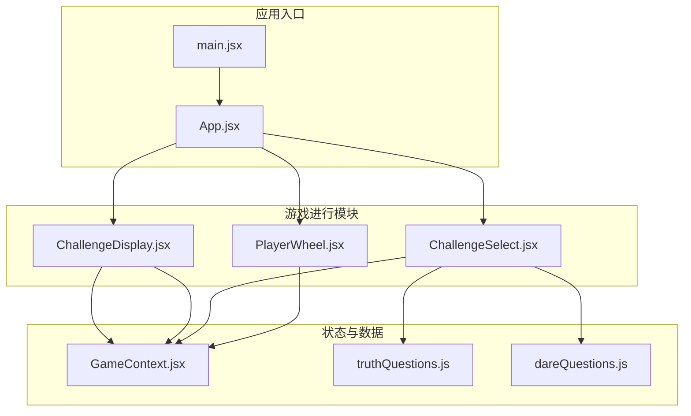
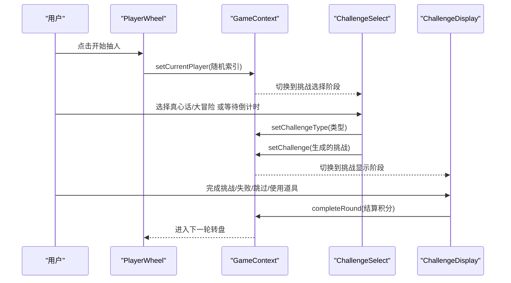
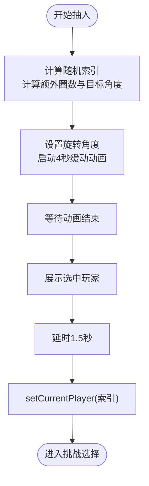
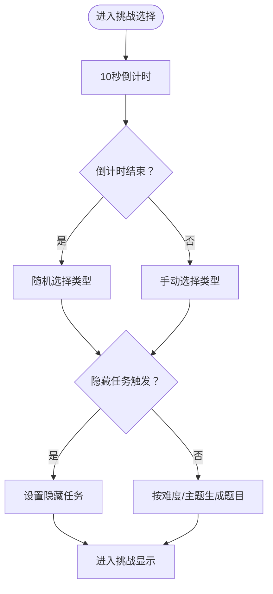
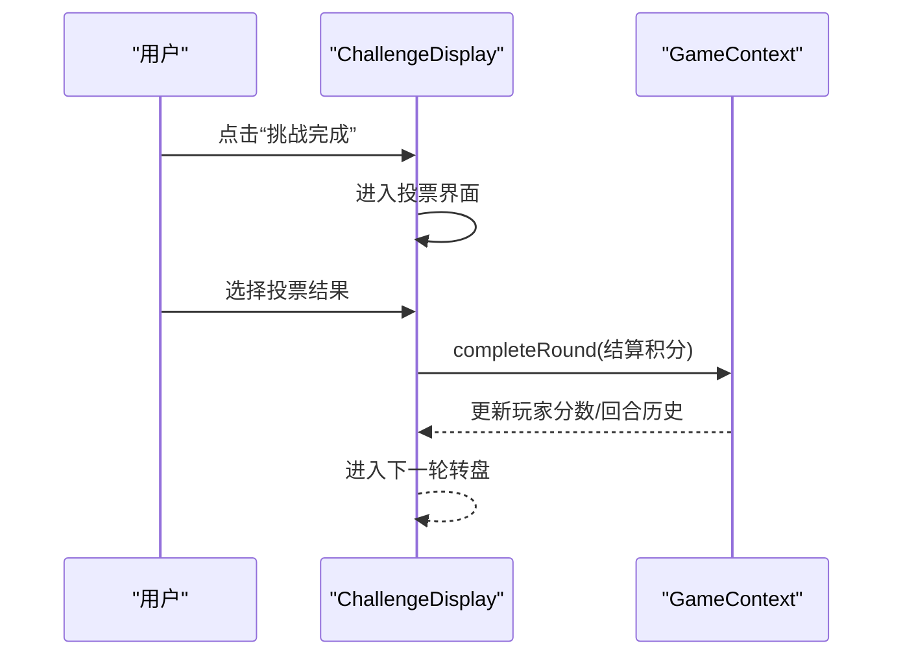
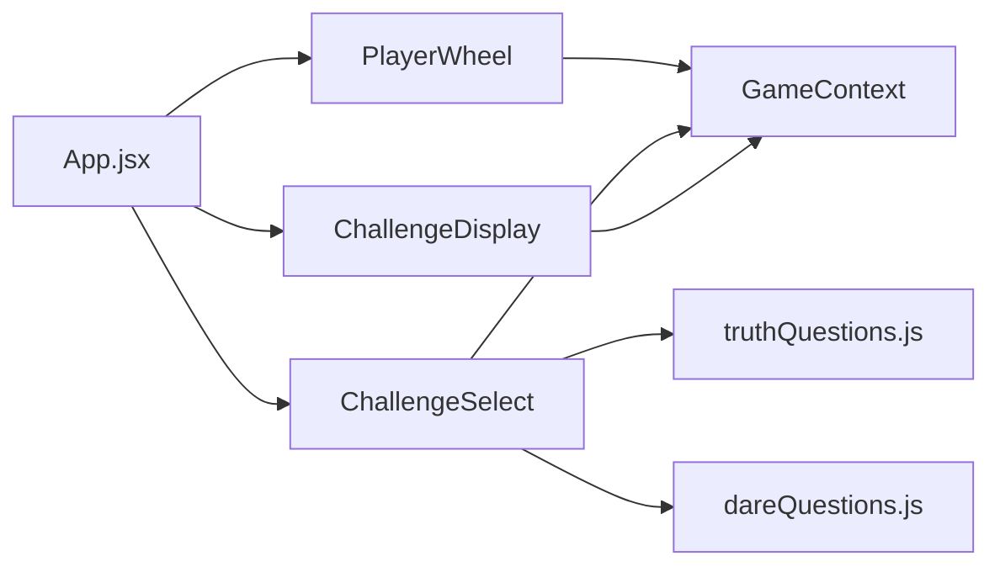

# 游戏进行模块

<cite>
**本文档引用的文件**
- [PlayerWheel.jsx](file://src/components/GamePlay/PlayerWheel.jsx)
- [ChallengeSelect.jsx](file://src/components/GamePlay/ChallengeSelect.jsx)
- [ChallengeDisplay.jsx](file://src/components/GamePlay/ChallengeDisplay.jsx)
- [GameContext.jsx](file://src/context/GameContext.jsx)
- [truthQuestions.js](file://src/data/truthQuestions.js)
- [dareQuestions.js](file://src/data/dareQuestions.js)
- [App.jsx](file://src/App.jsx)
- [main.jsx](file://src/main.jsx)
- [README.md](file://README.md)
</cite>

## 目录
1. [简介](#简介)
2. [项目结构](#项目结构)
3. [核心组件](#核心组件)
4. [架构总览](#架构总览)
5. [详细组件分析](#详细组件分析)
6. [依赖关系分析](#依赖关系分析)
7. [性能考虑](#性能考虑)
8. [故障排除指南](#故障排除指南)
9. [结论](#结论)
10. [附录](#附录)

## 简介
本文件面向“游戏进行模块”，系统性梳理并解释游戏核心玩法的四大关键组件：转盘抽人（PlayerWheel）、挑战选择（ChallengeSelect）、挑战显示（ChallengeDisplay）和分数显示（ScoreDisplay）。文档从架构设计、数据流、处理逻辑、动画实现、性能优化到扩展指导，全面覆盖从玩家选择、挑战生成、难度分级、持续时间计算，到积分系统、道具加成、投票结果处理与实时分数更新的完整闭环。

## 项目结构
游戏进行模块位于 src/components/GamePlay 目录，配合上下文 GameContext 实现全局状态管理，并通过 src/data 下的题库文件提供挑战内容生成支持。路由层 App.jsx 根据游戏阶段切换不同界面组件。

**图表来源**
- [main.jsx](file://src/main.jsx#L1-L11)
- [App.jsx](file://src/App.jsx#L1-L58)
- [PlayerWheel.jsx](file://src/components/GamePlay/PlayerWheel.jsx#L1-L300)
- [ChallengeSelect.jsx](file://src/components/GamePlay/ChallengeSelect.jsx#L1-L201)
- [ChallengeDisplay.jsx](file://src/components/GamePlay/ChallengeDisplay.jsx#L1-L356)
- [GameContext.jsx](file://src/context/GameContext.jsx#L1-L322)
- [truthQuestions.js](file://src/data/truthQuestions.js#L1-L156)
- [dareQuestions.js](file://src/data/dareQuestions.js#L1-L167)

**章节来源**
- [main.jsx](file://src/main.jsx#L1-L11)
- [App.jsx](file://src/App.jsx#L1-L58)

## 核心组件
- 转盘抽人（PlayerWheel）：负责随机抽取当前玩家，实现转盘动画、选中反馈与跳转控制。
- 挑战选择（ChallengeSelect）：提供真心话/大冒险选择，内置倒计时与自动选择逻辑，支持隐藏任务触发。
- 挑战显示（ChallengeDisplay）：展示挑战内容、倒计时、投票确认、道具使用、跳过与失败处理。
- 分数显示（ScoreDisplay）：通过 GameContext 的排行榜方法实时展示积分与排名。

**章节来源**
- [PlayerWheel.jsx](file://src/components/GamePlay/PlayerWheel.jsx#L1-L300)
- [ChallengeSelect.jsx](file://src/components/GamePlay/ChallengeSelect.jsx#L1-L201)
- [ChallengeDisplay.jsx](file://src/components/GamePlay/ChallengeDisplay.jsx#L1-L356)
- [GameContext.jsx](file://src/context/GameContext.jsx#L289-L322)

## 架构总览
游戏采用 React + Framer Motion 的前端架构，结合 useGame 上下文提供全局状态与动作分发。路由层根据 GAME_PHASES 在不同阶段渲染对应组件，形成“转盘抽人 → 挑战选择 → 挑战显示（投票）”的循环流程。

**图表来源**
- [PlayerWheel.jsx](file://src/components/GamePlay/PlayerWheel.jsx#L31-L62)
- [ChallengeSelect.jsx](file://src/components/GamePlay/ChallengeSelect.jsx#L38-L71)
- [ChallengeDisplay.jsx](file://src/components/GamePlay/ChallengeDisplay.jsx#L62-L99)
- [GameContext.jsx](file://src/context/GameContext.jsx#L116-L179)

## 详细组件分析

### 转盘抽人（PlayerWheel）
- 功能要点
  - 随机抽取当前玩家：基于玩家数组长度计算扇形角度，使用随机索引确定目标。
  - 转盘动画：通过旋转角度累计与缓动曲线实现真实感滚动；定时器控制旋转结束与跳转。
  - 选中反馈：选中后短暂延迟展示选中玩家名称，随后进入挑战选择阶段。
  - 游戏进度：根据游戏开始时间和配置时长计算进度条百分比。
  - 排行榜预览：展示当前积分领先的玩家。

- 关键实现
  - 旋转角度计算：总旋转 = 已旋转 + 多圈 + 目标扇形中心对齐角度。
  - 动画时长与缓动：固定4秒滚动，使用特定缓动函数提升真实感。
  - 状态管理：isSpinning 控制动画；isSelected 控制选中展示；selectedIndex 记录选中玩家索引。

**图表来源**
- [PlayerWheel.jsx](file://src/components/GamePlay/PlayerWheel.jsx#L31-L62)

**章节来源**
- [PlayerWheel.jsx](file://src/components/GamePlay/PlayerWheel.jsx#L1-L300)

### 挑战选择（ChallengeSelect）
- 功能要点
  - 类型选择：真心话/大冒险二选一，按钮禁用防止重复选择。
  - 倒计时：10秒自动随机选择，倒计时数字使用动画过渡。
  - 隐藏任务：5%概率触发隐藏任务，立即进入挑战显示阶段。
  - 题目生成：根据难度与主题过滤题库，避免重复使用。

- 关键实现
  - 自动选择：倒计时至0时随机选择类型并提交。
  - 隐藏任务：checkHiddenTask 触发后直接设置挑战并进入挑战显示。
  - 题目过滤：按难度区间与主题过滤，若无可用则重置使用记录。

**图表来源**
- [ChallengeSelect.jsx](file://src/components/GamePlay/ChallengeSelect.jsx#L14-L71)
- [truthQuestions.js](file://src/data/truthQuestions.js#L125-L156)
- [dareQuestions.js](file://src/data/dareQuestions.js#L129-L152)

**章节来源**
- [ChallengeSelect.jsx](file://src/components/GamePlay/ChallengeSelect.jsx#L1-L201)
- [truthQuestions.js](file://src/data/truthQuestions.js#L1-L156)
- [dareQuestions.js](file://src/data/dareQuestions.js#L1-L167)

### 挑战显示（ChallengeDisplay）
- 功能要点
  - 内容展示：真心话/大冒险分别使用不同样式卡片展示挑战内容。
  - 倒计时：真心话默认180秒，大冒险使用任务自带时长或默认120秒。
  - 投票确认：其他玩家（单设备模式下由当前操作者决定）投票“通过/有趣/需解释”，统计结果决定是否加分及加成。
  - 道具系统：支持使用保护卡跳过、双倍卡翻倍、反转卡等。
  - 跳过机制：消耗跳过卡并扣减积分，快速结束本轮。
  - 失败处理：大冒险失败扣分，计入回合历史。

- 关键实现
  - 计时器：每秒递减，倒计时结束时提示超时。
  - 投票统计：通过/有趣计数，超过半数视为通过；有趣投票额外加分。
  - 积分结算：根据挑战类型与投票结果计算基础分，受道具影响（如双倍卡）。
  - 道具使用：提交 useProp 后移除道具并执行相应效果。

**图表来源**
- [ChallengeDisplay.jsx](file://src/components/GamePlay/ChallengeDisplay.jsx#L62-L99)
- [GameContext.jsx](file://src/context/GameContext.jsx#L147-L181)

**章节来源**
- [ChallengeDisplay.jsx](file://src/components/GamePlay/ChallengeDisplay.jsx#L1-L356)
- [GameContext.jsx](file://src/context/GameContext.jsx#L147-L202)

### 分数显示（ScoreDisplay）
- 功能要点
  - 排行榜：通过 getLeaderboard 对玩家按分数排序，展示前三名与实时分数。
  - 实时更新：每次完成回合后，分数即时刷新并在转盘阶段预览。

**章节来源**
- [GameContext.jsx](file://src/context/GameContext.jsx#L289-L322)
- [PlayerWheel.jsx](file://src/components/GamePlay/PlayerWheel.jsx#L270-L285)

## 依赖关系分析
- 组件间耦合
  - PlayerWheel 依赖 GameContext 获取当前玩家索引并切换阶段。
  - ChallengeSelect 依赖 GameContext 设置挑战类型与挑战内容，并调用题库生成器。
  - ChallengeDisplay 依赖 GameContext 完成回合结算、使用道具与跳过卡。
- 数据依赖
  - 题库 truthQuestions.js 与 dareQuestions.js 提供挑战内容与难度映射。
- 外部依赖
  - Framer Motion 提供动画与过渡效果。
  - Tailwind CSS 提供样式与响应式布局。

**图表来源**
- [PlayerWheel.jsx](file://src/components/GamePlay/PlayerWheel.jsx#L1-L10)
- [ChallengeSelect.jsx](file://src/components/GamePlay/ChallengeSelect.jsx#L1-L6)
- [ChallengeDisplay.jsx](file://src/components/GamePlay/ChallengeDisplay.jsx#L1-L4)
- [App.jsx](file://src/App.jsx#L1-L11)

**章节来源**
- [GameContext.jsx](file://src/context/GameContext.jsx#L1-L322)
- [truthQuestions.js](file://src/data/truthQuestions.js#L1-L156)
- [dareQuestions.js](file://src/data/dareQuestions.js#L1-L167)

## 性能考虑
- 动画性能
  - PlayerWheel 使用 transform 与缓动曲线实现硬件加速滚动，避免频繁重排。
  - ChallengeSelect 与 ChallengeDisplay 使用 Framer Motion 的内置优化，减少不必要的重绘。
- 定时器管理
  - PlayerWheel 与 ChallengeSelect/Display 在卸载时清理定时器，防止内存泄漏。
- 数据过滤与去重
  - 题库过滤时先排除已使用ID，避免重复；当无可用题目时重置使用记录，保证流畅体验。
- 状态最小化
  - GameContext 将玩家状态、配置、回合历史集中管理，避免组件间重复传递。

**章节来源**
- [PlayerWheel.jsx](file://src/components/GamePlay/PlayerWheel.jsx#L65-L74)
- [ChallengeSelect.jsx](file://src/components/GamePlay/ChallengeSelect.jsx#L26-L27)
- [ChallengeDisplay.jsx](file://src/components/GamePlay/ChallengeDisplay.jsx#L32-L33)
- [truthQuestions.js](file://src/data/truthQuestions.js#L145-L150)
- [dareQuestions.js](file://src/data/dareQuestions.js#L144-L147)

## 故障排除指南
- 转盘动画不触发
  - 检查 isSpinning 状态是否被提前置为 true；确认定时器未被重复创建。
- 题库为空导致无法生成挑战
  - 确认 usedQuestions 是否正确更新；检查难度与主题过滤条件。
- 投票无效或分数未更新
  - 确认 completeRound 是否被调用且参数正确；检查 activeProps 是否影响最终得分。
- 跳过卡不可用
  - 确认玩家积分≥5且跳过卡数量>0；检查 useSkipCard 是否正确调用。

**章节来源**
- [PlayerWheel.jsx](file://src/components/GamePlay/PlayerWheel.jsx#L31-L62)
- [ChallengeSelect.jsx](file://src/components/GamePlay/ChallengeSelect.jsx#L38-L71)
- [ChallengeDisplay.jsx](file://src/components/GamePlay/ChallengeDisplay.jsx#L42-L99)
- [GameContext.jsx](file://src/context/GameContext.jsx#L183-L202)

## 结论
游戏进行模块通过清晰的阶段划分与上下文驱动的状态管理，实现了从玩家选择、挑战生成、难度分级、持续时间计算到积分结算与道具加成的完整闭环。组件间低耦合、高内聚的设计便于扩展与维护；动画与交互细节提升了用户体验。建议在后续迭代中进一步完善多设备联机投票与更丰富的挑战类型与积分规则。

## 附录

### 扩展新挑战类型与自定义积分规则指导
- 新增挑战类型
  - 在 dareQuestions.js 中添加新任务并指定难度与持续时间；在 ChallengeSelect.jsx 中增加类型按钮与逻辑分支。
  - 在 truthQuestions.js 中添加新真心话题，确保难度与主题字段齐全。
- 自定义积分规则
  - 在 GameContext 的 COMPLETE_ROUND 分支中调整基础分与加成逻辑，例如根据难度系数、投票结果与道具状态动态计算。
  - 若需新增道具，扩展 PROP_TYPES 并在 ChallengeDisplay.jsx 中添加使用逻辑与效果展示。
- 隐藏任务扩展
  - 在 dareQuestions.js 的 hiddenTasks 中新增特殊任务，确保触发概率与效果明确；在 ChallengeSelect.jsx 中保持触发逻辑一致。

**章节来源**
- [dareQuestions.js](file://src/data/dareQuestions.js#L1-L167)
- [truthQuestions.js](file://src/data/truthQuestions.js#L1-L156)
- [GameContext.jsx](file://src/context/GameContext.jsx#L147-L202)
- [ChallengeSelect.jsx](file://src/components/GamePlay/ChallengeSelect.jsx#L29-L36)