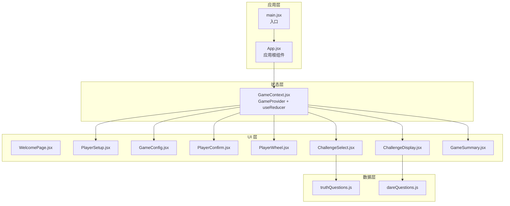
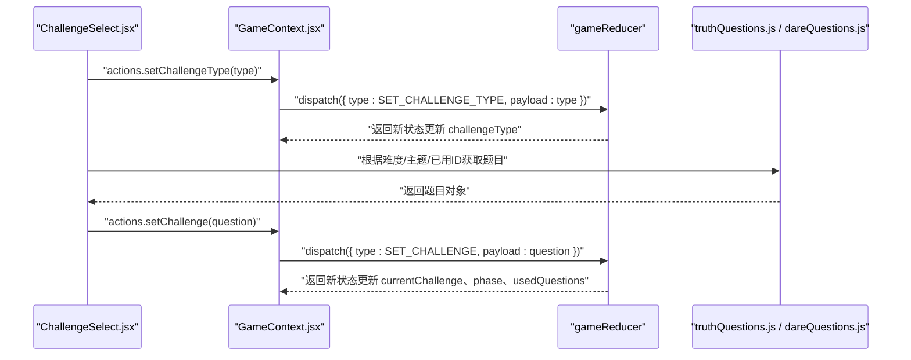
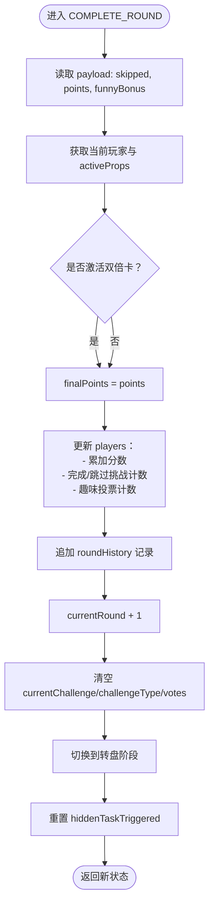
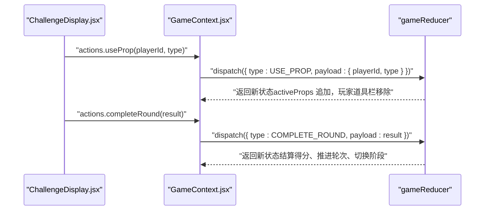
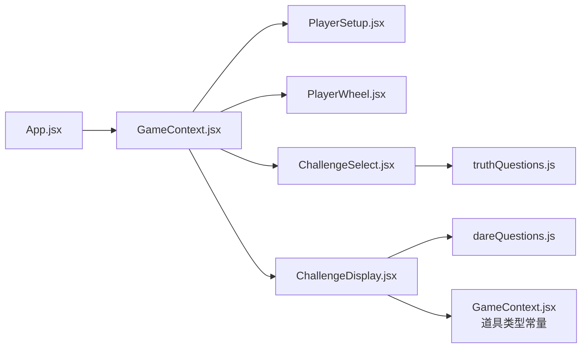

# Action 类型与 Reducer 实现

<cite>
**本文引用的文件**
- [GameContext.jsx](file://src/context/GameContext.jsx)
- [App.jsx](file://src/App.jsx)
- [PlayerSetup.jsx](file://src/components/GameSetup/PlayerSetup.jsx)
- [ChallengeSelect.jsx](file://src/components/GamePlay/ChallengeSelect.jsx)
- [ChallengeDisplay.jsx](file://src/components/GamePlay/ChallengeDisplay.jsx)
- [PlayerWheel.jsx](file://src/components/GamePlay/PlayerWheel.jsx)
- [truthQuestions.js](file://src/data/truthQuestions.js)
- [dareQuestions.js](file://src/data/dareQuestions.js)
- [main.jsx](file://src/main.jsx)
- [index.css](file://src/index.css)
</cite>

## 目录
1. [简介](#简介)
2. [项目结构](#项目结构)
3. [核心组件](#核心组件)
4. [架构总览](#架构总览)
5. [详细组件分析](#详细组件分析)
6. [依赖关系分析](#依赖关系分析)
7. [性能考虑](#性能考虑)
8. [故障排查指南](#故障排查指南)
9. [结论](#结论)

## 简介
本文件聚焦 Truth or Dare 项目中的状态管理实现，系统性梳理 Action 类型设计、Reducer 的分支逻辑、不可变更新策略、复杂状态更新流程（如“完成一轮”和“使用道具”）、action 创建器的设计模式与最佳实践，并给出错误处理与边界情况、性能优化与避免不必要重渲染的建议。目标读者既包括需要理解代码实现的开发者，也包括希望把握整体状态流的非技术用户。

## 项目结构
项目采用 React + useReducer 的轻量状态管理模式，核心状态集中在上下文 Provider 中，UI 组件通过自定义 Hook 访问状态与派发动作。关键文件如下：
- 状态与逻辑：src/context/GameContext.jsx
- 应用入口与路由：src/App.jsx、src/main.jsx
- UI 组件：各功能页面组件位于 src/components 下
- 数据源：src/data 下的题目与任务库
- 样式：src/index.css

图表来源
- [App.jsx](file://src/App.jsx#L13-L45)
- [GameContext.jsx](file://src/context/GameContext.jsx#L256-L312)
- [PlayerSetup.jsx](file://src/components/GameSetup/PlayerSetup.jsx#L1-L197)
- [ChallengeSelect.jsx](file://src/components/GamePlay/ChallengeSelect.jsx#L1-L201)
- [ChallengeDisplay.jsx](file://src/components/GamePlay/ChallengeDisplay.jsx#L1-L356)
- [PlayerWheel.jsx](file://src/components/GamePlay/PlayerWheel.jsx#L1-L300)
- [truthQuestions.js](file://src/data/truthQuestions.js#L125-L156)
- [dareQuestions.js](file://src/data/dareQuestions.js#L129-L167)

章节来源
- [App.jsx](file://src/App.jsx#L1-L58)
- [GameContext.jsx](file://src/context/GameContext.jsx#L1-L322)
- [main.jsx](file://src/main.jsx#L1-L11)

## 核心组件
本节从“Action 类型设计”“Reducer 分支逻辑”“不可变更新与深拷贝策略”“复杂状态更新”“action 创建器设计模式”五个维度展开。

- Action 类型设计
  - 设计原则：集中声明、语义明确、按功能域分组（阶段切换、玩家管理、配置、挑战、投票、道具、游戏生命周期等）
  - 关键枚举：ACTION_TYPES（包含 SET_PHASE、ADD_PLAYER、REMOVE_PLAYER、UPDATE_PLAYER、SET_CONFIG、START_GAME、SET_CURRENT_PLAYER、SET_CHALLENGE_TYPE、SET_CHALLENGE、SUBMIT_VOTE、COMPLETE_ROUND、USE_SKIP_CARD、USE_PROP、ADD_PROP、RESET_GAME、TRIGGER_HIDDEN_TASK、CLEAR_PLAYERS 等）

- Reducer 分支逻辑
  - 简单字段更新：SET_PHASE、SET_CHALLENGE_TYPE、SET_CHALLENGE、SUBMIT_VOTE、TRIGGER_HIDDEN_TASK、CLEAR_PLAYERS
  - 列表更新：ADD_PLAYER、REMOVE_PLAYER、UPDATE_PLAYER、ADD_PROP
  - 复合状态更新：COMPLETE_ROUND（累计分数、完成/跳过次数、趣味投票、轮次推进、清空投票与挑战、阶段切换、隐藏任务标记复位）、USE_PROP（激活道具、从玩家道具栏移除）
  - 游戏生命周期：START_GAME（进入转盘阶段、记录开始时间、初始化轮次）、RESET_GAME（重置玩家统计字段，保留玩家列表）

- 不可变更新与深拷贝策略
  - 基本策略：对 state 进行浅拷贝，对需要变更的子对象/数组进行浅拷贝，确保返回新引用，触发 React 重新渲染
  - 典型模式：使用扩展运算符对 state、state.config、state.players、state.usedQuestions、state.votes、state.activeProps 等进行浅拷贝；对数组使用 concat 或 map/filter 生成新数组
  - 注意事项：避免直接修改原对象属性；对嵌套对象（如 players[i]）仅在需要时局部浅拷贝

- 复杂状态更新
  - COMPLETE_ROUND：根据当前玩家、是否使用双倍卡、是否跳过、是否触发隐藏任务，计算最终得分，更新玩家统计、回合历史、轮次、挑战与投票状态，并切换到下一轮准备阶段
  - USE_PROP：将道具加入 activeProps，同时从当前玩家道具栏移除该道具，供后续阶段生效（例如双倍卡在结算时生效）

- action 创建器设计模式
  - Provider 内部封装 actions 对象，统一以 dispatch({ type, payload }) 形式暴露，便于组件调用
  - 设计要点：参数命名清晰（如 { playerId, vote }），payload 结构化，避免在组件内拼装复杂逻辑
  - 最佳实践：将 UI 交互与状态更新解耦，组件只负责收集用户输入与调用 actions

章节来源
- [GameContext.jsx](file://src/context/GameContext.jsx#L47-L250)
- [GameContext.jsx](file://src/context/GameContext.jsx#L256-L322)

## 架构总览
下面的序列图展示了从用户交互到状态更新的关键流程，以“选择挑战类型并进入挑战展示”为例：

图表来源
- [ChallengeSelect.jsx](file://src/components/GamePlay/ChallengeSelect.jsx#L38-L71)
- [GameContext.jsx](file://src/context/GameContext.jsx#L68-L139)
- [truthQuestions.js](file://src/data/truthQuestions.js#L125-L156)
- [dareQuestions.js](file://src/data/dareQuestions.js#L129-L152)

## 详细组件分析

### ACTION_TYPES 枚举与用途
- SET_PHASE：切换游戏阶段（欢迎页、玩家设置、游戏配置、玩家确认、转盘、选择挑战、显示挑战、投票、游戏总结）
- ADD_PLAYER：新增玩家（默认初始属性：分数、跳过卡、道具、完成/跳过挑战计数、趣味投票计数）
- REMOVE_PLAYER：按 id 删除玩家
- UPDATE_PLAYER：按 id 更新玩家字段（updates 为补丁对象）
- SET_CONFIG：合并配置项（时长、难度、主题、惩罚）
- START_GAME：进入转盘阶段，记录开始时间，初始化轮次
- SET_CURRENT_PLAYER：设置当前玩家索引，进入挑战选择阶段，清空激活道具
- SET_CHALLENGE_TYPE：设置挑战类型（truth/dare）
- SET_CHALLENGE：设置当前挑战，进入挑战展示阶段，记录已用题目
- SUBMIT_VOTE：提交某玩家的投票（用于挑战结果判定）
- COMPLETE_ROUND：完成一轮，计算得分、更新统计、推进轮次、清理状态、切换阶段
- USE_SKIP_CARD：消耗当前玩家的一张跳过卡
- USE_PROP：使用道具（记录到 activeProps，从玩家道具栏移除）
- ADD_PROP：为指定玩家添加随机道具
- RESET_GAME：重置游戏，保留玩家列表，重置玩家统计字段
- TRIGGER_HIDDEN_TASK：触发隐藏任务标记
- CLEAR_PLAYERS：清空玩家列表

章节来源
- [GameContext.jsx](file://src/context/GameContext.jsx#L47-L65)

### Reducer 分支逻辑详解
- SET_PHASE：直接替换 phase
- ADD_PLAYER：在 players 末尾追加新玩家（id 为时间戳字符串，初始属性设定）
- REMOVE_PLAYER：过滤掉匹配 id 的玩家
- UPDATE_PLAYER：映射 players，找到 id 匹配项后进行补丁式合并
- SET_CONFIG：合并 config 子对象
- START_GAME：进入转盘阶段，记录开始时间，轮次置 1
- SET_CURRENT_PLAYER：设置索引，进入挑战选择阶段，清空 activeProps
- SET_CHALLENGE_TYPE：设置 challengeType
- SET_CHALLENGE：设置 currentChallenge，进入挑战展示阶段，将题目 id 追加到 usedQuestions 对应类型列表
- SUBMIT_VOTE：合并 votes 映射
- COMPLETE_ROUND：核心复合逻辑
  - 读取 payload：skipped、points、funnyBonus
  - 读取当前玩家与 activeProps，判断是否激活双倍卡
  - 计算 finalPoints（若激活双倍卡则乘 2）
  - 更新 players：累计分数、完成/跳过挑战计数、趣味投票计数
  - 追加 roundHistory：记录轮次、玩家、挑战类型、挑战内容、是否跳过、最终得分
  - currentRound + 1，清空 currentChallenge、challengeType、votes，进入转盘阶段，重置 hiddenTaskTriggered
- USE_SKIP_CARD：当前玩家 skipCards - 1
- USE_PROP：activeProps 追加，当前玩家道具栏移除该道具
- ADD_PROP：为指定玩家 props 追加随机道具类型
- TRIGGER_HIDDEN_TASK：设置 hiddenTaskTriggered 为 true
- RESET_GAME：重置为初始状态，但保留 players 并重置其统计字段
- CLEAR_PLAYERS：清空 players

图表来源
- [GameContext.jsx](file://src/context/GameContext.jsx#L147-L181)

章节来源
- [GameContext.jsx](file://src/context/GameContext.jsx#L68-L250)

### 不可变更新与深拷贝策略
- 对顶层 state 进行浅拷贝，确保返回新引用
- 对嵌套对象（如 players[i]）仅在需要时局部浅拷贝，避免整块深拷贝
- 对数组使用扩展运算符或 map/filter 生成新数组
- 对映射（如 votes、usedQuestions）使用扩展运算符合并新值
- 在 COMPLETE_ROUND 中，同时更新 players 数组与 roundHistory 数组，均采用浅拷贝策略

章节来源
- [GameContext.jsx](file://src/context/GameContext.jsx#L68-L250)

### 复杂状态更新：COMPLETE_ROUND 与 USE_PROP
- COMPLETE_ROUND
  - 触发条件：挑战完成/失败/跳过后的结算
  - 关键点：双倍卡生效、趣味投票 bonus、回合历史记录、轮次推进、阶段切换
- USE_PROP
  - 触发条件：玩家使用道具
  - 关键点：activeProps 追加，玩家道具栏移除；后续阶段（如结算）读取 activeProps 生效

图表来源
- [ChallengeDisplay.jsx](file://src/components/GamePlay/ChallengeDisplay.jsx#L50-L59)
- [GameContext.jsx](file://src/context/GameContext.jsx#L193-L202)
- [GameContext.jsx](file://src/context/GameContext.jsx#L147-L181)

章节来源
- [ChallengeDisplay.jsx](file://src/components/GamePlay/ChallengeDisplay.jsx#L50-L59)
- [GameContext.jsx](file://src/context/GameContext.jsx#L147-L202)

### action 创建器的设计模式与最佳实践
- Provider 内部封装 actions 对象，统一以 dispatch({ type, payload }) 形式暴露
- payload 结构化：如 { playerId, vote }、{ skipped, points, funnyBonus }、{ id, updates } 等
- 组件职责分离：UI 仅负责收集输入与调用 actions，不直接操作状态
- 可测试性：通过注入不同的 actions 可以轻松模拟不同场景

章节来源
- [GameContext.jsx](file://src/context/GameContext.jsx#L256-L280)

### 错误处理与边界情况
- 玩家数量校验：添加玩家时检查空名、重复名、上限（最多 10 人）
- 跳过卡使用限制：需满足当前玩家拥有跳过卡且分数达到阈值
- 隐藏任务触发：随机概率触发，触发后在 UI 中高亮提示
- 题目池枯竭回退：当按难度/主题筛选后无可用题目，自动重置使用记录并回退到更宽松的筛选条件
- 游戏结束检测：转盘阶段根据配置时长与开始时间判断是否结束，自动跳转到总结页

章节来源
- [PlayerSetup.jsx](file://src/components/GameSetup/PlayerSetup.jsx#L10-L27)
- [ChallengeDisplay.jsx](file://src/components/GamePlay/ChallengeDisplay.jsx#L42-L48)
- [truthQuestions.js](file://src/data/truthQuestions.js#L145-L150)
- [dareQuestions.js](file://src/data/dareQuestions.js#L144-L147)
- [PlayerWheel.jsx](file://src/components/GamePlay/PlayerWheel.jsx#L23-L28)

## 依赖关系分析
- 组件与上下文
  - App.jsx 作为根组件包裹 GameProvider，内部通过 useGame 获取 state 与 actions
  - 各页面组件通过 useGame 访问状态与派发动作
- 数据依赖
  - ChallengeSelect.jsx 依赖 truthQuestions.js 与 dareQuestions.js 获取题目
  - ChallengeDisplay.jsx 依赖道具类型常量 PROP_TYPES 展示道具效果
- 样式与动画
  - index.css 提供全局样式与动画类，组件中通过类名驱动视觉反馈

图表来源
- [App.jsx](file://src/App.jsx#L1-L58)
- [GameContext.jsx](file://src/context/GameContext.jsx#L1-L322)
- [PlayerSetup.jsx](file://src/components/GameSetup/PlayerSetup.jsx#L1-L197)
- [PlayerWheel.jsx](file://src/components/GamePlay/PlayerWheel.jsx#L1-L300)
- [ChallengeSelect.jsx](file://src/components/GamePlay/ChallengeSelect.jsx#L1-L201)
- [ChallengeDisplay.jsx](file://src/components/GamePlay/ChallengeDisplay.jsx#L1-L356)
- [truthQuestions.js](file://src/data/truthQuestions.js#L1-L156)
- [dareQuestions.js](file://src/data/dareQuestions.js#L1-L167)

章节来源
- [App.jsx](file://src/App.jsx#L1-L58)
- [GameContext.jsx](file://src/context/GameContext.jsx#L1-L322)

## 性能考虑
- 不可变更新与浅比较
  - 使用扩展运算符确保返回新引用，配合 React.memo/useMemo/useCallback 可减少重渲染
- 复合更新拆分
  - 将 COMPLETE_ROUND 的多步更新拆分为独立的 reducer 分支，避免在组件中多次 setState
- 事件处理与防抖
  - 在倒计时与轮播等高频更新场景，注意清理定时器，避免内存泄漏
- 渲染优化
  - 使用 AnimatePresence 控制页面切换动画，避免不必要的 DOM 操作
  - 对长列表（玩家列表、轮次历史）使用虚拟滚动或分页（当前项目未实现，但可作为扩展方向）

## 故障排查指南
- 症状：无法添加/删除玩家
  - 排查：确认输入非空、名称唯一、未超过上限；检查 actions.addPlayer/removePlayer 是否正确调用
- 症状：挑战无法进入显示阶段
  - 排查：确认 setChallengeType 与 setChallenge 的调用顺序；检查 usedQuestions 是否正确更新
- 症状：跳过卡无效或扣减异常
  - 排查：确认 USE_SKIP_CARD 与 COMPLETE_ROUND 的调用时机；检查分数阈值与当前玩家道具状态
- 症状：隐藏任务未触发
  - 排查：确认触发概率逻辑与 triggerHiddenTask 的调用；检查 UI 是否正确显示高亮提示
- 症状：题目池枯竭导致无法继续
  - 排查：确认题目筛选逻辑与回退策略；检查 usedQuestions 的使用记录是否正确累积

章节来源
- [PlayerSetup.jsx](file://src/components/GameSetup/PlayerSetup.jsx#L10-L27)
- [ChallengeSelect.jsx](file://src/components/GamePlay/ChallengeSelect.jsx#L29-L36)
- [ChallengeDisplay.jsx](file://src/components/GamePlay/ChallengeDisplay.jsx#L42-L48)
- [truthQuestions.js](file://src/data/truthQuestions.js#L145-L150)
- [dareQuestions.js](file://src/data/dareQuestions.js#L144-L147)

## 结论
本项目的状态管理以 useReducer 为核心，通过集中化的 ACTION_TYPES 与清晰的 reducer 分支实现了从玩家管理、挑战选择、挑战执行到轮次推进的完整闭环。不可变更新策略保证了状态的可控性与可预测性；复合状态更新（如 COMPLETE_ROUND、USE_PROP）通过单一入口集中处理，降低了组件内的复杂度。结合 UI 组件的交互约束与数据层的题目筛选回退机制，系统在易用性与健壮性之间取得了良好平衡。未来可在长列表渲染、深层状态优化与测试覆盖方面进一步完善。