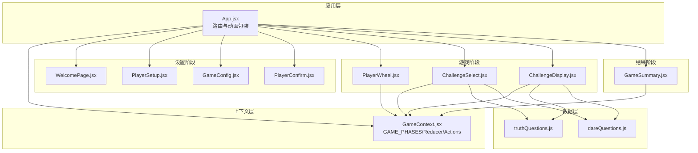
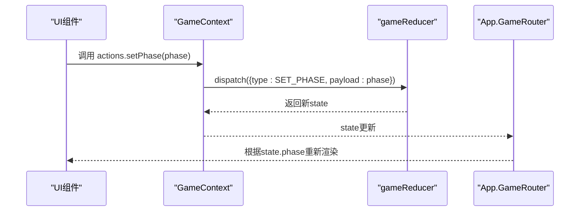
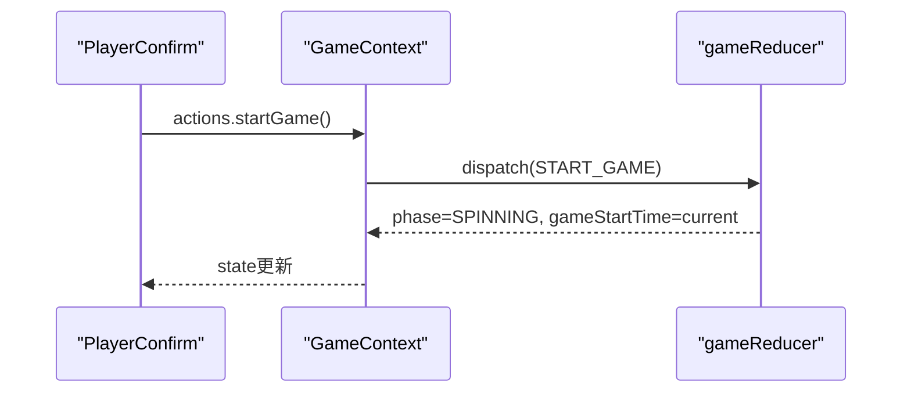
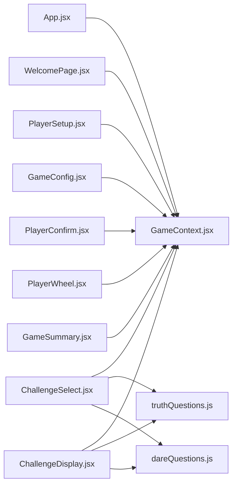

# 游戏阶段管理

<cite>
**本文档引用的文件**
- [App.jsx](file://src/App.jsx)
- [GameContext.jsx](file://src/context/GameContext.jsx)
- [WelcomePage.jsx](file://src/components/GameSetup/WelcomePage.jsx)
- [PlayerSetup.jsx](file://src/components/GameSetup/PlayerSetup.jsx)
- [GameConfig.jsx](file://src/components/GameSetup/GameConfig.jsx)
- [PlayerConfirm.jsx](file://src/components/GameSetup/PlayerConfirm.jsx)
- [PlayerWheel.jsx](file://src/components/GamePlay/PlayerWheel.jsx)
- [ChallengeSelect.jsx](file://src/components/GamePlay/ChallengeSelect.jsx)
- [ChallengeDisplay.jsx](file://src/components/GamePlay/ChallengeDisplay.jsx)
- [GameSummary.jsx](file://src/components/Results/GameSummary.jsx)
- [truthQuestions.js](file://src/data/truthQuestions.js)
- [dareQuestions.js](file://src/data/dareQuestions.js)
</cite>

## 目录
1. [简介](#简介)
2. [项目结构](#项目结构)
3. [核心组件](#核心组件)
4. [架构概览](#架构概览)
5. [详细组件分析](#详细组件分析)
6. [依赖分析](#依赖分析)
7. [性能考虑](#性能考虑)
8. [故障排除指南](#故障排除指南)
9. [结论](#结论)
10. [附录](#附录)

## 简介
本文件为 Truth or Dare 项目的游戏阶段管理系统提供全面技术文档。重点分析 GAME_PHASES 枚举设计、各阶段职责、状态机转换逻辑、进入/退出条件、状态清理与初始化、异步操作处理、扩展指南以及调试排查方法。文档同时解释阶段状态与 UI 组件的数据绑定机制，帮助开发者快速理解和维护游戏流程。

## 项目结构
项目采用 React + Framer Motion 的前端架构，按功能模块组织文件：
- context 层：集中管理游戏状态与动作（GameContext.jsx）
- components 层：按游戏阶段划分 UI 组件（GameSetup、GamePlay、Results）
- data 层：题目库与道具类型定义
- App.jsx：路由与动画包装

图表来源
- [App.jsx](file://src/App.jsx#L1-L58)
- [GameContext.jsx](file://src/context/GameContext.jsx#L1-L322)
- [WelcomePage.jsx](file://src/components/GameSetup/WelcomePage.jsx#L1-L88)
- [PlayerSetup.jsx](file://src/components/GameSetup/PlayerSetup.jsx#L1-L197)
- [GameConfig.jsx](file://src/components/GameSetup/GameConfig.jsx#L1-L185)
- [PlayerConfirm.jsx](file://src/components/GameSetup/PlayerConfirm.jsx#L1-L159)
- [PlayerWheel.jsx](file://src/components/GamePlay/PlayerWheel.jsx#L1-L300)
- [ChallengeSelect.jsx](file://src/components/GamePlay/ChallengeSelect.jsx#L1-L201)
- [ChallengeDisplay.jsx](file://src/components/GamePlay/ChallengeDisplay.jsx#L1-L356)
- [GameSummary.jsx](file://src/components/Results/GameSummary.jsx#L1-L224)
- [truthQuestions.js](file://src/data/truthQuestions.js#L1-L156)
- [dareQuestions.js](file://src/data/dareQuestions.js#L1-L167)

章节来源
- [App.jsx](file://src/App.jsx#L1-L58)
- [GameContext.jsx](file://src/context/GameContext.jsx#L1-L322)

## 核心组件
本节聚焦 GAME_PHASES 枚举与状态机核心逻辑。

- GAME_PHASES 枚举定义了完整的游戏生命周期阶段：
  - WELCOME：欢迎页面
  - PLAYER_SETUP：玩家设置
  - GAME_CONFIG：游戏配置
  - PLAYER_CONFIRM：玩家确认
  - SPINNING：转盘选人
  - CHALLENGE_SELECT：选择挑战类型
  - CHALLENGE_DISPLAY：挑战展示与投票
  - GAME_SUMMARY：游戏总结

- 状态机转换由 useGame.actions 触发，典型转换链路：
  - WELCOME → PLAYER_SETUP（用户点击“开始游戏”）
  - PLAYER_SETUP → GAME_CONFIG（满足人数要求）
  - GAME_CONFIG → PLAYER_CONFIRM（确认设置）
  - PLAYER_CONFIRM → SPINNING（开始游戏）
  - SPINNING → CHALLENGE_SELECT（选中玩家后）
  - CHALLENGE_SELECT → CHALLENGE_DISPLAY（选择挑战类型后）
  - CHALLENGE_DISPLAY → SPINNING（完成一轮后）
  - CHALLENGE_DISPLAY → GAME_SUMMARY（游戏结束）

- 关键 reducer 动作：
  - SET_PHASE：直接切换阶段
  - START_GAME：启动游戏并进入 SPINNING
  - SET_CURRENT_PLAYER：设置当前玩家并进入 CHALLENGE_SELECT
  - SET_CHALLENGE：设置挑战并进入 CHALLENGE_DISPLAY
  - COMPLETE_ROUND：完成一轮并返回 SPINNING 或 GAME_SUMMARY
  - endGame：直接进入 GAME_SUMMARY

章节来源
- [GameContext.jsx](file://src/context/GameContext.jsx#L4-L14)
- [GameContext.jsx](file://src/context/GameContext.jsx#L68-L250)
- [GameContext.jsx](file://src/context/GameContext.jsx#L260-L279)

## 架构概览
整体架构采用“上下文驱动”的单向数据流：UI 组件通过 useGame 获取 state 与 actions，actions 通过 dispatch 触发 reducer 更新 state，App.jsx 的 GameRouter 根据 state.phase 渲染对应组件。

图表来源
- [GameContext.jsx](file://src/context/GameContext.jsx#L68-L72)
- [App.jsx](file://src/App.jsx#L13-L44)

## 详细组件分析

### GAME_PHASES 枚举与职责
- WELCOME：引导用户进入游戏设置流程
- PLAYER_SETUP：收集玩家姓名并验证数量
- GAME_CONFIG：配置游戏参数（时长、难度、主题、惩罚）
- PLAYER_CONFIRM：展示规则与玩家列表，准备开始
- SPINNING：转盘随机选人，检查游戏结束
- CHALLENGE_SELECT：当前玩家选择真心话/大冒险
- CHALLENGE_DISPLAY：展示挑战内容、倒计时、投票与道具使用
- GAME_SUMMARY：统计与排名展示

章节来源
- [GameContext.jsx](file://src/context/GameContext.jsx#L4-L14)

### 阶段转换逻辑与控制流

#### 欢迎来页面到玩家设置
- 用户点击“开始游戏”，WelcomePage 调用 actions.setPhase(GAME_PHASES.PLAYER_SETUP)
- App.GameRouter 根据 state.phase 渲染 PlayerSetup

章节来源
- [WelcomePage.jsx](file://src/components/GameSetup/WelcomePage.jsx#L52-L61)
- [App.jsx](file://src/App.jsx#L17-L21)

#### 玩家设置到游戏配置
- PlayerSetup 校验玩家数量（≥4），满足条件后允许下一步
- 点击“下一步”触发 actions.setPhase(GAME_PHASES.GAME_CONFIG)

章节来源
- [PlayerSetup.jsx](file://src/components/GameSetup/PlayerSetup.jsx#L35-L183)
- [App.jsx](file://src/App.jsx#L21-L23)

#### 游戏配置到玩家确认
- GameConfig 支持返回与下一步导航
- actions.setPhase(GAME_PHASES.PLAYER_CONFIRM)

章节来源
- [GameConfig.jsx](file://src/components/GameSetup/GameConfig.jsx#L171-L179)
- [App.jsx](file://src/App.jsx#L23-L25)

#### 玩家确认到游戏开始
- PlayerConfirm 展示规则与玩家列表
- 点击“确认开始”触发 actions.startGame()

图表来源
- [PlayerConfirm.jsx](file://src/components/GameSetup/PlayerConfirm.jsx#L7-L9)
- [GameContext.jsx](file://src/context/GameContext.jsx#L108-L114)

#### 转盘选人到挑战选择
- PlayerWheel 在旋转结束后，通过 actions.setCurrentPlayer(index) 设置当前玩家并进入 CHALLENGE_SELECT

章节来源
- [PlayerWheel.jsx](file://src/components/GamePlay/PlayerWheel.jsx#L57-L60)
- [GameContext.jsx](file://src/context/GameContext.jsx#L116-L122)

#### 挑战选择到挑战展示
- ChallengeSelect 根据用户选择或倒计时自动选择类型，随后 actions.setChallenge(question) 进入 CHALLENGE_DISPLAY

章节来源
- [ChallengeSelect.jsx](file://src/components/GamePlay/ChallengeSelect.jsx#L38-L71)
- [GameContext.jsx](file://src/context/GameContext.jsx#L130-L139)

#### 挑战展示到下一轮或结束
- ChallengeDisplay 完成挑战后根据投票结果调用 actions.completeRound(result)，reducer 将状态重置并返回 SPINNING；当 checkGameEnd() 为真时，直接进入 GAME_SUMMARY

章节来源
- [ChallengeDisplay.jsx](file://src/components/GamePlay/ChallengeDisplay.jsx#L79-L99)
- [GameContext.jsx](file://src/context/GameContext.jsx#L147-L181)
- [PlayerWheel.jsx](file://src/components/GamePlay/PlayerWheel.jsx#L24-L28)
- [GameContext.jsx](file://src/context/GameContext.jsx#L295-L299)

### 阶段进入/退出条件与状态清理

- WELCOME → PLAYER_SETUP
  - 进入条件：用户点击开始
  - 退出条件：无显式退出，由下一步触发
  - 状态清理：无

- PLAYER_SETUP → GAME_CONFIG
  - 进入条件：玩家数量 ≥ 4
  - 退出条件：点击“下一步”
  - 状态清理：保留玩家列表，等待配置

- GAME_CONFIG → PLAYER_CONFIRM
  - 进入条件：配置完成
  - 退出条件：点击“确认开始”
  - 状态清理：无

- PLAYER_CONFIRM → SPINNING
  - 进入条件：开始游戏
  - 退出条件：转盘结束并设置当前玩家
  - 状态清理：初始化游戏开始时间与轮次

- SPINNING → CHALLENGE_SELECT
  - 进入条件：setCurrentPlayer(index)
  - 退出条件：选择挑战类型
  - 状态清理：重置 activeProps

- CHALLENGE_SELECT → CHALLENGE_DISPLAY
  - 进入条件：setChallenge(question)
  - 退出条件：完成挑战或失败
  - 状态清理：记录已用题目ID

- CHALLENGE_DISPLAY → SPINNING/GAME_SUMMARY
  - 进入条件：completeRound(result)
  - 退出条件：轮次推进或游戏结束
  - 状态清理：清空投票、重置挑战相关状态

章节来源
- [GameContext.jsx](file://src/context/GameContext.jsx#L108-L181)

### 异步操作在阶段转换中的处理
- PlayerWheel 使用 setTimeout 实现旋转动画与延迟跳转，确保视觉反馈后再进入下一阶段
- ChallengeSelect 使用 useEffect 实现倒计时，超时自动选择挑战类型
- ChallengeDisplay 使用 useEffect 实现倒计时与投票逻辑，支持道具使用与跳过卡
- checkGameEnd 通过 useEffect 监听轮次变化，在游戏结束时直接进入 GAME_SUMMARY

章节来源
- [PlayerWheel.jsx](file://src/components/GamePlay/PlayerWheel.jsx#L31-L62)
- [ChallengeSelect.jsx](file://src/components/GamePlay/ChallengeSelect.jsx#L14-L27)
- [ChallengeDisplay.jsx](file://src/components/GamePlay/ChallengeDisplay.jsx#L17-L33)
- [GameContext.jsx](file://src/context/GameContext.jsx#L295-L299)

### 阶段状态与 UI 组件的数据绑定
- App.GameRouter 通过 useGame(state) 读取 state.phase，并根据枚举值渲染对应组件
- 各阶段组件通过 useGame(actions) 调用 setPhase、startGame、setCurrentPlayer、setChallenge、completeRound 等动作
- 数据绑定体现在：
  - 玩家列表、配置参数、当前挑战、投票状态、轮次与时间进度等均来自 GameContext.state
  - 组件内部状态（如倒计时、选中状态）与全局状态协同工作

章节来源
- [App.jsx](file://src/App.jsx#L13-L44)
- [GameContext.jsx](file://src/context/GameContext.jsx#L256-L321)

## 依赖分析
- 组件间依赖：
  - App.jsx 依赖 GameContext 提供的 state 与 actions
  - 各阶段组件依赖 GameContext 的 actions 与 state
  - ChallengeSelect/ChallengeDisplay 依赖题目库模块
- 数据依赖：
  - truthQuestions.js/dareQuestions.js 提供题目筛选与随机选择逻辑
  - PROP_TYPES 定义道具类型与效果

图表来源
- [App.jsx](file://src/App.jsx#L1-L11)
- [GameContext.jsx](file://src/context/GameContext.jsx#L1-L322)
- [truthQuestions.js](file://src/data/truthQuestions.js#L1-L156)
- [dareQuestions.js](file://src/data/dareQuestions.js#L1-L167)

章节来源
- [App.jsx](file://src/App.jsx#L1-L11)
- [GameContext.jsx](file://src/context/GameContext.jsx#L1-L322)

## 性能考虑
- 动画与过渡：使用 Framer Motion 的 AnimatePresence 与 exit 动画，减少不必要的 DOM 重建
- 状态最小化：useReducer 将复杂状态收敛到单一 reducer，降低组件重渲染频率
- 异步清理：各阶段组件在卸载时清理定时器，避免内存泄漏
- 题目缓存：usedQuestions 记录已用题目ID，防止重复；当无可用题目时重置使用记录

章节来源
- [PlayerWheel.jsx](file://src/components/GamePlay/PlayerWheel.jsx#L65-L74)
- [ChallengeSelect.jsx](file://src/components/GamePlay/ChallengeSelect.jsx#L14-L27)
- [ChallengeDisplay.jsx](file://src/components/GamePlay/ChallengeDisplay.jsx#L25-L33)
- [truthQuestions.js](file://src/data/truthQuestions.js#L145-L150)
- [dareQuestions.js](file://src/data/dareQuestions.js#L144-L147)

## 故障排除指南
- 阶段无法切换
  - 检查 actions.setPhase 是否正确调用
  - 确认 App.GameRouter 的渲染逻辑未被错误覆盖
- 玩家数量校验失败
  - 确保 PlayerSetup 的 canProceed 条件满足（≥4）
  - 检查 actions.clearPlayers 与 setPhase 的调用顺序
- 转盘不响应
  - 检查 PlayerWheel 的 isSpinning/isSelected 状态
  - 确认定时器清理逻辑（spinTimeout/jumpTimeout）
- 挑战选择无响应
  - 检查 ChallengeSelect 的倒计时与 selected 状态
  - 确认 setChallengeType 与 setChallenge 的调用时机
- 投票与计分异常
  - 检查 ChallengeDisplay 的投票逻辑与 completeRound 的 result 参数
  - 确认道具使用与 activeProps 的状态同步
- 游戏结束判定
  - 检查 checkGameEnd 的轮询与 gameStartTime 初始化
  - 确认 COMPLETE_ROUND 后的 phase 切换

章节来源
- [PlayerWheel.jsx](file://src/components/GamePlay/PlayerWheel.jsx#L31-L74)
- [ChallengeSelect.jsx](file://src/components/GamePlay/ChallengeSelect.jsx#L14-L71)
- [ChallengeDisplay.jsx](file://src/components/GamePlay/ChallengeDisplay.jsx#L62-L99)
- [GameContext.jsx](file://src/context/GameContext.jsx#L295-L299)

## 结论
本项目通过清晰的 GAME_PHASES 枚举与 useGame.actions，构建了稳定的游戏状态机。各阶段职责明确、转换逻辑可追踪，配合 Framer Motion 的动画与 useReducer 的状态管理，实现了流畅的用户体验。建议在扩展新阶段时遵循现有模式：定义枚举值、在 App.GameRouter 中映射组件、在 GameContext 中添加相应动作与 reducer 分支，并在组件中正确处理异步与状态清理。

## 附录

### 扩展新游戏阶段指南
- 步骤
  1. 在 GAME_PHASES 中新增枚举值
  2. 在 App.GameRouter 中添加对应的渲染分支
  3. 在 GameContext.jsx 的 ACTIONS 与 gameReducer 中添加对应动作与状态处理
  4. 创建对应 UI 组件并在需要的阶段中调用 actions.setPhase 切换
  5. 如涉及异步操作，确保在组件卸载时清理定时器
  6. 如需访问题目库，参考 truthQuestions.js/dareQuestions.js 的筛选与随机选择模式

章节来源
- [GameContext.jsx](file://src/context/GameContext.jsx#L4-L14)
- [App.jsx](file://src/App.jsx#L17-L38)
- [truthQuestions.js](file://src/data/truthQuestions.js#L125-L155)
- [dareQuestions.js](file://src/data/dareQuestions.js#L129-L151)