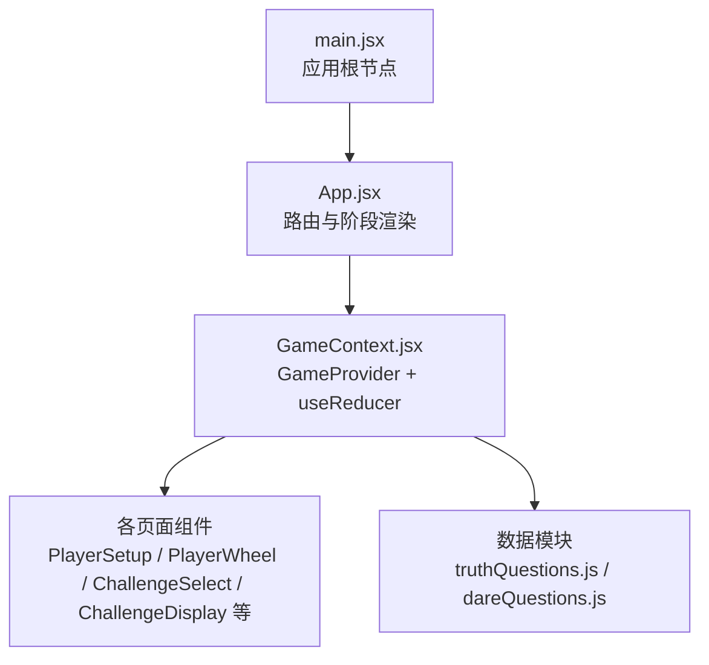
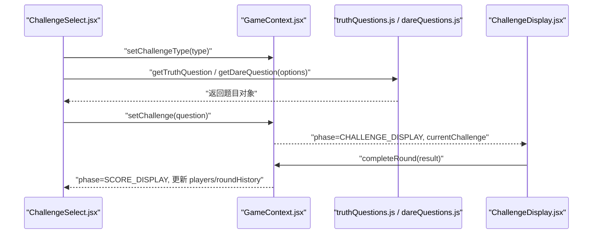
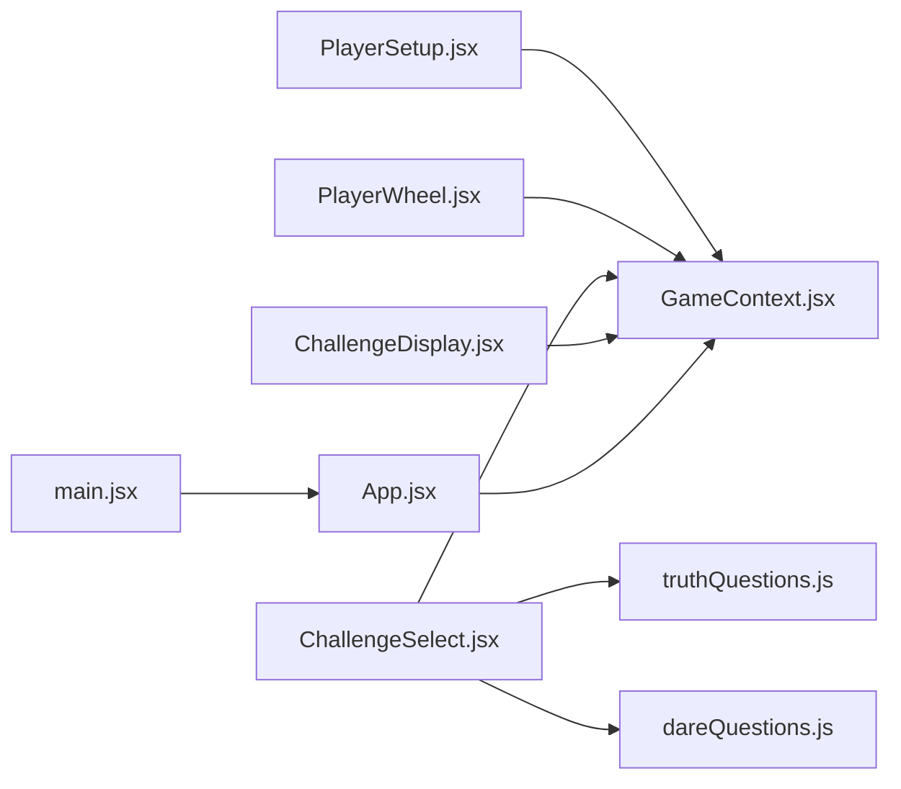

# 状态管理

<cite>
**本文引用的文件**
- [GameContext.jsx](file://src/context/GameContext.jsx)
- [App.jsx](file://src/App.jsx)
- [PlayerSetup.jsx](file://src/components/GameSetup/PlayerSetup.jsx)
- [PlayerWheel.jsx](file://src/components/GamePlay/PlayerWheel.jsx)
- [ChallengeSelect.jsx](file://src/components/GamePlay/ChallengeSelect.jsx)
- [ChallengeDisplay.jsx](file://src/components/GamePlay/ChallengeDisplay.jsx)
- [truthQuestions.js](file://src/data/truthQuestions.js)
- [dareQuestions.js](file://src/data/dareQuestions.js)
- [main.jsx](file://src/main.jsx)
- [package.json](file://package.json)
</cite>

## 目录
1. [简介](#简介)
2. [项目结构](#项目结构)
3. [核心组件](#核心组件)
4. [架构总览](#架构总览)
5. [详细组件分析](#详细组件分析)
6. [依赖关系分析](#依赖关系分析)
7. [性能考量](#性能考量)
8. [故障排查指南](#故障排查指南)
9. [结论](#结论)
10. [附录](#附录)

## 简介
本文件针对 Truth or Dare 项目的全局状态管理进行深入技术文档化，重点围绕 GameContext.jsx 中的 useReducer 实现展开，涵盖：
- 状态结构设计与字段职责
- Action 类型定义与分发策略
- Reducer 函数逻辑与分支处理
- 全局状态管理策略（玩家信息、游戏配置、挑战状态、积分数据等）
- 状态持久化与内存管理考虑
- 状态更新最佳实践与性能优化
- 状态与组件同步机制与一致性保障
- 状态调试与监控方法，以及常见问题排查

## 项目结构
项目采用 React + Vite 的前端架构，状态集中于上下文 Provider，路由根据游戏阶段切换不同页面组件。核心入口与上下文关系如下图所示：

图表来源
- [main.jsx](file://src/main.jsx#L1-L11)
- [App.jsx](file://src/App.jsx#L1-L61)
- [GameContext.jsx](file://src/context/GameContext.jsx#L257-L323)

章节来源
- [main.jsx](file://src/main.jsx#L1-L11)
- [App.jsx](file://src/App.jsx#L1-L61)
- [GameContext.jsx](file://src/context/GameContext.jsx#L257-L323)

## 核心组件
本节聚焦 GameContext.jsx 中的状态管理核心：枚举常量、初始状态、Action 类型、Reducer 逻辑、Provider 与自定义 Hook。

- 游戏阶段枚举：用于控制 UI 路由与流程推进
- 道具类型枚举：用于挑战过程中的道具效果与交互
- 初始状态：包含 phase、players、config、currentRound、currentPlayerIndex、currentChallenge、challengeType、votes、gameStartTime、roundHistory、usedQuestions、activeProps、hiddenTaskTriggered 等字段
- Action 类型：覆盖阶段变更、玩家增删改、配置设置、游戏启动、挑战选择与展示、投票、回合结算、道具使用与发放、隐藏任务触发、重置与清空等
- Reducer：基于 action.type 的纯函数分支，返回新的不可变状态
- Provider 与自定义 Hook：暴露 state、actions、getCurrentPlayer、getLeaderboard、checkGameEnd 给子组件使用

章节来源
- [GameContext.jsx](file://src/context/GameContext.jsx#L1-L323)

## 架构总览
下面的序列图展示了从“选择挑战类型”到“挑战完成并结算”的典型流程，体现状态在组件与上下文之间的流转与更新。

图表来源
- [ChallengeSelect.jsx](file://src/components/GamePlay/ChallengeSelect.jsx#L1-L201)
- [ChallengeDisplay.jsx](file://src/components/GamePlay/ChallengeDisplay.jsx#L1-L356)
- [truthQuestions.js](file://src/data/truthQuestions.js#L125-L156)
- [dareQuestions.js](file://src/data/dareQuestions.js#L129-L152)
- [GameContext.jsx](file://src/context/GameContext.jsx#L69-L251)

## 详细组件分析

### 状态结构设计与字段职责
- phase：当前游戏阶段，驱动 App.jsx 的路由渲染
- players：玩家数组，包含 id、name、score、skipCards、props、completedChallenges、skippedChallenges、funnyVotes 等
- config：游戏配置，包含 duration、difficulty、theme、punishment
- currentRound：当前轮次
- currentPlayerIndex：当前挑战玩家索引
- currentChallenge：当前挑战对象（含 type、content、difficulty、duration 等）
- challengeType：当前挑战类型（truth/dare）
- votes：其他玩家对当前挑战的投票映射
- gameStartTime：游戏开始时间戳
- roundHistory：每轮历史记录（轮次、玩家、挑战类型、挑战内容、是否跳过、得分）
- usedQuestions：按挑战类型记录已使用题目 ID，防止重复
- activeProps：当前轮次激活的道具集合
- hiddenTaskTriggered：隐藏任务触发标记

章节来源
- [GameContext.jsx](file://src/context/GameContext.jsx#L25-L45)

### Action 类型定义与分发策略
- SET_PHASE：切换游戏阶段
- ADD_PLAYER / REMOVE_PLAYER / UPDATE_PLAYER：玩家生命周期管理
- SET_CONFIG：更新游戏配置
- START_GAME：启动游戏并初始化时间与轮次
- SET_CURRENT_PLAYER：设置当前挑战玩家并进入挑战选择阶段
- SET_CHALLENGE_TYPE / SET_CHALLENGE：设置挑战类型与挑战内容
- SUBMIT_VOTE：提交投票
- COMPLETE_ROUND：回合结算，计算积分、统计完成/跳过次数、记录历史、推进阶段
- USE_SKIP_CARD / USE_PROP / ADD_PROP：跳过卡与道具使用与发放
- RESET_GAME：重置游戏并保留玩家基础信息
- TRIGGER_HIDDEN_TASK：触发隐藏任务
- CLEAR_PLAYERS：清空玩家列表
- endGame：结束游戏至总结页

章节来源
- [GameContext.jsx](file://src/context/GameContext.jsx#L48-L66)
- [GameContext.jsx](file://src/context/GameContext.jsx#L261-L280)

### Reducer 函数逻辑与分支处理
- SET_PHASE：浅拷贝并替换 phase
- ADD_PLAYER：追加新玩家，生成唯一 id，初始化基础属性
- REMOVE_PLAYER：过滤掉指定 id 的玩家
- UPDATE_PLAYER：按 id 合并更新字段
- SET_CONFIG：合并 config 字段
- START_GAME：进入 spinning 阶段，记录开始时间与第 1 轮
- SET_CURRENT_PLAYER：设置当前玩家索引，进入挑战选择阶段，并清空 activeProps
- SET_CHALLENGE_TYPE：设置挑战类型
- SET_CHALLENGE：设置挑战内容，进入挑战展示阶段，并记录 usedQuestions
- SUBMIT_VOTE：合并 votes 映射
- COMPLETE_ROUND：计算双倍积分（若 activeProps 包含 double），更新当前玩家分数与统计，记录 roundHistory，推进轮次与阶段，清理 votes
- USE_SKIP_CARD：扣减当前玩家 skipCards
- USE_PROP：将道具加入 activeProps，并从玩家道具列表移除
- ADD_PROP：为指定玩家发放随机道具
- TRIGGER_HIDDEN_TASK：标记隐藏任务触发
- RESET_GAME：重置 players 的分数与道具等状态
- CLEAR_PLAYERS：清空 players

章节来源
- [GameContext.jsx](file://src/context/GameContext.jsx#L69-L251)

### Provider 与自定义 Hook
- GameProvider：使用 useReducer 创建上下文，封装 actions 对象，提供 getCurrentPlayer、getLeaderboard、checkGameEnd 辅助函数
- useGame：自定义 Hook，校验上下文有效性并返回 state/actions/工具函数

章节来源
- [GameContext.jsx](file://src/context/GameContext.jsx#L257-L323)

### 状态与组件同步机制与一致性保障
- App.jsx 根据 state.phase 渲染不同页面组件，确保 UI 与状态一致
- PlayerWheel.jsx 在每轮结束后检查游戏是否超时，触发 endGame
- ChallengeSelect.jsx 在倒计时结束时自动选择挑战类型，并触发隐藏任务概率
- ChallengeDisplay.jsx 根据挑战类型与时间限制推进流程，支持投票与道具使用，最终调用 completeRound 完成结算

章节来源
- [App.jsx](file://src/App.jsx#L14-L48)
- [PlayerWheel.jsx](file://src/components/GamePlay/PlayerWheel.jsx#L24-L28)
- [ChallengeSelect.jsx](file://src/components/GamePlay/ChallengeSelect.jsx#L14-L27)
- [ChallengeDisplay.jsx](file://src/components/GamePlay/ChallengeDisplay.jsx#L24-L33)

### 数据一致性与挑战系统
- truthQuestions.js / dareQuestions.js 提供题目筛选与随机选择逻辑，结合 usedQuestions 避免重复
- ChallengeSelect.jsx 在选择挑战类型后，根据配置与已用题目获取挑战内容
- ChallengeDisplay.jsx 根据挑战类型与难度设置倒计时，支持“完成/失败/跳过/使用道具/投票”等路径

章节来源
- [truthQuestions.js](file://src/data/truthQuestions.js#L125-L156)
- [dareQuestions.js](file://src/data/dareQuestions.js#L129-L152)
- [ChallengeSelect.jsx](file://src/components/GamePlay/ChallengeSelect.jsx#L48-L71)
- [ChallengeDisplay.jsx](file://src/components/GamePlay/ChallengeDisplay.jsx#L17-L33)

### 状态持久化策略与内存管理考虑
- 当前实现未集成浏览器本地存储（如 localStorage/sessionStorage）或 Redux DevTools，状态仅驻留内存
- 内存管理建议：
  - 控制 players 数量上限（当前代码限制最多 10 人）
  - 控制 roundHistory 的长度，避免无限增长
  - usedQuestions 按类型维护，可在题目池耗尽时重置
  - 定时器在组件卸载时清理，避免内存泄漏（已在相关组件中清理）

章节来源
- [PlayerSetup.jsx](file://src/components/GameSetup/PlayerSetup.jsx#L20-L23)
- [PlayerWheel.jsx](file://src/components/GamePlay/PlayerWheel.jsx#L65-L74)
- [ChallengeDisplay.jsx](file://src/components/GamePlay/ChallengeDisplay.jsx#L24-L33)

### 状态更新最佳实践与性能优化
- 避免不必要的重渲染：
  - 将依赖 state 的派生值（如 getCurrentPlayer、getLeaderboard、checkGameEnd）作为 Provider 内部函数，减少外部依赖
  - 使用 React.memo 或 useMemo 缓存昂贵计算（例如排序）
- 性能优化技巧：
  - 将大型数据（题库）拆分为独立模块，按需加载
  - 使用稳定引用（如 useCallback）包装 actions，避免子组件重复渲染
  - 合理拆分组件，减少单一组件的渲染范围
- 状态粒度：
  - 将 players 与 config 分离，避免无关字段变动导致的重渲染

章节来源
- [GameContext.jsx](file://src/context/GameContext.jsx#L283-L300)
- [PlayerWheel.jsx](file://src/components/GamePlay/PlayerWheel.jsx#L125-L130)

### 状态调试与监控方法
- 使用 React DevTools 检查 GameContext 的 state 与 actions
- 在关键 reducer 分支添加日志（开发环境），观察状态变化轨迹
- 使用浏览器性能面板监测渲染与重渲染热点
- 单元测试：对 getTruthQuestion/getDareQuestion 进行边界测试，验证 usedQuestions 重置逻辑

章节来源
- [truthQuestions.js](file://src/data/truthQuestions.js#L145-L150)
- [dareQuestions.js](file://src/data/dareQuestions.js#L144-L147)

### 常见状态管理问题与排查
- 问题：玩家列表无法添加/删除
  - 排查：确认 PlayerSetup.jsx 中 actions.addPlayer/removePlayer 是否正确调用，且未超过上限
- 问题：挑战重复出现
  - 排查：检查 usedQuestions 的记录与筛选逻辑，必要时重置
- 问题：积分不正确
  - 排查：核对 COMPLETE_ROUND 分支中双倍道具与 funnyVotes 的计算
- 问题：倒计时异常
  - 排查：确认 ChallengeDisplay.jsx 的定时器清理与挑战类型对应的时长

章节来源
- [PlayerSetup.jsx](file://src/components/GameSetup/PlayerSetup.jsx#L10-L27)
- [truthQuestions.js](file://src/data/truthQuestions.js#L129-L150)
- [dareQuestions.js](file://src/data/dareQuestions.js#L133-L147)
- [GameContext.jsx](file://src/context/GameContext.jsx#L148-L182)
- [ChallengeDisplay.jsx](file://src/components/GamePlay/ChallengeDisplay.jsx#L24-L33)

## 依赖关系分析
- 组件依赖上下文：各页面组件通过 useGame 获取 state 与 actions
- 上下文依赖数据模块：ChallengeSelect.jsx 依赖 truthQuestions.js / dareQuestions.js
- 应用入口：main.jsx 渲染 App.jsx，App.jsx 包裹 GameProvider

图表来源
- [PlayerSetup.jsx](file://src/components/GameSetup/PlayerSetup.jsx#L1-L197)
- [PlayerWheel.jsx](file://src/components/GamePlay/PlayerWheel.jsx#L1-L300)
- [ChallengeSelect.jsx](file://src/components/GamePlay/ChallengeSelect.jsx#L1-L201)
- [ChallengeDisplay.jsx](file://src/components/GamePlay/ChallengeDisplay.jsx#L1-L356)
- [truthQuestions.js](file://src/data/truthQuestions.js#L1-L156)
- [dareQuestions.js](file://src/data/dareQuestions.js#L1-L167)
- [App.jsx](file://src/App.jsx#L1-L61)
- [main.jsx](file://src/main.jsx#L1-L11)

章节来源
- [package.json](file://package.json#L12-L16)

## 性能考量
- 渲染优化：将复杂计算移出渲染函数，使用 useMemo/useCallback
- 状态拆分：将高频更新与低频更新分离，减少无关字段导致的重渲染
- 数据缓存：题库按难度/主题过滤后可缓存中间结果，避免重复计算
- 异步与定时器：确保组件卸载时清理定时器，避免内存泄漏

## 故障排查指南
- 症状：玩家无法进入下一阶段
  - 检查 PlayerSetup.jsx 的 canProceed 条件与 actions.setPhase 调用
- 症状：挑战内容不随配置变化
  - 检查 ChallengeSelect.jsx 的 getTruthQuestion/getDareQuestion 调用与 options 传入
- 症状：游戏无法按时结束
  - 检查 PlayerWheel.jsx 的 checkGameEnd 与 actions.endGame 调用时机

章节来源
- [PlayerSetup.jsx](file://src/components/GameSetup/PlayerSetup.jsx#L35-L36)
- [ChallengeSelect.jsx](file://src/components/GamePlay/ChallengeSelect.jsx#L56-L67)
- [PlayerWheel.jsx](file://src/components/GamePlay/PlayerWheel.jsx#L24-L28)

## 结论
GameContext.jsx 通过 useReducer 将 Truth or Dare 的全局状态集中管理，配合清晰的 Action 类型与稳定的 Reducer 分支，实现了从玩家管理、挑战生成、投票与道具使用到回合结算的完整闭环。当前实现以内存状态为主，具备良好的扩展性；建议后续引入持久化与调试工具，进一步提升可维护性与可观测性。

## 附录
- 关键实现路径参考：
  - [GameContext.jsx 初始状态与 Reducer](file://src/context/GameContext.jsx#L25-L251)
  - [GameContext.jsx Provider 与自定义 Hook](file://src/context/GameContext.jsx#L257-L323)
  - [App.jsx 阶段路由](file://src/App.jsx#L14-L48)
  - [PlayerSetup.jsx 玩家管理](file://src/components/GameSetup/PlayerSetup.jsx#L10-L27)
  - [PlayerWheel.jsx 游戏进度与结束判断](file://src/components/GamePlay/PlayerWheel.jsx#L24-L28)
  - [ChallengeSelect.jsx 挑战类型选择与隐藏任务](file://src/components/GamePlay/ChallengeSelect.jsx#L14-L36)
  - [ChallengeDisplay.jsx 挑战展示与结算](file://src/components/GamePlay/ChallengeDisplay.jsx#L24-L99)
  - [truthQuestions.js 题目筛选](file://src/data/truthQuestions.js#L125-L156)
  - [dareQuestions.js 题目筛选与隐藏任务](file://src/data/dareQuestions.js#L129-L166)