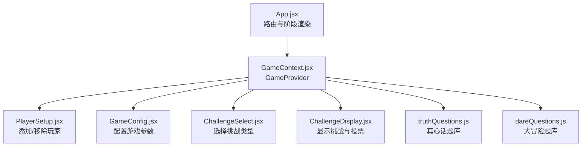
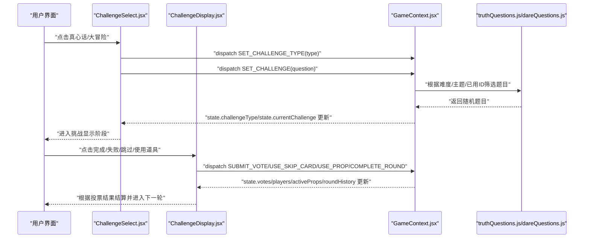
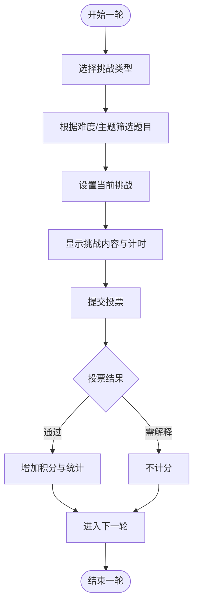
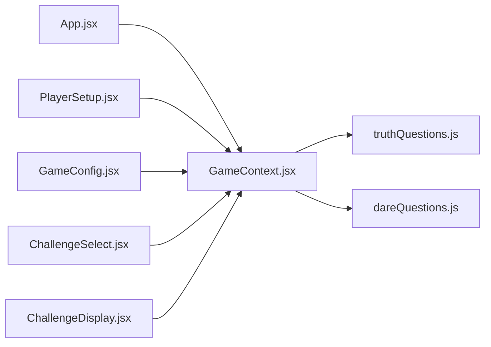

# 状态结构设计

<cite>
**本文档引用的文件**
- [GameContext.jsx](file://src/context/GameContext.jsx)
- [App.jsx](file://src/App.jsx)
- [PlayerSetup.jsx](file://src/components/GameSetup/PlayerSetup.jsx)
- [GameConfig.jsx](file://src/components/GameSetup/GameConfig.jsx)
- [ChallengeSelect.jsx](file://src/components/GamePlay/ChallengeSelect.jsx)
- [ChallengeDisplay.jsx](file://src/components/GamePlay/ChallengeDisplay.jsx)
- [truthQuestions.js](file://src/data/truthQuestions.js)
- [dareQuestions.js](file://src/data/dareQuestions.js)
- [package.json](file://package.json)
</cite>

## 目录
1. [简介](#简介)
2. [项目结构](#项目结构)
3. [核心组件](#核心组件)
4. [架构总览](#架构总览)
5. [详细组件分析](#详细组件分析)
6. [依赖分析](#依赖分析)
7. [性能考虑](#性能考虑)
8. [故障排除指南](#故障排除指南)
9. [结论](#结论)
10. [附录](#附录)

## 简介
本文件针对 Truth or Dare 项目的状态结构设计进行系统化技术文档编写，重点围绕初始状态对象的设计理念、各状态字段的含义与作用域、玩家状态(players)、游戏配置(config)、挑战状态(currentChallenge)、投票状态(votes)等核心状态的设计思路展开。文档还解释了状态字段之间的关联关系与数据依赖性，阐述了状态的嵌套结构设计（例如玩家属性中的积分统计字段），并提供状态结构扩展指南与状态验证及默认值处理的最佳实践，帮助开发者在不破坏现有功能的前提下安全地扩展状态结构。

## 项目结构
该项目采用 React + useReducer 的上下文状态管理模式，将全局状态集中于 GameContext，通过 useGame Hook 在组件树中注入状态与动作。应用入口 App.jsx 根据当前 phase 动态渲染不同阶段的页面组件，形成清晰的“阶段驱动”的界面流转。

图表来源
- [App.jsx](file://src/App.jsx#L14-L48)
- [GameContext.jsx](file://src/context/GameContext.jsx#L252-L322)
- [PlayerSetup.jsx](file://src/components/GameSetup/PlayerSetup.jsx#L1-L197)
- [GameConfig.jsx](file://src/components/GameSetup/GameConfig.jsx#L1-L185)
- [ChallengeSelect.jsx](file://src/components/GamePlay/ChallengeSelect.jsx#L1-L201)
- [ChallengeDisplay.jsx](file://src/components/GamePlay/ChallengeDisplay.jsx#L1-L356)
- [truthQuestions.js](file://src/data/truthQuestions.js#L1-L156)
- [dareQuestions.js](file://src/data/dareQuestions.js#L1-L167)

章节来源
- [App.jsx](file://src/App.jsx#L14-L48)
- [GameContext.jsx](file://src/context/GameContext.jsx#L252-L322)

## 核心组件
本节聚焦于 GameContext 中的 initialState 设计与 reducer 的状态更新逻辑，解释每个字段的职责、默认值、生命周期以及与其他字段的耦合关系。

- 初始状态(initialState)字段概览
  - phase: 当前游戏阶段，受 GAME_PHASES 枚举控制，用于驱动 App.jsx 的路由渲染。
  - players: 玩家数组，每个玩家包含基础信息与统计字段，用于积分、道具、挑战完成度等统计。
  - config: 游戏配置，包含时长、难度、主题、惩罚机制等，影响题目筛选与挑战时长。
  - currentRound: 当前轮次编号，用于记录与历史回放。
  - currentPlayerIndex: 当前挑战玩家索引，配合 players 数组定位当前玩家。
  - currentChallenge: 当前挑战对象，包含类型、内容、难度等，用于挑战显示与计时。
  - challengeType: 当前挑战类型（truth/dare），用于样式与计时差异。
  - votes: 投票映射，记录其他玩家对当前挑战的投票结果。
  - gameStartTime: 游戏开始时间戳，用于判断是否达到配置时长。
  - roundHistory: 每轮历史记录，包含轮次、玩家、挑战类型、挑战内容、是否跳过、得分等。
  - usedQuestions: 已使用题目ID集合，按类型维护，避免重复。
  - activeProps: 当前轮次激活的道具效果，影响计分与流程。
  - hiddenTaskTriggered: 是否触发隐藏任务，用于特殊事件标记。

章节来源
- [GameContext.jsx](file://src/context/GameContext.jsx#L24-L44)

## 架构总览
下面的序列图展示了从“选择挑战类型”到“显示挑战内容与投票”的完整流程，体现状态在 reducer 中的流转与组件间的协作。

图表来源
- [ChallengeSelect.jsx](file://src/components/GamePlay/ChallengeSelect.jsx#L38-L71)
- [ChallengeDisplay.jsx](file://src/components/GamePlay/ChallengeDisplay.jsx#L42-L99)
- [GameContext.jsx](file://src/context/GameContext.jsx#L68-L250)
- [truthQuestions.js](file://src/data/truthQuestions.js#L125-L156)
- [dareQuestions.js](file://src/data/dareQuestions.js#L129-L167)

## 详细组件分析

### 初始状态(initialState)设计理念
- 字段职责与作用域
  - phase: 控制 App.jsx 的渲染分支，确保 UI 与业务流程一致。
  - players: 存储玩家基础信息与统计字段，支持积分、跳过卡、道具、完成/跳过挑战次数、有趣投票次数等统计维度。
  - config: 影响题目筛选与挑战时长，提供统一的难度/主题/惩罚策略入口。
  - currentRound/currentPlayerIndex: 支持轮次推进与当前玩家定位，保证流程可控。
  - currentChallenge/challengeType: 统一挑战数据结构，便于计时、投票、道具效果联动。
  - votes: 记录其他玩家投票，支持“通过/有趣/需解释”三种结果。
  - gameStartTime: 用于时长控制，结合 config.duration 判断游戏结束。
  - roundHistory: 记录每轮关键信息，便于游戏总结与回放。
  - usedQuestions: 防止题目重复，提升游戏体验。
  - activeProps: 记录当前轮次生效的道具效果，影响计分与流程。
  - hiddenTaskTriggered: 标记隐藏任务触发，用于特殊事件处理。

- 关联关系与数据依赖
  - players 与 currentPlayerIndex：通过索引定位当前玩家，用于跳过卡、道具使用、积分统计。
  - config 与 currentChallenge：config.difficulty 与 config.theme 决定题目筛选；config.duration 决定游戏时长。
  - currentChallenge 与 challengeType：决定挑战显示样式与时长差异。
  - votes 与 players：投票结果影响当前玩家积分与完成/跳过统计。
  - usedQuestions 与 currentChallenge：防止题目重复，支持重置逻辑。
  - activeProps 与 players：道具使用后从玩家道具列表移除并加入 activeProps，影响计分倍数等。

- 嵌套结构设计
  - 玩家属性中的统计字段：completedChallenges、skippedChallenges、funnyVotes 等，形成“玩家统计”子结构，便于在组件中直接读取与展示。
  - 挑战对象：包含 id、content、difficulty、category、duration 等字段，满足显示、计时、难度分级与分类筛选需求。

章节来源
- [GameContext.jsx](file://src/context/GameContext.jsx#L24-L44)
- [GameContext.jsx](file://src/context/GameContext.jsx#L68-L250)

### 玩家状态(players)设计
- 字段含义
  - id/name/score：基础标识与积分。
  - skipCards：跳过卡数量，用于跳过挑战并扣分。
  - props：当前拥有的道具类型列表。
  - completedChallenges/skippedChallenges：完成与跳过挑战次数，用于统计与成就展示。
  - funnyVotes：因挑战有趣而获得的投票次数，作为额外奖励依据。
- 设计要点
  - 新增玩家时设置默认值，保证初始状态一致性。
  - 使用索引定位当前玩家，避免跨组件传递复杂对象。
  - 积分计算考虑 activeProps（如双倍积分）与 funnyVotes 奖励。

章节来源
- [GameContext.jsx](file://src/context/GameContext.jsx#L73-L100)
- [GameContext.jsx](file://src/context/GameContext.jsx#L147-L181)
- [ChallengeDisplay.jsx](file://src/components/GamePlay/ChallengeDisplay.jsx#L42-L59)

### 游戏配置(config)设计
- 字段含义
  - duration：游戏时长（分钟），用于 checkGameEnd 判断。
  - difficulty：题目难度等级，影响题目筛选范围。
  - theme：题目主题，影响题目类别筛选。
  - punishment：惩罚机制等级，影响挑战失败后的扣分或惩罚。
- 设计要点
  - 通过 setConfig 动作合并更新，避免覆盖其他配置项。
  - 与题目库筛选函数配合，实现动态题目生成。

章节来源
- [GameContext.jsx](file://src/context/GameContext.jsx#L28-L33)
- [GameContext.jsx](file://src/context/GameContext.jsx#L102-L106)
- [GameConfig.jsx](file://src/components/GameSetup/GameConfig.jsx#L30-L36)
- [truthQuestions.js](file://src/data/truthQuestions.js#L125-L156)
- [dareQuestions.js](file://src/data/dareQuestions.js#L129-L152)

### 挑战状态(currentChallenge)设计
- 字段含义
  - type：挑战类型（truth/dare），用于样式与计时差异。
  - question/content：挑战内容，用于显示。
  - difficulty：难度星级，用于显示与计分。
  - category/duration：分类与时长，用于筛选与计时。
  - isHidden：隐藏任务标记，用于特殊事件处理。
- 设计要点
  - setChallenge 动作同时更新 currentChallenge 并记录 usedQuestions，防止重复。
  - ChallengeSelect 根据难度与主题筛选题目，ChallengeDisplay 根据挑战类型设置计时与计分。

章节来源
- [GameContext.jsx](file://src/context/GameContext.jsx#L36-L37)
- [GameContext.jsx](file://src/context/GameContext.jsx#L130-L139)
- [ChallengeSelect.jsx](file://src/components/GamePlay/ChallengeSelect.jsx#L48-L71)
- [ChallengeDisplay.jsx](file://src/components/GamePlay/ChallengeDisplay.jsx#L16-L33)

### 投票状态(votes)设计
- 字段含义
  - 结构：{ playerId: vote }，记录其他玩家对当前挑战的投票结果。
  - 投票类型：pass/funny/explain，分别代表“通过/有趣/需解释”。
- 设计要点
  - submitVote 动作按玩家ID更新投票，支持多玩家投票。
  - ChallengeDisplay 在确认结果时统计 pass/funny 投票数量，决定是否计分与额外奖励。

章节来源
- [GameContext.jsx](file://src/context/GameContext.jsx#L38-L38)
- [GameContext.jsx](file://src/context/GameContext.jsx#L141-L145)
- [ChallengeDisplay.jsx](file://src/components/GamePlay/ChallengeDisplay.jsx#L66-L99)

### 状态更新流程与数据流
- 流程图：从选择挑战到完成结算的关键步骤

图表来源
- [ChallengeSelect.jsx](file://src/components/GamePlay/ChallengeSelect.jsx#L38-L71)
- [ChallengeDisplay.jsx](file://src/components/GamePlay/ChallengeDisplay.jsx#L62-L99)
- [GameContext.jsx](file://src/context/GameContext.jsx#L130-L181)

## 依赖分析
- 组件与上下文的依赖
  - App.jsx 依赖 GAME_PHASES 与 useGame，根据 phase 渲染不同页面。
  - 各页面组件依赖 useGame 获取 state 与 actions，实现状态驱动的 UI 更新。
- 数据层依赖
  - 题库文件提供题目筛选与随机选择逻辑，被 ChallengeSelect 使用。
- 外部依赖
  - React、framer-motion、tailwindcss 等，用于 UI 与动画。

图表来源
- [App.jsx](file://src/App.jsx#L14-L48)
- [PlayerSetup.jsx](file://src/components/GameSetup/PlayerSetup.jsx#L1-L197)
- [GameConfig.jsx](file://src/components/GameSetup/GameConfig.jsx#L1-L185)
- [ChallengeSelect.jsx](file://src/components/GamePlay/ChallengeSelect.jsx#L1-L201)
- [ChallengeDisplay.jsx](file://src/components/GamePlay/ChallengeDisplay.jsx#L1-L356)
- [truthQuestions.js](file://src/data/truthQuestions.js#L1-L156)
- [dareQuestions.js](file://src/data/dareQuestions.js#L1-L167)

章节来源
- [App.jsx](file://src/App.jsx#L14-L48)
- [package.json](file://package.json#L12-L31)

## 性能考虑
- 状态更新粒度
  - 使用 useReducer 将状态更新集中在 reducer，减少不必要的重渲染。
  - 动作类型明确，避免深层对象变更导致的全量重渲染。
- 数据结构优化
  - players 与 usedQuestions 采用扁平结构，便于快速查找与更新。
  - votes 采用映射结构，支持 O(1) 查找与更新。
- 渲染优化
  - App.jsx 使用 AnimatePresence 进行页面切换动画，避免频繁挂载卸载带来的性能损耗。
  - 页面组件内部仅订阅所需状态，避免全局状态变化引发的过度渲染。

## 故障排除指南
- 常见问题与排查
  - 玩家无法添加/移除：检查 PlayerSetup 中的表单校验与 actions 调用，确认 state.players 长度限制与去重逻辑。
  - 题目重复：检查 usedQuestions 的更新逻辑与 setChallenge 动作，确保已用ID正确记录。
  - 投票无效：检查 submitVote 动作与 ChallengeDisplay 中的投票收集逻辑，确认投票映射结构与确认流程。
  - 计时异常：检查 ChallengeDisplay 中的计时器初始化与 useEffect 清理，确保倒计时与投票阶段互斥。
  - 道具使用异常：检查 useProp 动作与 players.props 的更新逻辑，确认道具从玩家列表移除并在 activeProps 中生效。
- 最佳实践
  - 在 reducer 中保持纯函数更新，避免副作用。
  - 对外部依赖（如题目库）进行边界条件测试，确保筛选与重置逻辑正确。
  - 使用 console.log 或调试工具跟踪 state 变化，定位状态更新问题。

章节来源
- [PlayerSetup.jsx](file://src/components/GameSetup/PlayerSetup.jsx#L10-L27)
- [GameContext.jsx](file://src/context/GameContext.jsx#L130-L139)
- [ChallengeDisplay.jsx](file://src/components/GamePlay/ChallengeDisplay.jsx#L66-L99)

## 结论
Truth or Dare 的状态结构设计以 useReducer 为核心，通过 initialState 的清晰字段划分与 reducer 的纯函数更新，实现了游戏流程、玩家统计、挑战与投票的高效协同。该设计具备良好的可扩展性与可维护性，能够支持后续的功能增强与规则扩展。建议在扩展新字段时遵循“最小变更原则”，确保与现有字段的耦合关系清晰，并在 reducer 中提供默认值与边界处理，保障系统的稳定性。

## 附录

### 状态字段扩展指南
- 新增字段的原则
  - 明确字段职责与作用域，避免与现有字段重复。
  - 在 reducer 的相应 case 中提供默认值与边界处理。
  - 为新字段提供对应的 actions 与组件使用示例。
- 示例：新增“玩家头像/角色”字段
  - 在玩家对象中添加 avatar 字段，并在新增玩家时设置默认值。
  - 在 reducer 的 ADD_PLAYER case 中初始化该字段。
  - 在组件中读取并展示该字段，确保 UI 与状态同步。
- 验证与默认值处理最佳实践
  - 使用默认值填充初始状态，避免 undefined 引发的错误。
  - 在 reducer 中对可能缺失的字段进行防御性赋值。
  - 为外部依赖（如题目库）提供兜底逻辑，避免空数组或空对象导致的异常。

章节来源
- [GameContext.jsx](file://src/context/GameContext.jsx#L73-L86)
- [GameContext.jsx](file://src/context/GameContext.jsx#L221-L233)