# 自定义 Hook 与工具函数

<cite>
**本文档引用的文件**
- [GameContext.jsx](file://src/context/GameContext.jsx)
- [App.jsx](file://src/App.jsx)
- [ChallengeDisplay.jsx](file://src/components/GamePlay/ChallengeDisplay.jsx)
- [ChallengeSelect.jsx](file://src/components/GamePlay/ChallengeSelect.jsx)
- [PlayerWheel.jsx](file://src/components/GamePlay/PlayerWheel.jsx)
- [PlayerSetup.jsx](file://src/components/GameSetup/PlayerSetup.jsx)
- [truthQuestions.js](file://src/data/truthQuestions.js)
- [dareQuestions.js](file://src/data/dareQuestions.js)
- [main.jsx](file://src/main.jsx)
</cite>

## 目录
1. [简介](#简介)
2. [项目结构](#项目结构)
3. [核心组件](#核心组件)
4. [架构概览](#架构概览)
5. [详细组件分析](#详细组件分析)
6. [依赖关系分析](#依赖关系分析)
7. [性能考虑](#性能考虑)
8. [故障排除指南](#故障排除指南)
9. [结论](#结论)

## 简介

Truth or Dare 是一个基于 React 的多人互动游戏应用，采用现代前端技术栈构建。本项目的核心创新在于其精心设计的状态管理架构，通过自定义 Hook 和工具函数实现了高度模块化的组件设计。

该项目展示了如何在 React 应用中有效使用 Context API 和 useReducer 来管理复杂的游戏状态，包括玩家管理、游戏配置、挑战系统和道具机制等。通过自定义 Hook `useGame()`，开发者可以轻松访问游戏状态和操作方法，同时工具函数如 `getCurrentPlayer()`、`getLeaderboard()` 和 `checkGameEnd()` 提供了简洁的状态访问接口。

## 项目结构

项目采用功能驱动的组织方式，主要目录结构如下：

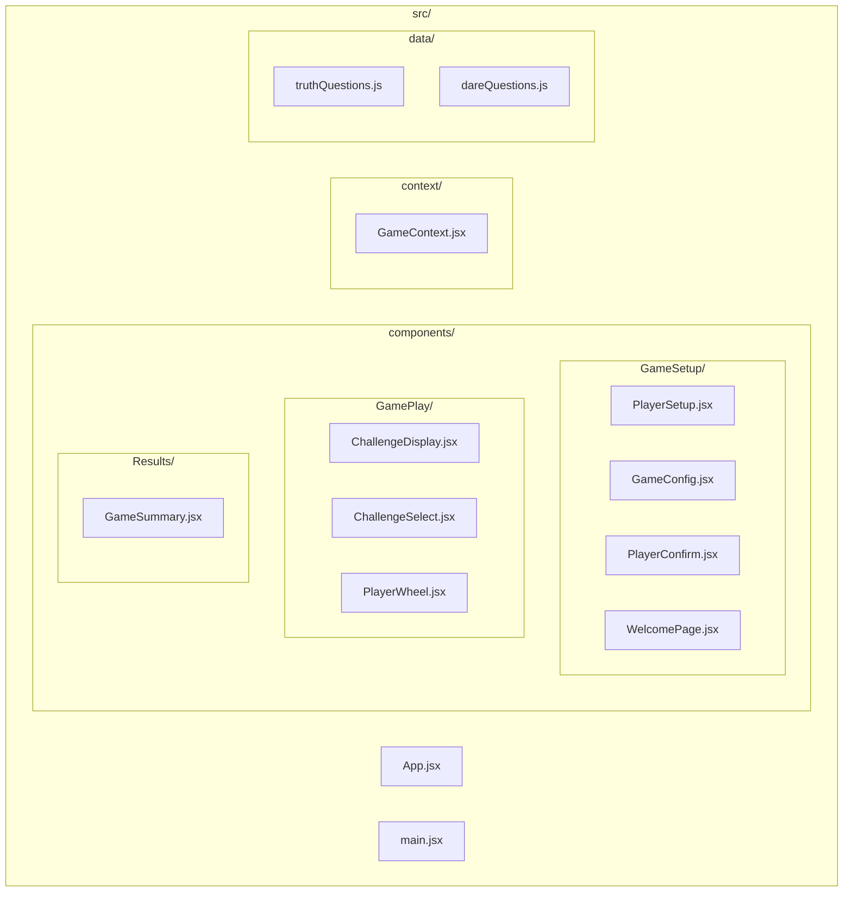

**图表来源**
- [GameContext.jsx](file://src/context/GameContext.jsx#L1-L322)
- [App.jsx](file://src/App.jsx#L1-L58)

**章节来源**
- [GameContext.jsx](file://src/context/GameContext.jsx#L1-L322)
- [App.jsx](file://src/App.jsx#L1-L58)

## 核心组件

### GameContext 上下文系统

GameContext 是整个应用的核心状态管理中心，采用了 Redux 风格的 reducer 模式：

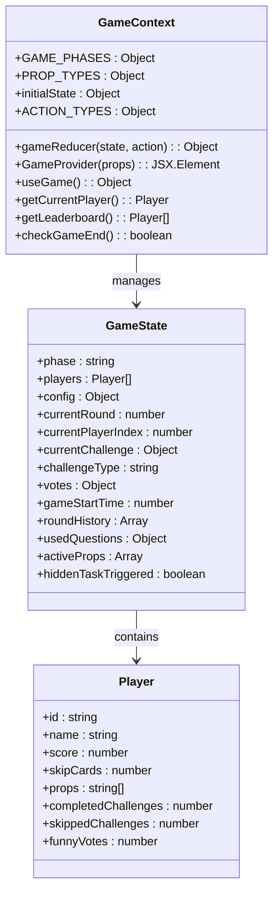

**图表来源**
- [GameContext.jsx](file://src/context/GameContext.jsx#L25-L44)
- [GameContext.jsx](file://src/context/GameContext.jsx#L68-L250)

### 自定义 Hook 设计模式

`useGame()` 自定义 Hook 实现了 React 最佳实践：

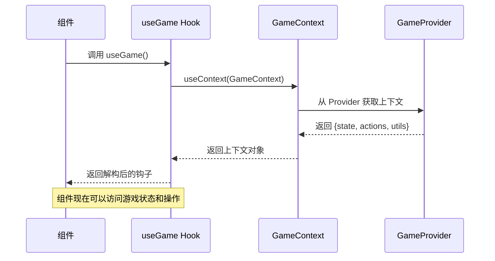

**图表来源**
- [GameContext.jsx](file://src/context/GameContext.jsx#L314-L322)
- [App.jsx](file://src/App.jsx#L13-L45)

**章节来源**
- [GameContext.jsx](file://src/context/GameContext.jsx#L252-L322)
- [App.jsx](file://src/App.jsx#L1-L58)

## 架构概览

### 状态管理模式

项目采用集中式状态管理，通过 useReducer 实现：

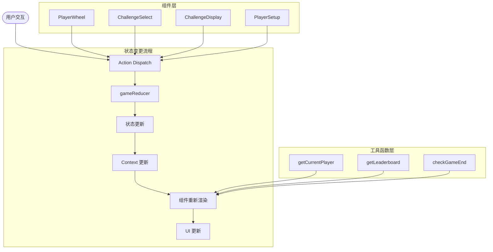

**图表来源**
- [GameContext.jsx](file://src/context/GameContext.jsx#L68-L250)
- [GameContext.jsx](file://src/context/GameContext.jsx#L281-L300)

### 组件通信机制

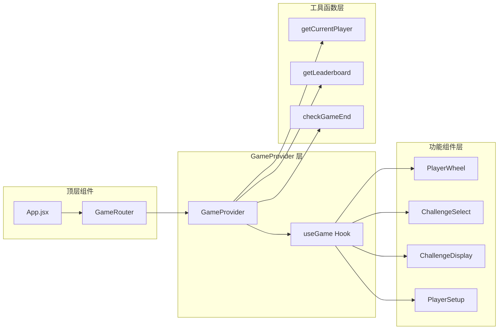

**图表来源**
- [App.jsx](file://src/App.jsx#L13-L45)
- [GameContext.jsx](file://src/context/GameContext.jsx#L256-L312)

**章节来源**
- [GameContext.jsx](file://src/context/GameContext.jsx#L1-L322)
- [App.jsx](file://src/App.jsx#L1-L58)

## 详细组件分析

### useGame 自定义 Hook 分析

`useGame()` 是项目中最核心的自定义 Hook，实现了以下功能：

#### 核心实现原理

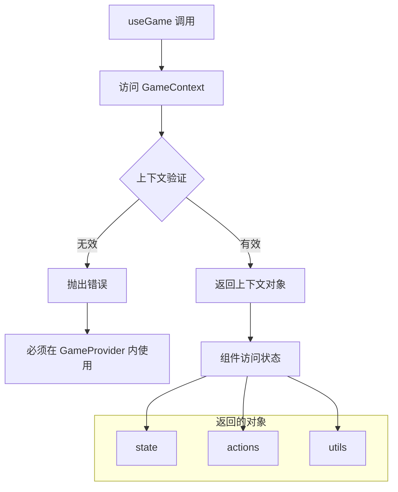

**图表来源**
- [GameContext.jsx](file://src/context/GameContext.jsx#L314-L322)

#### 使用模式

组件通过多种方式使用 `useGame()`：

1. **状态访问模式**：`const { state } = useGame()`
2. **操作方法模式**：`const { actions } = useGame()`
3. **工具函数模式**：`const { getCurrentPlayer } = useGame()`

**章节来源**
- [GameContext.jsx](file://src/context/GameContext.jsx#L314-L322)
- [ChallengeDisplay.jsx](file://src/components/GamePlay/ChallengeDisplay.jsx#L6-L12)
- [ChallengeSelect.jsx](file://src/components/GamePlay/ChallengeSelect.jsx#L8-L11)
- [PlayerWheel.jsx](file://src/components/GamePlay/PlayerWheel.jsx#L6-L6)

### GameProvider 组件分析

GameProvider 是状态管理的根组件，负责：

#### 状态初始化

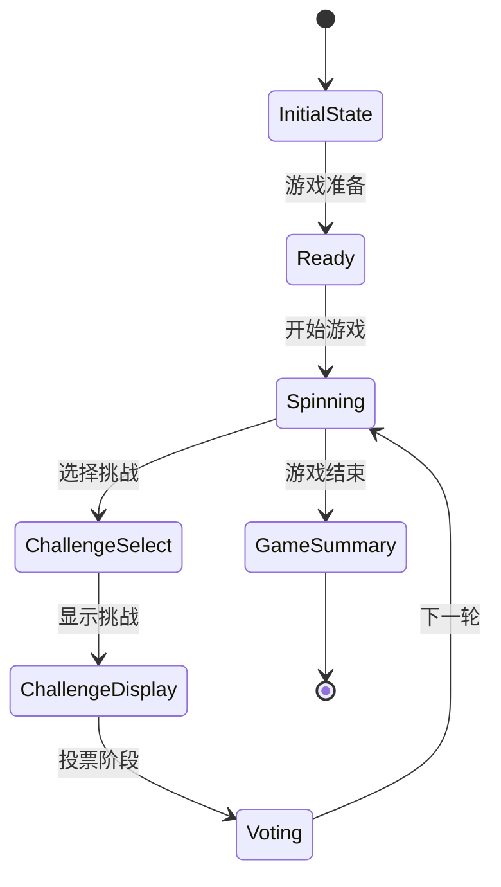

**图表来源**
- [GameContext.jsx](file://src/context/GameContext.jsx#L25-L44)
- [GameContext.jsx](file://src/context/GameContext.jsx#L4-L14)

#### 动作管理

GameProvider 提供了完整的 CRUD 操作：

| 操作类型 | 方法名 | 描述 |
|---------|--------|------|
| 状态设置 | `setPhase` | 设置游戏阶段 |
| 玩家管理 | `addPlayer` | 添加玩家 |
| 玩家管理 | `removePlayer` | 移除玩家 |
| 玩家管理 | `updatePlayer` | 更新玩家信息 |
| 配置管理 | `setConfig` | 设置游戏配置 |
| 游戏控制 | `startGame` | 开始游戏 |
| 游戏控制 | `setCurrentPlayer` | 设置当前玩家 |
| 挑战管理 | `setChallengeType` | 设置挑战类型 |
| 挑战管理 | `setChallenge` | 设置挑战内容 |
| 投票管理 | `submitVote` | 提交投票 |
| 轮次管理 | `completeRound` | 完成轮次 |

**章节来源**
- [GameContext.jsx](file://src/context/GameContext.jsx#L256-L279)

### 工具函数设计分析

#### getCurrentPlayer 工具函数

该函数提供了安全的当前玩家访问机制：

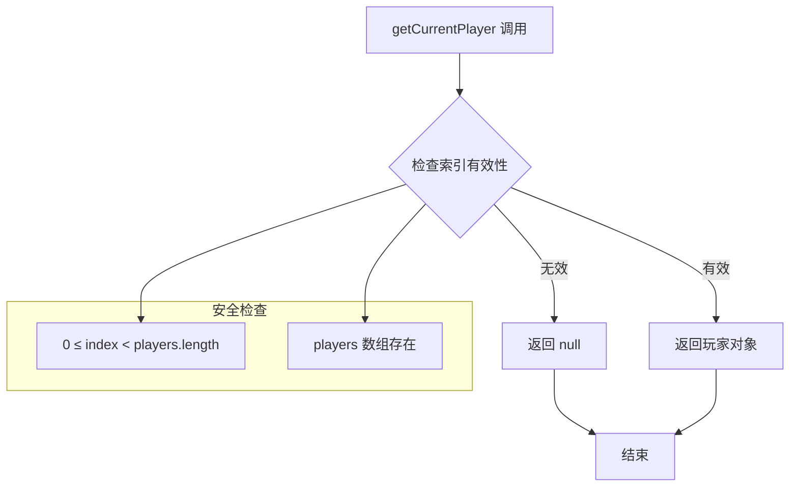

**图表来源**
- [GameContext.jsx](file://src/context/GameContext.jsx#L282-L287)

#### getLeaderboard 工具函数

实现了稳定的排行榜排序算法：

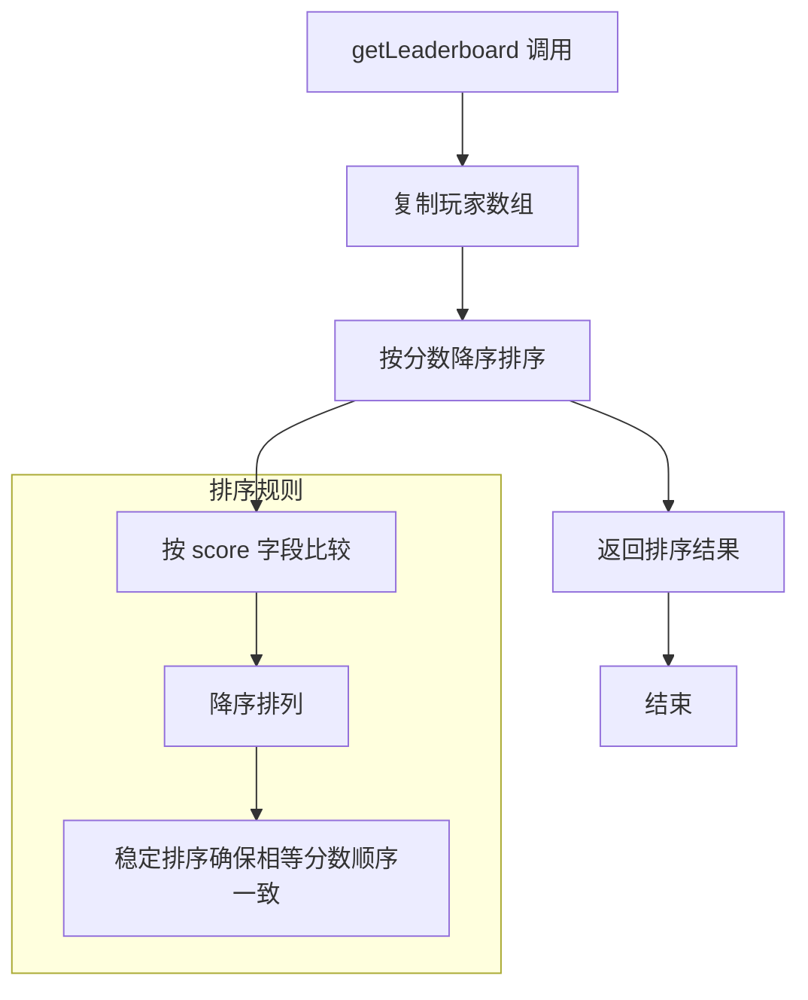

**图表来源**
- [GameContext.jsx](file://src/context/GameContext.jsx#L289-L292)

#### checkGameEnd 工具函数

实现了精确的游戏结束检测：

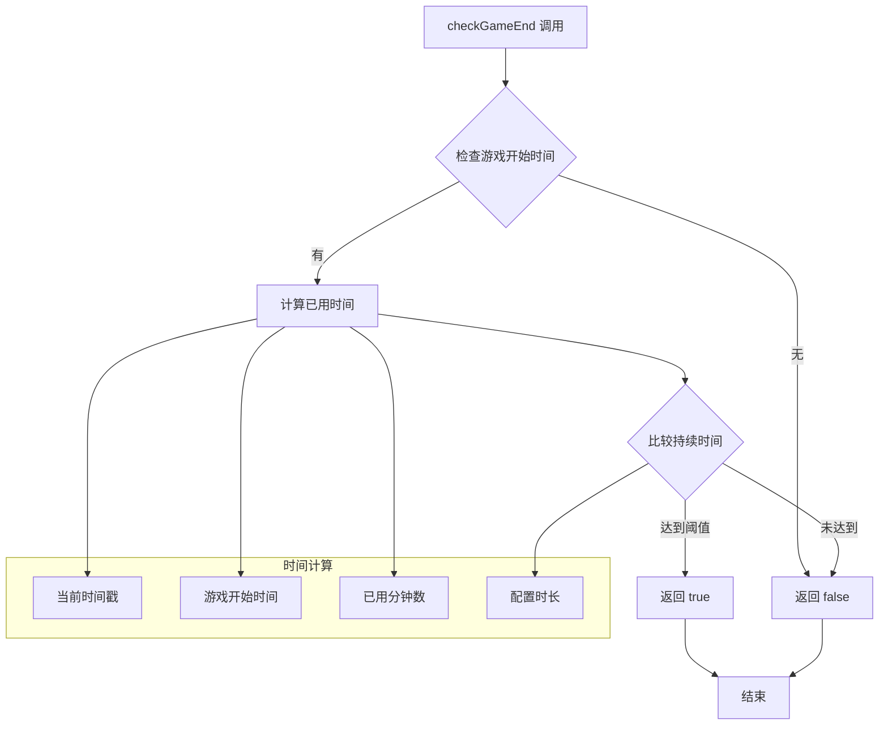

**图表来源**
- [GameContext.jsx](file://src/context/GameContext.jsx#L295-L299)

**章节来源**
- [GameContext.jsx](file://src/context/GameContext.jsx#L281-L299)

### 关键组件使用示例

#### PlayerWheel 组件集成

PlayerWheel 组件完美展示了工具函数的组合使用：

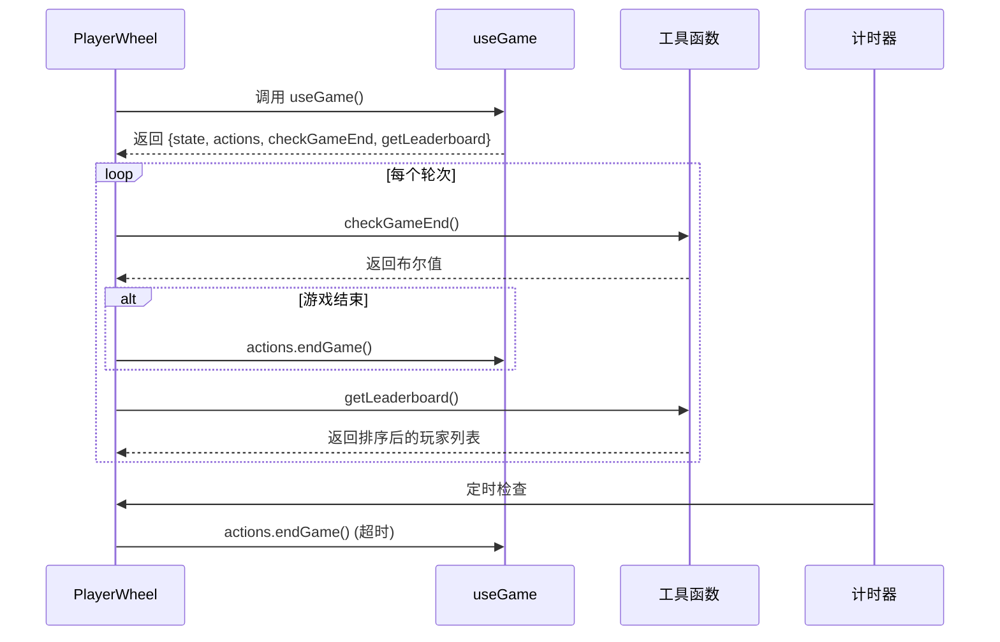

**图表来源**
- [PlayerWheel.jsx](file://src/components/GamePlay/PlayerWheel.jsx#L6-L28)
- [PlayerWheel.jsx](file://src/components/GamePlay/PlayerWheel.jsx#L130-L131)

**章节来源**
- [PlayerWheel.jsx](file://src/components/GamePlay/PlayerWheel.jsx#L1-L300)

#### ChallengeDisplay 组件集成

ChallengeDisplay 展示了复杂状态管理的实现：

```mermaid
flowchart TD
Component[ChallengeDisplay] --> Hook[useGame Hook]
Hook --> State[state]
Hook --> Actions[actions]
Hook --> Utils[getCurrentPlayer]
State --> Challenge[currentChallenge]
State --> Players[players]
State --> Config[config]
Utils --> CurrentPlayer[getCurrentPlayer()]
CurrentPlayer --> PlayerInfo[玩家信息]
Actions --> CompleteRound[completeRound]
Actions --> UseProp[useProp]
Actions --> UseSkipCard[useSkipCard]
subgraph "挑战处理流程"
Challenge --> Timer[倒计时]
Challenge --> Voting[投票系统]
Challenge --> Props[道具使用]
end
Timer --> CompleteRound
Voting --> CompleteRound
Props --> CompleteRound
```

**图表来源**
- [ChallengeDisplay.jsx](file://src/components/GamePlay/ChallengeDisplay.jsx#L6-L101)

**章节来源**
- [ChallengeDisplay.jsx](file://src/components/GamePlay/ChallengeDisplay.jsx#L1-L356)

## 依赖关系分析

### 组件间依赖关系

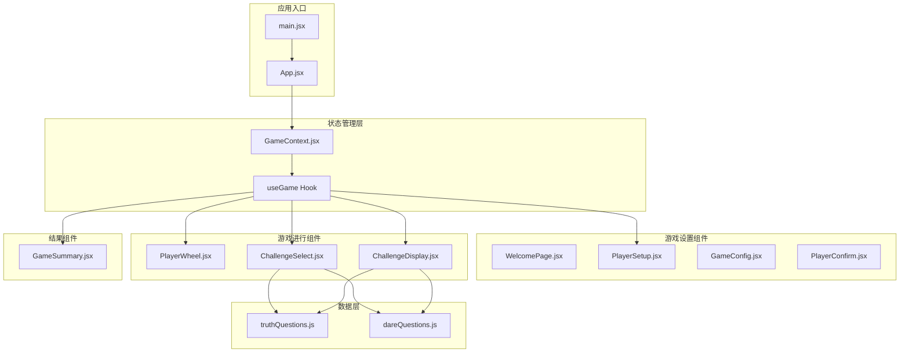

**图表来源**
- [main.jsx](file://src/main.jsx#L1-L11)
- [App.jsx](file://src/App.jsx#L1-L58)
- [GameContext.jsx](file://src/context/GameContext.jsx#L1-L322)

### 数据流分析

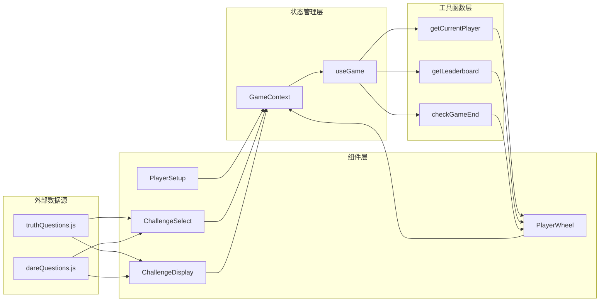

**图表来源**
- [truthQuestions.js](file://src/data/truthQuestions.js#L1-L156)
- [dareQuestions.js](file://src/data/dareQuestions.js#L1-L167)
- [GameContext.jsx](file://src/context/GameContext.jsx#L281-L300)

**章节来源**
- [GameContext.jsx](file://src/context/GameContext.jsx#L1-L322)
- [truthQuestions.js](file://src/data/truthQuestions.js#L1-L156)
- [dareQuestions.js](file://src/data/dareQuestions.js#L1-L167)

## 性能考虑

### Context Provider 优化策略

1. **最小化重渲染**：GameProvider 将状态、动作和工具函数组合在一个对象中，避免不必要的拆分
2. **内存优化**：工具函数在 Provider 内部定义，避免重复创建
3. **懒加载**：组件按需渲染，使用 Framer Motion 进行动画过渡

### Hook 使用最佳实践

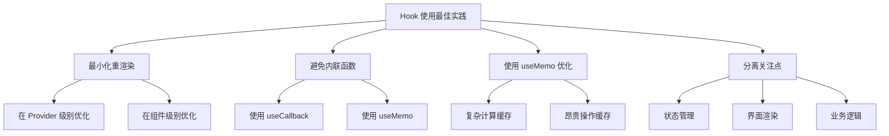

### 性能监控建议

1. **React DevTools Profiler**：监控组件渲染性能
2. **useMemo/useCallback**：对昂贵计算和回调函数进行缓存
3. **虚拟滚动**：对于大量玩家列表使用虚拟化
4. **代码分割**：按路由拆分代码块

## 故障排除指南

### 常见问题及解决方案

#### useGame Hook 错误

**问题**：`useGame must be used within a GameProvider`

**原因**：在 GameProvider 外部使用了 useGame Hook

**解决方案**：
```javascript
// ❌ 错误用法
function MyComponent() {
  const { state } = useGame(); // 抛出错误
}

// ✅ 正确用法
function App() {
  return (
    <GameProvider>
      <MyComponent />
    </GameProvider>
  );
}
```

#### 空状态处理

**问题**：getCurrentPlayer 返回 null

**原因**：currentPlayerIndex 无效或 players 数组为空

**解决方案**：
```javascript
function SafeComponent() {
  const { getCurrentPlayer } = useGame();
  const player = getCurrentPlayer();
  
  if (!player) {
    return <div>请先添加玩家</div>;
  }
  
  return <div>当前玩家：{player.name}</div>;
}
```

#### 性能问题诊断

**问题**：组件频繁重渲染

**诊断步骤**：
1. 检查是否在每次渲染时创建新的对象
2. 确认是否正确使用了 useMemo 和 useCallback
3. 验证 Context Provider 是否过度更新

**优化建议**：
```javascript
// ❌ 可能导致重渲染
const { state, actions } = useGame();

// ✅ 优化版本
const gameContext = useGame();
const { state, actions } = gameContext;
```

**章节来源**
- [GameContext.jsx](file://src/context/GameContext.jsx#L314-L322)
- [ChallengeDisplay.jsx](file://src/components/GamePlay/ChallengeDisplay.jsx#L101-L102)

## 结论

Truth or Dare 项目展示了现代 React 应用中自定义 Hook 和工具函数的最佳实践。通过精心设计的 GameContext 系统，项目实现了：

### 核心优势

1. **清晰的状态管理**：通过 useReducer 实现了可预测的状态更新
2. **简洁的 API 设计**：useGame Hook 提供了直观的访问接口
3. **强大的工具函数**：getCurrentPlayer、getLeaderboard、checkGameEnd 等函数简化了常见操作
4. **良好的性能表现**：通过合理的优化策略确保了流畅的用户体验

### 技术亮点

- **模块化设计**：每个组件都专注于单一职责
- **类型安全**：通过严格的类型检查确保代码质量
- **可测试性**：清晰的函数分离便于单元测试
- **可扩展性**：灵活的架构支持功能扩展

### 未来发展方向

1. **状态持久化**：考虑添加本地存储支持
2. **实时同步**：添加 WebSocket 支持实现多人实时游戏
3. **移动端优化**：针对移动设备进行专门优化
4. **国际化支持**：添加多语言支持

这个项目为 React 开发者提供了一个优秀的参考案例，展示了如何在实际项目中有效使用自定义 Hook 和工具函数来构建复杂的应用程序。