# 项目概述

<cite>
**本文档引用的文件**
- [README.md](file://README.md)
- [package.json](file://package.json)
- [vite.config.js](file://vite.config.js)
- [tailwind.config.js](file://tailwind.config.js)
- [src/main.jsx](file://src/main.jsx)
- [src/App.jsx](file://src/App.jsx)
- [src/context/GameContext.jsx](file://src/context/GameContext.jsx)
- [src/index.css](file://src/index.css)
- [src/data/truthQuestions.js](file://src/data/truthQuestions.js)
- [src/data/dareQuestions.js](file://src/data/dareQuestions.js)
- [src/components/GameSetup/WelcomePage.jsx](file://src/components/GameSetup/WelcomePage.jsx)
- [src/components/GameSetup/PlayerSetup.jsx](file://src/components/GameSetup/PlayerSetup.jsx)
- [src/components/GamePlay/PlayerWheel.jsx](file://src/components/GamePlay/PlayerWheel.jsx)
- [src/components/GamePlay/ChallengeSelect.jsx](file://src/components/GamePlay/ChallengeSelect.jsx)
- [src/components/GamePlay/ChallengeDisplay.jsx](file://src/components/GamePlay/ChallengeDisplay.jsx)
</cite>

## 目录
1. [项目简介](#项目简介)
2. [项目结构](#项目结构)
3. [核心组件](#核心组件)
4. [架构总览](#架构总览)
5. [详细组件分析](#详细组件分析)
6. [依赖关系分析](#依赖关系分析)
7. [性能考虑](#性能考虑)
8. [故障排除指南](#故障排除指南)
9. [结论](#结论)

## 项目简介

Truth or Dare 是一款基于 React 19 的本地派对游戏应用，实现了经典的"真心话大冒险"游戏机制。该项目旨在为朋友聚会、团队建设等社交活动提供轻松有趣的互动体验，通过精心设计的界面和流畅的交互流程，让玩家在短时间内享受高质量的娱乐时光。

### 项目目标与价值主张

**核心目标**
- 提供完整的本地派对游戏解决方案
- 实现经典"真心话大冒险"游戏规则的数字化
- 支持多人协作和实时互动
- 确保简单易用的用户体验

**价值主张**
- **社交驱动**：促进玩家间的深度交流和互动
- **灵活配置**：支持多种游戏主题、难度和惩罚机制
- **本地运行**：无需网络连接即可使用
- **即时反馈**：通过动画和视觉效果增强游戏体验

### 适用场景

- **朋友聚会**：生日派对、宿舍聚会、同学聚餐
- **团队建设**：公司团建、部门活动、户外拓展
- **家庭聚会**：节日庆典、周末家庭活动
- **学习小组**：学生社团活动、兴趣小组聚会

## 项目结构

项目采用模块化的文件组织结构，按照功能域进行清晰的层次划分：

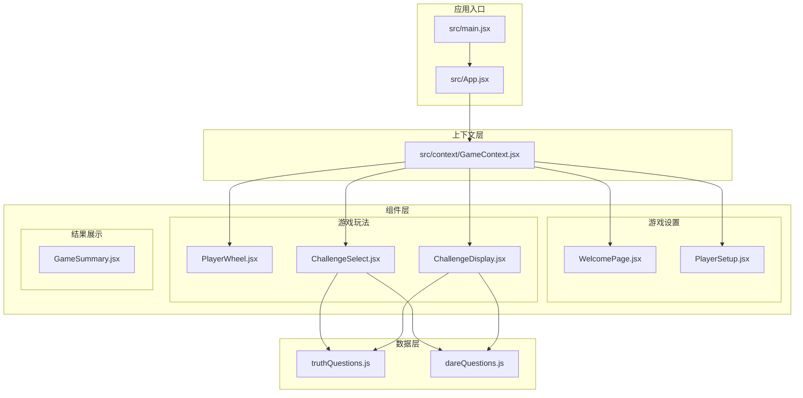

**图表来源**
- [src/main.jsx](file://src/main.jsx#L1-L11)
- [src/App.jsx](file://src/App.jsx#L1-L61)
- [src/context/GameContext.jsx](file://src/context/GameContext.jsx#L1-L323)

### 技术架构选择

**React 19 核心框架**
- 采用最新的 React 19 版本，享受最新的性能优化和开发体验
- 使用函数组件和 Hooks 模式，确保代码的现代化和可维护性

**Framer Motion 动画系统**
- 提供流畅的页面切换和元素动画效果
- 支持复杂的过渡动画和手势交互
- 增强用户的沉浸式体验

**Tailwind CSS 样式框架**
- 实现原子化样式开发，提高开发效率
- 支持响应式设计，适配各种设备屏幕
- 提供丰富的工具类，简化样式编写

**Vite 构建工具**
- 提供极速的开发服务器启动和热更新
- 优化的构建配置，生成高效的静态资源
- 良好的 TypeScript 支持和插件生态

**Section sources**
- [package.json](file://package.json#L1-L33)
- [vite.config.js](file://vite.config.js#L1-L8)
- [tailwind.config.js](file://tailwind.config.js#L1-L12)

## 核心组件

### 游戏状态管理

项目采用 Redux 风格的状态管理模式，通过自定义的 GameContext 提供全局状态管理：

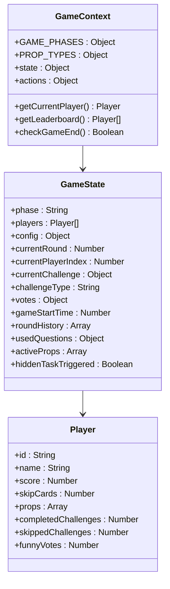

**图表来源**
- [src/context/GameContext.jsx](file://src/context/GameContext.jsx#L1-L323)

### 游戏流程控制

应用通过一个统一的路由组件来管理游戏的不同阶段：

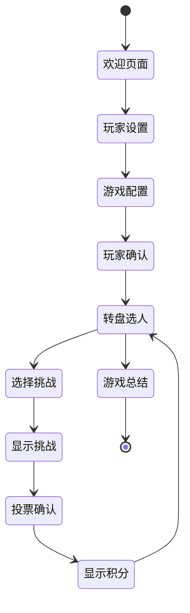

**图表来源**
- [src/App.jsx](file://src/App.jsx#L14-L48)
- [src/context/GameContext.jsx](file://src/context/GameContext.jsx#L3-L15)

**Section sources**
- [src/context/GameContext.jsx](file://src/context/GameContext.jsx#L1-L323)
- [src/App.jsx](file://src/App.jsx#L1-L61)

## 架构总览

项目采用分层架构设计，确保各层职责清晰、耦合度低：

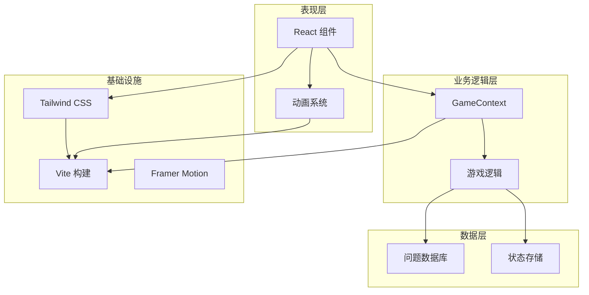

**图表来源**
- [src/main.jsx](file://src/main.jsx#L1-L11)
- [src/App.jsx](file://src/App.jsx#L1-L61)
- [src/context/GameContext.jsx](file://src/context/GameContext.jsx#L1-L323)

### 数据流设计

项目实现了单向数据流，确保状态变更的可预测性和可追踪性：

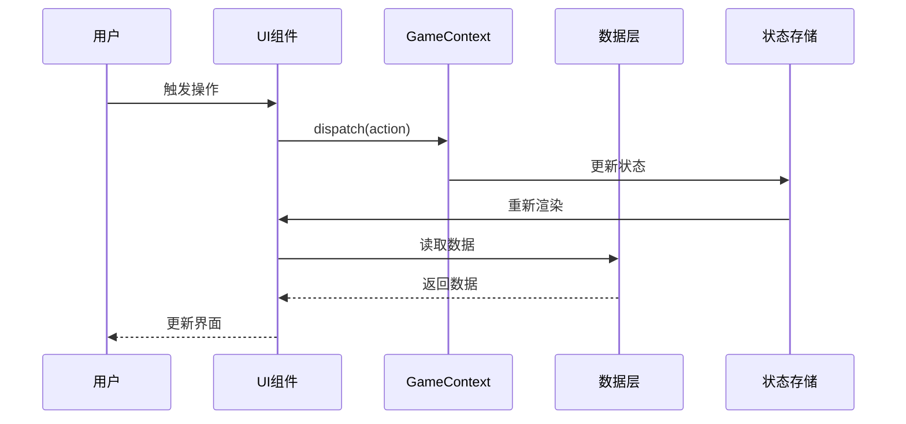

**图表来源**
- [src/context/GameContext.jsx](file://src/context/GameContext.jsx#L69-L251)

**Section sources**
- [src/main.jsx](file://src/main.jsx#L1-L11)
- [src/App.jsx](file://src/App.jsx#L1-L61)

## 详细组件分析

### 游戏设置组件

#### 欢迎页面组件

欢迎页面作为游戏的入口，提供了简洁明了的引导界面：

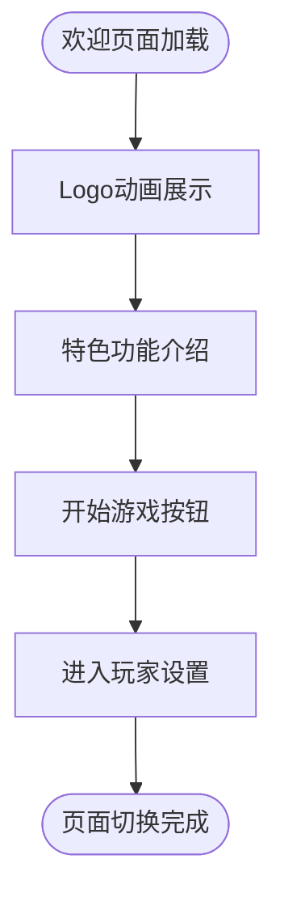

**图表来源**
- [src/components/GameSetup/WelcomePage.jsx](file://src/components/GameSetup/WelcomePage.jsx#L1-L88)

该组件实现了以下核心功能：
- 渐进式动画展示，提升视觉体验
- 游戏特色功能的直观展示
- 游戏流程的简要说明
- 平滑的页面过渡效果

#### 玩家设置组件

玩家设置组件负责管理参与游戏的人员信息：

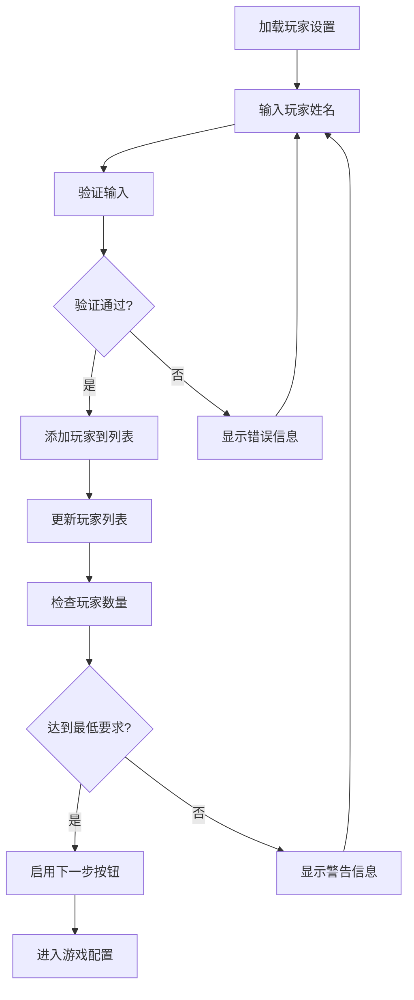

**图表来源**
- [src/components/GameSetup/PlayerSetup.jsx](file://src/components/GameSetup/PlayerSetup.jsx#L1-L197)

**Section sources**
- [src/components/GameSetup/WelcomePage.jsx](file://src/components/GameSetup/WelcomePage.jsx#L1-L88)
- [src/components/GameSetup/PlayerSetup.jsx](file://src/components/GameSetup/PlayerSetup.jsx#L1-L197)

### 游戏玩法组件

#### 转盘选人组件

转盘选人组件是游戏的核心交互模块，实现了动态的随机选择功能：

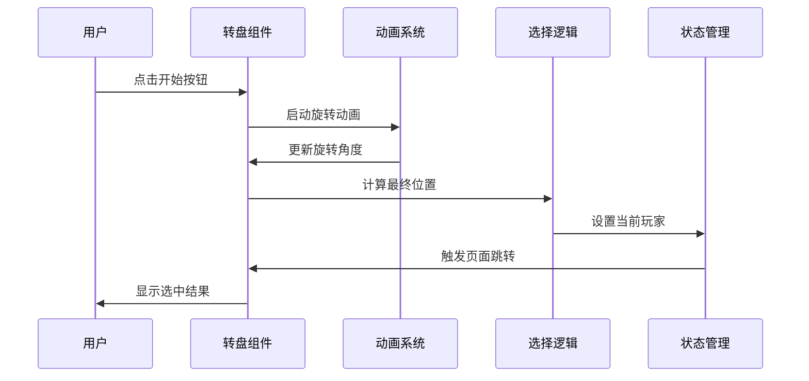

**图表来源**
- [src/components/GamePlay/PlayerWheel.jsx](file://src/components/GamePlay/PlayerWheel.jsx#L31-L62)

该组件的关键特性包括：
- 真实的物理旋转效果模拟
- 动态的颜色渐变设计
- 响应式的玩家名称显示
- 进度条和时间限制功能

#### 挑战选择组件

挑战选择组件提供了两种游戏选项的快速选择：

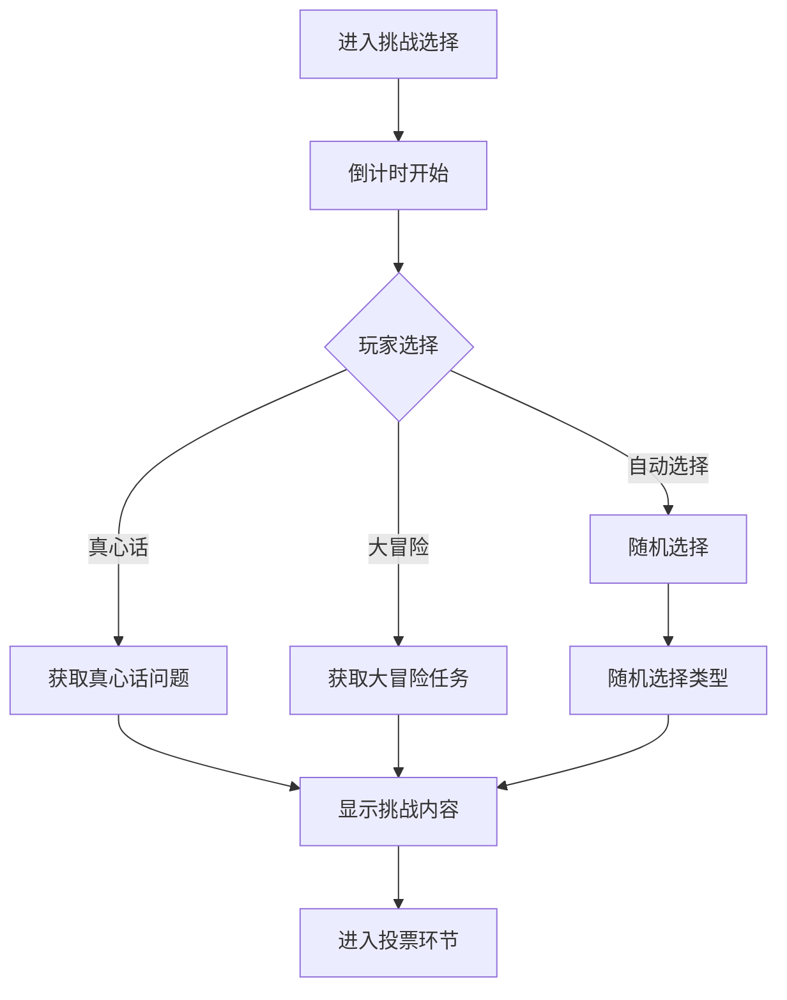

**图表来源**
- [src/components/GamePlay/ChallengeSelect.jsx](file://src/components/GamePlay/ChallengeSelect.jsx#L38-L71)

**Section sources**
- [src/components/GamePlay/PlayerWheel.jsx](file://src/components/GamePlay/PlayerWheel.jsx#L1-L300)
- [src/components/GamePlay/ChallengeSelect.jsx](file://src/components/GamePlay/ChallengeSelect.jsx#L1-L201)

#### 挑战显示组件

挑战显示组件是游戏的核心交互界面，实现了完整的挑战执行流程：

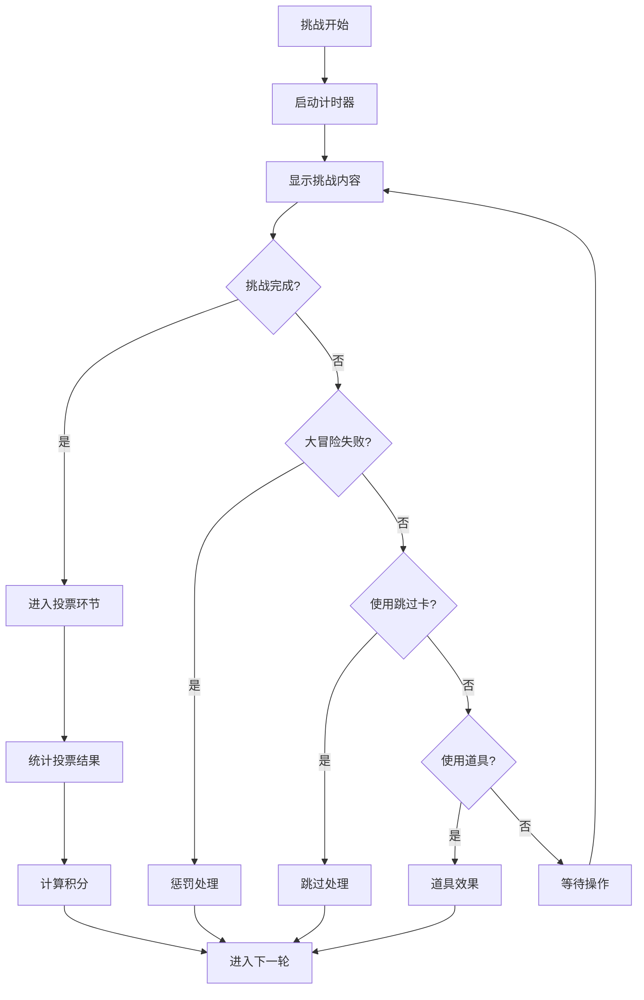

**图表来源**
- [src/components/GamePlay/ChallengeDisplay.jsx](file://src/components/GamePlay/ChallengeDisplay.jsx#L62-L99)

**Section sources**
- [src/components/GamePlay/ChallengeDisplay.jsx](file://src/components/GamePlay/ChallengeDisplay.jsx#L1-L356)

### 数据层设计

#### 问题数据库

项目内置了丰富的问题和任务数据库，支持多种主题和难度级别：

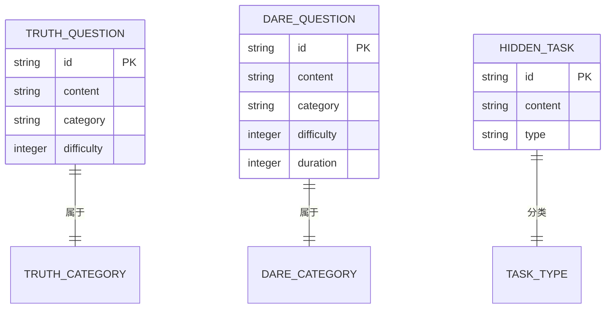

**图表来源**
- [src/data/truthQuestions.js](file://src/data/truthQuestions.js#L1-L156)
- [src/data/dareQuestions.js](file://src/data/dareQuestions.js#L1-L167)

**Section sources**
- [src/data/truthQuestions.js](file://src/data/truthQuestions.js#L1-L156)
- [src/data/dareQuestions.js](file://src/data/dareQuestions.js#L1-L167)

## 依赖关系分析

项目采用现代化的依赖管理策略，确保开发体验和运行性能的平衡：

```mermaid
graph LR
subgraph "运行时依赖"
REACT[react@^19.2.0]
REACTDOM[react-dom@^19.2.0]
FRAMER[framer-motion@^12.29.0]
TAILWIND[@tailwindcss/vite@^4.1.18]
end
subgraph "开发时依赖"
VITE[vite@^4.5.14]
TAILWINDCSS[tailwindcss@^3.4.19]
POSTCSS[postcss@^8.5.6]
ESLINT[eslint@^9.39.1]
TYPES["@types/react@^19.2.5"]
end
subgraph "构建工具"
ROLLUP[rollup]
ESBUILD[esbuild]
AUTOPREFIXER[autoprefixer]
end
REACT --> REACTDOM
REACT --> FRAMER
TAILWIND --> TAILWINDCSS
VITE --> ROLLUP
VITE --> ESBUILD
TAILWINDCSS --> AUTOPREFIXER
POSTCSS --> AUTOPREFIXER
```

**图表来源**
- [package.json](file://package.json#L12-L31)

### 性能优化策略

项目在多个层面实施了性能优化措施：

**构建优化**
- 使用 Vite 提供的快速开发服务器
- 启用 Tree Shaking 减少打包体积
- 按需加载组件和资源

**运行时优化**
- React 19 的并发特性提升渲染性能
- Framer Motion 的硬件加速动画
- Tailwind CSS 的原子化样式减少 CSS 体积

**缓存策略**
- 浏览器缓存静态资源
- 内存中的状态缓存
- 本地存储的游戏进度

**Section sources**
- [package.json](file://package.json#L1-L33)
- [vite.config.js](file://vite.config.js#L1-L8)

## 性能考虑

### 加载性能

项目采用了多项措施来优化启动时间和运行时性能：

- **代码分割**：按需加载不同游戏阶段的组件
- **懒加载**：动画库和第三方组件的延迟加载
- **资源压缩**：构建时自动压缩 JavaScript 和 CSS 文件

### 运行时性能

- **虚拟滚动**：玩家列表使用虚拟滚动优化大量数据的渲染
- **事件防抖**：输入框和按钮操作的防抖处理
- **内存管理**：及时清理定时器和事件监听器

### 动画性能

- **GPU 加速**：使用 transform 和 opacity 属性触发 GPU 加速
- **动画节流**：限制高频动画的帧率
- **硬件加速**：合理使用 will-change 属性

## 故障排除指南

### 常见问题及解决方案

**开发服务器无法启动**
1. 检查端口占用情况
2. 确认 Node.js 版本兼容性
3. 清理 node_modules 和重新安装依赖

**页面空白或组件未渲染**
1. 检查浏览器控制台的错误信息
2. 验证 React 和 ReactDOM 的版本匹配
3. 确认 index.html 中的根元素存在

**动画效果异常**
1. 检查 Framer Motion 的版本兼容性
2. 验证 CSS 动画相关的样式类
3. 确认浏览器对现代 CSS 属性的支持

**游戏状态异常**
1. 检查 GameContext 的状态更新逻辑
2. 验证 reducer 的纯函数性质
3. 确认 action 类型的一致性

### 调试技巧

**开发环境调试**
- 使用 React DevTools 检查组件树和状态
- 利用浏览器开发者工具监控网络请求
- 通过 console.log 追踪异步操作的执行流程

**生产环境调试**
- 启用详细的错误报告
- 监控应用的性能指标
- 收集用户反馈和使用数据

**Section sources**
- [README.md](file://README.md#L1-L20)

## 结论

Truth or Dare 派对游戏项目成功地将经典的"真心话大冒险"游戏机制带到了数字时代。通过精心设计的技术架构和用户体验，项目不仅实现了游戏的核心功能，还提供了流畅、愉悦的交互体验。

### 项目优势

**技术创新**
- 采用 React 19 的最新特性和最佳实践
- 集成 Framer Motion 提供优秀的动画体验
- 使用 Tailwind CSS 实现现代化的样式设计

**用户体验**
- 直观的界面设计和流畅的交互流程
- 支持多种游戏主题和难度级别
- 实时的进度跟踪和积分显示

**技术实现**
- 清晰的模块化架构和职责分离
- 完善的状态管理和数据流设计
- 良好的可扩展性和可维护性

### 发展前景

项目为后续的功能扩展奠定了坚实的基础，包括：
- 更多的游戏主题和挑战类型
- 社交分享和排行榜功能
- 跨平台部署和移动端适配
- AI 驱动的个性化推荐系统

通过持续的迭代和优化，Truth or Dare 有望成为本地派对游戏领域的标杆产品，为用户带来更加丰富和有趣的社交体验。